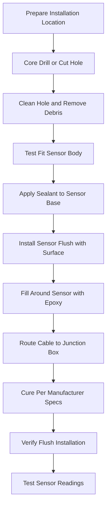
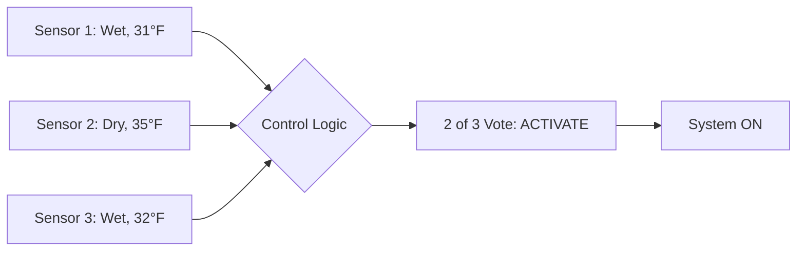

## Overview

Pavement-mounted sensors provide direct measurement of surface conditions for automatic snow melting system control. These sensors install flush with the heated surface and integrate multiple sensing elements—temperature measurement, moisture detection, and precipitation monitoring—in a single assembly. The embedded design eliminates wind effects and mounting angle variables that affect aerial sensors while providing accurate real-time data at the critical snow-pavement interface.

Proper sensor selection, installation, and placement determine control system reliability. A damaged or improperly calibrated pavement sensor causes false activations, missed snow events, or complete system failure. Understanding sensor construction, installation requirements, and durability considerations ensures reliable long-term performance.

## Sensor Construction

### Multi-Function Sensor Assembly

Modern pavement sensors combine three essential sensing functions in a single housing:

**Temperature Sensing Element**
- RTD (Resistance Temperature Detector) or precision thermistor
- Measurement range: -40°F to 140°F typical
- Accuracy: ±1°F over operating range
- Response time: 60-90 seconds to 63.2% of step change
- Sensor location: 1/4 inch below surface

**Moisture Detection Grid**
- Exposed electrode pairs on sensor face
- Measures electrical conductivity between electrodes
- Detects water film thickness as thin as 0.001 inch
- Discriminates between wet and dry conditions
- Resistant to contamination from road salts

**Precipitation Rate Detection**
- Thermal or capacitive sensing element
- Differentiates active precipitation from residual moisture
- Prevents false activation during drying after rain
- Response threshold: typically 0.01 inch/hour

### Physical Specifications

Standard pavement sensor dimensions:

| Parameter | Typical Specification | Design Considerations |
|-----------|----------------------|------------------------|
| Face diameter | 4 to 6 inches | Larger face improves averaging |
| Installation depth | 3 to 4 inches | Must reach below frost penetration |
| Body material | Reinforced epoxy or polyurethane | Chemical resistance to deicers |
| Face material | Polymer composite | Traffic load capacity >20,000 lb |
| Cable length | 50 to 500 feet | Field-extendable with junction box |
| Ingress protection | IP68 (submersible) | Prevents moisture infiltration |
| Operating temperature | -40°F to 140°F | Withstands thermal cycling |

## Temperature Sensing Principles

### RTD Temperature Measurement

Resistance Temperature Detectors operate on the principle that electrical resistance of pure metals increases predictably with temperature. Platinum RTDs exhibit the relationship:

$$R_T = R_0[1 + \alpha(T - T_0) + \beta(T - T_0)^2]$$

Where:
- $R_T$ = Resistance at temperature $T$ (Ω)
- $R_0$ = Resistance at reference temperature $T_0$ (Ω)
- $\alpha$ = Temperature coefficient (0.00385 Ω/Ω/°C for Pt100)
- $\beta$ = Second-order coefficient (typically small)
- $T$ = Measured temperature (°C)
- $T_0$ = Reference temperature (0°C)

For Pt100 sensors (100Ω at 0°C), the resistance changes approximately 0.385Ω per °C, providing excellent resolution for the critical 28°F to 40°F range where snow melting decisions occur.

### Thermal Response Characteristics

The sensor response to temperature changes follows first-order dynamics:

$$T_{sensor}(t) = T_{final} + (T_{initial} - T_{final})e^{-t/\tau}$$

Where:
- $\tau$ = Thermal time constant (seconds)
- $t$ = Time elapsed (seconds)

Sensor time constant depends on thermal mass, surface area, and contact resistance between the sensor and surrounding pavement. Typical values range from 60 to 120 seconds, adequate for tracking pavement temperature changes during storm events while filtering rapid fluctuations.

## Moisture Detection Methods

### Conductivity-Based Detection

Exposed electrode grids detect moisture through changes in electrical conductivity. Pure water exhibits low conductivity (0.055 μS/cm), but road surface moisture contains dissolved ions from deicing salts, increasing conductivity substantially.

The sensor applies a small AC voltage (typically 12V at 1-10 kHz) between electrode pairs and measures current flow:

$$\sigma = \frac{I \cdot L}{V \cdot A}$$

Where:
- $\sigma$ = Electrical conductivity (S/m)
- $I$ = Measured current (A)
- $V$ = Applied voltage (V)
- $L$ = Electrode spacing (m)
- $A$ = Effective sensing area (m²)

Conductivity increases with both moisture quantity and ionic concentration. Controllers set a conductivity threshold (typically 50-200 μS/cm) above which the surface is considered wet.

### Moisture Film Thickness

The relationship between measured conductivity and water film thickness is approximately:

$$d = \frac{\sigma_{measured}}{\sigma_{bulk} \cdot f}$$

Where:
- $d$ = Water film thickness (m)
- $\sigma_{measured}$ = Measured conductivity (S/m)
- $\sigma_{bulk}$ = Bulk water conductivity (S/m)
- $f$ = Geometric factor accounting for electrode configuration

Detection of films as thin as 0.001 inch (25 μm) enables early system activation before significant snow accumulation.

## Installation Requirements

### Slab Penetration and Mounting

### Flush-Mount Installation Steps

**1. Location Selection**
- Representative area receiving typical snow accumulation
- Avoid drainage paths or areas shaded by structures
- Minimum 6 inches from control joints or cracks
- Protected from direct traffic in wheel paths where possible

**2. Hole Preparation**
- Core drill diameter: sensor diameter + 1/4 inch clearance
- Depth: per manufacturer specification (typically 3.5 to 4.5 inches)
- Clean hole thoroughly to ensure proper epoxy adhesion
- Ensure hole walls are square and smooth

**3. Sensor Installation**
- Test-fit sensor before applying adhesive
- Apply manufacturer-specified sealant or epoxy to sensor base
- Press sensor firmly into place
- Verify sensor face is exactly flush (not recessed or proud)
- Use straightedge across installation to confirm alignment

**4. Void Filling**
- Fill gap between sensor body and concrete with epoxy grout
- Ensure complete void elimination (prevents water infiltration)
- Feather edges to create smooth transition
- Allow full cure before traffic exposure (24-72 hours typical)

**5. Cable Protection**
- Route cable in conduit embedded in slab or surface-mounted
- Provide service loop at sensor location
- Seal conduit entry points against water infiltration
- Label cable at both ends with sensor identification

### Retrofit Installation Considerations

Cutting into existing slabs requires special attention to:

- **Reinforcement location**: X-ray or GPR scanning to locate rebar
- **Heating tube clearance**: Maintain 6-inch minimum from hydronic piping
- **Crack formation**: Install compression seal around sensor perimeter
- **Slab age**: Concrete should cure minimum 28 days before cutting
- **Structural impact**: Avoid cutting through primary reinforcement

## Sensor Placement Strategy

### Single Sensor Applications

Small installations (residential driveways, walkways under 500 ft²) typically employ a single sensor. Location selection criteria:

- Center of protected area (for uniform exposure)
- Highest elevation point (first to cool, last to dry)
- Representative microclimate conditions
- Accessible location for future maintenance

### Multiple Sensor Arrays

Large installations benefit from multiple sensors to account for microclimate variations:

| Installation Area | Recommended Sensor Density | Placement Strategy |
|-------------------|---------------------------|-------------------|
| < 500 ft² | 1 sensor | Geometric center |
| 500 - 2000 ft² | 2 sensors | Opposite corners |
| 2000 - 10,000 ft² | 3-4 sensors | Grid pattern, 50-70 ft spacing |
| > 10,000 ft² | 4+ sensors | Microclimates, elevation changes |

### Control Logic for Multiple Sensors

**OR Logic** (Any sensor activation triggers system)
- Maximum reliability for snow removal
- Higher energy consumption from earliest activation
- Prevents localized snow accumulation in cold spots

**AND Logic** (All sensors must activate)
- Reduces false starts
- Risk of snow accumulation in early-cooling areas
- Lower energy consumption

**Majority Logic** (2 of 3 or 3 of 5 sensors must activate)
- Balances reliability and energy efficiency
- Eliminates false triggers from single sensor failures
- Recommended for critical applications

## Durability and Environmental Resistance

### Mechanical Loading

Pavement sensors withstand vehicle traffic loads through:

**Face Strength**
- Composite polymer face material
- Compression strength: 20,000+ lb (matches concrete)
- Flexural strength prevents cracking under point loads
- Abrasion resistance from snow plow blades

**Load Distribution**
The sensor face acts as a beam supported by the surrounding concrete:

$$\sigma_{max} = \frac{M \cdot c}{I}$$

Where:
- $\sigma_{max}$ = Maximum stress in sensor face (psi)
- $M$ = Bending moment from applied load (lb·in)
- $c$ = Distance from neutral axis to outer fiber (in)
- $I$ = Moment of inertia of sensor face cross-section (in⁴)

Proper installation eliminates voids beneath the sensor that would reduce support and increase stress concentration.

### Chemical Resistance

Road surface chemicals attack sensor materials:

**Deicing Salts**
- Sodium chloride (NaCl): Most common, moderate corrosivity
- Calcium chloride (CaCl₂): Hygroscopic, increases moisture exposure
- Magnesium chloride (MgCl₂): More corrosive than NaCl
- Potassium acetate (CH₃COOK): Non-corrosive but expensive

**Material Selection**
- Electrode plating: Gold or platinum (corrosion immunity)
- Wire insulation: Fluoropolymer (chemical resistance)
- Sealants: Polyurethane or polysulfide (deicing salt compatibility)
- Body material: Epoxy resin (inert to chlorides)

### Thermal Cycling Effects

Annual temperature swings from -20°F to 140°F (direct sun on dark pavement) create thermal stress:

$$\epsilon = \alpha \cdot \Delta T$$

Where:
- $\epsilon$ = Thermal strain (dimensionless)
- $\alpha$ = Coefficient of thermal expansion (in/in/°F)
- $\Delta T$ = Temperature change (°F)

Material mismatch between sensor body ($\alpha_{sensor}$ ≈ 30×10⁻⁶ in/in/°F) and concrete ($\alpha_{concrete}$ ≈ 5×10⁻⁶ in/in/°F) causes differential expansion. Proper sealant selection accommodates movement without cracking.

## Electrical Interface

### Signal Conditioning

Controllers interpret sensor signals through:

**Temperature Signal**
- 4-wire RTD connection eliminates lead resistance errors
- 3-wire configuration acceptable for distances <100 feet
- Excitation current: 1 mA (minimizes self-heating)
- Signal range: 80Ω to 120Ω for Pt100 over operating range

**Moisture Signal**
- Digital output (dry/wet threshold) or analog (conductivity value)
- Update rate: 1 to 10 seconds
- Voltage output: 0-5V or 0-10V analog
- Contact closure: Some models provide relay output

**Precipitation Signal**
- Binary indication (yes/no) or rate measurement
- Integration time: 30-60 seconds (prevents droplet transients)
- Sensitivity adjustment: Field-adjustable threshold

### Wiring Specifications

| Cable Type | Typical Specification | Application Notes |
|------------|----------------------|-------------------|
| Conductor size | 18 to 22 AWG | Larger for runs >200 feet |
| Conductor count | 4 to 8 | Depends on sensor functions |
| Insulation | THHN or FEP | Chemical and moisture resistant |
| Shielding | 100% foil + drain wire | EMI protection near power wiring |
| Jacket | UV-resistant PVC or PE | Outdoor-rated burial cable |
| Conduit | Schedule 40 PVC minimum | Protection from mechanical damage |

## Calibration and Maintenance

### Temperature Calibration Verification

Compare sensor readings to reference thermometer:

**Ice Bath Method**
1. Prepare ice bath at 32.0°F
2. Submerge sensor (if removable) or use surface contact
3. Allow 5-minute stabilization
4. Record sensor reading
5. Acceptable deviation: ±1.5°F

**Ambient Comparison**
1. Compare to calibrated reference placed adjacent to sensor
2. Allow overnight stabilization to eliminate solar effects
3. Take reading at dawn (thermal equilibrium conditions)
4. Record deviation for controller offset adjustment

### Moisture Detection Testing

Simulate wet conditions:

**Water Application Test**
1. Apply 1 tablespoon water to sensor face
2. Sensor should indicate wet within 5 seconds
3. Verify controller receives wet signal
4. Allow surface to dry naturally
5. Sensor should indicate dry within 5 minutes of visual dryness

**Salt Solution Test**
1. Apply salt solution (10% NaCl) to simulate deicing residue
2. Verify detection sensitivity unchanged
3. Rinse with clean water
4. Confirm proper drying indication

### Preventive Maintenance Schedule

| Maintenance Task | Frequency | Procedure |
|-----------------|-----------|-----------|
| Visual inspection | Monthly (winter) | Check for damage, verify flush installation |
| Cleaning | As needed | Remove debris, rinse with water |
| Calibration check | Annually (fall) | Verify temperature accuracy ±2°F |
| Moisture test | Annually (fall) | Confirm wet/dry response |
| Cable inspection | Annually | Check for damage, water infiltration |
| Sealant condition | Every 3-5 years | Reseal if cracks develop around sensor |

## Performance Optimization

### Sensor Location Effects on System Performance

Sensor placement significantly impacts annual energy consumption and snow removal effectiveness:

**Energy Impact of Poor Placement**
- Shaded location: 15-25% increased runtime (delayed drying)
- Drainage path: 20-30% increased false starts (standing water)
- Wind-protected alcove: 10-15% increased after-run time

**Reliability Impact**
- Exposed elevation: -5 to -10°F colder than sheltered areas (earlier activation)
- South-facing slope: +5 to +15°F warmer (potential missed activation)
- Edge vs. center: Edge locations cool 30-60 minutes earlier

### Multi-Sensor Voting Strategies

Implement redundancy without excessive energy consumption:

This majority-voting approach provides fault tolerance while preventing single-sensor failures from causing system shutdown or unnecessary activation.

## Troubleshooting Common Issues

| Symptom | Possible Cause | Diagnostic Test | Solution |
|---------|---------------|-----------------|----------|
| Temperature reads constant | Failed RTD element | Measure resistance (should be 80-120Ω) | Replace sensor |
| Always indicates wet | Electrode contamination | Visual inspection, resistance check | Clean or replace |
| Never indicates wet | Broken moisture circuit | Apply water, measure electrode continuity | Replace sensor or cable |
| Intermittent readings | Cable damage or loose connection | Wiggle test, continuity check | Repair or replace cable |
| Reads 10-20°F high | Self-heating from moisture detection current | Verify excitation current <1mA | Reduce detection current |
| Sensor proud or recessed | Installation settling or frost heave | Straightedge measurement | Re-level or replace |

## Specification and Selection Criteria

### Performance Requirements

Specify pavement sensors based on application requirements:

**Temperature Sensing**
- Accuracy requirement: ±1°F for critical applications, ±2°F acceptable for general use
- Range: -40°F to 140°F minimum
- Response time: <90 seconds to 63.2% of step change

**Moisture Detection**
- Sensitivity: 0.001-inch water film detection
- Response time: <10 seconds to wet indication
- False alarm rate: <1% with proper installation

**Durability**
- Traffic loading: 20,000 lb minimum compressive strength
- Chemical resistance: Compatible with all common deicing agents
- Life expectancy: 15-20 years with proper installation

### Cost-Benefit Analysis

Pavement sensor economics compared to alternatives:

| Sensor Type | Initial Cost | Installation Cost | Annual Maintenance | Life Expectancy | Total 20-Year Cost |
|-------------|-------------|-------------------|-------------------|-----------------|-------------------|
| Pavement sensor | $300-600 | $200-500 | $50 | 15-20 years | $2,500-4,000 |
| Aerial sensor + slab RTD | $400-800 | $300-600 | $75 | 12-15 years | $3,500-5,500 |
| Manual operation | $0 | $0 | $0 | N/A | $8,000-15,000† |

†Manual operation costs reflect energy waste from delayed shutdown and missed optimal start times.

## Industry Standards and References

**ASHRAE Applications Handbook**
- Chapter 51: Snow Melting and Freeze Protection
- Sensor placement recommendations
- Control system design guidance

**Manufacturer Specifications**
- Installation instructions supersede general guidance
- Calibration procedures specific to sensor model
- Warranty requirements for proper installation

**IEEE Standards**
- IEEE 1451: Smart transducer interface standards
- Applies to digital sensors with standardized communication

The pavement sensor serves as the primary input for automatic snow melting control, directly measuring the conditions that determine system activation. Proper selection, installation, and maintenance ensure reliable snow removal with optimal energy efficiency throughout the system's operational life.
