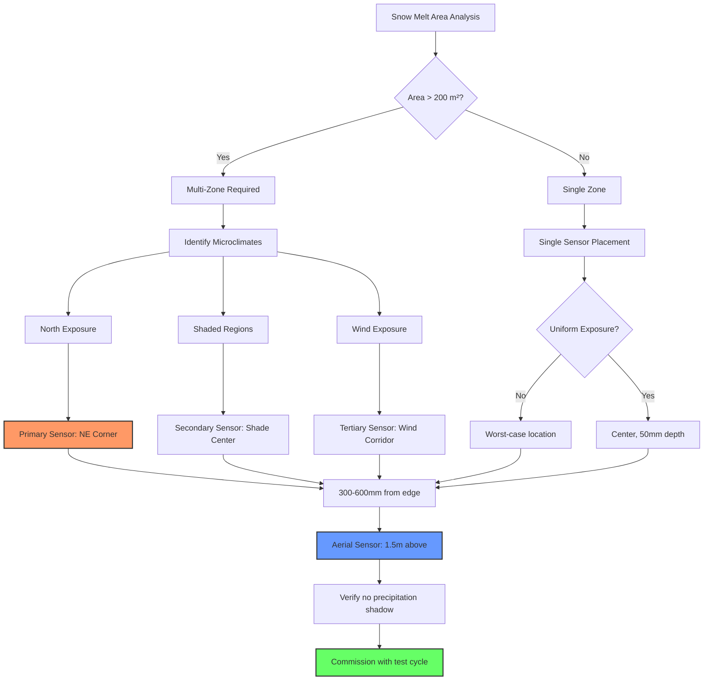

## Physical Principles of Sensor Location

Sensor placement in snow melting systems directly impacts response time, energy consumption, and operational reliability. The critical challenge is selecting locations that provide representative conditions while accounting for thermal lag and environmental exposure variability.

The thermal response time of embedded slab sensors follows heat diffusion principles. For a sensor at depth $d$ below the surface, the time constant is:

$$\tau = \frac{d^2}{\alpha}$$

where $\alpha$ is thermal diffusivity (m²/s). For concrete with $\alpha \approx 7 \times 10^{-7}$ m²/s at 50 mm depth:

$$\tau = \frac{(0.05)^2}{7 \times 10^{-7}} = 3571 \text{ s} \approx 60 \text{ min}$$

This delay determines minimum preheat requirements.

## Representative Location Selection

The selected sensor location must represent the worst-case condition for the protected area. This requires analyzing three thermal boundary conditions:

**Edge Effects**: Heat loss occurs through all six surfaces of a slab element at the perimeter, compared to one-dimensional loss at the center. The edge temperature deficit is:

$$\Delta T_{edge} = \frac{q \cdot L}{2k_{eff}}$$

where $q$ is the surface heat flux (W/m²), $L$ is the edge distance (m), and $k_{eff}$ is the effective thermal conductivity accounting for insulation.

**Radiation Balance**: Surface locations experience different net radiation based on view factors. A sensor in a location with high sky view factor experiences greater radiative cooling:

$$q_{rad} = \epsilon \sigma (T_s^4 - T_{sky}^4)$$

For clear sky conditions, $T_{sky} \approx T_{air} - 6$ K, increasing the cooling rate by 15-20% compared to sheltered locations.

**Wind Exposure**: Convective heat transfer coefficient varies with wind speed according to:

$$h_c = 5.7 + 3.8V$$

where $V$ is wind velocity (m/s). A sensor in a wind-protected location underestimates actual heat requirements by the ratio of local to design wind speed.

## Sensor Type Comparison

| Sensor Type | Typical Location | Response Time | Detection Parameter | Accuracy | Application |
|-------------|-----------------|---------------|---------------------|----------|-------------|
| Aerial Moisture/Temperature | 1.5-2 m above surface | 30-90 s | Precipitation + air temp | ±0.5°C, 95% detection | Primary precipitation sensing |
| Embedded RTD | 25-50 mm below surface | 10-60 min | Slab temperature | ±0.1°C | Slab temperature control |
| Surface-Mount RTD | Bonded to surface | 2-10 min | Surface temperature | ±0.2°C | Rapid response control |
| Pavement Sensor | Flush with surface | 5-15 min | Surface temp + moisture | ±0.3°C | Combined detection |
| Remote Infrared | 2-5 m standoff | <1 s | Surface temperature | ±1°C | Non-contact verification |

## Multiple Sensor Zone Strategy

Large areas require multiple detection zones to account for microclimate variations. Maximum area per sensor is limited by thermal uniformity (±1°C variation), precipitation shadow effects, and control valve capacity.

For rectangular areas, divide into zones when:

$$A > \frac{k \cdot \Delta T_{max}}{q_{design} \cdot CV}$$

where $CV$ is the coefficient of variation for snow deposition (typically 0.15-0.25).

## Critical Placement Considerations

### North Exposure Priority

Northern exposures receive minimal solar radiation during winter months. The solar gain difference between north and south exposures at 40°N latitude in January is approximately:

$$\Delta Q_{solar} = 150-200 \text{ W/m}^2$$

This represents 30-40% of typical design heat flux (400-500 W/m²). Position primary sensors on north-facing areas to prevent under-heating of critical zones.

### Shade vs. Sun Exposure

Shaded areas lose solar assist (100-200 W/m²), receive reduced longwave radiation, and experience lower air temperatures (1-3°C deficit). Place at least one sensor in permanently shaded locations. For mixed exposure:

$$q_{effective} = f_{shade} \cdot q_{shade} + (1-f_{shade}) \cdot q_{sun}$$

### Edge vs. Center Placement

Perimeter locations lose heat through both top surface and exposed edges. The total heat loss at corners exceeds center areas by:

$$q_{corner} = q_{surface} + 2 \cdot U_{edge} \cdot h_{slab} \cdot \Delta T$$

where $U_{edge}$ is the edge U-factor (W/m·K) and $h_{slab}$ is slab thickness (m).

**Standard practice**: Position the primary control sensor 300-600 mm from the most exposed edge (typically northeast corner for northern hemisphere installations). This location captures edge thermal penalty while avoiding extreme corner effects that may trigger excessive system operation.

## Optimal Sensor Layout

## Installation Verification

Verify sensor placement through thermal imaging (confirm coldest zones), response time measurement (cold water test), precipitation testing (multi-angle spray), and comparative readings (variance <0.5°C).

Proper sensor placement reduces energy consumption by 15-25% while improving snow-free reliability from 85-90% to 95-98%.
