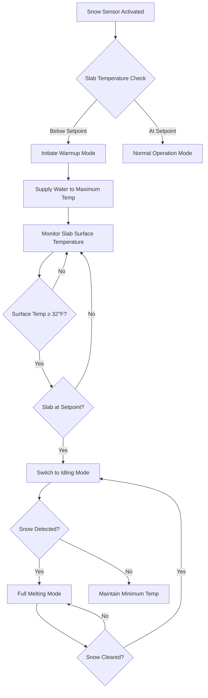

## Slab Warmup Fundamentals

Slab warmup is the process of raising the embedded piping or heating element temperature from ambient conditions to operating temperature before or during snowfall. The warmup period represents a critical control phase that determines system effectiveness and energy consumption. The physical process involves conduction through concrete, transient heat transfer, and thermal storage effects.

The warmup time depends on three primary factors: the thermal mass of the slab (concrete density and specific heat), the thermal resistance between heating elements and slab surface, and the heat input rate from the piping or heating cables.

## Warmup Time Calculation

The transient heat transfer during warmup follows an exponential response governed by the thermal time constant of the slab system. For a simplified analysis, the warmup time can be estimated using:

$$t_{warmup} = \frac{\rho \cdot c_p \cdot V \cdot \Delta T}{Q_{input}}$$

Where:
- $t_{warmup}$ = warmup time (seconds)
- $\rho$ = concrete density (typically 2400 kg/m³)
- $c_p$ = concrete specific heat (880 J/kg·K)
- $V$ = effective volume of concrete being heated (m³)
- $\Delta T$ = temperature rise required (K)
- $Q_{input}$ = heat input rate (W)

For a more accurate prediction accounting for heat losses during warmup:

$$t_{warmup} = \frac{\rho \cdot c_p \cdot A \cdot d \cdot \Delta T}{Q_{input} - Q_{loss}}$$

Where:
- $A$ = slab area (m²)
- $d$ = effective depth of heated zone (m)
- $Q_{loss}$ = heat loss to surroundings during warmup (W)

The effective depth typically extends from the heating element to the surface plus approximately 50-75 mm below the heating element due to bidirectional heat flow.

## Thermal Time Constant

The slab behaves as a first-order thermal system with a time constant:

$$\tau = \frac{R_{th} \cdot C_{th}}{1}$$

Where:
- $R_{th}$ = thermal resistance from heating element to surface (K/W)
- $C_{th}$ = thermal capacitance of slab (J/K)

The surface temperature response follows:

$$T(t) = T_{final} \cdot \left(1 - e^{-t/\tau}\right) + T_{initial}$$

At $t = \tau$, the slab reaches 63% of its final temperature. At $t = 3\tau$, the slab reaches 95% of final temperature, which typically defines the practical warmup completion point.

## Warmup Control Sequence

## Warmup Strategies by Slab Type

| Slab Configuration | Typical Warmup Time | Control Strategy | Energy Impact | Notes |
|-------------------|---------------------|------------------|---------------|-------|
| Thin Overlay (50-75 mm) | 1.0-1.5 hours | Aggressive preheat | Low thermal mass, fast response | Requires frequent cycling |
| Standard Concrete (100-150 mm) | 2.0-3.0 hours | Moderate preheat | Balanced response | Most common residential |
| Heavy Concrete (>150 mm) | 3.0-4.5 hours | Extended preheat | High thermal mass, slow response | Commercial applications |
| Asphalt with Shallow Piping | 0.75-1.25 hours | Rapid preheat | Lower thermal capacity | Requires careful control |
| Concrete with Deep Piping | 3.5-5.0 hours | Very early preheat | Significant heat loss during warmup | Poor installation practice |

## Preheating Requirements

ASHRAE guidelines recommend maintaining slab temperature above 32°F (0°C) during precipitation events. The preheating strategy depends on whether the system operates in:

**Automatic Mode**: Snow sensors trigger warmup when precipitation and temperature conditions are met. The system must complete warmup before significant accumulation occurs, typically requiring 1-2 hours advance notice.

**Manual Mode**: Operator initiates warmup based on weather forecasts. Allows longer warmup periods but risks unnecessary energy consumption from false alarms.

**Continuous Idling Mode**: Slab maintained at 32-40°F during winter months. Eliminates warmup delay but increases seasonal energy consumption by 40-60%.

## Thermal Mass Considerations

The thermal mass of the slab system includes:

1. **Concrete Volume**: Primary thermal storage component
2. **Water in Piping**: Typically 5-10% of total thermal mass
3. **Base Materials**: Insulation eliminates this contribution
4. **Surface Finishes**: Negligible contribution

The total thermal capacitance determines the heat storage capacity:

$$C_{total} = \sum_{i} (m_i \cdot c_{p,i})$$

Higher thermal mass provides:
- Greater temperature stability during operation
- Reduced surface temperature fluctuations
- Extended coast-down period after system shutdown
- Longer warmup times and higher preheat energy

## Energy Consumption During Warmup

The energy required for slab warmup can be calculated:

$$E_{warmup} = \rho \cdot c_p \cdot V \cdot \Delta T + \int_0^{t_{warmup}} Q_{loss}(t) \, dt$$

The first term represents the sensible heat stored in the slab. The second term accounts for heat losses during the warmup period, which can represent 30-50% of total warmup energy depending on ambient conditions and wind speed.

For typical residential applications, warmup energy ranges from 0.5-2.0 kWh/m², varying with slab thickness and temperature rise required.

## Temperature Setpoint Strategy

The warmup target temperature balances two competing requirements:

**Lower Setpoint (32-35°F)**:
- Minimum energy consumption
- Adequate for light snowfall
- Risk of surface freezing during heavy precipitation
- Suitable for idling mode

**Higher Setpoint (38-40°F)**:
- Immediate melting capacity
- No surface accumulation during warmup
- 15-25% higher energy consumption
- Recommended for critical applications

The optimal setpoint varies with geographic location, snow intensity, and consequence of temporary accumulation.

## Practical Implementation

Effective warmup control requires:

1. **Accurate slab temperature measurement**: Sensors embedded 12-25 mm below surface
2. **Weather prediction integration**: Local precipitation forecasts or moisture/temperature sensors
3. **Adaptive timing**: Learning algorithms that adjust preheat initiation based on historical warmup performance
4. **Supply temperature ramping**: Gradual increase prevents thermal shock in concrete

Modern controllers employ predictive algorithms that initiate warmup based on weather service data, achieving optimal balance between response time and energy efficiency.
