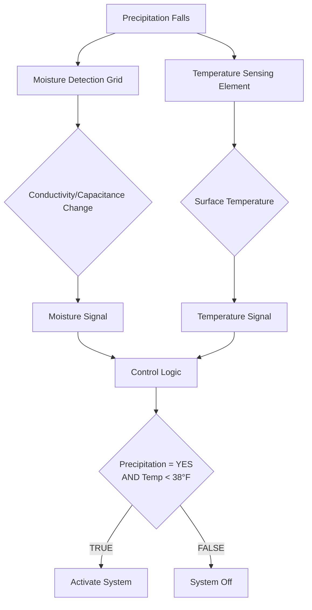

## Overview

Snow and ice detection sensors form the critical input interface for automatic snow melting control systems. These devices must reliably distinguish between frozen and liquid precipitation, measure pavement surface temperature with precision, and provide timely activation signals before significant snow accumulation occurs. Sensor performance directly determines system effectiveness and energy efficiency.

The fundamental challenge in snow detection involves differentiating precipitation types (snow vs. rain) while accounting for the transition zone near freezing where precipitation may begin as snow and change to rain or vice versa. Sensors must detect moisture presence, measure temperature accurately, and in advanced designs, quantify precipitation rate to distinguish brief flurries from sustained snowfall requiring system activation.

## Moisture Detection Principles

### Electrical Conductivity Sensing

Conductivity-based moisture detection exploits the electrical properties of water to sense precipitation. The sensor incorporates exposed electrodes separated by a small gap (typically 1-5 mm) embedded flush with the pavement surface. When moisture bridges the gap between electrodes, the electrical resistance decreases, triggering a detection signal.

The relationship between moisture presence and conductivity follows:

$$\sigma = \frac{1}{\rho} = \frac{I}{V \cdot A/L}$$

Where:
- $\sigma$ = electrical conductivity (S/m)
- $\rho$ = resistivity ($\Omega \cdot m$)
- $I$ = current (A)
- $V$ = applied voltage (V)
- $A$ = electrode cross-sectional area (m²)
- $L$ = electrode spacing (m)

Pure water exhibits low conductivity ($5.5 \times 10^{-6}$ S/m), but precipitation contains dissolved ions that increase conductivity significantly. The sensor applies a small AC voltage (typically 5-24 VAC) across the electrode grid and monitors current flow. When moisture bridges the electrodes, current increases by 2-3 orders of magnitude, providing a clear detection threshold.

**Temperature effects on conductivity:**

Water conductivity varies with temperature according to:

$$\sigma_T = \sigma_{25} \cdot [1 + \alpha(T - 25)]$$

Where:
- $\sigma_T$ = conductivity at temperature $T$ (S/m)
- $\sigma_{25}$ = conductivity at 25°C (S/m)
- $\alpha$ = temperature coefficient (0.019-0.025/°C for typical precipitation)
- $T$ = temperature (°C)

Advanced sensors incorporate temperature compensation to maintain consistent detection thresholds across the operating temperature range (-40°F to 120°F).

### Capacitance Sensing Technology

Capacitive moisture sensors detect the change in dielectric constant when water appears on the sensing surface. The sensor consists of interleaved electrodes forming a capacitor whose capacitance changes when the dielectric medium changes from air to water or ice.

The capacitance relationship follows:

$$C = \epsilon_0 \epsilon_r \frac{A}{d}$$

Where:
- $C$ = capacitance (F)
- $\epsilon_0$ = permittivity of free space ($8.854 \times 10^{-12}$ F/m)
- $\epsilon_r$ = relative permittivity of dielectric material
- $A$ = electrode area (m²)
- $d$ = electrode spacing (m)

The relative permittivity values for different materials:
- Air: $\epsilon_r = 1.0$
- Ice: $\epsilon_r = 3.2$
- Water: $\epsilon_r = 80.4$ at 20°C

When moisture contacts the sensor surface, the capacitance increases dramatically due to water's high dielectric constant. The sensor circuit monitors capacitance through frequency shift detection or AC impedance measurement, providing moisture presence indication.

**Advantages of capacitive sensing:**
- No exposed electrodes subject to corrosion
- Detects moisture through protective coatings
- Less sensitive to water chemistry variations
- Can distinguish ice from water based on dielectric differences

## Temperature Sensing Methods

### Resistance Temperature Detectors (RTDs)

RTDs provide the highest accuracy for pavement temperature measurement in snow melting applications. These sensors utilize the predictable resistance change of pure metals (typically platinum) with temperature.

The Callendar-Van Dusen equation describes RTD resistance-temperature relationship:

$$R_T = R_0[1 + AT + BT^2 + C(T-100)T^3]$$

For temperatures above 0°C, the equation simplifies to:

$$R_T = R_0(1 + AT + BT^2)$$

Where:
- $R_T$ = resistance at temperature $T$ ($\Omega$)
- $R_0$ = resistance at 0°C (100 $\Omega$ for Pt100)
- $A$ = 3.9083 × 10⁻³ °C⁻¹
- $B$ = -5.775 × 10⁻⁷ °C⁻²
- $C$ = -4.183 × 10⁻¹² °C⁻⁴ (below 0°C)

For typical snow melting applications using Pt100 RTDs:

| Temperature | Resistance | Change/°F |
|-------------|----------|----------|
| -40°F (-40°C) | 84.27 Ω | 0.214 Ω/°F |
| 0°F (-17.8°C) | 93.20 Ω | 0.217 Ω/°F |
| 32°F (0°C) | 100.00 Ω | 0.219 Ω/°F |
| 40°F (4.4°C) | 101.73 Ω | 0.220 Ω/°F |

The large resistance change per degree (approximately 0.22 Ω/°F for Pt100) enables high-resolution temperature measurement. Quality snow melting sensors achieve ±0.5°F accuracy across the operating range, critical for reliable snow/rain discrimination at temperatures near freezing.

**RTD wire configurations:**
- **2-wire**: Simplest but includes lead wire resistance; accuracy ±2°F
- **3-wire**: Compensates for lead resistance; accuracy ±1°F
- **4-wire**: Eliminates all lead wire effects; accuracy ±0.5°F

Snow melting applications require 3-wire or 4-wire RTDs to maintain accuracy with long cable runs (up to 1000 ft) from sensor to controller.

### Thermistor Sensors

Negative Temperature Coefficient (NTC) thermistors provide an alternative to RTDs with higher sensitivity but reduced accuracy and more limited temperature range. The resistance-temperature relationship follows:

$$R_T = R_0 \exp\left[\beta\left(\frac{1}{T} - \frac{1}{T_0}\right)\right]$$

Where:
- $R_T$ = resistance at temperature $T$ (K)
- $R_0$ = resistance at reference temperature $T_0$ (typically 10,000 Ω at 25°C)
- $\beta$ = material constant (3000-4500 K for typical NTC thermistors)
- $T$ = absolute temperature (K)

Thermistors exhibit much higher sensitivity than RTDs (4-5% resistance change per °C vs. 0.4% for Pt100) but suffer from non-linear response and parameter variations between devices. Snow melting applications typically favor RTDs for their accuracy and long-term stability.

## Sensor Technologies and Types

### Pavement-Embedded Sensors

Pavement-mounted sensors install flush with the heated surface, providing direct measurement of actual surface conditions. These represent the most common sensor type for snow melting control.

**Construction details:**
- **Housing**: Stainless steel or high-impact polymer rated for vehicle traffic
- **Dimensions**: 4-6 inch diameter, 1/2 to 3/4 inch depth
- **Mounting**: Cast into slab during pour or core-drilled into existing pavement
- **Wiring**: 4-8 conductor shielded cable, typically 18-22 AWG
- **Protection**: Epoxy potting for complete moisture sealing

The sensor face incorporates multiple elements:

1. **Moisture detection grid**: Interleaved conductors or capacitive plates
2. **RTD or thermistor**: Embedded 1/4 to 1/2 inch below surface
3. **Reference element**: For temperature compensation of moisture circuit
4. **Heating element** (optional): Prevents ice buildup on sensor face

### Aerial Precipitation Sensors

Aerial sensors mount above the protected area (8-12 feet typical height) and detect falling precipitation without pavement contact. These sensors eliminate mechanical damage concerns but require separate pavement temperature measurement.

**Heated grid detection:**

The sensor maintains a small heated surface (1-4 square inches) at a setpoint temperature above ambient (typically 15-25°F above air temperature). When precipitation falls on the heated surface, the power required to maintain setpoint temperature increases due to evaporative cooling:

$$Q_{evap} = \dot{m} h_{fg}$$

Where:
- $Q_{evap}$ = evaporative cooling rate (BTU/hr)
- $\dot{m}$ = moisture mass flow rate (lb/hr)
- $h_{fg}$ = latent heat of vaporization (970 BTU/lb at 80°F)

For light precipitation (0.1 inch/hr), a 2 square inch sensor experiences approximately:

$$\dot{m} = 0.1 \text{ in/hr} \times 2 \text{ in}^2 \times 62.4 \text{ lb/ft}^3 / (12 \text{ in/ft})^3 = 7.2 \times 10^{-4} \text{ lb/hr}$$

$$Q_{evap} = 7.2 \times 10^{-4} \times 970 = 0.70 \text{ BTU/hr} = 0.20 \text{ W}$$

The sensor detects this power increase (typically 0.2-2 W depending on precipitation rate) and generates an alarm when power exceeds threshold for a specified duration (1-5 minutes).

**Infrared/optical detection:**

Advanced sensors use infrared or visible light beams to detect precipitation particles. As water droplets or snow crystals pass through the sensing volume, they scatter light which is detected by photosensors. The detection principle follows Mie scattering theory for particles comparable to light wavelength:

$$I_{scattered} \propto \frac{d^6}{\lambda^4}$$

Where:
- $I_{scattered}$ = scattered light intensity
- $d$ = particle diameter
- $\lambda$ = light wavelength

Optical sensors distinguish snow from rain based on particle size, fall velocity, and scattering characteristics. Snow crystals (1-10 mm diameter) produce different scattering patterns than raindrops (0.5-5 mm diameter).

### Combination Sensor Arrays

High-reliability installations employ redundant sensors with voting logic:

**Dual sensor configuration:**
- Two pavement sensors spaced 10-20 feet apart
- System activates when either sensor detects snow and cold temperature
- Reduces false-negative events (missed snow detection)

**Triple sensor with voting:**
- Three sensors in 2-of-3 voting arrangement
- Requires two sensors to agree for activation
- Reduces false-positive events (activation during rain)

The probability of system failure decreases with redundancy:

$$P_{fail} = P_{sensor}^n$$

Where:
- $P_{fail}$ = probability of complete system failure
- $P_{sensor}$ = probability of single sensor failure
- $n$ = number of redundant sensors

For sensors with 95% reliability ($P_{sensor} = 0.05$), dual redundancy achieves 99.75% system reliability.

## Installation Best Practices

### Pavement Sensor Placement

Proper sensor location ensures representative measurement of surface conditions:

**Location criteria:**
1. **Representative area**: Place sensor in typical area, not shaded or sheltered zones
2. **Drainage**: Avoid low spots where water accumulates
3. **Traffic**: Position sensor outside primary wheel paths when possible
4. **Sun exposure**: Account for solar heating effects on south-facing slopes
5. **Multiple zones**: Install separate sensors for distinct microclimates

**Installation depth:**

The sensor face must sit flush with finished pavement (±1/8 inch tolerance). Temperature sensing elements position 1/4 to 1/2 inch below the surface to measure the critical interface temperature where snow contact occurs.

For concrete slabs, the sensor mounts during pour:

Critical installation steps:
1. Secure sensor to reinforcement using tie wire or mounting clips
2. Route cable under tubing to slab edge in protective conduit
3. Verify sensor face height matches planned slab elevation
4. Protect cable penetration through slab edge with flexible seal
5. Test sensor function before concrete placement

### Aerial Sensor Mounting

Mounting height and angle significantly affect performance:

| Parameter | Recommended Range | Reason |
|-----------|------------------|---------|
| Height above pavement | 8-12 feet | Balance coverage area vs. wind effects |
| Mounting angle | 30-45° from vertical | Prevent water pooling on sensor face |
| Clearance from obstructions | >3 feet | Avoid shelter/shadow effects |
| Distance from heated area edge | <50 feet | Ensure precipitation correlation |

**Wind effect compensation:**

Wind creates false triggers on heated grid sensors through forced convection cooling. The convective heat transfer coefficient increases with wind velocity:

$$h_c = 2.8 + 3.0 V$$

Where:
- $h_c$ = convection coefficient (BTU/hr·ft²·°F)
- $V$ = wind velocity (mph)

At 20 mph wind, the convection coefficient increases from 2.8 (still air) to 62.8 BTU/hr·ft²·°F, causing the sensor to increase heating power even without precipitation. Advanced sensors incorporate wind speed measurement and compensation algorithms to reduce false activation.

### Wiring and Protection

Sensor cables require protection from moisture, mechanical damage, and electrical interference:

**Cable specifications:**
- Conductor gauge: 18-22 AWG (depending on run length and signal type)
- Insulation: 600V rated, suitable for wet/damp locations
- Shield: 100% foil or braid shield for noise immunity
- Jacket: Sunlight-resistant PVC or polyethylene for aerial sensors

**Installation requirements:**
1. Route cables in separate conduit from power wiring
2. Maintain 12-inch separation from AC power cables when not in conduit
3. Use sealed conduit fittings at sensor and controller connections
4. Provide drip loops before entering enclosures
5. Bond shield at controller end only (avoid ground loops)

Maximum cable lengths:
- RTD sensors (4-wire): 1000 feet
- Thermistor sensors: 500 feet
- Moisture detection (conductivity): 750 feet
- Capacitance sensors: 250 feet (depends on operating frequency)

### Calibration and Testing

New sensor installations require verification before system commissioning:

**Temperature calibration:**
1. Measure sensor resistance with precision ohmmeter
2. Compare to RTD/thermistor reference table at ambient temperature
3. Verify reading accuracy within ±1°F
4. Record offset in controller if adjustment range provided

**Moisture detection test:**
1. Apply water to sensor face with spray bottle
2. Verify moisture alarm within 5-30 seconds (per manufacturer spec)
3. Dry sensor and confirm alarm clears
4. Test at multiple temperatures (40°F, 32°F, 25°F)

**Simulated snow test:**
1. Pre-cool pavement sensor to 30-35°F
2. Apply ice-water mixture to sensor face
3. Verify controller activates system with proper time delays
4. Monitor for false deactivation during active moisture

Annual maintenance includes:
- Visual inspection of sensor face for damage/degradation
- Cleaning of moisture detection grids (remove debris, road salts)
- Verification of temperature accuracy
- Testing of moisture detection response time
- Documentation of sensor condition and performance

## Advanced Features

### Precipitation Rate Sensing

Premium sensors measure precipitation intensity to distinguish light flurries from heavy snowfall:

$$R = \frac{\Delta h}{\Delta t}$$

Where:
- $R$ = precipitation rate (inches/hour)
- $\Delta h$ = accumulated depth (inches)
- $\Delta t$ = time interval (hours)

The sensor correlates moisture grid conductivity changes with precipitation rate. Higher intensity precipitation causes faster conductivity increase:

$$\frac{dC}{dt} \propto R$$

Controllers use rate information to:
- Delay activation for brief flurries (< 0.1 inch/hr)
- Immediate start for heavy snow (> 0.3 inch/hr)
- Modulate heat output based on melting demand

### Multi-Point Temperature Profiling

Advanced installations measure temperature at multiple depths:

- Surface temperature (0-1/4 inch depth)
- Mid-slab temperature (2-4 inch depth)
- Base temperature (4-6 inch depth)

The temperature profile indicates slab thermal state and warmup progress. Temperature gradient through the slab follows:

$$\frac{dT}{dx} = -\frac{q}{k}$$

Where:
- $dT/dx$ = temperature gradient (°F/inch)
- $q$ = heat flux (BTU/hr·ft²)
- $k$ = concrete thermal conductivity (0.75-1.0 BTU/hr·ft·°F)

During warmup, temperature sensors at different depths allow calculation of transient heat storage:

$$Q_{stored} = m c_p (T_{avg,final} - T_{avg,initial})$$

This information enables predictive control algorithms that optimize warmup timing and energy consumption.

## Manufacturer Technologies

Leading manufacturers employ proprietary detection methods:

**Thermostor (SunTouch/Watts)**
- Heated grid aerial sensors with wind compensation
- Pavement sensors with integrated moisture/temperature measurement
- Operating range: -40°F to 140°F

**ETI (Environmental Technology Inc.)**
- Conductivity-based pavement sensors
- Advanced precipitation rate algorithms
- Self-diagnostic capabilities

**ICM Controls**
- Capacitive moisture detection
- Digital signal processing for noise immunity
- Modular sensor/controller architecture

**Tekmar/Watts**
- Dual-element temperature sensing
- Moisture detection with automatic sensitivity adjustment
- Integration with boiler and mixing valve controls

Consult ASHRAE Handbook - HVAC Applications Chapter 51 for detailed sensor selection guidance and application-specific recommendations. Manufacturers provide sensor specifications including response times, accuracy specifications, and installation requirements that must be verified during design phase.
