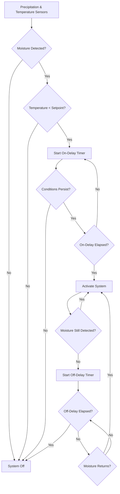

Time delay settings in snow melting controls serve two critical functions: preventing unnecessary system activation from transient weather events (on-delay) and ensuring complete surface drying after precipitation ends (off-delay). Proper delay configuration requires understanding slab thermal dynamics and the physics of heat transfer through concrete substrates.

## Physical Basis for Time Delays

**On-Delay Requirements**

The on-delay timer prevents system activation during brief weather fluctuations that would waste energy without providing meaningful snow melting. This delay must be short enough to activate before significant snow accumulation but long enough to filter false triggers from:

- Passing cloud cover temporarily reducing sensor temperature
- Light precipitation that evaporates without accumulating
- Sensor contamination from debris or temporary shading

The optimal on-delay balances these factors against the slab heat-up time required to reach effective melting temperatures at the surface.

**Off-Delay Requirements**

The off-delay timer ensures the slab surface reaches complete dryness before system shutdown. Premature shutdown leaves residual moisture that can refreeze, creating hazardous ice conditions. The required off-delay depends on:

- Residual heat stored in the slab thermal mass
- Evaporative cooling rate at the surface
- Ambient temperature and humidity conditions
- Slab porosity and moisture retention characteristics

## Slab Thermal Response Calculations

**Heat Storage in Concrete Mass**

The thermal energy stored in a concrete slab determines both heat-up time and cool-down behavior:

$$Q_{stored} = \rho \cdot V \cdot c_p \cdot \Delta T$$

Where:
- $Q_{stored}$ = thermal energy stored (Btu or kJ)
- $\rho$ = concrete density (typically 145 lb/ft³ or 2,320 kg/m³)
- $V$ = slab volume (ft³ or m³)
- $c_p$ = specific heat of concrete (0.22 Btu/lb·°F or 0.92 kJ/kg·K)
- $\Delta T$ = temperature rise from ambient to operating temperature (°F or K)

**Heat-Up Time Estimation**

The time required to bring a slab from ambient temperature to effective melting capacity:

$$t_{heatup} = \frac{\rho \cdot d \cdot c_p \cdot \Delta T}{q_{avg}}$$

Where:
- $t_{heatup}$ = heat-up time (hours)
- $d$ = effective slab depth influenced by heating (ft or m)
- $q_{avg}$ = average heat flux from embedded tubing or cables (Btu/h·ft² or W/m²)

For a typical 4-inch concrete slab with 50 Btu/h·ft² heat output:

$$t_{heatup} = \frac{145 \times 0.333 \times 0.22 \times 30}{50} = 0.63 \text{ hours} \approx 38 \text{ minutes}$$

This calculation assumes a 30°F temperature rise and represents the theoretical minimum. Actual heat-up time exceeds this due to:

- Heat loss to the substrate below
- Heat loss to ambient air above
- Non-uniform temperature distribution
- Transient conduction effects

Practical heat-up times typically range from 45 to 90 minutes depending on slab construction and environmental conditions.

## Time Delay Control Logic

The control sequence integrates sensor inputs with timer functions to optimize system operation:

## Delay Setting Recommendations by Application

| Application Type | On-Delay (minutes) | Off-Delay (minutes) | Rationale |
|-----------------|-------------------|---------------------|-----------|
| Critical Walkways | 5-7 | 45-60 | Minimize slip hazard; ensure complete drying |
| Building Entrances | 7-10 | 40-50 | Balance safety with energy cost |
| Parking Areas | 10-15 | 30-40 | Tolerate brief accumulation; reduce runtime |
| Roadways/Ramps | 3-5 | 60-90 | Maximum safety priority; extended drying |
| Loading Docks | 8-12 | 35-45 | Operational continuity; moderate priority |
| Decorative Plazas | 12-15 | 30-35 | Aesthetic maintenance; lower safety criticality |

**Setting Adjustments**

Base delay values require modification based on local conditions:

- **High Wind Areas**: Reduce off-delay by 10-15% (faster evaporation)
- **Humid Climates**: Increase off-delay by 20-30% (slower evaporation)
- **High Solar Exposure**: Reduce on-delay by 15-20% (natural melting assist)
- **Shaded Locations**: Increase both delays by 10-15% (reduced ambient heat gain)

## Standards and Design Considerations

ASHRAE Handbook - HVAC Applications Chapter 51 provides guidance on snow melting system controls but does not specify exact timer values. Instead, design must account for:

1. **Load Class Requirements**: Free area from snow (Class I) versus snow-free area (Class II) or snow-free with backup capacity (Class III)
2. **Idling Strategy**: Systems maintaining slab temperature above freezing reduce on-delay requirements
3. **Energy Source**: Electric resistance systems heat faster than hydronic systems with long piping runs
4. **Slab Construction**: Insulation below heating elements improves heat-up time by 30-50%

**Adjustable Timer Implementation**

Modern controls provide field-adjustable delays allowing calibration to specific site conditions. Commissioning should include:

- Testing system response during actual precipitation events
- Measuring surface temperature rise rates
- Verifying complete moisture removal before shutdown
- Documenting final settings for operational reference

The optimal timer configuration balances three objectives: safety through reliable snow removal, energy efficiency through minimized runtime, and equipment longevity through reduced thermal cycling.

## Practical Considerations

**False Start Prevention**

Excessive on-delay causes snow accumulation before system activation, requiring higher heat output to achieve clearing. Insufficient on-delay wastes energy on non-events. The correct setting depends on local snowfall intensity patterns and acceptable accumulation depth.

**Incomplete Drying Consequences**

Premature system shutdown from inadequate off-delay creates ice formation risk. Residual moisture in concrete pores refreezes when ambient temperature drops, potentially causing surface spalling in addition to slip hazards. Off-delay should extend until surface temperature and evaporation rate indicate complete dryness.

**Seasonal Adjustment**

Some installations benefit from seasonal timer modification. Early and late winter conditions with higher solar angles and ambient temperatures permit shorter delays compared to mid-winter operation. Advanced controls with ambient temperature compensation automatically adjust delay periods based on measured conditions.
