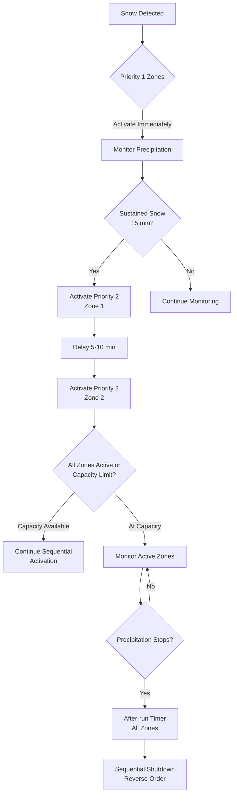
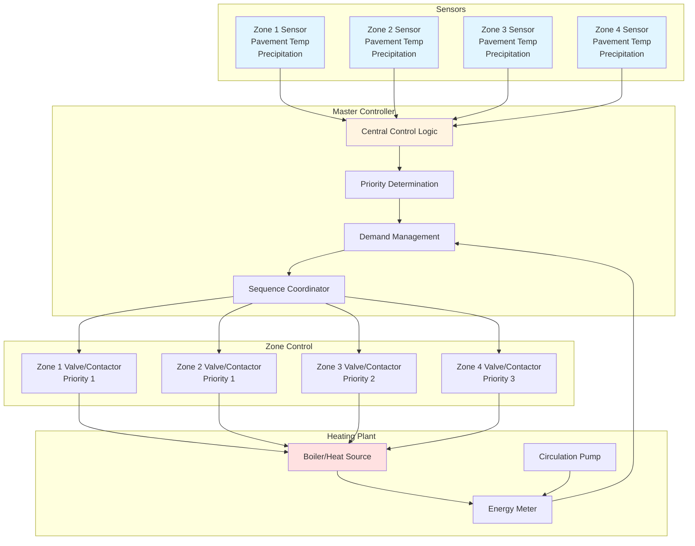

## Overview

Zoning divides large snow melting installations into independently controlled segments to manage electrical demand, optimize energy consumption, and provide operational flexibility. Multi-zone control addresses two fundamental constraints: limited heating plant capacity and peak power limitations that prohibit simultaneous operation of all areas. The zone control strategy determines system effectiveness, installation cost, and annual operating expense.

Snow melting zones differ from building HVAC zones in critical aspects. Building zones respond to steady-state loads with predictable diversity, while snow melting zones face identical snow loads simultaneously across all areas. This simultaneity eliminates traditional diversity factors and requires careful design to prevent system overload during peak demand.

## Zone Sizing Fundamentals

### Heat Flux Distribution

Zone size depends on the available heat flux density and total heat output capacity. The fundamental relationship governs zone area:

$$A_{\text{zone}} = \frac{Q_{\text{available}}}{q_{\text{flux}}}$$

Where:
- $A_{\text{zone}}$ = Maximum zone area (ft²)
- $Q_{\text{available}}$ = Available heating capacity for zone (BTU/hr)
- $q_{\text{flux}}$ = Required heat flux density (BTU/hr·ft²)

The required heat flux density varies with snow melting class (ASHRAE Classes I, II, III) and site conditions:

| Snow Melting Class | Design Heat Flux | Application |
|-------------------|------------------|-------------|
| Class I | 100-150 BTU/hr·ft² | Residential driveways, low-priority walks |
| Class II | 150-250 BTU/hr·ft² | Commercial entries, parking areas |
| Class III | 250-400 BTU/hr·ft² | Critical access, emergency routes, heliports |

### Hydraulic Balance Requirements

Hydronic zoning requires flow rate calculation for each zone to ensure proper heat delivery. The zone flow rate derives from the heat load and system temperature differential:

$$\dot{m}_{\text{zone}} = \frac{Q_{\text{zone}}}{c_p \cdot \Delta T}$$

Converting to common units (GPM):

$$\text{GPM}_{\text{zone}} = \frac{Q_{\text{zone}} \text{ (BTU/hr)}}{500 \cdot \Delta T \text{ (°F)}}$$

Where:
- $\dot{m}_{\text{zone}}$ = Zone mass flow rate (lb/hr)
- $Q_{\text{zone}}$ = Zone heat load (BTU/hr)
- $c_p$ = Fluid specific heat (1.0 BTU/lb·°F for water)
- $\Delta T$ = Supply-return temperature difference (°F)
- 500 = Conversion constant (8.33 lb/gal × 60 min/hr)

Standard hydronic snow melting systems operate with 10-20°F temperature differentials. Higher differentials reduce flow rates and piping sizes but require higher supply temperatures.

### Electrical Load Calculation

Electric snow melting zones require power distribution analysis to determine circuit capacity and zone limits:

$$P_{\text{zone}} = \frac{q_{\text{flux}} \cdot A_{\text{zone}}}{3.412}$$

Where:
- $P_{\text{zone}}$ = Electrical power required (watts)
- $q_{\text{flux}}$ = Heat flux density (BTU/hr·ft²)
- $A_{\text{zone}}$ = Zone area (ft²)
- 3.412 = Conversion factor (BTU/hr to watts)

Electrical systems face hard limits from circuit breaker capacity and transformer ratings. A typical 200-amp, 240V circuit provides maximum 48 kW (163,800 BTU/hr), limiting zone area based on design heat flux:

- At 150 BTU/hr·ft²: Maximum 1,092 ft²
- At 200 BTU/hr·ft²: Maximum 819 ft²
- At 250 BTU/hr·ft²: Maximum 655 ft²

## Zoning Strategies

### Priority-Based Zoning

Priority zoning assigns operational importance to different areas, activating critical zones first and secondary zones as capacity permits. This strategy maximizes snow removal effectiveness within system capacity constraints.

**Priority classifications:**

1. **Priority 1 (Critical)** - Emergency access, building entries, ADA ramps, fire lanes
2. **Priority 2 (High)** - Main walkways, primary parking aisles, loading docks
3. **Priority 3 (Standard)** - General parking, secondary walks, overflow areas
4. **Priority 4 (Low)** - Remote parking, storage areas, rarely used access

The control system monitors total system capacity and available margin before activating lower-priority zones. Priority 1 zones receive immediate activation upon snow detection. Priority 2-4 zones activate sequentially with time delays (typically 15-30 minutes) to verify sustained snowfall and prevent unnecessary operation during brief flurries.

### Sequential Activation

Sequential activation staggers zone startup to limit peak demand and reduce thermal shock to the heating plant. This strategy proves essential for systems approaching full capacity utilization.

**Staging sequence:**

Staging delays range from 5-15 minutes between zone activations. The delay provides time for flow stabilization, pressure equalization, and heating plant response. Excessively short delays cause system instability; excessively long delays result in snow accumulation on inactive zones.

### Geographic Zoning

Geographic zoning divides the installation by physical location rather than priority. This approach suits large sites where different areas experience varying microclimate conditions due to building shadows, wind exposure, or elevation differences.

**Zone definition criteria:**

- Solar exposure (south-facing vs. north-facing slopes)
- Wind exposure (sheltered vs. exposed areas)
- Elevation changes (ramps vs. level surfaces)
- Substrate type (concrete vs. asphalt thermal mass differences)
- Traffic patterns (high-use vs. low-use areas)

Geographic zones may require individual sensors to account for local conditions. A sheltered north-facing entry may accumulate snow while a south-facing parking area remains clear, necessitating independent control.

### Demand-Based Zoning

Demand-based zoning monitors real-time energy consumption and available capacity, activating zones dynamically to maximize coverage within power constraints. This strategy requires sophisticated controls with energy metering and predictive algorithms.

The system calculates available capacity:

$$Q_{\text{available}} = Q_{\text{total}} - Q_{\text{active}} - Q_{\text{reserve}}$$

Where:
- $Q_{\text{available}}$ = Capacity available for additional zones
- $Q_{\text{total}}$ = Total system capacity
- $Q_{\text{active}}$ = Current load from operating zones
- $Q_{\text{reserve}}$ = Reserve margin (typically 10-15%)

Additional zones activate only when available capacity exceeds the zone design load plus reserve margin. This prevents system overload during extreme conditions when active zones draw maximum power.

## Comparison of Zoning Strategies

| Strategy | Advantages | Disadvantages | Best Application |
|----------|-----------|---------------|------------------|
| **Priority-Based** | Ensures critical area coverage; Simple logic; Predictable operation | May leave low-priority areas uncleared; Binary on/off per zone | Facilities with distinct critical vs. non-critical areas |
| **Sequential** | Limits peak demand; Gradual system loading; Reduces thermal shock | All areas eventually active (no true load shedding); Delayed coverage | Systems near capacity limits; Large installations |
| **Geographic** | Accounts for microclimates; Optimizes for local conditions; Reduces unnecessary operation | Requires multiple sensors; Complex setup; Higher installation cost | Large sites with varying exposure; Multi-building campuses |
| **Demand-Based** | Maximum efficiency; Adapts to real-time conditions; Optimizes capacity utilization | Requires advanced controls; Complex commissioning; Unpredictable zone activation | Installations with variable capacity; Integrated facility systems |

## Multi-Zone Control Architecture

A complete multi-zone control system integrates sensors, zone controllers, heating plant controls, and monitoring systems:

The master controller receives inputs from all zone sensors and determines activation sequence based on priority assignments, available capacity, and precipitation conditions. Individual zone controllers (valves for hydronic systems, contactors for electric systems) respond to master controller commands while maintaining local safety interlocks.

## Design Considerations

### Zone Valve Sizing

Hydronic zone valves must provide adequate flow capacity without excessive pressure drop. The valve $C_v$ coefficient determines flow capacity:

$$C_v = \frac{\text{GPM}}{\sqrt{\Delta P}}$$

Where:
- $C_v$ = Valve flow coefficient
- GPM = Required zone flow rate
- $\Delta P$ = Allowable pressure drop across valve (psi)

Select valves with $C_v$ values 25-30% higher than the calculated requirement to ensure adequate flow at partial-open positions and account for valve wear.

### Electrical Load Diversity

Unlike building electrical loads, snow melting systems exhibit zero diversity during active snow events. All zones experience identical snow loads simultaneously, eliminating traditional diversity factors used in electrical design.

Total system capacity must equal the sum of all zone loads:

$$P_{\text{total}} = \sum_{i=1}^{n} P_{\text{zone,i}}$$

No diversity factor applies. Demand-based zoning provides the only method to reduce installed capacity below total connected load, accepting that some zones may not operate during extreme events.

### Control Integration

Multi-zone systems require coordination between zone controllers and the central heating plant. The heating plant must receive demand signals indicating the number and size of active zones to modulate firing rate, pump speed, and supply temperature.

**Essential integration signals:**

- Total zone activation count
- Aggregate heat demand (BTU/hr)
- System flow rate requirement (GPM)
- Return temperature feedback
- High/low limit alarm conditions

Modern systems use BACnet, Modbus, or proprietary protocols for controller communication. Ensure compatibility between zone controllers, master controller, and heating plant controls during design.

## Performance Optimization

Proper zone sizing and control tuning maximize system effectiveness:

**Zone size limits:**
- Minimum zone size: 500-800 ft² (avoid excessive zoning with high valve/contactor costs)
- Maximum zone size: Limited by available capacity and single-circuit flow/power limits
- Optimal zone size: 1,500-3,000 ft² for balanced installation and operating costs

**Control parameters:**
- Start delay between zones: 5-15 minutes
- After-run time: 30-60 minutes (all zones)
- Priority override capability: Allow manual priority reassignment
- Capacity reserve: Maintain 10-15% margin before activating additional zones

**Commissioning verification:**
- Verify individual zone activation and deactivation
- Confirm proper staging sequence and time delays
- Test priority override functions
- Measure actual zone flow rates or power consumption
- Validate system capacity limits and load shedding thresholds

ASHRAE Handbook - HVAC Applications Chapter 51 provides detailed guidance on zone control strategies, while manufacturers' technical documentation specifies zone valve sizing and control wiring requirements for specific equipment.
