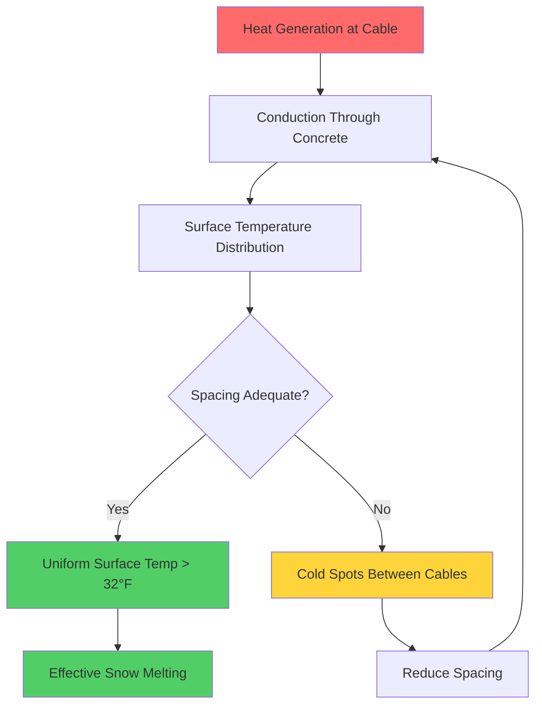
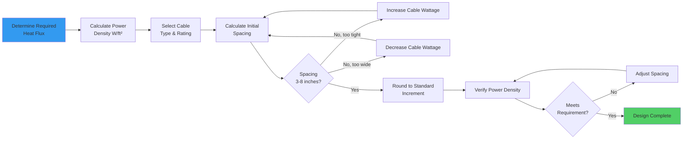

Cable spacing represents the critical design parameter linking electric heating cable output to required power density for snow melting systems. Proper spacing ensures uniform surface temperature distribution while meeting thermal performance requirements. The fundamental relationship balances cable wattage per linear foot against target watts per square foot, with spacing serving as the geometric factor connecting these parameters.

## Fundamental Spacing Relationship

The spacing calculation derives from the requirement that total power output per unit area equals cable power distributed over its influence zone. For parallel cable runs with uniform spacing, the power density relationship is:

$$P_{\text{density}} = \frac{P_{\text{cable}}}{S}$$

Where:
- $P_{\text{density}}$ = power density (W/ft²)
- $P_{\text{cable}}$ = cable power output (W/ft)
- $S$ = center-to-center spacing (ft)

Rearranging to solve for spacing:

$$S = \frac{P_{\text{cable}}}{P_{\text{density}}}$$

Converting to inches for field measurement:

$$S_{\text{inches}} = \frac{P_{\text{cable}} \times 12}{P_{\text{density}}}$$

This equation demonstrates the inverse relationship between cable spacing and power density. Higher target power density requires proportionally tighter cable spacing for a given cable wattage.

## Spacing Calculation Examples

**Example 1: Residential Driveway**

Given parameters:
- Required heat flux: 180 Btu/hr·ft² (ASHRAE Class II, moderate climate)
- Power density: $180 / 3.412 = 52.8$ W/ft²
- Selected cable: 18 W/ft constant wattage

Calculate spacing:

$$S = \frac{18 \times 12}{52.8} = 4.09 \text{ inches}$$

Specify 4-inch on-center spacing (standard increment).

Verify actual power density:

$$P_{\text{actual}} = \frac{18 \times 12}{4} = 54 \text{ W/ft}^2$$

This provides 54 W/ft², exceeding the 52.8 W/ft² requirement by 2.3% for adequate safety margin.

**Example 2: Commercial Loading Dock**

Given parameters:
- Required heat flux: 250 Btu/hr·ft² (Class III, heavy snowfall)
- Power density: $250 / 3.412 = 73.3$ W/ft²
- Selected cable: 22 W/ft mineral insulated

Calculate spacing:

$$S = \frac{22 \times 12}{73.3} = 3.60 \text{ inches}$$

Specify 3.5-inch spacing or use 3-inch spacing for margin:

At 3.5-inch spacing: $P = (22 \times 12) / 3.5 = 75.4$ W/ft²
At 3-inch spacing: $P = (22 \times 12) / 3 = 88$ W/ft²

The 3.5-inch spacing provides suitable performance; 3-inch spacing offers 19% excess capacity for severe conditions or rapid response.

## Thermal Physics of Cable Spacing

Heat transfer from embedded cables to the pavement surface follows two-dimensional conduction paths. The spacing dimension directly influences temperature uniformity across the surface. This relationship derives from steady-state heat conduction in semi-infinite media.

For a linear heat source at depth $d$ below the surface, the temperature distribution along the surface follows approximately:

$$T(x) - T_{\infty} = \frac{q'}{2\pi k} \ln\left(\frac{L}{r}\right)$$

Where:
- $T(x)$ = surface temperature at distance $x$ from cable centerline
- $T_{\infty}$ = ambient temperature
- $q'$ = cable heat output per unit length (W/m)
- $k$ = thermal conductivity of pavement material (W/m·K)
- $r$ = distance from cable to surface point
- $L$ = characteristic length

The temperature profile exhibits higher values directly above each cable with gradual decrease between cables. Spacing must be sufficiently close that the minimum temperature (midpoint between adjacent cables) exceeds the freezing point under design conditions.



## Temperature Uniformity Analysis

Surface temperature uniformity depends on the ratio of spacing to burial depth. Define the spacing ratio:

$$R_s = \frac{S}{d}$$

Where:
- $S$ = cable spacing
- $d$ = cable burial depth

For concrete snow melting systems with typical burial depth of 2 inches (0.167 ft):

| Spacing (inches) | Spacing Ratio $R_s$ | Surface Temp Variation | Uniformity Rating |
|------------------|---------------------|------------------------|-------------------|
| 3 | 1.5:1 | ±2-3°F | Excellent |
| 4 | 2:1 | ±3-5°F | Good |
| 6 | 3:1 | ±5-8°F | Acceptable |
| 8 | 4:1 | ±8-12°F | Marginal |
| 10 | 5:1 | ±12-18°F | Poor |

Practical design limits spacing ratios to 3:1 or less for acceptable uniformity. Tighter ratios provide more uniform heating but increase cable length and installation cost. The optimal ratio balances thermal performance against economic constraints.

## Spacing Design Methodology



## Practical Spacing Constraints

**Minimum Spacing: 3 inches**

Physical and thermal limitations establish the minimum practical spacing:

1. **Installation clearance**: Cable must not contact adjacent runs during placement or concrete consolidation
2. **Thermal interaction**: Cables spaced closer than 3 inches create overlapping heat flux patterns that can cause localized overheating
3. **Mechanical integrity**: Excessive heat density (>100 W/ft²) in concrete can cause thermal stress cracking
4. **Rebar coordination**: Spacing must allow cable ties to secure to reinforcing mesh without interference

**Maximum Spacing: 8 inches**

Upper spacing limits derive from temperature uniformity requirements:

1. **Surface temperature variation**: Spacing beyond 8 inches creates cold zones between cables where snow accumulates
2. **Response time**: Wide spacing increases thermal mass between heat source and surface, slowing system response
3. **Standard practice**: Field experience establishes 8 inches as the practical maximum for consistent performance
4. **Economic threshold**: Very wide spacing requires higher wattage cable to achieve power density, often negating cost savings

**Standard Increments**

Field installation uses discrete spacing values aligned with reinforcing mesh patterns:
- 3 inches: High-density applications, edge zones
- 4 inches: Typical residential and light commercial
- 6 inches: Standard commercial installations
- 8 inches: Light-duty or budget-constrained projects

## Edge Zone Design

Perimeter areas experience 30-50% higher heat loss than interior zones due to:

1. **Additional exposure surfaces**: Heat conducts laterally through exposed concrete edges
2. **Convective boundary effects**: Wind creates enhanced heat transfer coefficients at perimeters
3. **Thermal bridging**: Edge conditions lack insulation continuity
4. **Snow drift accumulation**: Wind-driven snow deposits preferentially at edges

Edge zone compensation requires tighter cable spacing or higher wattage cable. The edge zone extends 18-24 inches from any exposed perimeter.

**Edge Zone Spacing Calculation:**

$$S_{\text{edge}} = \frac{S_{\text{interior}}}{F_{\text{edge}}}$$

Where $F_{\text{edge}}$ = edge factor, typically 1.5 to 2.0

For a system with 6-inch interior spacing and edge factor of 1.5:

$$S_{\text{edge}} = \frac{6}{1.5} = 4 \text{ inches}$$

Alternative approach: maintain interior spacing but increase cable wattage in edge zones by the edge factor.

## Spacing vs. Power Density Trade-offs

The cable spacing decision involves multiple interrelated factors:

| Factor | Tighter Spacing (3-4") | Wider Spacing (6-8") |
|--------|------------------------|---------------------|
| **Temperature Uniformity** | Excellent (±2-4°F) | Acceptable (±6-10°F) |
| **System Response Time** | Fast (15-30 min) | Moderate (30-60 min) |
| **Cable Length Required** | High (+50-100%) | Baseline |
| **Installation Labor** | Increased | Standard |
| **Material Cost** | Higher | Lower |
| **Power Density Achieved** | High (60-90 W/ft²) | Moderate (30-50 W/ft²) |
| **Cable Wattage Options** | Lower W/ft acceptable | Higher W/ft required |
| **Surface Quality** | Superior | Adequate |

## Multi-Zone Spacing Design

Complex installations employ variable spacing to optimize performance and cost:

**Zone 1 - High Priority Areas:**
- Walkways, building entrances, loading zones
- Spacing: 3-4 inches
- Power density: 60-80 W/ft²
- Objective: Rapid clearing, continuous bare pavement

**Zone 2 - Standard Areas:**
- Main driveways, parking areas
- Spacing: 4-6 inches
- Power density: 50-65 W/ft²
- Objective: Effective clearing during active snowfall

**Zone 3 - Light Duty Areas:**
- Overflow parking, secondary access
- Spacing: 6-8 inches
- Power density: 35-50 W/ft²
- Objective: Snow reduction, ice prevention

```mermaid
graph TD
    A[Total Heated Area] --> B[Zone 1: High Priority<br/>3-4" spacing]
    A --> C[Zone 2: Standard<br/>4-6" spacing]
    A --> D[Zone 3: Light Duty<br/>6-8" spacing]

    B --> E[Separate Circuit<br/>Priority Control]
    C --> F[Standard Circuit<br/>Normal Control]
    D --> G[Delayed Circuit<br/>Economy Control]

    E --> H[Contactor Bank]
    F --> H
    G --> H

    H --> I[Snow/Ice Controller]

    style B fill:#ff6b6b
    style C fill:#ffd43b
    style D fill:#51cf66
    style I fill:#339af0
```

## Calculation Software and Design Tools

Modern cable spacing design utilizes computational tools to optimize complex layouts:

**Design Inputs:**
- Pavement dimensions and edge conditions
- Required heat flux from ASHRAE calculations
- Cable specifications (voltage, wattage, diameter)
- Control strategy (full area vs. zoned)
- Budget constraints

**Optimization Algorithms:**
- Minimize total cable length subject to power density constraints
- Balance uniformity requirements against cost
- Coordinate spacing with structural reinforcing layout
- Generate installation drawings with spacing dimensions

**Output Documentation:**
- Cable routing plans with spacing callouts
- Electrical load calculations by circuit
- Bill of materials with cable lengths
- Installation specifications

## Installation Quality Control

Accurate field execution of designed spacing ensures system performance:

**Layout Methods:**

1. **Template strips**: Plywood or metal templates with hole spacing match design dimensions
2. **Chalk lines**: Mark parallel lines at specified spacing intervals
3. **Pre-marked mesh**: Reinforcing mesh with spacing indicators
4. **Laser guides**: Project parallel lines at exact spacing

**Verification Procedures:**

1. Measure spacing at 10-foot intervals along cable runs
2. Verify spacing tolerance: ±0.5 inches from design specification
3. Document actual spacing variations on as-built drawings
4. Calculate actual power density based on field measurements

**Common Installation Errors:**

- Progressive spacing drift: cumulative error in repetitive spacing measurements
- Inconsistent edge zone spacing: failure to transition to tighter spacing at perimeters
- Crossing cables: spacing measured to wrong adjacent cable at turns
- Compression during concrete placement: spacing closes under vibrator action

## Advanced Spacing Considerations

**Variable Depth Compensation:**

When cable burial depth varies (sloped surfaces, drainage profiles), adjust spacing to maintain power density:

$$S_{\text{adjusted}} = S_{\text{nominal}} \times \sqrt{\frac{d_{\text{nominal}}}{d_{\text{actual}}}}$$

This square root relationship accounts for three-dimensional heat spreading from deeper burial positions.

**Thermal Conductivity Effects:**

Pavement materials with different thermal conductivities require spacing adjustments. Higher conductivity materials (dense concrete) allow slightly wider spacing than low conductivity materials (asphalt with air voids) for equivalent surface temperature uniformity.

**Transient Response Optimization:**

Systems requiring rapid response (emergency helicopter pads, critical access roads) benefit from tighter spacing. The reduced thermal mass between cables and surface decreases time constant for temperature rise.

## Economic Optimization

The total installed cost includes cable material, labor, and electrical infrastructure:

$$C_{\text{total}} = (C_{\text{cable}} \times L) + (C_{\text{labor}} \times L) + C_{\text{electrical}}$$

Where cable length $L$ is inversely proportional to spacing $S$:

$$L = \frac{A}{S}$$

For area $A$ in square feet and spacing $S$ in feet.

Optimal spacing minimizes total cost while meeting performance requirements. Analysis typically reveals an economic optimum at 4-6 inch spacing for most applications, balancing installation cost against operational effectiveness.

## Summary

Cable spacing design requires systematic analysis of thermal requirements, cable capabilities, and installation constraints. The fundamental spacing equation provides the starting point, with adjustments for edge zones, uniformity requirements, and practical field considerations. Proper spacing selection ensures effective snow melting performance while controlling installation cost and operational efficiency.

