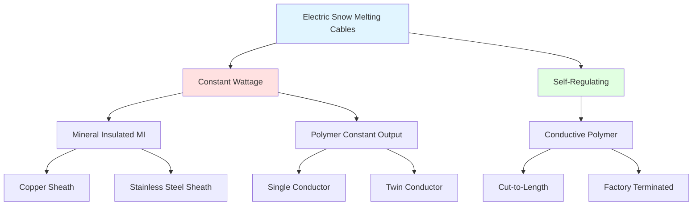

Electric snow melting cables transform electrical energy into thermal energy through resistive heating, operating on the fundamental principle that current flow through a resistive element generates heat according to Joule's Law. The cable type selection directly impacts system performance, operational costs, and reliability.

## Fundamental Heating Mechanisms

All electric heating cables convert electrical energy to thermal energy through resistive heating. The power dissipation follows Joule's Law:

$$P = I^2 R = \frac{V^2}{R}$$

where:
- $P$ = power dissipation (W)
- $I$ = current (A)
- $R$ = resistance (Ω)
- $V$ = voltage (V)

The heat flux delivered to the surface depends on cable spacing and power output:

$$q = \frac{P_L}{s}$$

where:
- $q$ = heat flux (W/m²)
- $P_L$ = linear power density (W/m)
- $s$ = cable spacing (m)

## Cable Technology Classification

## Constant Wattage Cable Systems

Constant wattage cables maintain fixed power output regardless of ambient temperature or surface conditions. The resistance per unit length remains constant:

$$R_L = \frac{R_{total}}{L}$$

where:
- $R_L$ = resistance per unit length (Ω/m)
- $L$ = total cable length (m)

**Mineral Insulated (MI) Cable:**

MI cable consists of solid metal conductors embedded in compacted magnesium oxide (MgO) insulation within a seamless metal sheath. The construction provides exceptional durability and heat transfer characteristics.

Heat conduction through the MgO insulation follows Fourier's Law:

$$q = -k A \frac{dT}{dr}$$

For cylindrical geometry, the thermal resistance from conductor to sheath:

$$R_{th} = \frac{\ln(r_o/r_i)}{2\pi k L}$$

where:
- $k$ = thermal conductivity of MgO (approximately 40 W/m·K at 20°C)
- $r_o$ = outer radius of insulation
- $r_i$ = inner radius (conductor radius)

**Key MI Cable Characteristics:**

- Maximum operating temperature: 150-260°C depending on sheath material
- Copper sheath: Superior thermal conductivity (385 W/m·K), lower cost
- Stainless steel sheath: Corrosion resistance in harsh chemical environments
- Magnesium oxide insulation: Hygroscopic, requires end sealing
- Power densities: Typically 10-65 W/m

**Polymer Constant Wattage Cable:**

Uses polymer insulation with embedded resistance wire. Available in single conductor (requires separate ground) or twin conductor (heating element and return in one cable) configurations.

- Maximum operating temperature: 65-85°C
- Lower cost than MI cable
- Easier installation and termination
- Power densities: 8-50 W/m

## Self-Regulating Cable Technology

Self-regulating cables employ a conductive polymer matrix between two parallel bus wires. The polymer's electrical resistance increases with temperature, creating a negative feedback mechanism:

$$R(T) = R_0[1 + \alpha(T - T_0)]$$

where:
- $R(T)$ = resistance at temperature $T$
- $R_0$ = resistance at reference temperature $T_0$
- $\alpha$ = temperature coefficient of resistance (positive)

As ambient temperature decreases, polymer resistance decreases, allowing higher current flow and increased heat output. Conversely, warmer sections automatically reduce power consumption.

**Power-Temperature Relationship:**

$$P(T) = \frac{V^2}{R_0[1 + \alpha(T - T_0)]}$$

This self-limiting behavior prevents overheating and reduces energy consumption when full power is not required. The cable can be cut to any length in the field without affecting electrical characteristics of other sections.

## Performance Comparison

| Parameter | Constant Wattage (MI) | Constant Wattage (Polymer) | Self-Regulating |
|-----------|----------------------|---------------------------|-----------------|
| **Power Output** | Fixed, high precision | Fixed | Variable with temperature |
| **Max Operating Temp** | 150-260°C | 65-85°C | 65-85°C |
| **Temperature Coefficient** | Near zero | Near zero | Positive (self-limiting) |
| **Overlapping Installation** | Not permitted (overheating) | Not permitted | Permitted (self-limiting) |
| **Energy Efficiency** | Constant consumption | Constant consumption | Reduces with temperature rise |
| **Cold Start-Up Current** | Rated current | Rated current | 1.5-2.5× rated current |
| **Field Cutting** | Requires recalculation | Requires recalculation | Cut to any length |
| **Lifespan** | 30+ years | 15-25 years | 15-25 years |
| **Cost (Relative)** | 2.0-3.0× | 1.0× | 1.5-2.0× |

## Cable Selection Criteria

**Choose Constant Wattage MI Cable when:**
- Maximum heat flux density required (>200 W/m²)
- High temperature exposure expected
- Longest service life critical
- Harsh chemical environment present
- Precise, predictable power output needed

**Choose Self-Regulating Cable when:**
- Variable heat requirements across the area
- Energy efficiency prioritized
- Installation complexity high (overlapping possible)
- Field cutting and modifications expected
- Lower installation labor costs needed

## Power Density Calculation

Required cable power output depends on design heat load:

$$P_L = q \cdot s$$

For a design heat flux of 400 W/m² with 150 mm cable spacing:

$$P_L = 400 \text{ W/m}^2 \times 0.15 \text{ m} = 60 \text{ W/m}$$

## Code Compliance

NEC Article 426 governs fixed outdoor electric deicing and snow-melting equipment:

- **426.20**: Embedded deicing equipment must be identified as suitable for the application
- **426.22**: Cables must be listed for specific voltage and power ratings
- **426.23**: Installation in concrete or asphalt requires cables rated for wet locations
- **426.28**: Ground-fault protection required for all branch circuits
- **426.50**: Disconnecting means must be readily accessible

IEEE Standard 515 provides testing procedures and performance criteria for electric snow melting cable systems.

## Installation Considerations

Cable spacing directly controls heat flux uniformity. Uneven spacing creates cold spots where snow accumulates. For sinusoidal spacing variation:

$$q(x) = \frac{P_L}{s_0[1 + \epsilon \sin(2\pi x/\lambda)]}$$

where $\epsilon$ is the spacing variation fraction and $\lambda$ is the variation wavelength. Maintaining spacing tolerance within ±10% ensures adequate performance.

The thermal time constant for system response:

$$\tau = \frac{\rho c h}{2q}$$

where:
- $\rho$ = concrete density (2400 kg/m³)
- $c$ = specific heat (880 J/kg·K)
- $h$ = slab thickness (m)

Typical response times range from 20-45 minutes for 100-150 mm slabs, requiring pre-storm activation for effective snow melting.
