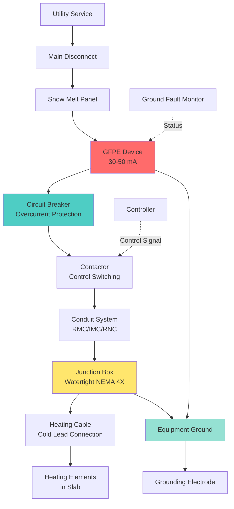

## Physical Basis of Electrical Protection

Electric snow melting systems operate by converting electrical energy directly into thermal energy through resistive heating elements. The power density typically ranges from 30 to 80 W/ft² depending on climate conditions and application requirements. Because these systems operate in wet environments with direct contact to conductive materials (concrete, moisture), electrical protection becomes critical for both personnel safety and equipment longevity.

The fundamental challenge lies in detecting and interrupting ground fault currents before they reach hazardous levels. A ground fault occurs when current flows through an unintended path to ground, typically through moisture penetration or insulation failure. The relationship between current, resistance, and voltage governs fault behavior:

$$I_{fault} = \frac{V_{line-ground}}{R_{fault}}$$

Where $R_{fault}$ includes the combined resistance of damaged insulation, moisture path, and soil contact. In wet conditions, $R_{fault}$ can drop to dangerous levels, necessitating rapid fault detection.

## NEC Article 426 Requirements

NEC Article 426 establishes mandatory requirements for fixed outdoor electric deicing and snow melting equipment. The code recognizes the inherent risks of operating electrical systems in moisture-saturated environments and mandates specific protection schemes.

### Ground Fault Protection of Equipment (GFPE)

All branch circuits supplying fixed outdoor electric deicing and snow melting equipment must include ground fault protection. The maximum trip threshold is 30 mA for personnel protection applications or may be higher (up to 50 mA) for equipment protection when personnel contact is unlikely.

The trip time follows an inverse relationship with fault magnitude:

$$t_{trip} = \frac{K}{I_{fault} - I_{threshold}}$$

Where $K$ is a device-specific constant and $I_{threshold}$ is the nominal trip current. This ensures that large faults clear rapidly while nuisance tripping from transient leakage is minimized.

### Circuit Overcurrent Protection

Branch circuit breakers must be sized to carry the full load current continuously while providing protection against overloads and short circuits. The minimum breaker rating follows:

$$I_{breaker} \geq \frac{P_{total}}{V_{line} \times \sqrt{3} \times PF \times 0.8}$$

For three-phase systems, where the 0.8 factor accounts for the 80% continuous load limitation in NEC 210.19(A). For single-phase systems:

$$I_{breaker} \geq \frac{P_{total}}{V_{line} \times PF \times 0.8}$$

The power factor (PF) for resistive heating elements is typically 1.0, simplifying calculations.

## Protection Methods Comparison

Different protection schemes offer varying levels of safety and reliability based on application requirements.

| Protection Method | Trip Threshold | Response Time | Application | Nuisance Trip Risk |
|-------------------|----------------|---------------|-------------|-------------------|
| Class A GFCI | 4-6 mA | <25 ms | Personnel protection | High in large systems |
| GFPE (30 mA) | 30 mA | <100 ms | Small systems, walkways | Moderate |
| GFPE (50 mA) | 50 mA | <100 ms | Large area systems | Low |
| Equipment Ground Only | N/A (overcurrent) | Varies | Not permitted by NEC | N/A |

The selection depends on system size and leakage current characteristics. Larger systems with extensive cable runs exhibit higher capacitive leakage:

$$I_{leakage} = 2\pi f C V$$

Where $f$ is line frequency (60 Hz), $C$ is cable capacitance to ground, and $V$ is line voltage. For systems exceeding 200 feet of heating cable, 50 mA GFPE is typically required to prevent nuisance tripping.

## System Protection Architecture

## Load Calculation and Circuit Sizing

Proper circuit sizing requires accurate load determination based on area and power density. The total connected load is:

$$P_{total} = A \times \rho_{power}$$

Where $A$ is the heated area in ft² and $\rho_{power}$ is power density in W/ft². The full-load current becomes:

$$I_{full} = \frac{A \times \rho_{power}}{V_{line} \times \sqrt{3} \times PF}$$

For a 1000 ft² driveway at 50 W/ft² on 240V three-phase:

$$I_{full} = \frac{1000 \times 50}{240 \times \sqrt{3} \times 1.0} = 120.3 \text{ A}$$

The minimum conductor ampacity must be:

$$I_{conductor} \geq I_{full} \times 1.25 = 150.4 \text{ A}$$

Select 175 A circuit breaker and 4/0 AWG copper conductors (rated 200 A at 75°C).

## Conduit and Wiring Methods

NEC 426.12 requires heating cable terminations to be accessible. Conduit systems must use rigid metal conduit (RMC), intermediate metal conduit (IMC), or rigid nonmetallic conduit (RNC) suitable for wet locations. PVC Schedule 40 or Schedule 80 is commonly used due to corrosion resistance.

Junction boxes must be rated NEMA 4X for weatherproof protection and located above anticipated snow accumulation levels. All cold lead splices between power feeders and heating cables occur within these enclosures using methods specified by the heating cable manufacturer.

The equipment grounding conductor must be continuous from the service panel through the GFPE device to all junction boxes and must terminate at each heating cable shield or braid. This provides the reference path for ground fault detection.

## Testing and Verification

Before energization, verify insulation resistance between conductors and ground using a 500V or 1000V megohmmeter. Minimum acceptable values are typically 20 megohms for new installations. After installation but before concrete pour, confirm:

1. Continuity of heating elements and ground paths
2. Insulation resistance exceeds manufacturer minimums
3. GFPE device trips within rated time at test current
4. All terminations are watertight and properly sealed

Post-installation testing should include functional verification of the GFPE test button monthly during snow season to ensure protection remains operational.

## Critical Installation Considerations

Moisture ingress at cable terminations represents the primary failure mode for electric snow melting systems. Use heat-shrink termination kits with triple-layer sealing: inner adhesive liner, middle insulation layer, and outer moisture barrier. Apply dielectric compound to all connections before sealing.

Spacing of heating cables affects both thermal performance and electrical protection. Closer spacing increases capacitive coupling between conductors, raising leakage current. Maintain manufacturer-specified spacing to keep leakage below GFPE trip thresholds while achieving required power density.

The equipment ground serves dual purposes: providing a fault return path for protective device operation and reducing electromagnetic field exposure. Proper grounding ensures fault currents return through intentional low-impedance paths rather than through structural steel or other conductive building components.
