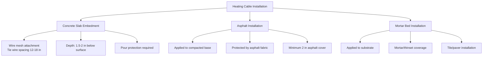

## Cable Technology Fundamentals

Electric heating cables convert electrical energy to thermal energy through resistive heating, described by Joule's law:

$$Q = I^2 R t$$

where $Q$ is heat generated (J), $I$ is current (A), $R$ is resistance (Ω), and $t$ is time (s). The power output per unit length is:

$$P_L = \frac{V^2}{R_L}$$

where $P_L$ is power per length (W/m) and $R_L$ is resistance per length (Ω/m).

## Constant Wattage Cable Systems

### Construction and Operation

Constant wattage (series resistance) cables maintain fixed power output regardless of temperature. The heating element consists of a continuous resistance wire or parallel resistance circuits embedded in polymer insulation with braided metal shielding.

**Key characteristics:**

- Fixed resistance wire (typically nickel-chromium alloy)
- Constant power output: 10-50 W/ft (33-164 W/m)
- Operating temperatures up to 150°F (65°C)
- Requires precise length cutting to match circuit ratings

### Power Output Equation

For series resistance cables:

$$P_{total} = \frac{V^2}{R_{total}} = \frac{V^2}{R_L \cdot L}$$

where $L$ is total cable length (m). This equation demonstrates that series cables cannot be field-cut without changing total circuit resistance and power output.

### Installation Requirements

Per NEC Article 426.20, constant wattage cables require:

- Dedicated branch circuits with GFCI protection
- Maximum circuit rating of 50A at 208-240V
- Temperature-sensing control systems
- Minimum spacing: 3 inches (76 mm) between parallel runs
- Maximum embedment depth: 2 inches (51 mm) in concrete

## Self-Regulating Cable Systems

### Conductive Polymer Technology

Self-regulating cables utilize conductive polymer matrices between parallel bus wires. As temperature increases, the polymer expands, reducing conductive pathways and decreasing current flow. This creates an inverse relationship between temperature and power output:

$$P(T) = P_0 \left(1 - \alpha(T - T_0)\right)$$

where $P_0$ is nominal power at reference temperature $T_0$, and $\alpha$ is the temperature coefficient (typically 0.008-0.012 per °C).

### Physical Mechanism

The conductive polymer contains carbon particles dispersed in a semi-crystalline polymer matrix. At lower temperatures:

1. Polymer contracts, creating more conductive pathways
2. Resistance decreases, current increases
3. Power output increases

At higher temperatures, the reverse occurs, providing automatic temperature regulation without external controls.

### Performance Characteristics

**Typical specifications:**

- Power output range: 4-12 W/ft at 50°F (13-39 W/m at 10°C)
- Maximum exposure temperature: 185°F (85°C)
- Can be field-cut to any length
- Power output varies 50-70% over operating range
- Startup current: 1.5-2.5× steady-state current

## Cable Type Comparison

| Parameter | Constant Wattage | Self-Regulating |
|-----------|-----------------|-----------------|
| Power output | Fixed | Variable with temperature |
| Field cutting | No (series), Yes (parallel) | Yes |
| Energy efficiency | Lower | Higher (auto-regulation) |
| Installation cost | Lower | Higher |
| Control requirements | Mandatory | Optional for optimization |
| Overlapping tolerance | Zero | Good (self-limiting) |
| Lifespan | 15-20 years | 10-15 years |
| Cold startup surge | Low | High (1.5-2.5×) |

## Installation Methods

### Concrete Embedment Procedure

1. **Substrate preparation**: Clean, level concrete base with proper drainage slope (minimum 1/4 in per ft)

2. **Cable layout**: Install cables according to design spacing (typically 3-4 inches for driveways, 2-3 inches for critical areas)

3. **Attachment**: Secure to wire mesh using plastic ties every 12-18 inches

4. **Electrical testing**: Measure resistance before and after embedment:

$$R_{measured} = \frac{R_L \cdot L}{1000}$$

Variance should be within ±10% of manufacturer specifications.

5. **Concrete placement**: Pour minimum 3000 psi concrete, maintain 1.5-2 inch cable depth

6. **Curing protection**: Avoid cable energization for minimum 28 days to allow complete concrete curing

## Power Density Calculations

Required power density depends on snow melting class per ASHRAE design conditions:

### Heat Flux Requirements

Total heat flux combines three components:

$$q_{total} = q_{melt} + q_{sensible} + q_{losses}$$

**Melting heat flux:**

$$q_{melt} = \frac{\dot{m}_s \cdot h_{sf}}{\eta}$$

where $\dot{m}_s$ is snow accumulation rate (kg/m²·h), $h_{sf}$ is heat of fusion (334 kJ/kg), and $\eta$ is system efficiency (typically 0.65-0.75 for electric).

**Sensible heating:**

$$q_{sensible} = \dot{m}_s \cdot c_p \cdot (T_{out} - T_{snow})$$

where $c_p$ is specific heat of water (4.19 kJ/kg·K).

**Heat losses:**

$$q_{losses} = h_c \cdot (T_{surface} - T_{air}) + \varepsilon \sigma (T_{surface}^4 - T_{sky}^4)$$

Convective coefficient $h_c$ ranges from 15-35 W/m²·K depending on wind speed.

### Typical Power Densities

Per ASHRAE guidelines:

| Application | Class | Power Density |
|-------------|-------|---------------|
| Residential driveway | I | 150-200 W/m² (47-63 W/ft²) |
| Commercial walkway | II | 200-300 W/m² (63-94 W/ft²) |
| Critical access | III | 300-400 W/m² (94-125 W/ft²) |
| Ramps/loading | III | 400-500 W/m² (125-156 W/ft²) |

### Cable Spacing Calculation

Required spacing for desired power density:

$$S = \frac{P_L}{q_{required}} \times 1000$$

where $S$ is spacing (mm), $P_L$ is cable power (W/m), and $q_{required}$ is design power density (W/m²).

**Example:** For 30 W/ft (98 W/m) cable achieving 250 W/m²:

$$S = \frac{98}{250} \times 1000 = 392 \text{ mm} \approx 15.4 \text{ inches}$$

Use 15-inch spacing with 3.5 inches (89 mm) edge offset.

## Control Integration and NEC Compliance

### Required Controls (NEC 426.28)

Electric snow melting systems shall include:

- Ground-fault protection (30 mA maximum)
- Disconnecting means within sight
- Temperature and moisture sensing controls
- Overcurrent protection per NEC 426.4

### Control Strategies

**Basic snow/ice detection:**
- Combined temperature/moisture sensor
- Activates when temperature <38°F (3°C) and moisture present
- Continues operation 30-90 minutes after snow cessation

**Optimized control:**
- Pre-heating based on weather forecast
- Variable power output based on snowfall intensity
- Slab temperature maintenance for rapid response

## Electrical Design Considerations

### Circuit Sizing

Maximum cable length per circuit:

$$L_{max} = \frac{V \cdot I_{breaker}}{P_L \cdot 1.25}$$

The 1.25 multiplier accounts for continuous duty (NEC 426.4).

**Example:** 240V, 20A circuit, 12 W/ft cable:

$$L_{max} = \frac{240 \times 20}{12 \times 1.25} = 320 \text{ ft maximum}$$

### Voltage Drop Limitations

Maintain voltage drop below 3% for optimal performance:

$$\Delta V = \frac{2 \cdot L \cdot I \cdot R_{conductor}}{1000}$$

where $L$ is one-way circuit length (ft), $I$ is current (A), and $R_{conductor}$ is conductor resistance (Ω/1000 ft).

## System Selection Criteria

**Select constant wattage cables when:**

- Precise, uniform heat output required
- Lower initial cost prioritized
- Professional installation guaranteed
- Simple geometric layouts

**Select self-regulating cables when:**

- Energy efficiency paramount
- Irregular layouts or variable conditions
- Overlapping cable runs possible
- Lower maintenance preferred
- Backup/redundancy desired

Both cable types provide reliable snow melting when properly designed, installed, and controlled according to NEC Article 426 and ASHRAE thermal load calculations.
