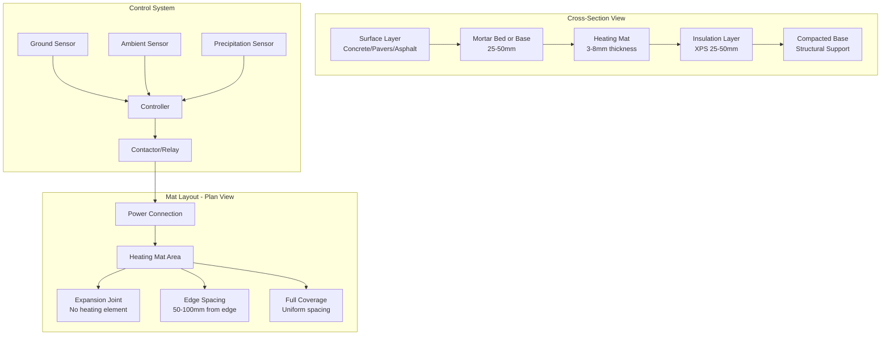

## Physical Principles of Electric Heating Mats

Electric heating mats convert electrical energy directly into thermal energy through resistance heating. When current flows through a resistive conductor, collisions between electrons and the conductor's atomic lattice produce heat at a rate defined by Joule's law:

$$P = I^2 R = \frac{V^2}{R}$$

where $P$ is power (W), $I$ is current (A), $R$ is resistance (Ω), and $V$ is voltage (V). This heat conducts through the mat substrate to the overlying surface, where it melts snow and prevents ice accumulation.

The effectiveness of a heating mat depends on delivering sufficient power density to overcome heat losses from the surface. These losses occur through three mechanisms: convection to ambient air, radiation to the sky, and latent heat required for phase change from ice to liquid water.

## Power Density Requirements

The required power density for snow melting depends on climate conditions and desired performance level. The fundamental energy balance equation is:

$$q_{required} = q_{conv} + q_{rad} + q_{melt} + q_{sens}$$

where:
- $q_{conv}$ = convective heat loss to air
- $q_{rad}$ = radiative heat loss
- $q_{melt}$ = latent heat for melting snow
- $q_{sens}$ = sensible heat to warm meltwater

For practical design, ASHRAE provides simplified power density recommendations:

$$q = \frac{A_r \cdot S \cdot (h_f + c_p \Delta T)}{3600} + h_c A_s (T_s - T_a)$$

where:
- $A_r$ = snowfall rate (mm/hr)
- $S$ = snow density (kg/m³)
- $h_f$ = latent heat of fusion (334 kJ/kg)
- $c_p$ = specific heat of water (4.18 kJ/kg·K)
- $\Delta T$ = temperature rise of meltwater
- $h_c$ = convective heat transfer coefficient (W/m²·K)
- $A_s$ = surface area factor
- $T_s$ = surface temperature (°C)
- $T_a$ = ambient temperature (°C)

Typical residential applications require 215-320 W/m² (20-30 W/ft²), while commercial applications with higher performance expectations require 320-540 W/m² (30-50 W/ft²).

## Heating Mat Construction Types

Electric heating mats consist of resistive heating elements embedded in or bonded to a flexible substrate. Three primary construction methods exist:

**Twin-conductor cable mats**: Parallel conductors wound in a serpentine pattern, factory-assembled on polymer mesh. The twin-conductor design eliminates electromagnetic field concerns and simplifies installation with single-end power connection.

**Self-regulating polymer mats**: Conductive polymer between bus wires adjusts resistance based on local temperature. As mat temperature increases, polymer resistance increases, reducing power output. This provides inherent overheat protection and energy efficiency.

**Metal foil mats**: Resistive metal foil laminated between insulating layers. Uniform heating element thickness ensures consistent power density across the entire mat area.

## Heating Mat Comparison

| Mat Type | Power Density | Voltage | Installation Substrate | Primary Application | Temperature Limit |
|----------|--------------|---------|----------------------|-------------------|------------------|
| Twin-conductor cable | 160-430 W/m² | 120/240V | Concrete, asphalt, pavers | Driveways, walkways, steps | 65°C continuous |
| Self-regulating polymer | 110-320 W/m² | 120/208/240V | Any rigid surface | Roofs, gutters, pipes | Varies with polymer |
| Metal foil | 215-540 W/m² | 120/240V | Concrete, thin-set mortar | Commercial entrances, ramps | 82°C continuous |
| Heavy-duty cable | 320-650 W/m² | 208/240/480V | Concrete (embedded) | Loading docks, helipads | 93°C continuous |

## Installation Configuration

Proper installation ensures uniform heat distribution and system longevity. The installation sequence and layer arrangement significantly affect thermal performance.

## Installation Design Considerations

**Thermal insulation**: Installing rigid foam insulation beneath heating mats reduces downward heat loss by 30-50%. Extruded polystyrene (XPS) with minimum R-5 (RSI-0.88) rating is standard. Without insulation, heat conducts into the ground, reducing surface temperature and wasting energy.

**Edge effects**: Heat loss increases near unheated edges. Maintain 50-100mm (2-4 inches) spacing from edges, or increase power density in edge zones by 20-30% to compensate.

**Expansion joints**: Never install heating elements across expansion joints. Structural movement damages cables. Terminate mats 25mm (1 inch) before joints and provide separate circuits on each side.

**Embedment depth**: Optimal embedment in concrete is 25-50mm (1-2 inches) below the surface. Shallow placement improves response time but increases physical damage risk. Deeper placement protects elements but increases thermal lag.

**Circuit design**: Divide large areas into multiple circuits (15-20A maximum per circuit at 120V, 20-30A at 240V). This provides redundancy, simplifies troubleshooting, and enables zone control for areas with varying solar exposure or traffic patterns.

## Control System Integration

Automatic control systems optimize performance and minimize energy consumption. Three-sensor systems (ground temperature, air temperature, precipitation) provide the most efficient operation:

1. **Ground sensor** prevents operation when surface exceeds setpoint (typically 4°C)
2. **Precipitation sensor** detects moisture and initiates heating cycle
3. **Ambient temperature sensor** prevents operation above freezing conditions

Advanced controllers incorporate rate-of-temperature-change algorithms to pre-heat surfaces before snowfall, reducing accumulation during storm onset.

## Performance Standards and Testing

Electric snow melting systems must comply with:

- **UL 1093**: Standard for Halogenated Agent Extinguishing System Units
- **NEC Article 426**: Fixed outdoor electric deicing and snow-melting equipment requirements
- **IEEE 844**: Recommended practice for electrical impedance, induction, and skin effect heating of pipelines and vessels
- **ASHRAE Design Guide**: Snow Melting and Freeze Protection

Ground-fault circuit interrupter (GFCI) protection is mandatory per NEC for all circuits. Use weatherproof junction boxes rated NEMA 4X minimum. All heating mat installations require insulation resistance testing before energization (minimum 20 MΩ at 500V DC).

## Operational Energy Analysis

Annual energy consumption depends on climate zone, desired response level, and control strategy. The seasonal energy requirement is:

$$E_{season} = \sum_{i=1}^{n} P \cdot A \cdot t_i \cdot \eta$$

where $P$ is power density (W/m²), $A$ is heated area (m²), $t_i$ is operating duration for event $i$ (hours), and $\eta$ is system efficiency (typically 0.75-0.85 accounting for thermal losses).

For a 50m² residential driveway in climate zone 5A with 300 W/m² power density and 200 hours annual operation, seasonal consumption is approximately 2,250 kWh. At $0.12/kWh, annual operating cost is $270.

Idling strategies maintain surface temperature slightly above freezing (1-2°C) during predicted snow events, consuming 30-50% of full power but ensuring immediate snow melting upon precipitation onset. This increases energy consumption but improves performance for critical applications.

## Material Selection and Durability

Heating cable insulation must withstand installation stresses, chemical exposure from deicing salts, and thermal cycling. Common insulation materials:

- **Fluoropolymer (PTFE, FEP)**: Excellent chemical resistance, temperature rating to 200°C, premium cost
- **Cross-linked polyethylene (XLPE)**: Good moisture resistance, temperature rating to 90°C, moderate cost
- **Polyvinyl chloride (PVC)**: Lower cost, temperature rating to 75°C, adequate for light-duty applications

Cable shields (typically tinned copper braid) provide electromagnetic compatibility and serve as equipment grounding conductor. Minimum shield coverage is 90% for outdoor snow melting applications.

Expected service life for properly installed systems is 20-30 years with minimal maintenance. Failures typically result from physical damage during construction or inadequate grounding causing moisture ingress.

---

*This technical content provides engineering-level analysis of electric heating mat systems for snow melting applications, covering thermodynamic principles, design calculations, installation methods, and performance optimization.*
