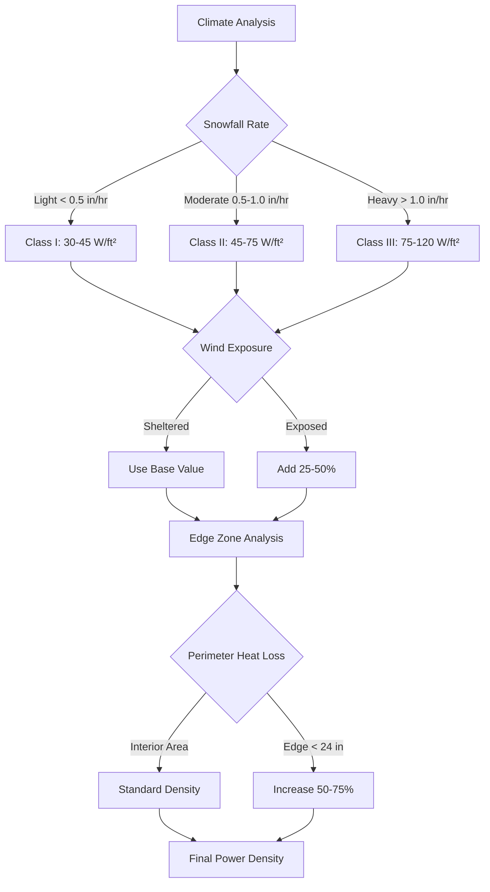

Power density represents the fundamental design parameter for electric snow melting systems, quantifying the thermal output delivered per unit area of heated pavement. Proper specification of power density ensures adequate melting capacity while avoiding oversized electrical infrastructure that inflates installation costs. The design process requires translating climate-driven heat flux requirements into electrical power specifications based on fundamental heat transfer principles.

## Physics of Power Density

Electric snow melting systems convert electrical energy to thermal energy through resistive heating. The relationship between electrical power and thermal output follows directly from Joule's first law:

$$P = I^2 R = \frac{V^2}{R}$$

Where:
- $P$ = power dissipated as heat (watts)
- $I$ = current (amperes)
- $R$ = resistance (ohms)
- $V$ = voltage (volts)

For embedded heating cables, the resistance per unit length determines power density when combined with geometric spacing. The area-based power density becomes:

$$P_{density} = \frac{P_{cable} \times 12}{S}$$

Where:
- $P_{density}$ = power density (W/ft²)
- $P_{cable}$ = cable power per linear foot (W/ft)
- $S$ = cable spacing center-to-center (inches)
- Factor 12 converts feet to inches

This relationship reveals that power density scales linearly with cable wattage and inversely with spacing. A 20 W/ft cable installed at 4-inch spacing delivers:

$$P_{density} = \frac{20 \times 12}{4} = 60 \text{ W/ft}^2$$

The same cable at 6-inch spacing reduces power density to 40 W/ft², demonstrating the critical importance of spacing precision.

## Heat Flux to Power Density Conversion

Power density must match or exceed the thermal heat flux required to melt snow and overcome environmental losses. ASHRAE provides detailed heat flux calculations in Chapter 52 of the HVAC Applications Handbook, accounting for:

1. **Latent heat of fusion** for snow melting: 144 Btu/lb
2. **Sensible heat** to raise melt water temperature
3. **Convective losses** to ambient air
4. **Radiative heat exchange** with sky and surroundings
5. **Back losses** through pavement and substrate

The total required heat flux combines these components:

$$q_{total} = q_{melt} + q_{sensible} + q_{conv} + q_{rad} - q_{back}$$

Converting from Btu/hr·ft² to watts per square foot requires the conversion factor:

$$P_{density} = \frac{q_{total}}{3.412}$$

The factor 3.412 converts Btu/hr to watts (1 watt = 3.412 Btu/hr).

Example calculation for moderate snowfall conditions:
- Required heat flux: 180 Btu/hr·ft²
- Power density = 180 ÷ 3.412 = 52.8 W/ft²
- Specified design value: 55 W/ft² (rounded up for margin)

## Climate-Based Design Values

Power density requirements vary significantly with geographic location and design objectives. ASHRAE categorizes systems into three classes based on performance level:

| System Class | Description | Heat Flux Range | Power Density Range |
|--------------|-------------|-----------------|---------------------|
| Class I | Minimize accumulation, some residual | 100-150 Btu/hr·ft² | 30-45 W/ft² |
| Class II | Bare pavement during snowfall | 150-250 Btu/hr·ft² | 45-75 W/ft² |
| Class III | Rapid melt, wind-driven snow | 250-400 Btu/hr·ft² | 75-120 W/ft² |

Climate zones impose additional design constraints based on snowfall intensity, wind exposure, and ambient temperature during storms.

**Cold Climate Regions** (Minneapolis, Denver, Boston):
- Class II residential: 60-70 W/ft²
- Class III commercial: 85-100 W/ft²
- Exposed areas: 100-120 W/ft²

**Moderate Climate Regions** (Seattle, Portland, Philadelphia):
- Class I residential: 35-45 W/ft²
- Class II commercial: 50-65 W/ft²
- Exposed areas: 70-85 W/ft²

**Intermittent Snow Regions** (Southern states, coastal areas):
- Class I occasional use: 25-35 W/ft²
- Class II priority areas: 40-55 W/ft²

## Edge Zone Considerations

Pavement perimeters experience elevated heat loss due to three-dimensional heat transfer through exposed edges. The thermal resistance at boundaries decreases compared to interior regions where heat flow is predominantly one-dimensional (vertical).

Heat loss at edges follows:

$$q_{edge} = U_{edge} \times (T_{slab} - T_{ambient})$$

The effective U-value at edges typically exceeds interior values by 40-80% depending on insulation configuration and exposure. This necessitates higher power density in perimeter zones.

Standard practice divides heated areas into zones:

| Zone Type | Distance from Edge | Power Density Multiplier |
|-----------|-------------------|-------------------------|
| Interior | > 24 inches | 1.0 (base design value) |
| Edge | 12-24 inches | 1.25-1.5 |
| Perimeter | 0-12 inches | 1.5-1.75 |

For a base design of 60 W/ft²:
- Interior spacing: 4 inches (60 W/ft²)
- Edge spacing: 3 inches (80 W/ft²)
- Perimeter spacing: 2.5 inches (96 W/ft²)

This graduated approach maintains surface temperature uniformity while controlling installation costs.

## Electrical Service Sizing

The total electrical load determines service requirements, circuit configuration, and distribution equipment specifications. Load calculations proceed systematically from power density to total system demand.

**Total Connected Load:**

$$P_{total} = P_{density} \times A_{heated} \times DF$$

Where:
- $P_{total}$ = total system load (watts)
- $P_{density}$ = design power density (W/ft²)
- $A_{heated}$ = total heated area (ft²)
- $DF$ = diversity factor (typically 1.0 for snow melting)

Example for 3,000 ft² commercial entrance at 65 W/ft²:

$$P_{total} = 65 \times 3000 \times 1.0 = 195,000 \text{ W} = 195 \text{ kW}$$

**Branch Circuit Sizing:**

NEC Article 426.4 requires branch circuits to be sized at 125% of the total connected load for continuous operation:

$$I_{branch} = \frac{P_{circuit} \times 1.25}{V}$$

For a 240V circuit with 20 W/ft cable at 4-inch spacing covering 200 ft²:
- Cable length required: 200 ft² × (12 in/ft ÷ 4 in) = 600 linear feet
- Circuit load: 600 ft × 20 W/ft = 12,000 W
- Required current: (12,000 × 1.25) ÷ 240 = 62.5 A

This requires a 70A circuit breaker with #4 AWG copper conductors (rated 85A at 75°C).

**Service Panel Load:**

The main electrical service must accommodate the snow melting load plus existing building loads:

$$S_{main} = (P_{existing} + P_{snowmelt}) \times DF_{panel}$$

Where $DF_{panel}$ represents the panel diversity factor, typically 1.0 when snow melting operates as the primary load during storms.

| Heated Area | Typical Load @ 60 W/ft² | Service Requirement |
|-------------|------------------------|---------------------|
| 500 ft² (small driveway) | 30 kW | 125-150A panel |
| 1,500 ft² (large driveway) | 90 kW | 300-400A panel |
| 5,000 ft² (commercial) | 300 kW | 800-1000A service |
| 10,000 ft² (plaza) | 600 kW | 1600A+ service |

## Voltage Selection and Load Distribution

Operating voltage affects current magnitude, conductor sizing, and voltage drop considerations. Standard voltages include:

**120V Single-Phase:**
- Residential applications < 5 kW
- Maximum circuit load: ~1,920 W (16A × 120V × 80%)
- Limited to small areas or supplemental heating

**240V Single-Phase:**
- Residential and small commercial
- Maximum circuit load: ~3,840 W (20A × 240V × 80%)
- Most common for driveways and walkways

**208V Three-Phase:**
- Commercial applications
- Allows balanced load distribution across phases
- Reduces conductor sizes compared to single-phase

**480V Three-Phase:**
- Large commercial and industrial
- Requires step-down transformers at heating zones
- Minimizes distribution conductor costs for extensive areas

Power density remains constant regardless of voltage, but current varies inversely:

$$I = \frac{P_{density} \times A}{V \times \text{Number of phases}}$$

For 100 ft² area at 60 W/ft² (6,000W total):
- 120V: 50A required
- 240V: 25A required
- 480V: 12.5A required

Higher voltages reduce conductor costs but increase transformer and insulation requirements.

## Performance Optimization Strategies

Maximizing thermal effectiveness while controlling electrical demand requires strategic power density distribution:

**1. Graduated Density Zoning:**
Allocate higher power density to critical areas while reducing it in lower-priority zones. Priority hierarchy:
- Level 1 (highest): Egress paths, ADA routes (75-100 W/ft²)
- Level 2: Main traffic areas (60-75 W/ft²)
- Level 3: Secondary areas (45-60 W/ft²)
- Level 4 (lowest): Decorative or overflow zones (30-45 W/ft²)

**2. Thermal Mass Utilization:**
Increased slab thickness provides thermal storage, allowing reduced idling power density:
- Standard 4-inch slab: Full power density required
- 6-inch slab: Can reduce idling by 20-30%
- 8+ inch slab: Can reduce idling by 30-40%

**3. Insulation Effectiveness:**
Below-slab insulation redirects heat upward, improving surface effectiveness:

| Insulation R-Value | Effective Power Delivery | Density Reduction Potential |
|-------------------|-------------------------|----------------------------|
| None | 60-70% | Baseline |
| R-5 | 75-80% | 10-15% |
| R-10 | 80-85% | 15-20% |
| R-15+ | 85-90% | 20-25% |

With R-10 insulation, a system requiring 60 W/ft² without insulation can achieve equivalent performance at 48-51 W/ft², reducing electrical infrastructure costs.

## Design Example: Commercial Entrance

**Project Parameters:**
- Location: Chicago, IL
- Area: 1,200 ft² entrance plaza
- Performance: Class II (bare pavement)
- Wind exposure: Moderate
- Edge perimeter: 160 linear feet

**Step 1: Base Heat Flux**
From ASHRAE climate data for Chicago:
- Design snowfall rate: 0.75 in/hr
- Ambient design temperature: 15°F
- Wind speed: 15 mph
- Required heat flux: 220 Btu/hr·ft²

**Step 2: Power Density Calculation**
$$P_{base} = \frac{220}{3.412} = 64.5 \text{ W/ft}^2$$

Specify 65 W/ft² for interior zones.

**Step 3: Edge Zone Adjustment**
Edge zone area: 160 ft × 2 ft = 320 ft²
Interior area: 1,200 - 320 = 880 ft²

Edge power density: 65 × 1.5 = 97.5 W/ft² (specify 100 W/ft²)

**Step 4: Total Electrical Load**
$$P_{interior} = 880 \times 65 = 57,200 \text{ W}$$
$$P_{edge} = 320 \times 100 = 32,000 \text{ W}$$
$$P_{total} = 89,200 \text{ W} = 89.2 \text{ kW}$$

**Step 5: Circuit Configuration**
Using 240V, 20 W/ft cable:

Interior spacing: (20 × 12) ÷ 65 = 3.7 inches → use 3.5 inches (68.6 W/ft²)
Edge spacing: (20 × 12) ÷ 100 = 2.4 inches → use 2.5 inches (96 W/ft²)

Cable length required:
- Interior: 880 ÷ (3.5 ÷ 12) = 3,017 ft
- Edge: 320 ÷ (2.5 ÷ 12) = 1,536 ft
- Total: 4,553 linear feet

Number of circuits (240V, 20A, 80% loading):
Maximum cable per circuit: (240 × 20 × 0.8) ÷ 20 = 192 ft
Required circuits: 4,553 ÷ 192 = 23.7 → 24 circuits

**Step 6: Service Panel**
With 125% NEC multiplier:
Service requirement = 89.2 kW × 1.25 = 111.5 kW
Current at 240V: 111,500 ÷ 240 = 464A
Specify: 600A panel with 24 × 20A GFCI breakers

## Common Design Errors

**Undersizing Power Density:**
Specifying insufficient power density based on mild winter averages rather than design conditions results in poor performance during actual storm events. Always design to ASHRAE 99% winter design conditions, not typical values.

**Ignoring Edge Effects:**
Uniform power density across the entire area leads to cold perimeters and incomplete melting at boundaries where heat loss is greatest. Edge zones require 50-75% additional power density.

**Inadequate Electrical Infrastructure:**
Failing to account for the 125% NEC continuous load multiplier causes circuit breaker nuisance tripping or conductor overheating. All calculations must include this safety margin.

**Voltage Drop Neglect:**
Long cable runs at low voltage cause significant voltage drop, reducing actual power delivery below design values. Voltage at the furthest heating element should remain within 5% of nominal.

**Insufficient Insulation:**
Operating systems without below-slab insulation wastes 30-40% of generated heat to the ground. The incremental cost of R-10 insulation pays back through reduced power requirements in 3-5 years in most applications.

## ASHRAE Design References

ASHRAE provides comprehensive design guidance in multiple publications:

**ASHRAE Handbook - HVAC Applications, Chapter 52:**
- Heat flux calculation methodology
- Climate data for snow melting design
- Load distribution factors
- System classification criteria

**ASHRAE Standard 90416:**
While this standard doesn't exist specifically for snow melting, designers should reference:
- ASHRAE 90.1: Energy Standard for Buildings (electrical system efficiency)
- Local climate design data from ASHRAE Climatic Design Conditions

**Key Design Values from ASHRAE:**

| Location | 99% Design Temp (°F) | Design Snow Rate (in/hr) | Recommended Class II (W/ft²) |
|----------|---------------------|-------------------------|----------------------------|
| Minneapolis, MN | -12 | 0.8 | 70-80 |
| Denver, CO | 1 | 0.7 | 65-75 |
| Chicago, IL | 0 | 0.75 | 65-75 |
| Boston, MA | 9 | 0.6 | 60-70 |
| Seattle, WA | 28 | 0.4 | 45-55 |
| Portland, OR | 25 | 0.35 | 40-50 |

## Power Density Verification

After installation but before concrete placement, verify actual power density through resistance measurements:

**Measured Resistance Method:**
$$R_{measured} = \frac{V^2}{P_{rated}}$$

For 240V, 20 W/ft cable, 200-ft circuit:
- Expected resistance: (240²) ÷ (20 × 200) = 14.4 Ω
- Acceptable range: 14.0-14.8 Ω (±3%)

Measure resistance between conductors with megohmmeter. Calculate actual power:
$$P_{actual} = \frac{V^2}{R_{measured}}$$

If $R_{measured}$ = 14.6 Ω:
$$P_{actual} = \frac{240^2}{14.6} = 3,945 \text{ W}$$

Compared to design: 4,000 W (within 2%, acceptable)

**Current Draw Method:**
Energize circuit and measure actual current draw:
$$P_{actual} = V \times I \times \text{power factor}$$

For resistive heating, power factor = 1.0

This verification confirms proper installation before concrete encapsulation makes corrections impossible.

## Conclusion

Power density specification for electric snow melting systems requires systematic analysis of climate conditions, heat flux requirements, and electrical infrastructure constraints. Proper design delivers adequate thermal performance while controlling installation and operating costs. The fundamental relationship between cable wattage, geometric spacing, and resulting power density governs all system configurations, with climate-based design values ranging from 30 W/ft² for light-duty applications to 120 W/ft² for extreme conditions. Edge zone considerations, electrical service sizing, and performance optimization through insulation and thermal mass complete the comprehensive design process.
