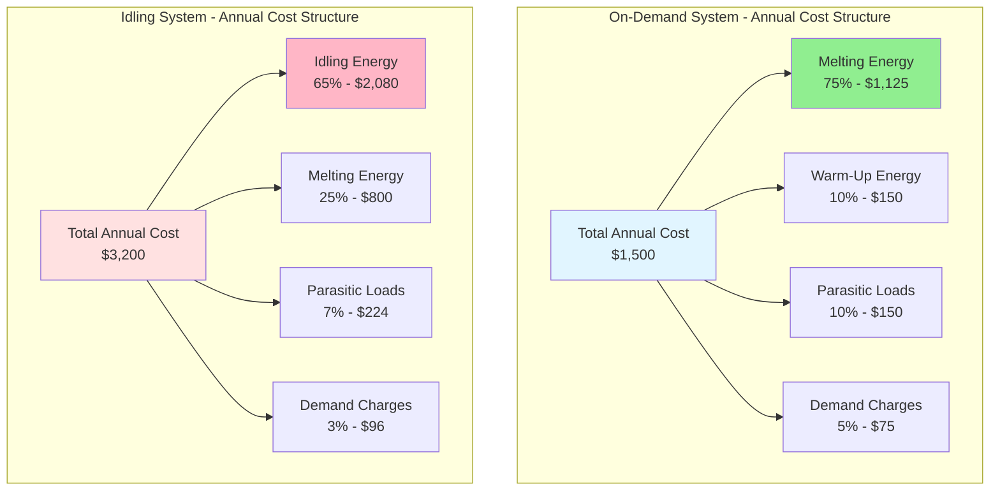

Annual operating cost represents the most significant financial consideration for snow melting systems over their service life, typically comprising 60-80% of total life cycle expenditure. The cost structure depends on energy consumption patterns, utility rate mechanisms, geographic location, and system design parameters. Understanding these cost components enables accurate economic analysis and optimization of control strategies.

## Cost Calculation Fundamentals

Annual operating cost consists of energy consumption multiplied by applicable utility rates, with adjustments for rate structure complexity. The fundamental relationship derives from energy balance principles applied to seasonal operation.

### Basic Annual Cost Equation

The annual operating cost for a snow melting system is calculated as:

$$C_{annual} = C_{energy} + C_{demand} + C_{fixed}$$

where each component represents distinct utility billing mechanisms applied to system operation.

### Energy Consumption Cost

The energy consumption component represents the largest portion of annual cost, calculated from heat delivery requirements:

$$C_{energy} = \sum_{i=1}^{n} \left( \frac{E_i}{\eta_{sys}} \times R_i \right)$$

where:
- $C_{energy}$ = annual energy cost (\$/year)
- $E_i$ = energy delivered to slab during period $i$ (kWh or therms)
- $\eta_{sys}$ = system efficiency (0.65-1.00)
- $R_i$ = energy rate during period $i$ (\$/kWh or \$/therm)
- $n$ = number of billing periods or rate tiers

### Demand Charge Cost

Electric systems face demand charges based on peak power draw during billing periods:

$$C_{demand} = P_{peak} \times R_d \times N_{months}$$

where:
- $C_{demand}$ = annual demand charge cost (\$/year)
- $P_{peak}$ = maximum 15-minute average power demand (kW)
- $R_d$ = demand rate (\$/kW·month)
- $N_{months}$ = number of months with active demand charges (typically 4-6)

For snow melting systems, peak demand typically occurs during initial warm-up cycles when full system capacity activates simultaneously. This can represent 20-40% of total electric costs in commercial rate structures.

## Energy Consumption Components

Total annual energy consumption derives from three operational modes, each contributing to the annual cost burden based on control strategy and climate conditions.

### Melting Energy

Energy required to melt accumulated snowfall represents the primary system function:

$$E_{melt} = A_{slab} \times q_{design} \times t_{melt} \times 0.001$$

where:
- $E_{melt}$ = melting energy consumption (kWh)
- $A_{slab}$ = heated slab area (m²)
- $q_{design}$ = design heat flux (W/m²)
- $t_{melt}$ = cumulative melting hours per season (hours)
- 0.001 = conversion factor W·h to kWh

Typical melting hours by climate zone:

| Climate Zone | Annual Snow Events | Melting Hours/Season |
|--------------|-------------------|---------------------|
| Mild (Seattle, Portland) | 10-20 | 50-100 |
| Moderate (Chicago, Boston) | 30-50 | 150-300 |
| Severe (Minneapolis, Buffalo) | 50-80 | 300-500 |
| Extreme (Anchorage, high elevation) | 80-120 | 500-800 |

### Idling Energy

Systems operating in idling mode maintain elevated slab temperature during winter months to eliminate warm-up delays:

$$E_{idle} = A_{slab} \times q_{idle} \times t_{idle} \times 0.001$$

where:
- $E_{idle}$ = idling energy consumption (kWh)
- $q_{idle}$ = idling heat flux, typically 30-50 W/m² (10-16 BTU/hr·ft²)
- $t_{idle}$ = total idling hours per season (1500-3000 hours typical)

Idling operation increases annual energy consumption by 150-400% compared to on-demand strategies, representing a substantial cost penalty justified only for critical applications requiring zero snow accumulation tolerance.

### Warm-Up Energy

On-demand systems require energy input to raise slab temperature from ambient conditions to effective melting capacity:

$$E_{warmup} = A_{slab} \times \rho_{conc} \times c_{conc} \times d_{eff} \times \Delta T \times N_{events} \times 2.78 \times 10^{-7}$$

where:
- $E_{warmup}$ = warm-up energy per season (kWh)
- $\rho_{conc}$ = concrete density (2400 kg/m³)
- $c_{conc}$ = concrete specific heat (880 J/kg·K)
- $d_{eff}$ = effective slab depth heated (0.05-0.10 m)
- $\Delta T$ = temperature rise (15-25 K typical)
- $N_{events}$ = number of snow events requiring warm-up (20-60/season)
- $2.78 \times 10^{-7}$ = conversion factor J to kWh

Warm-up energy typically represents 5-15% of total annual consumption for on-demand systems, with higher percentages in mild climates with frequent small snow events.

## Utility Rate Structures

Electric and gas utility rate structures significantly impact annual operating costs through various pricing mechanisms that reflect utility system capacity constraints and time-varying generation costs.

### Electric Rate Components

**Energy Charges (¢/kWh)**
- Residential simple rate: 10-25 ¢/kWh (flat rate)
- Commercial tiered rate: 8-12 ¢/kWh (first tier), 10-18 ¢/kWh (higher tiers)
- Time-of-use rate: 6-10 ¢/kWh (off-peak), 15-30 ¢/kWh (on-peak)

**Demand Charges (\$/kW·month)**
- Commercial facilities: \$5-25/kW·month
- Industrial facilities: \$10-35/kW·month
- Residential: typically none

**Fixed Charges**
- Account fee: \$10-50/month
- Minimum bill provisions
- Transformer/service charges

### Natural Gas Rate Components

**Commodity Charges (\$/therm or \$/CCF)**
- Residential rate: \$0.80-1.80/therm
- Commercial rate: \$0.60-1.40/therm (volume discounts apply)
- Seasonal variation: 20-40% higher in winter months

**Distribution Charges**
- Fixed customer charge: \$10-30/month
- Delivery charge: \$0.20-0.60/therm

Natural gas rates demonstrate lower seasonal volatility than electricity and provide cost advantages for hydronic systems in most geographic markets.

## Regional Operating Cost Analysis

Annual operating costs vary substantially by geographic location due to climate severity, utility rate structures, and infrastructure availability. The following analysis compares representative systems across North American climate zones.

### Cost Comparison Table

**System: 100 m² (1076 ft²) driveway, 300 W/m² design flux, automatic on-demand controls**

| Region | Climate Type | Operating Hours | Electric Cost | Gas Cost (Hydronic) | Cost Ratio (E/G) |
|--------|--------------|----------------|---------------|---------------------|------------------|
| Seattle, WA | Mild marine | 80 hrs | \$480 | \$90 | 5.3:1 |
| Chicago, IL | Moderate continental | 250 hrs | \$1,500 | \$245 | 6.1:1 |
| Minneapolis, MN | Severe continental | 400 hrs | \$2,400 | \$380 | 6.3:1 |
| Buffalo, NY | Severe lake-effect | 450 hrs | \$2,700 | \$510 | 5.3:1 |
| Denver, CO | Moderate high-altitude | 200 hrs | \$1,200 | \$215 | 5.6:1 |
| Boston, MA | Moderate coastal | 280 hrs | \$1,680 | \$420 | 4.0:1 |
| Anchorage, AK | Extreme subarctic | 600 hrs | \$4,200 | \$780 | 5.4:1 |

**Rate Assumptions:**
- Electric: \$0.12/kWh average (varies \$0.08-0.18/kWh by region)
- Natural gas: \$1.20/therm average (varies \$0.90-1.80/therm by region)
- Hydronic system efficiency: 75% overall (includes boiler and distribution losses)
- Electric system efficiency: 100% (resistance heating)

### Regional Cost Factors

**Pacific Northwest (Seattle, Portland)**
- High electricity rates (\$0.10-0.14/kWh) favor gas systems
- Low natural gas rates (\$0.90-1.20/therm)
- Minimal snow events reduce absolute costs
- Mild temperatures reduce warm-up energy penalties

**Upper Midwest (Chicago, Minneapolis, Madison)**
- Moderate electricity rates (\$0.10-0.13/kWh)
- Low natural gas rates (\$0.80-1.10/therm)
- High snow frequency drives total consumption
- Severe cold increases idling losses

**Northeast (Boston, Buffalo, Albany)**
- High electricity rates (\$0.14-0.22/kWh) strongly favor gas
- Moderate to high gas rates (\$1.20-1.80/therm)
- Lake-effect areas experience extended operating hours
- Dense urban areas may have demand charge penalties

**Mountain West (Denver, Salt Lake City)**
- Moderate electricity rates (\$0.09-0.12/kWh)
- Moderate gas rates (\$0.90-1.30/therm)
- High solar insolation reduces idling requirements
- Rapid temperature swings increase cycling frequency

## Cost Component Breakdown

Understanding the proportional contribution of each cost element enables targeted optimization strategies. The following diagram illustrates typical cost allocation for on-demand and idling control strategies.

The cost structure demonstrates that idling systems shift energy consumption from productive melting to unproductive standby losses, increasing total annual cost by 100-150% while improving response time and eliminating initial snow accumulation.

## Demand Charge Impact

Commercial and industrial electric customers face demand charges that can represent 20-40% of total annual snow melting costs. Demand charges apply to the peak 15-minute average power draw during each billing period.

### Demand Charge Calculation

For an electric snow melting system with installed capacity of 150 kW operating in a commercial facility:

$$C_{demand,annual} = P_{system} \times R_d \times N_{winter}$$

Example calculation:
- System capacity: 150 kW
- Demand rate: \$12.50/kW·month
- Winter billing months: 5 (November-March)

$$C_{demand,annual} = 150 \text{ kW} \times 12.50 \text{ \$/kW·month} \times 5 \text{ months} = \$9,375/\text{year}$$

This demand charge applies even if the system operates for only 200 hours per season, representing a substantial fixed cost component.

### Demand Mitigation Strategies

**Load Shedding**
- Sequence zone activation to limit simultaneous operation
- Reduces peak demand by 30-50%
- Requires sophisticated zone controllers
- May compromise snow clearing performance

**Soft Start Control**
- Gradual ramp-up of system capacity over 15-20 minutes
- Reduces peak 15-minute average by 20-30%
- Minimizes impact on clearing performance
- Simple implementation with solid-state controls

**Off-Peak Operation**
- Schedule pre-heating during off-peak hours when applicable
- Eliminates on-peak demand charges in time-of-use rate structures
- Requires accurate weather forecasting
- Limited applicability for unpredictable snow events

## Time-of-Use Rate Optimization

Electric utilities increasingly employ time-of-use (TOU) rate structures that vary energy charges based on time of day and season. These rates create opportunities for cost optimization through strategic control programming.

### Typical TOU Rate Structure

| Period | Winter Months (Nov-Mar) | Energy Rate |
|--------|------------------------|-------------|
| Off-Peak | 10 PM - 6 AM weekdays, all weekend | \$0.06-0.08/kWh |
| Mid-Peak | 6 AM - 4 PM, 9 PM - 10 PM weekdays | \$0.10-0.13/kWh |
| On-Peak | 4 PM - 9 PM weekdays | \$0.18-0.30/kWh |

Snow events often occur during off-peak or mid-peak periods, providing natural alignment with lower rates. However, late-afternoon or evening snow during on-peak periods can dramatically increase operating costs.

### Cost Impact Example

100 m² system operating 200 hours per season under TOU rates:
- Off-peak operation (60%): 120 hrs × 30 kW × \$0.07/kWh = \$252
- Mid-peak operation (30%): 60 hrs × 30 kW × \$0.12/kWh = \$216
- On-peak operation (10%): 20 hrs × 30 kW × \$0.25/kWh = \$150

**Total cost: \$618 (vs. \$720 at flat \$0.12/kWh rate)**

Strategic pre-heating during off-peak periods can reduce time-sensitive melting requirements during on-peak windows, yielding 15-30% cost savings in TOU rate structures.

## Economic Optimization Strategies

Reducing annual operating cost while maintaining acceptable snow clearing performance requires systematic optimization of design parameters and control algorithms.

### High-Impact Cost Reduction Measures

| Strategy | Cost Reduction | Implementation Complexity | Capital Cost Impact |
|----------|---------------|---------------------------|---------------------|
| On-demand vs. idling control | 40-60% | Low (programming) | Minimal |
| Under-slab insulation (R-10) | 25-40% | Medium (construction) | +\$15-25/m² |
| Zone control (melt tire tracks only) | 30-50% area reduction | Medium (additional controls) | +\$1,500-3,000 |
| High-efficiency condensing boiler | 15-25% (hydronic only) | Medium (equipment upgrade) | +\$2,000-5,000 |
| Advanced weather-predictive controls | 10-20% | High (software/sensors) | +\$3,000-8,000 |
| Heat pump system (cold climate) | 50-70% vs. electric resistance | High (system redesign) | +\$10,000-25,000 |

### Control Strategy Selection Criteria

**Select On-Demand Operation When:**
- Snow events are infrequent (< 30/season)
- Warm-up delay of 30-90 minutes is acceptable
- Energy cost minimization is primary objective
- Manual snow removal backup is available during warm-up

**Select Idling Operation When:**
- Zero snow accumulation tolerance (hospital emergency, airport ramp)
- Liability risk from any ice formation is severe
- Energy cost is secondary to reliability
- Facility has 24/7 monitoring and backup power

**Select Zone Control When:**
- Full-area melting is not required (driveway tire tracks vs. entire surface)
- System area exceeds 200 m² (2,150 ft²)
- Demand charges are significant cost component
- Incremental zone control cost is justified by savings

## Seasonal Cost Variation

Operating costs concentrate in winter months with substantial month-to-month variation based on weather patterns and utility seasonal rate structures.

### Monthly Cost Distribution

Typical seasonal cost profile for moderate climate (Chicago-area, 100 m² system):

| Month | Snow Events | Operating Hours | Energy Cost | % of Annual |
|-------|-------------|----------------|-------------|-------------|
| November | 3 | 15 | \$90 | 6% |
| December | 8 | 45 | \$270 | 18% |
| January | 12 | 70 | \$420 | 28% |
| February | 10 | 60 | \$360 | 24% |
| March | 7 | 40 | \$240 | 16% |
| April | 2 | 10 | \$60 | 4% |
| May-Oct | 0 | 0 | \$60 (fixed charges) | 4% |
| **Annual Total** | **42** | **240** | **\$1,500** | **100%** |

January and February typically account for 50-55% of annual operating costs due to peak snow frequency and coldest ambient temperatures that increase heat losses.

## Life Cycle Economic Context

Annual operating costs must be evaluated within the broader life cycle economic framework to support optimal system selection and design decisions. The relationship between initial capital cost and ongoing operating expenses determines the economically optimal configuration.

### Break-Even Analysis

The crossover point where hydronic systems become more economical than electric systems depends on system area, utility rates, and service life.

**Present Value of Operating Costs (20-year analysis, 5% discount rate):**

$$PV_{operating} = C_{annual} \times \frac{1 - (1 + i)^{-n}}{i} \times (1 + g)$$

where:
- $PV_{operating}$ = present value of operating costs
- $C_{annual}$ = first-year annual operating cost
- $i$ = discount rate (0.05 typical)
- $n$ = analysis period (years)
- $g$ = energy cost escalation rate (0.02-0.03 typical)

For typical rate structures (\$0.12/kWh, \$1.20/therm, 75% hydronic efficiency):
- Break-even system area: 150-200 m² (1,600-2,150 ft²)
- Hydronic systems favor larger installations
- Electric systems favor smaller, retrofit applications

Annual operating cost analysis provides the foundation for comprehensive economic evaluation, enabling data-driven decisions on system type, sizing, control strategy, and optimization measures that minimize total life cycle cost while meeting performance requirements.

## References

ASHRAE Handbook - HVAC Applications, Chapter 51: Snow Melting and Freeze Protection
ASHRAE Economic Analysis of HVAC Systems (2015)
DOE Energy Cost Calculator Methodology
