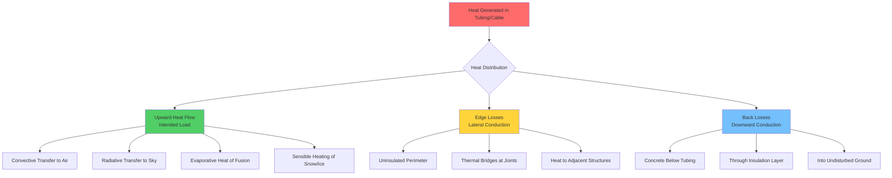

## Physical Principles of Heat Loss

Snow melting systems experience heat losses through multiple pathways that reduce thermal efficiency and increase operating costs. Understanding these loss mechanisms from first principles enables proper insulation design and accurate load calculations.

Heat flows from higher to lower temperature regions according to Fourier's law. In a snow melting installation, the heated slab loses energy not only to the snow (the intended load) but also to the surrounding earth and adjacent structures through conduction, to the perimeter through edge effects, and to the atmosphere through the slab edges.

## Edge Losses

Edge losses occur at the perimeter where the heated slab interfaces with unheated adjacent surfaces or terminates at an exposed edge. This represents a thermal bridge where heat conducts laterally through the concrete.

The edge heat loss per unit length of perimeter is calculated as:

$$q_{edge} = \frac{(T_{slab} - T_{ambient}) \times k_{concrete} \times A_{edge}}{L_{path}}$$

Where:
- $q_{edge}$ = edge heat loss rate (W/m or BTU/hr·ft)
- $T_{slab}$ = slab operating temperature (°C or °F)
- $T_{ambient}$ = adjacent surface or air temperature (°C or °F)
- $k_{concrete}$ = thermal conductivity of concrete (1.4 W/m·K or 0.81 BTU/hr·ft·°F)
- $A_{edge}$ = cross-sectional area of slab edge (m² or ft²)
- $L_{path}$ = heat flow path length (m or ft)

For a simplified design approach using linear heat transfer:

$$Q_{edge,total} = U_{edge} \times P \times (T_{slab} - T_{ambient})$$

Where:
- $Q_{edge,total}$ = total edge heat loss (W or BTU/hr)
- $U_{edge}$ = edge heat transfer coefficient (W/m·K or BTU/hr·ft·°F), typically 0.5-1.5
- $P$ = total perimeter length (m or ft)

The edge heat transfer coefficient depends on slab thickness, edge insulation, and the thermal properties of adjacent materials. Uninsulated edges can lose 50-150 W/m (50-150 BTU/hr·ft) under design conditions.

## Back Losses

Back losses represent downward heat transfer from the slab into the earth beneath. This heat flow is driven by the temperature difference between the slab underside and the undisturbed ground temperature.

The back loss heat flux is calculated as:

$$q_{back} = \frac{T_{slab} - T_{ground}}{R_{total}}$$

Where:
- $q_{back}$ = back heat loss flux (W/m² or BTU/hr·ft²)
- $T_{ground}$ = undisturbed earth temperature (°C or °F)
- $R_{total}$ = total thermal resistance of layers below tubing (m²·K/W or hr·ft²·°F/BTU)

The total thermal resistance includes the concrete below the tubing and any insulation layers:

$$R_{total} = R_{concrete,below} + R_{insulation} + R_{soil,effective}$$

For concrete beneath tubing:

$$R_{concrete,below} = \frac{d_{below}}{k_{concrete}}$$

Where $d_{below}$ is the concrete thickness below the tubing centerline.

Without insulation, back losses can represent 30-50% of the total system heat output. Installing 2-4 inches of extruded polystyrene (XPS) insulation beneath the slab reduces back losses to less than 10% of total system capacity.

## Heat Loss Mitigation Strategies

Effective insulation strategies significantly improve system efficiency and reduce operating costs. The choice of strategy depends on installation type, budget, and performance requirements.

| Strategy | Edge Loss Reduction | Back Loss Reduction | Typical R-Value | Installation Cost | Lifecycle Savings |
|----------|-------------------|-------------------|-----------------|-------------------|-------------------|
| No insulation (baseline) | 0% | 0% | R-0 | Baseline | Baseline |
| Edge insulation only | 60-80% | 0% | R-5 to R-10 edges | +5-10% | 15-25% |
| Under-slab insulation only | 0% | 70-85% | R-10 to R-20 | +15-25% | 30-45% |
| Full perimeter and under-slab | 60-80% | 70-85% | R-10/R-20 | +20-35% | 45-60% |
| Enhanced insulation package | 75-90% | 80-90% | R-15/R-30 | +30-50% | 55-70% |
| Insulated boundary zone (3 ft) | 40-60% | 40-60% | R-10/R-15 | +10-15% | 25-35% |

## ASHRAE Design Standards

ASHRAE Handbook - HVAC Applications Chapter 51 provides the foundational methodology for calculating snow melting loads including heat loss components. The standard approach separates:

1. **Snow melting load components**: sensible heating, latent heat of fusion, evaporation
2. **Environmental losses**: radiation, convection
3. **Conduction losses**: back losses and edge losses

Total system capacity must account for all loss pathways:

$$Q_{total} = Q_{snow} + Q_{radiation} + Q_{convection} + Q_{evaporation} + Q_{back} + Q_{edge}$$

The standard recommends insulation levels based on climate zone and system operating hours. For continuous operation in severe climates, under-slab insulation of R-15 to R-20 and edge insulation of R-10 minimum are specified to maintain acceptable energy efficiency.

## Design Considerations

**Insulation placement depth**: Position insulation directly beneath the tubing or heating cables to minimize the concrete mass that must be heated. Each inch of concrete below the heating element increases thermal mass and back loss potential.

**Edge detail execution**: Extend vertical edge insulation to the full slab depth and ensure continuous coverage without gaps. Thermal bridges at construction joints or penetrations create localized high heat loss zones.

**Moisture resistance**: Use closed-cell insulation materials (XPS or polyisocyanurate) that maintain R-value when exposed to ground moisture. Open-cell or fiberglass products lose thermal performance when saturated.

**Ground temperature variation**: Undisturbed earth temperature varies with depth and season. For systems operating frequently, assume the ground beneath reaches a quasi-steady elevated temperature 5-10°F above the natural ground temperature, which reduces the effective temperature difference and back losses.

**Economic optimization**: Calculate the payback period for insulation investments by comparing the installed cost premium against the present value of energy savings over the system's 20-30 year lifespan. In most commercial applications, full under-slab and edge insulation provides payback within 3-7 years through reduced operating costs.
