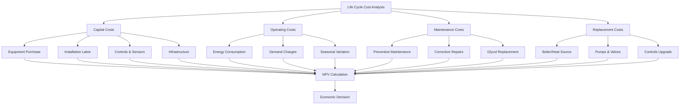

## Economic Framework for Snow Melting Systems

Life cycle cost (LCC) analysis provides the fundamental economic framework for evaluating snow melting and freeze protection system investments over their operational lifetime. Unlike simple first-cost comparisons, LCC analysis accounts for the time value of money, operational expenses, maintenance requirements, and equipment longevity to determine true economic performance.

The physics of snow melting—requiring substantial energy input to overcome latent heat of fusion (334 kJ/kg) and sensible heating—translates directly into operating costs that typically exceed initial capital investment over a 20-30 year system life. Proper economic analysis must capture these long-term implications.

## Life Cycle Cost Components

### Capital Investment

Initial capital costs include design fees, equipment procurement, installation labor, piping or electrical infrastructure, controls, and commissioning. For hydronic systems, boiler or heat exchanger costs dominate. Electric resistance systems carry lower installation costs but higher operating expenses due to energy pricing structures.

The installed cost per unit area varies significantly:

| System Type | Typical Installed Cost | Equipment Life |
|-------------|------------------------|----------------|
| Hydronic (Boiler) | $150-250/m² | 20-25 years |
| Hydronic (Heat Pump) | $180-300/m² | 15-20 years |
| Electric Resistance | $100-180/m² | 15-20 years |
| Infrared Radiant | $120-200/m² | 10-15 years |

### Operating Costs

Annual energy consumption drives operating expenses. The heat flux required for effective snow melting under design conditions (typically 150-400 W/m² depending on climate) multiplied by operating hours and energy rates determines yearly costs.

For a hydronic system with boiler efficiency $\eta_b$, the annual energy cost is:

$$C_{annual} = \frac{Q_{required} \cdot t_{operation}}{\eta_b} \cdot c_{fuel}$$

where $Q_{required}$ is the design heat flux (W/m²), $t_{operation}$ is cumulative operating hours per season, and $c_{fuel}$ is the unit energy cost.

Electric systems face higher energy costs due to electricity pricing:

$$C_{electric} = Q_{required} \cdot A \cdot t_{operation} \cdot c_{electricity}$$

where $A$ is the heated area (m²) and $c_{electricity}$ is the electric rate ($/kWh).

### Maintenance and Replacement

Maintenance costs include seasonal startup/shutdown, glycol testing and replacement (hydronic systems), control calibration, and minor repairs. Annual maintenance typically ranges from 1-3% of initial capital cost.

Equipment replacement schedules must be incorporated into LCC models. Boilers, heat exchangers, pumps, and control systems have finite service lives requiring capital reinvestment.

## Net Present Value Analysis

The fundamental LCC metric is net present value, which discounts all future costs to present-day equivalent values using the time value of money:

$$LCC = C_0 + \sum_{n=1}^{N} \frac{C_n}{(1+r)^n}$$

where:
- $C_0$ = initial capital investment ($)
- $C_n$ = costs in year $n$ including energy, maintenance, and replacements ($)
- $r$ = discount rate (typically 3-8% real rate)
- $N$ = analysis period (years, typically 20-30)

The discount rate reflects opportunity cost of capital and risk. Higher discount rates favor low-initial-cost systems with higher operating expenses, while lower rates favor efficient systems with higher capital costs.

## Economic Comparison Methodology

### Equivalent Annual Cost

For comparing systems with different lifespans, equivalent annual cost (EAC) normalizes LCC to an annualized basis:

$$EAC = \frac{LCC \cdot r}{1-(1+r)^{-N}}$$

This metric enables direct comparison of capital-intensive versus operating-intensive alternatives.

### Simple Payback Period

The simple payback period, while ignoring time value of money, provides intuitive understanding:

$$PBP = \frac{\Delta C_0}{\Delta C_{annual}}$$

where $\Delta C_0$ is the incremental capital cost of the efficient option and $\Delta C_{annual}$ is the annual operating cost savings.

For snow melting systems, payback periods comparing high-efficiency versus standard equipment typically range from 5-12 years depending on climate severity and energy costs.

## System Life Cycle Cost Comparison

## Optimization Strategies

### Control Strategy Impact

Advanced control strategies significantly impact LCC by reducing unnecessary operation. Slab temperature feedback control can reduce energy consumption by 30-50% compared to simple snow detection, dramatically improving long-term economics despite higher initial control costs.

The NPV benefit of advanced controls over a 20-year period with 5% discount rate:

$$NPV_{control} = -\Delta C_{control} + \sum_{n=1}^{20} \frac{S_{annual}}{(1.05)^n}$$

where $\Delta C_{control}$ is the incremental control cost and $S_{annual}$ is annual energy savings.

### Energy Source Selection

Energy source selection fundamentally determines operating costs. Natural gas-fired hydronic systems typically offer lowest LCC in regions with severe snow loads and moderate gas pricing. Heat pump systems may optimize LCC in moderate climates with high electricity-to-gas price ratios exceeding 3:1.

Electric resistance systems rarely achieve competitive LCC except for small areas (< 50 m²) where capital cost savings offset operating penalties.

### Zoning and Staging

Dividing large areas into independently controlled zones reduces average heat flux requirements by targeting critical pathways while allowing secondary areas to operate at reduced capacity. This zoning strategy can reduce 20-year LCC by 15-25% for parking facilities and large walkway networks.

## Sensitivity Analysis

LCC outcomes are sensitive to key assumptions including energy price escalation, discount rate, and climate severity. Energy price volatility introduces uncertainty; sensitivity analysis should evaluate LCC over a range of escalation rates (0-5% annual real increase) to assess investment robustness.

Climate change projections suggest decreasing snow loads in many regions, potentially reducing operating costs but also questioning investment justification. Economic models should incorporate scenarios reflecting climate uncertainty over the 20-30 year analysis horizon.

## Economic Decision Framework

| Decision Factor | High LCC Priority | Low LCC Priority |
|----------------|-------------------|------------------|
| Initial Budget | Constrained | Flexible |
| Energy Costs | High (>$0.12/kWh) | Low (<$0.08/kWh) |
| Usage Intensity | Continuous operation | Intermittent |
| Maintenance Capability | In-house expertise | Limited resources |
| System Lifespan | >20 years | <15 years |

Sound economic analysis requires transparent assumptions, comprehensive cost accounting, and realistic operational projections. Life cycle cost analysis transforms snow melting system selection from a first-cost decision into a strategic investment optimization aligned with long-term facility economics.
