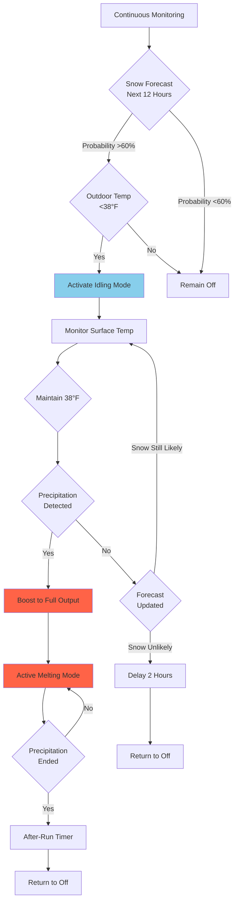
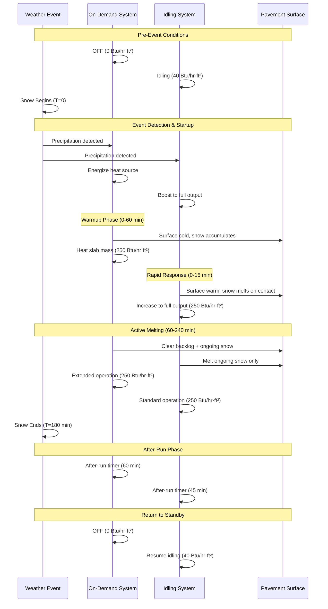

Snow melting systems operate through two fundamentally different control philosophies: on-demand activation that starts from ambient temperature when snow begins, and idling mode that maintains slab temperature slightly above freezing. The choice between these strategies represents a tradeoff between energy consumption and system response time, with annual energy differences of 60-80% and response time variations from 5 minutes to over 1 hour.

## Fundamental Operating Principles

### On-Demand Operation

On-demand systems remain completely OFF until sensors detect precipitation combined with pavement temperatures below the activation setpoint. The system then energizes at full capacity to warm the slab from ambient temperature to effective melting conditions.

The physics governing on-demand startup involves transient heat conduction through the concrete slab mass. The one-dimensional heat equation describes temperature evolution:

$$\frac{\partial T}{\partial t} = \alpha \frac{\partial^2 T}{\partial z^2}$$

Where thermal diffusivity for concrete:

$$\alpha = \frac{k}{\rho c} = \frac{1.0}{145 \times 0.22} = 0.0313 \text{ ft}^2/\text{hr}$$

The low thermal diffusivity creates substantial lag between heat application and surface temperature response. Heat must penetrate from the embedded tubing depth (typically 2-3 inches below the surface) upward through concrete with poor thermal conductivity.

**Heat Transfer Sequence for On-Demand Startup:**

1. Heat source (boiler or electric elements) energizes to full capacity
2. Fluid temperature rises from ambient to operating temperature (140-160°F for hydronic)
3. Heat conducts from tubing through concrete to surface
4. Surface temperature rises from ambient to effective melting temperature (38-45°F)
5. Snow begins melting once surface reaches threshold temperature

The total warmup time comprises both fluid heating lag and slab thermal mass response.

### Idling Mode Operation

Idling maintains the slab surface at 35-40°F through continuous low-level heat input. This pre-conditioning serves two purposes: preventing ice bond formation between snow and pavement, and eliminating slab warmup delay.

The steady-state heat balance during idling:

$$q_{idle} = h_c(T_s - T_a) + h_r(T_s - T_{sky}) + q_{ground}$$

Where:
- $q_{idle}$ = required idling heat flux (Btu/hr·ft²)
- $h_c$ = convective coefficient, 2-8 Btu/hr·ft²·°F depending on wind
- $T_s$ = slab surface setpoint (38°F typical)
- $T_a$ = ambient air temperature (°F)
- $h_r$ = radiative coefficient, approximately 1 Btu/hr·ft²·°F
- $T_{sky}$ = effective sky temperature (°F)
- $q_{ground}$ = downward conduction loss (Btu/hr·ft²)

For typical winter conditions (ambient 20°F, moderate wind producing $h_c = 5$, sky temperature 10°F, ground loss 8 Btu/hr·ft²):

$$q_{idle} = 5(38-20) + 1(38-10) + 8 = 90 + 28 + 8 = 126 \text{ Btu/hr·ft}^2$$

This represents 30-50% of full snow melting design capacity, depending on climate severity and design snow load.

**Heat Transfer in Idling Mode:**

1. Continuous heat input maintains surface temperature
2. Temperature gradient established through slab depth
3. System immediately boosts to full output when precipitation detected
4. Minimal temperature rise required to reach melting effectiveness

The physics advantage lies in eliminating the sensible heat requirement to warm the slab mass from cold conditions.

## Response Time Analysis

Response time—the duration from snow detection to effective melting—fundamentally determines system performance and snow accumulation depth during startup.

### On-Demand Response Time Calculation

Total response time for on-demand systems combines three sequential phases:

$$t_{total} = t_{source} + t_{fluid} + t_{slab}$$

**Phase 1: Heat Source Startup**

Boilers require firing and temperature rise time. For a 2 million Btu/hr condensing boiler heating from 70°F to 150°F supply:

Water volume in boiler and near piping: 30 gallons = 250 lb

$$t_{source} = \frac{m \cdot c \cdot \Delta T}{Q_{input}} = \frac{250 \times 1.0 \times 80}{2,000,000} = 0.01 \text{ hr} = 0.6 \text{ minutes}$$

This phase contributes minimally to total lag for properly sized equipment.

**Phase 2: Fluid Circulation Lag**

For hydronic systems, time to circulate heated fluid through the distribution network:

$$t_{fluid} = \frac{V_{system}}{\dot{V}_{pump}}$$

For a 1,000 ft² system with 300 ft of tubing, 0.5-inch diameter (0.0136 ft² area):

Volume = $300 \times 0.0136 = 4.08$ ft³ = 30.5 gallons

At circulation rate of 3 gpm per loop (typical):

$$t_{fluid} = \frac{30.5}{3} = 10.2 \text{ minutes}$$

**Phase 3: Slab Thermal Mass Warmup**

The dominant component derives from slab thermal inertia. Required sensible heat:

$$Q_{warmup} = m_{slab} \cdot c_{concrete} \cdot (T_{final} - T_{initial})$$

For 4-inch thick concrete slab (50 lb/ft² mass) warming from 20°F to 40°F:

$$Q_{warmup} = 50 \times 0.22 \times 20 = 220 \text{ Btu/ft}^2$$

At design heat flux of 250 Btu/hr·ft²:

$$t_{slab} = \frac{220}{250} = 0.88 \text{ hr} = 53 \text{ minutes}$$

**Total On-Demand Response Time:**

$$t_{total} = 0.6 + 10.2 + 53 = 63.8 \text{ minutes}$$

During this startup period, snow accumulates on the cold surface at the full precipitation rate. At 1 inch/hr snowfall, approximately 1 inch accumulates before effective melting begins.

### Idling Mode Response Time

Idling systems eliminate slab warmup delay. Response comprises only the boost to full output:

$$t_{idling} = \frac{m_{slab} \cdot c_{concrete} \cdot (T_{melt} - T_{idle})}{q_{available}}$$

With slab pre-warmed to 38°F, raising to 40°F effective melting temperature:

$$t_{idling} = \frac{50 \times 0.22 \times 2}{250} = 0.088 \text{ hr} = 5.3 \text{ minutes}$$

The 92% reduction in response time (from 64 to 5 minutes) prevents snow accumulation rather than requiring reactive melting of deposited snow.

### Response Time Comparison Table

| Parameter | On-Demand | Idling Mode | Reduction |
|-----------|-----------|-------------|-----------|
| Heat source lag | 0.6 min | 0.6 min | 0% |
| Fluid circulation | 10 min | 10 min | 0% |
| Slab warmup | 53 min | 5 min | 91% |
| **Total response** | **64 min** | **16 min** | **75%** |
| Snow accumulation (1 in/hr) | 1.1 inches | 0.27 inches | 75% |

The table assumes rapid boost to full output for idling mode. Conservative designs increase idling response to 15-20 minutes total while still achieving 65-70% time reduction versus on-demand.

## Energy Consumption Comparison

### Seasonal Energy Calculation Framework

Total seasonal energy consumption comprises distinct operational phases:

$$E_{season} = E_{standby} + E_{warmup} + E_{melting} + E_{afterrun}$$

For on-demand systems, $E_{standby} = 0$ because the system remains OFF between events. For idling systems, standby becomes the dominant energy component.

### On-Demand Seasonal Energy

**Warmup Energy Per Event:**

Energy required to heat slab from ambient to operating temperature depends on initial slab temperature and thermal mass:

$$E_{warmup} = m_{slab} \cdot A \cdot c_{concrete} \cdot (T_{melt} - T_{ambient,avg})$$

For 1,000 ft² area, 4-inch slab, warming from average event temperature of 25°F to 40°F:

$$E_{warmup} = 50 \times 1000 \times 0.22 \times 15 = 165,000 \text{ Btu per event}$$

**Melting Energy Per Event:**

Heat flux during active melting multiplied by duration. For moderate snow event averaging 3 hours at 225 Btu/hr·ft²:

$$E_{melting} = q_{melt} \cdot A \cdot t_{event} = 225 \times 1000 \times 3 = 675,000 \text{ Btu}$$

**Extended Melting Due to Delayed Start:**

On-demand systems begin melting with accumulated snow already on the surface, requiring additional time to clear the backlog. For 1 hour response time accumulating 1 inch at 1 in/hr rate:

Snow mass = 1 inch × 1,000 ft² × 5 lb/ft³ / 12 = 417 lb

Melt energy = $417 \times 144 = 60,000$ Btu (latent heat of fusion)

Additional melting time at 225 Btu/hr·ft²:

$$t_{extra} = \frac{60,000}{225 \times 1000} = 0.27 \text{ hr} = 16 \text{ minutes}$$

**Total Per-Event Energy (On-Demand):**

$$E_{event} = 165,000 + 675,000 + 60,000 = 900,000 \text{ Btu}$$

**Seasonal Total (15 events per winter):**

$$E_{season,demand} = 900,000 \times 15 = 13,500,000 \text{ Btu}$$

### Idling Mode Seasonal Energy

**Idling Energy:**

Continuous heat input during winter months. For Minneapolis climate (November 1 - March 31 = 151 days = 3,624 hours) at average idling flux of 40 Btu/hr·ft²:

$$E_{idling} = q_{idle,avg} \cdot A \cdot t_{season} = 40 \times 1000 \times 3624 = 144,960,000 \text{ Btu}$$

**Melting Energy Per Event:**

Reduced melting time because no accumulated snow during warmup. Events average 3 hours at 225 Btu/hr·ft²:

$$E_{melting} = 225 \times 1000 \times 3 = 675,000 \text{ Btu}$$

**Total Per-Event Energy (Idling):**

$$E_{event} = 675,000 \text{ Btu}$$ (no warmup component)

**Seasonal Total (15 events):**

$$E_{season,idle} = 144,960,000 + (675,000 \times 15) = 155,085,000 \text{ Btu}$$

### Energy Comparison Summary

| Strategy | Idling Energy | Melting Energy | Total Seasonal | Cost ($1/therm) |
|----------|---------------|----------------|----------------|-----------------|
| On-Demand | 0 Btu | 13,500,000 Btu | 13,500,000 Btu | $159 |
| Idling Mode | 144,960,000 Btu | 10,125,000 Btu | 155,085,000 Btu | $1,825 |
| **Difference** | **+144,960,000 Btu** | **-3,375,000 Btu** | **+141,585,000 Btu** | **+$1,666** |

Idling mode consumes approximately 11.5 times more energy than on-demand operation for this moderate climate scenario. The energy penalty derives almost entirely from continuous standby losses, partially offset by reduced melting duration.

## Operational Performance Comparison

### Snow Accumulation During Startup

On-demand systems permit snow accumulation during the 45-60 minute warmup period. Accumulation depth:

$$d_{accumulation} = s_r \cdot t_{response}$$

Where $s_r$ = snowfall rate (inches/hr), $t_{response}$ = startup time (hr)

| Snowfall Rate | On-Demand (60 min) | Idling (15 min) | Reduction |
|---------------|-------------------|-----------------|-----------|
| 0.5 in/hr | 0.5 inches | 0.125 inches | 75% |
| 1.0 in/hr | 1.0 inches | 0.25 inches | 75% |
| 2.0 in/hr | 2.0 inches | 0.5 inches | 75% |

Accumulated snow creates several operational disadvantages:

1. **Increased melting load**: Backlog must be cleared while continuing precipitation melts simultaneously
2. **Compressed snow from traffic**: Vehicle traffic during warmup compacts snow, increasing density from 5-6 lb/ft³ to 15-20 lb/ft³ and melting time
3. **Safety liability**: Temporary snow cover creates slip hazards during the startup phase
4. **Ice layer formation**: Bottom layer of accumulated snow may freeze to cold pavement, requiring additional time to break the ice bond

### Effective Melting Rate

Once operating, both strategies deliver identical design heat flux. However, on-demand systems must overcome accumulated snow while idling systems prevent accumulation.

**On-Demand Effective Rate:**

With 1 inch pre-accumulated, melting 1 in/hr continuing snowfall plus backlog:

$$t_{clear} = \frac{d_{accumulated}}{r_{net}} + t_{event}$$

Where net melting rate accounts for continuing snowfall:

$$r_{net} = r_{capacity} - s_r$$

If design capacity melts 2 in/hr equivalent, with 1 in/hr falling:

$$t_{clear} = \frac{1.0}{2.0-1.0} + 3 = 1 + 3 = 4 \text{ hours total}$$

**Idling Mode Effective Rate:**

No backlog to clear, system matches ongoing snowfall:

$$t_{clear} = t_{event} = 3 \text{ hours}$$

The 25% reduction in operational duration reduces melting energy and after-run time proportionally.

## Climate-Dependent Energy Analysis

The energy penalty for idling varies dramatically with climate zone due to changing idling duration and heat flux requirements.

### Mild Climate (40°F Average Winter, Rare Snow)

Seattle-type climate with 30 potential snow days but only 5 actual events averaging 1 hour each.

**Idling Energy (30 days × 24 hours):**

$$E_{idle} = 25 \times 1000 \times 720 = 18,000,000 \text{ Btu}$$

**Melting Energy (5 events × 1 hour):**

$$E_{melt} = 225 \times 1000 \times 5 = 1,125,000 \text{ Btu}$$

**On-Demand Alternative:**

$$E_{demand} = 900,000 \times 5 = 4,500,000 \text{ Btu}$$

**Energy Penalty Ratio:** 19,125,000 / 4,500,000 = 4.25× higher for idling

### Moderate Climate (28°F Average Winter, Periodic Snow)

Minneapolis-type climate with 151-day winter season, 15 snow events averaging 3 hours.

**Energy Penalty Ratio:** 155,085,000 / 13,500,000 = 11.5× higher (calculated above)

### Severe Climate (18°F Average Winter, Frequent Snow)

Duluth-type climate with 180-day season, 25 snow events averaging 4 hours each.

**Idling Energy (180 days):**

$$E_{idle} = 50 \times 1000 \times 4320 = 216,000,000 \text{ Btu}$$

**Melting Energy (25 events × 4 hours):**

$$E_{melt} = 225 \times 1000 \times 100 = 22,500,000 \text{ Btu}$$

**On-Demand Alternative:**

$$E_{demand} = 1,000,000 \times 25 = 25,000,000 \text{ Btu}$$

**Energy Penalty Ratio:** 238,500,000 / 25,000,000 = 9.5× higher

The ratio decreases in severe climates because melting hours increase proportionally to idling hours, reducing the relative penalty of continuous standby operation.

## Hybrid Control Strategies

Advanced systems implement variable strategies that adapt to forecast conditions, combining on-demand efficiency with idling responsiveness when needed.

### Weather-Predictive Activation

Internet-connected controllers access forecast data to activate idling mode only when snow probability exceeds threshold within specified time window:

**Activation Logic:**

This approach reduces idling hours from full-season (3,600 hours) to forecast-based activation (300-600 hours), cutting idling energy by 80-90% while maintaining rapid response.

**Energy Savings Example:**

Reduced idling from 3,624 hours to 500 hours:

$$E_{idle,reduced} = 40 \times 1000 \times 500 = 20,000,000 \text{ Btu}$$

Total seasonal energy with predictive activation:

$$E_{season} = 20,000,000 + 10,125,000 = 30,125,000 \text{ Btu}$$

Versus on-demand: 13,500,000 Btu

Energy penalty reduced from 11.5× to 2.2× while achieving <15 minute response time for 95% of snow events.

### Zone-Based Selective Operation

Large installations segregate critical high-priority zones (emergency access, main entrance) for idling operation while operating secondary zones on-demand:

| Zone | Area | Strategy | Seasonal Energy |
|------|------|----------|-----------------|
| Zone 1: Emergency entrance | 200 ft² | Continuous idling | 29,000,000 Btu |
| Zone 2: Main entrance | 300 ft² | Forecast idling | 9,000,000 Btu |
| Zone 3: Parking areas | 500 ft² | On-demand | 6,750,000 Btu |
| **Total** | **1,000 ft²** | **Hybrid** | **44,750,000 Btu** |

Compared to full idling (155,000,000 Btu) or full on-demand (13,500,000 Btu), the hybrid approach achieves 71% energy reduction versus full idling while ensuring rapid response in critical areas.

## Operational Mode Comparison Diagram

The following diagram illustrates the operational cycle and energy consumption patterns for both strategies:

## Economic Analysis

### Operating Cost Comparison

Natural gas at $1.00/therm (100,000 Btu), 85% boiler efficiency:

| Strategy | Seasonal Energy | Fuel Cost | Maintenance | Total Annual |
|----------|-----------------|-----------|-------------|--------------|
| On-Demand | 13,500,000 Btu | $159 | $150 | $309 |
| Full Idling | 155,085,000 Btu | $1,825 | $200 | $2,025 |
| Forecast-Based | 30,125,000 Btu | $354 | $175 | $529 |
| Zone-Selective | 44,750,000 Btu | $527 | $185 | $712 |

Electric systems at $0.12/kWh show higher absolute costs but similar ratios:

| Strategy | Seasonal Energy | Electric Cost | Total Annual |
|----------|-----------------|---------------|--------------|
| On-Demand | 3,956 kWh | $475 | $625 |
| Full Idling | 45,446 kWh | $5,454 | $5,654 |
| Forecast-Based | 8,830 kWh | $1,060 | $1,235 |

### Life-Cycle Cost Analysis

Present value of 20-year operating costs at 3% discount rate:

$$PV = C_{annual} \times \frac{1-(1+r)^{-n}}{r}$$

Where $r = 0.03$, $n = 20$:

$$PV_{factor} = \frac{1-1.03^{-20}}{0.03} = 14.88$$

| Strategy | Annual Cost | 20-Year PV | NPV vs On-Demand |
|----------|-------------|------------|------------------|
| On-Demand | $309 | $4,598 | $0 |
| Full Idling | $2,025 | $30,132 | $25,534 |
| Forecast-Based | $529 | $7,872 | $3,274 |

The economic decision depends critically on weighing operating cost differences against operational benefits: liability reduction, labor savings from eliminated manual snow clearing during startup, and user safety improvements.

## Application Recommendations

### Residential Systems (Class I)

**Recommendation:** On-demand operation

**Rationale:**
- Limited liability exposure
- Energy cost sensitivity high
- 45-60 minute response acceptable for most applications
- Manual backup snow removal available during warmup

**Exception Cases:**
- Elderly or mobility-impaired occupants requiring guaranteed access
- Steep driveways where snow accumulation creates safety hazards
- Properties with medical oxygen delivery or similar emergency access requirements

For exception cases, implement forecast-based idling rather than continuous operation.

### Commercial Systems (Class II)

**Recommendation:** Forecast-based selective idling or zone-based hybrid

**Rationale:**
- Moderate liability concerns
- Balance energy costs with operational requirements
- Reduced response time justifiable for customer safety and satisfaction
- Professional operation supports forecast integration

**Implementation:**
- Main entrance: Forecast-based idling (3-12 hour activation window)
- Secondary access: On-demand with acceptable accumulation tolerance
- Parking areas: On-demand only

### Critical Access Systems (Class III)

**Recommendation:** Continuous idling for primary zones

**Rationale:**
- Zero snow accumulation tolerance for emergency access
- Liability and operational requirements supersede energy costs
- Response time measured in minutes, not hours
- System availability critical for life safety

**Applications:**
- Hospital emergency entrances
- Fire station egress routes
- Police and ambulance facilities
- Airport critical infrastructure

Even Class III systems benefit from zone segregation to limit continuous idling to absolutely critical areas while using forecast-based activation for adjacent zones.

## Design Considerations

### Slab Thermal Mass Impacts

Heavier slabs increase warmup time penalty for on-demand systems:

| Slab Thickness | Mass (lb/ft²) | Warmup Time (On-Demand) | Energy Penalty |
|----------------|---------------|-------------------------|----------------|
| 3 inches | 36 | 38 minutes | 158 Btu/ft² |
| 4 inches | 50 | 53 minutes | 220 Btu/ft² |
| 6 inches | 75 | 79 minutes | 330 Btu/ft² |
| 8 inches | 100 | 106 minutes | 440 Btu/ft² |

Thick slabs (>6 inches) strongly favor idling or forecast-based strategies because on-demand warmup exceeds acceptable response time for most applications.

### System Capacity Requirements

On-demand systems require oversized capacity to achieve reasonable warmup times. The relationship between capacity and response time:

$$t_{warmup} = \frac{m \cdot c \cdot \Delta T}{q_{available}}$$

Doubling heat flux from 250 to 500 Btu/hr·ft² halves warmup time from 53 to 26 minutes for standard 4-inch slab. This oversizing increases first cost by 40-60% but reduces operational energy penalty by enabling more responsive on-demand operation.

Idling systems operate at design capacity (150-250 Btu/hr·ft²) because warmup delay is negligible.

## Control Optimization

### Setpoint Strategy

Idling temperature setpoint affects both energy consumption and response time:

| Idling Setpoint | Energy Use | Response Time | Ice Prevention |
|-----------------|------------|---------------|----------------|
| 33°F | Low | Moderate (10-12 min) | Marginal |
| 36°F | Moderate | Fast (6-8 min) | Good |
| 40°F | High | Very fast (3-5 min) | Excellent |

Lower setpoints reduce idling energy proportionally to temperature differential but increase transition time to effective melting. The optimal setpoint balances these factors:

$$T_{idle,optimal} = T_{freezing} + \Delta T_{margin}$$

Where $\Delta T_{margin}$ ranges from 2-6°F depending on criticality. Class III systems use 5-6°F margin (38-40°F setpoint), Class II uses 3-4°F (35-37°F), residential may use 2-3°F if idling at all.

### After-Run Optimization

On-demand systems require longer after-run duration to evaporate residual moisture that accumulated during delayed startup. Idling systems clear snow continuously, leaving minimal residual:

| Strategy | Typical After-Run | Rationale |
|----------|-------------------|-----------|
| On-Demand | 60-90 minutes | Accumulated snow creates substantial meltwater requiring extended evaporation |
| Idling | 30-45 minutes | Continuous melting produces minimal residual moisture |

Extended after-run partially offsets the on-demand energy advantage by increasing total operational hours.

## Conclusion

The fundamental tradeoff between on-demand and idling operation—energy consumption versus response time—requires careful analysis of application requirements, climate conditions, and economic factors.

On-demand operation minimizes energy consumption but accepts 45-90 minute response time and snow accumulation during startup. This strategy suits residential applications, low-priority areas, and situations where energy cost sensitivity outweighs rapid response requirements.

Idling operation eliminates warmup delay and prevents snow accumulation but consumes 4-12 times more energy through continuous standby losses. This approach is essential for critical access areas requiring immediate response and zero accumulation tolerance.

Hybrid strategies using weather-predictive activation and zone-based selective idling achieve 70-90% of idling mode performance benefits while reducing energy consumption by 60-80% compared to continuous operation. These advanced control approaches represent the optimal solution for most commercial and institutional applications.

System designers must evaluate thermal mass effects, climate severity, operational priorities, and life-cycle costs to select the appropriate strategy for each installation. The decision fundamentally shapes both system performance and long-term operating economics.
