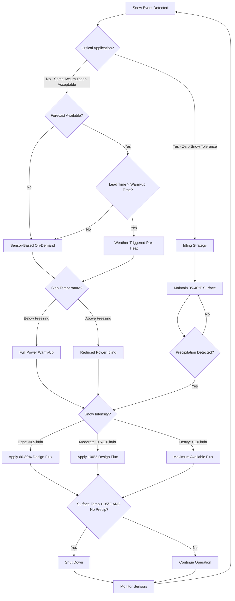

Operating strategy selection fundamentally determines the energy consumption profile and economic viability of snow melting systems. The control approach governs when heat input begins, at what intensity, and for what duration, directly impacting both annual operating costs and system effectiveness. Three distinct strategies dominate current practice, each reflecting different optimization priorities and risk tolerances.

## Physical Basis of Operating Strategy Selection

The energy balance for a snow melting slab during precipitation events establishes the relationship between thermal input, environmental heat losses, and melting capacity:

$$q_{total} = q_{snow} + q_{sensible} + q_{evap} + q_{conv} + q_{rad} + q_{cond}$$

Where:
- $q_{snow}$ = latent heat to melt snow (144 BTU/lb at 32°F)
- $q_{sensible}$ = heat to raise snowmelt temperature from 32°F to surface temperature
- $q_{evap}$ = evaporative losses from water film on slab surface
- $q_{conv}$ = convective heat transfer to ambient air
- $q_{rad}$ = radiative exchange with sky and surroundings
- $q_{cond}$ = downward conduction through slab and soil

Operating strategy determines the temporal distribution of this heat input. On-demand systems minimize total energy by operating only during precipitation events, accepting a warm-up period during which the slab temperature rises from ambient to melting effectiveness. Idling systems maintain elevated slab temperature continuously, eliminating the warm-up energy penalty but incurring continuous standby losses.

## Warm-Up Energy Calculation

The energy required to raise slab temperature from ambient to operating conditions governs the effectiveness of on-demand strategies:

$$Q_{warmup} = A_s \cdot \rho_c \cdot c_c \cdot d \cdot (T_{op} - T_{amb}) + Q_{losses}$$

Where:
- $A_s$ = slab area (ft²)
- $\rho_c$ = concrete density (145 lb/ft³ typical)
- $c_c$ = concrete specific heat (0.22 BTU/lb·°F)
- $d$ = effective thermal depth (typically 0.33-0.50 ft)
- $T_{op}$ = operating surface temperature (typically 38-45°F)
- $T_{amb}$ = initial ambient slab temperature (°F)
- $Q_{losses}$ = heat losses during warm-up period

The warm-up time constant depends on heat flux capacity and thermal mass:

$$\tau = \frac{\rho_c \cdot c_c \cdot d}{q_{applied} / \Delta T}$$

For a 4-inch (0.33 ft) slab with applied heat flux of 150 BTU/hr·ft² and 40°F temperature rise:

$$\tau = \frac{145 \times 0.22 \times 0.33}{150 / 40} = 2.8 \text{ hours to 63% of final temperature}$$

This thermal lag creates the fundamental tradeoff between energy consumption (favoring on-demand) and immediate response (favoring idling).

## Operating Strategy Decision Tree

## Operating Mode Comparison

| Strategy | Annual Operating Hours | Energy Consumption | Warm-Up Delay | Snow Accumulation Risk | Best Application |
|----------|----------------------|-------------------|---------------|----------------------|------------------|
| **On-Demand Sensor** | 150-300 hrs | **Baseline** (1.0x) | 30-90 minutes | Moderate (1-3" during warm-up) | Residential driveways, non-critical paths |
| **Weather Forecast** | 180-350 hrs | 1.1-1.3x | 0-30 minutes | Low (0-1" during warm-up) | Commercial facilities with monitoring staff |
| **Idling (Full Season)** | 2000-3000 hrs | 5.0-12.0x | None | Minimal (immediate response) | Hospital emergency access, heliports |
| **Idling (Snow Days Only)** | 400-800 hrs | 1.8-3.5x | None | Minimal | High-value commercial, critical walkways |
| **Manual Control** | Variable | 1.2-2.0x | 30-120 minutes | High (depends on operator) | Attended facilities with backup procedures |
| **Hybrid (Forecast + Sensor)** | 200-400 hrs | 1.15-1.4x | 15-60 minutes | Low | Optimal balance for most applications |

## Annual Energy Cost Optimization

The total annual operating cost for a snow melting system combines energy consumption, auxiliary equipment operation, and control system costs:

$$C_{annual} = C_{energy} + C_{pumping} + C_{controls} + C_{maintenance}$$

The energy cost component depends on operating strategy:

**On-Demand Strategy:**

$$C_{energy,OD} = \sum_{i=1}^{n} \left[ q_{design} \cdot A_s \cdot t_{melt,i} + Q_{warmup,i} \right] \cdot \frac{1}{\eta_{sys}} \cdot c_{fuel}$$

Where:
- $n$ = number of snow events per season
- $t_{melt,i}$ = melting duration for event $i$ (hours)
- $Q_{warmup,i}$ = warm-up energy for event $i$ (BTU)
- $\eta_{sys}$ = system efficiency (0.85-0.95 for hydronic, 1.0 for electric)
- $c_{fuel}$ = fuel cost ($/BTU or $/kWh)

**Idling Strategy:**

$$C_{energy,idle} = \left[ q_{idle} \cdot A_s \cdot t_{season} + \sum_{i=1}^{n} (q_{design} - q_{idle}) \cdot A_s \cdot t_{melt,i} \right] \cdot \frac{1}{\eta_{sys}} \cdot c_{fuel}$$

Where:
- $q_{idle}$ = idling heat flux (typically 20-40 BTU/hr·ft²)
- $t_{season}$ = total idling hours (typically 2000-3000 hrs for northern climates)

**Optimization Function:**

The economically optimal strategy minimizes total cost including snow removal backup:

$$\min \left[ C_{energy} + C_{maintenance} + (P_{failure} \cdot C_{removal}) \right]$$

Where $P_{failure}$ represents the probability of inadequate melting requiring mechanical snow removal, and $C_{removal}$ is the cost of backup snow removal services.

## Sensor-Based Control Implementation

Automatic snow detection systems use multiple sensor inputs to determine operating state:

**Moisture Detection:** Conductivity sensors measure surface wetness, distinguishing between dry, damp, and wet conditions. Precipitation must be present for system activation.

**Temperature Sensing:** Slab surface temperature measurement determines if moisture will freeze. Typical activation threshold: surface temperature below 37°F with moisture present.

**Ambient Temperature:** Air temperature provides anticipatory information for warm-up initiation. Some controllers begin pre-heating when ambient temperature falls below 35°F with precipitation forecast.

**Activation Logic:**

$$\text{System ON} = (\text{Moisture} = \text{WET}) \land (T_{surface} < 37°F) \lor (\text{Forecast} = \text{SNOW}) \land (T_{ambient} < 35°F)$$

$$\text{System OFF} = (T_{surface} > 40°F) \land (\text{Moisture} = \text{DRY}) \land (\text{Time Since Last Precip} > 2 \text{ hrs})$$

This hysteresis prevents cycling and ensures complete drying before shutdown.

## Weather Forecast Integration

Advanced control systems integrate numerical weather prediction data to optimize warm-up timing:

**Lead Time Calculation:**

$$t_{lead} = t_{forecast} - \tau_{warmup} - \Delta t_{safety}$$

Where:
- $t_{forecast}$ = time until predicted precipitation onset
- $\tau_{warmup}$ = system warm-up time constant (hours)
- $\Delta t_{safety}$ = safety margin for forecast uncertainty (typically 0.5-1.0 hrs)

When $t_{lead} > 0$, the system can achieve operating temperature before precipitation begins, eliminating snow accumulation during warm-up.

**Forecast Confidence Adjustment:**

$$q_{applied} = q_{design} \cdot P_{snow}^{0.5}$$

Where $P_{snow}$ is the forecast probability of snow. This reduces unnecessary operation for low-probability events while maintaining response capability.

## Pre-Storm Warm-Up Strategy

For systems with forecast integration, pre-storm warm-up provides the energy efficiency of on-demand operation with the immediate response of idling:

**Energy Comparison (2000 ft² system, 30°F initial temperature, 2-hour warm-up):**

Without pre-warm:
- Snow accumulation during warm-up: 2 inches (2 in/hr snowfall rate)
- Warm-up energy: $Q = 2000 \times 145 \times 0.22 \times 0.33 \times 10 = 2.1 \text{ million BTU}$
- Snow removal energy: $Q_{melt} = 2000 \times 2/12 \times 8 \times 144 = 0.38 \text{ million BTU}$
- Total: 2.48 million BTU

With 2-hour pre-warm:
- Snow accumulation: None (slab at temperature when snow begins)
- Warm-up energy: 2.1 million BTU (same)
- Snow removal energy: 0 BTU
- Total: 2.1 million BTU (15% savings)

Pre-warming also eliminates aesthetic concerns and liability issues associated with temporary snow accumulation.

## Hybrid Operating Strategies

Optimal control combines multiple approaches based on conditions:

**Zone-Based Control:** Critical areas (building entrances, emergency access) operate in idling mode while less critical zones (parking areas, secondary walkways) use on-demand control.

**Time-Weighted Idling:** System idles during high-probability snow periods (e.g., daytime during active weather patterns) and switches to on-demand during overnight or low-probability periods.

**Temperature-Modified Idling:** Idling heat flux varies with ambient temperature:

$$q_{idle}(T_{amb}) = q_{base} + k \cdot (T_{threshold} - T_{amb})$$

Where:
- $q_{base}$ = minimum idling flux (15 BTU/hr·ft²)
- $k$ = temperature coefficient (typically 0.5-1.0)
- $T_{threshold}$ = threshold temperature (typically 37°F)

This increases idling intensity as ambient temperature drops, reducing warm-up time for precipitation events occurring during coldest periods.

## Economic Decision Criteria

**Strategy Selection Based on Annual Snow Hours:**

- **< 100 hours/season:** On-demand sensor control (warm-up penalty small relative to idling cost)
- **100-300 hours/season:** Weather-integrated on-demand (optimal balance)
- **300-500 hours/season:** Limited idling during storm periods plus on-demand
- **> 500 hours/season:** Full-season idling may be economically justified for critical applications

**Break-Even Analysis:**

Idling becomes cost-competitive when:

$$\frac{n_{events} \cdot Q_{warmup}}{\eta_{sys}} \cdot c_{fuel} > q_{idle} \cdot A_s \cdot t_{season} \cdot \frac{c_{fuel}}{\eta_{sys}}$$

Solving for break-even event frequency:

$$n_{events} > \frac{q_{idle} \cdot A_s \cdot t_{season}}{Q_{warmup}}$$

For typical values ($q_{idle}$ = 30 BTU/hr·ft², $t_{season}$ = 2000 hrs, $Q_{warmup}$ = 50,000 BTU/event for 1000 ft²):

$$n_{events} > \frac{30 \times 1000 \times 2000}{50,000} = 1200 \text{ events}$$

This unrealistic number confirms that on-demand operation maintains lower energy costs for all practical climates. Idling justification rests on operational requirements (zero snow tolerance), not energy economics.

## Control System Performance Metrics

**Effectiveness Index:**

$$\eta_{control} = \frac{\text{Hours with Dry Surface During Precip}}{\text{Total Precipitation Hours}}$$

Target: > 0.95 for critical applications, > 0.85 for general use

**Energy Efficiency Ratio:**

$$\text{EER}_{control} = \frac{\text{Actual Annual Energy}}{\text{Theoretical Minimum Energy}}$$

Theoretical minimum assumes perfect prediction with zero warm-up time. Values of 1.2-1.5 represent excellent control performance for on-demand systems.

**False Activation Rate:**

$$\text{FAR} = \frac{\text{Operating Hours Without Effective Precipitation}}{\text{Total Operating Hours}}$$

Target: < 0.15 (indicates good sensor accuracy and control logic)

Operating strategy selection represents the single most impactful decision affecting snow melting system life cycle costs. On-demand control with weather forecast integration provides optimal energy performance for the majority of applications, achieving 70-85% energy savings relative to continuous idling while maintaining surface effectiveness above 90% through intelligent warm-up timing.
