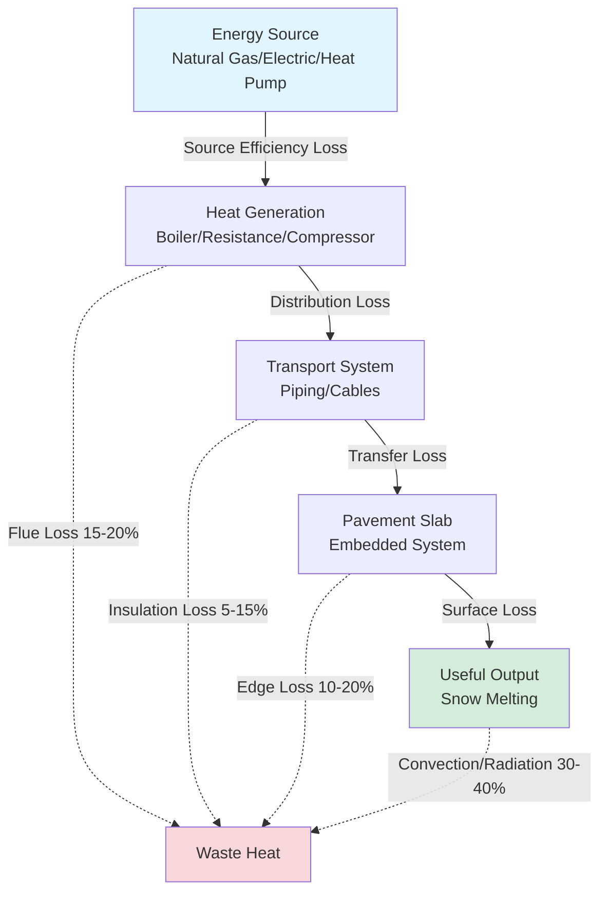

## Fundamental Efficiency Principles

Snow melting system efficiency quantifies the ratio of useful heat delivered to the pavement surface to the total energy consumed at the source. This relationship involves multiple conversion stages, each introducing losses that compound through the system.

The overall system efficiency is expressed as:

$$\eta_{\text{system}} = \eta_{\text{source}} \times \eta_{\text{distribution}} \times \eta_{\text{transfer}}$$

Where:
- $\eta_{\text{source}}$ = heat generation efficiency (boiler, heat pump, or electric resistance)
- $\eta_{\text{distribution}}$ = piping or cable distribution efficiency
- $\eta_{\text{transfer}}$ = heat transfer efficiency to pavement surface

## Energy Flow and Loss Mechanisms

## System-Specific Efficiency Analysis

### Electric Resistance Systems

Electric resistance heating provides 100% conversion efficiency at the heating element itself:

$$\eta_{\text{electric}} = \frac{Q_{\text{delivered}}}{P_{\text{input}}} = 1.0 \text{ (at element)}$$

However, the total system efficiency accounts for transmission losses and generation inefficiency at the power plant. The source-to-site efficiency is approximately 33% when considering grid power generation:

$$\eta_{\text{source-to-site}} = 0.33 \times 0.95 \times 0.98 = 0.31$$

This represents: 33% power plant efficiency, 95% transmission efficiency, 98% local distribution efficiency.

### Hydronic Boiler Systems

Condensing boiler efficiency ranges from 90-98% depending on return water temperature:

$$\eta_{\text{boiler}} = \frac{Q_{\text{output}}}{m_{\text{fuel}} \times LHV}$$

Where LHV is the lower heating value of the fuel. The complete system efficiency includes distribution losses through insulated piping:

$$\eta_{\text{hydronic}} = \eta_{\text{boiler}} \times (1 - L_{\text{pipe}}) \times \eta_{\text{slab}}$$

For a well-designed system: $\eta_{\text{hydronic}} = 0.95 \times 0.90 \times 0.85 = 0.73$

### Heat Pump Systems

Heat pump coefficient of performance (COP) varies significantly with outdoor temperature:

$$\text{COP} = \frac{Q_{\text{delivered}}}{W_{\text{compressor}} + W_{\text{auxiliary}}}$$

The COP decreases as outdoor temperature drops, which is problematic for snow melting applications:

$$\text{COP}(T_{\text{outdoor}}) = \text{COP}_{\text{rated}} - k(T_{\text{rated}} - T_{\text{outdoor}})$$

Where $k \approx 0.05$ per degree Fahrenheit for typical systems. At 32°F (0°C), a heat pump may achieve COP = 2.0-2.5, while at 0°F (-18°C), COP drops to 1.5-2.0.

## Comparative System Efficiency

| System Type | Source Efficiency | Distribution Efficiency | Overall Efficiency | Operating Cost Index |
|-------------|-------------------|-------------------------|-------------------|---------------------|
| **Electric Resistance** | 100% (element) | 98% | 31% (source-to-site) | 1.00 (baseline) |
| **Non-Condensing Boiler** | 80-85% | 85-90% | 58-68% | 0.55 |
| **Condensing Boiler** | 90-98% | 85-90% | 69-79% | 0.45 |
| **Heat Pump (32°F)** | COP 2.0-2.5 | 90-95% | 60-75% | 0.60 |
| **Heat Pump (0°F)** | COP 1.5-2.0 | 90-95% | 45-60% | 0.75 |

*Operating cost index normalized to electric resistance = 1.00, assuming natural gas at $1.00/therm and electricity at $0.12/kWh*

## Efficiency Optimization Strategies

### Insulation and Heat Retention

Minimize edge losses by installing vertical and horizontal edge insulation around the heated slab perimeter:

$$q_{\text{edge}} = \frac{P \times h \times k \times \Delta T}{d}$$

Where:
- $P$ = perimeter length
- $h$ = slab depth
- $k$ = soil thermal conductivity (0.5-1.5 BTU/hr·ft·°F)
- $\Delta T$ = temperature difference
- $d$ = insulation thickness

Proper insulation reduces edge losses from 20% to 5-8% of total heat output.

### Control System Impact

Intelligent control systems improve seasonal efficiency by 30-50% through:

1. **Demand-based operation**: Activating only during precipitation events
2. **Temperature modulation**: Reducing output temperature when full capacity is unnecessary
3. **Zone optimization**: Heating only critical pathways during light snowfall

The seasonal efficiency factor (SEF) accounts for partial-load operation:

$$\text{SEF} = \frac{\sum Q_{\text{delivered,season}}}{\sum E_{\text{consumed,season}}}$$

Systems with advanced controls achieve SEF values 1.3-1.5 times higher than continuously operated systems.

## ASHRAE Design Standards

ASHRAE Handbook—HVAC Applications Chapter 51 provides efficiency guidelines:

- Minimum boiler efficiency: 85% for non-condensing, 90% for condensing
- Maximum distribution losses: 10% for properly insulated systems
- Recommended edge insulation: R-10 minimum for perimeter, R-5 for underside
- Control system efficiency credit: Up to 40% reduction in seasonal energy use

The standard design approach uses annual efficiency:

$$\text{AFUE} = \frac{\text{Seasonal Heat Output}}{\text{Seasonal Fuel Input}}$$

## Economic Efficiency Considerations

The lifecycle cost analysis must balance installation cost against operational efficiency:

$$\text{LCC} = C_{\text{install}} + \sum_{i=1}^{n} \frac{C_{\text{operate,i}}}{(1+r)^i}$$

Where $r$ is the discount rate and $n$ is the system lifetime (typically 20-30 years).

Higher-efficiency systems command 20-40% installation premiums but reduce operating costs by 30-55%, yielding payback periods of 4-8 years depending on climate zone and utilization frequency.

## Conclusions

System efficiency fundamentally determines both operational cost and environmental impact of snow melting installations. Condensing boiler hydronic systems provide the optimal balance of efficiency (70-79%) and reliability for most applications. Heat pumps offer competitive efficiency in moderate climates (>20°F design temperature) but suffer performance degradation in severe cold. Electric resistance systems, while simple and reliable, incur the highest operating costs due to source-to-site inefficiency, limiting their application to small areas or auxiliary zones.

Proper design addressing insulation, distribution losses, and intelligent controls transforms theoretical component efficiency into realized system performance, reducing energy consumption by 40-60% compared to baseline installations.
