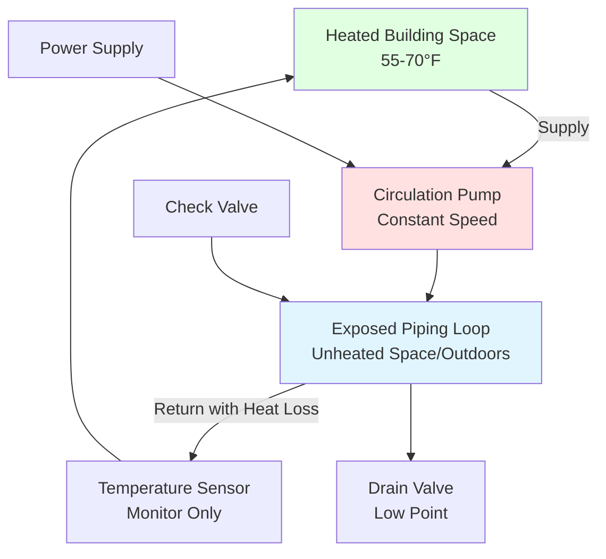
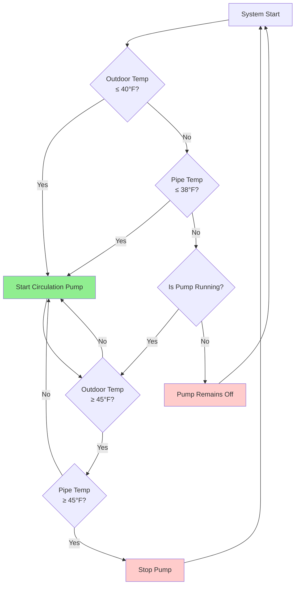

Circulation-based freeze protection maintains fluid velocity and introduces thermal energy from heated spaces to prevent ice formation in exposed piping. This method provides reliable protection when properly designed but requires careful attention to fluid mechanics, control strategies, pump redundancy, and energy consumption. The fundamental principle exploits both convective heat transport and the physical impossibility of ice formation in flowing fluid above critical velocity thresholds.

## Physical Principles of Circulation Protection

Freeze protection through circulation operates on two distinct mechanisms working in combination:

**Convective Heat Transport:**

The rate of heat delivery to exposed piping through circulation is governed by:

$$Q_{circ} = \dot{m} \cdot c_p \cdot \Delta T = \rho \cdot V \cdot A \cdot c_p \cdot \Delta T$$

Where:
- $Q_{circ}$ = heat delivery rate (BTU/hr or W)
- $\dot{m}$ = mass flow rate (lb/hr or kg/s)
- $c_p$ = specific heat of fluid (BTU/lb·°F or J/kg·K)
- $\rho$ = fluid density (lb/ft³ or kg/m³)
- $V$ = fluid velocity (ft/s or m/s)
- $A$ = pipe cross-sectional area (ft² or m²)
- $\Delta T$ = temperature drop through exposed section (°F or K)

**Ice Nucleation Suppression:**

Flowing fluid experiences shear forces that disrupt the molecular alignment required for ice crystal formation. Turbulent flow (Reynolds number Re > 4000) provides additional mixing that prevents stratification and localized cold zones. The minimum velocity to prevent ice formation under turbulent conditions:

$$V_{min} = \frac{Re_{crit} \cdot \nu}{D} = \frac{4000 \cdot \nu}{D}$$

Where:
- $Re_{crit}$ = critical Reynolds number (4000 for turbulent threshold)
- $\nu$ = kinematic viscosity (ft²/s or m²/s)
- $D$ = pipe inside diameter (ft or m)

For water at 35°F ($\nu$ ≈ 1.77×10⁻⁵ ft²/s), minimum velocities are:

| Pipe Size | Inside Diameter | Minimum Velocity | Minimum Flow Rate |
|-----------|----------------|------------------|------------------|
| 1/2" | 0.622" | 0.82 ft/s | 0.54 GPM |
| 3/4" | 0.824" | 0.62 ft/s | 0.72 GPM |
| 1" | 1.049" | 0.49 ft/s | 0.94 GPM |
| 1-1/4" | 1.380" | 0.37 ft/s | 1.29 GPM |
| 1-1/2" | 1.610" | 0.32 ft/s | 1.50 GPM |
| 2" | 2.067" | 0.25 ft/s | 2.45 GPM |

**Design practice employs safety factors of 2-3× these minimum velocities (0.5-1.5 ft/s) to account for:**
- Pump wear and degraded performance over time
- Partial blockages from sediment or debris
- Glycol solutions with higher viscosity at low temperatures
- Power interruptions causing temporary flow cessation

## Continuous Circulation Systems

Continuous circulation maintains constant flow through exposed piping whenever ambient temperatures pose freezing risk. This approach provides maximum reliability but consumes energy proportional to operating duration.

### Pump Sizing for Continuous Circulation

The circulation pump must overcome system friction losses while maintaining design velocity. Total dynamic head (TDH) calculation:

$$TDH = h_f + h_m + h_s$$

Where:
- $h_f$ = friction head loss in straight pipe
- $h_m$ = minor losses through fittings, valves
- $h_s$ = static head if elevation change exists

Friction head loss uses the Darcy-Weisbach equation:

$$h_f = f \cdot \frac{L}{D} \cdot \frac{V^2}{2g}$$

Where:
- $f$ = friction factor (0.015-0.025 for turbulent flow in commercial pipe)
- $L$ = pipe length (ft or m)
- $D$ = pipe diameter (ft or m)
- $V$ = velocity (ft/s or m/s)
- $g$ = gravitational acceleration (32.2 ft/s² or 9.81 m/s²)

For a typical freeze protection loop with 200 ft of 1" pipe at 1.0 ft/s velocity:

$$h_f = 0.020 \cdot \frac{200}{0.0874} \cdot \frac{1.0^2}{2 \cdot 32.2} = 0.71 \text{ ft}$$

Minor losses typically add 30-50% to friction losses, yielding TDH of approximately 1.0-1.5 ft for this system.

**Pump power requirement:**

$$P_{pump} = \frac{Q \cdot TDH \cdot \rho}{33,000 \cdot \eta}$$

For water systems ($\rho$ = 62.4 lb/ft³) at Q = 1.0 GPM, TDH = 1.2 ft, efficiency $\eta$ = 0.30 (small pumps):

$$P_{pump} = \frac{1.0 \cdot 1.2 \cdot 62.4}{33,000 \cdot 0.30} = 0.0076 \text{ HP} \approx 6 \text{ watts}$$

Annual energy consumption for continuous operation during 4-month heating season (2880 hours):

$$E_{annual} = 6 \text{ W} \cdot 2880 \text{ hr} = 17.3 \text{ kWh}$$

### System Schematic for Continuous Circulation

**Key design requirements per IPC Section 305.6:**

- Pump must operate whenever ambient temperature falls below 40°F
- Minimum 1.5× safety factor on calculated flow rate
- Dedicated electrical circuit with manual disconnect
- Check valve prevents reverse thermosiphon during pump failure
- Drain valve at low point for system servicing
- Temperature monitoring at furthest/coldest point from heat source

## Aquastat-Controlled Circulation

Temperature-actuated circulation operates the pump only when piping temperature approaches freezing, substantially reducing energy consumption compared to continuous circulation. Control strategy uses either pipe surface sensors or outdoor air temperature as activation signal.

### Pipe Temperature Control Strategy

Direct pipe temperature measurement provides most accurate freeze protection with aquastat or electronic temperature controller mounted on pipe surface:

**Control Logic:**
- Pump ON when pipe temperature ≤ 38°F (2°C safety margin)
- Pump OFF when pipe temperature ≥ 45°F (prevents short-cycling)
- Differential of 7°F provides hysteresis to avoid rapid on/off cycling

Sensor placement considerations:

- Install at coldest location (typically north-facing exterior wall)
- Ensure thermal contact with pipe using conductive paste
- Insulate sensor from ambient air with weatherproof cover
- Mount on bottom of horizontal pipes where stratification causes coldest temperatures
- Use averaging sensors on large-diameter pipes (>4")

For installations with multiple exposure zones, deploy sensors at:
1. Northernmost exposed section
2. Highest elevation point (heat stratification losses)
3. Section with maximum wind exposure
4. Any uninsulated fitting or valve clusters

Wire sensors in parallel so any single sensor reaching setpoint activates pump.

### Outdoor Temperature Interlock

Outdoor air temperature provides predictive freeze protection, activating circulation before pipe temperature drops to critical levels. This approach offers several advantages:

**Benefits:**
- Anticipates freezing conditions before pipe reaches 32°F
- Single sensor can protect entire system
- Less complex installation than multiple pipe sensors
- No pipe penetration or insulation disruption required

**Control setpoints:**
- Pump ON at outdoor temperature ≤ 40°F
- Pump OFF at outdoor temperature ≥ 45°F
- Adjustable setpoints for local climate optimization

Temperature sensor must be located in representative outdoor location:
- North-facing wall mount, away from building heat sources
- Minimum 4 ft from windows, exhaust vents, or HVAC discharge
- Shielded from direct solar radiation
- Protected from precipitation in weatherproof enclosure

### Control System Comparison

| Control Method | Energy Savings | Installation Cost | Reliability | Response Time | Complexity |
|---------------|----------------|-------------------|-------------|---------------|------------|
| Continuous Circulation | Baseline (0%) | Low | Excellent | Instant | Minimal |
| Pipe Aquastat | 60-80% | Medium | Excellent | 5-15 min | Low |
| Outdoor Sensor | 50-70% | Low | Very Good | 10-30 min | Low |
| Combined (Pipe + Outdoor) | 50-70% | High | Outstanding | 5-15 min | Medium |

**Combined control strategy** uses outdoor temperature as primary activation with pipe temperature override:
- Outdoor sensor at 40°F starts circulation preemptively
- Pipe sensor at 38°F provides backup activation if outdoor control fails
- System cannot be disabled unless both sensors indicate safe temperatures

This redundant approach offers optimal balance of energy efficiency and freeze protection assurance for critical applications.

## Circulation Pump Backup and Redundancy

For critical installations where freeze damage consequences are severe (fire protection, process systems, potable water mains), redundant pump configurations provide backup protection during maintenance or pump failure.

### Duplex Pump Configuration

Parallel pumps with automatic alternation provide redundancy without continuous operation of both units:

**Duplex System Operation:**
1. Lead pump operates during normal freeze protection cycles
2. Lag pump remains on standby with isolation valves open
3. Controller alternates lead/lag designation weekly to equalize wear
4. Upon lead pump failure detection (flow switch or current sensor), lag pump starts immediately
5. Alarm signals pump failure condition for service scheduling

Flow verification ensures circulation is actually occurring:
- Paddle-type flow switches detect flow above minimum threshold
- Differential pressure switches across pump confirm pressure rise
- Current sensors verify pump motor is drawing expected amperage

### Pump Performance Degradation

Circulation pumps experience performance decline over time from:
- Impeller wear reducing head capacity by 10-20% over 5-10 years
- Seal leakage allowing internal recirculation
- Motor bearing wear increasing friction losses
- Sediment accumulation in impeller passages

**Design practices to accommodate degradation:**
- Size pumps for 1.5× design flow rate at initial installation
- Schedule annual performance testing (flow and head measurement)
- Replace pumps when performance drops below 1.2× design flow
- Specify high-quality bronze or stainless steel pumps for longevity

## Energy Analysis and Optimization

Circulation freeze protection consumes energy to operate pumps continuously or intermittently throughout the heating season. Quantitative analysis informs control strategy selection.

### Annual Energy Consumption Calculation

Total seasonal energy depends on pump power and operating hours:

$$E_{season} = P_{pump} \cdot h_{operation} \cdot \frac{1}{\eta_{motor}}$$

Where:
- $E_{season}$ = seasonal energy consumption (kWh)
- $P_{pump}$ = pump hydraulic power (kW)
- $h_{operation}$ = total operating hours per season (hr)
- $\eta_{motor}$ = motor efficiency (0.30-0.60 for small pumps)

Operating hours vary significantly by control strategy and climate:

| Climate Zone | Continuous Operation | Outdoor Sensor Control | Pipe Sensor Control |
|--------------|---------------------|----------------------|---------------------|
| Minneapolis, MN | 4320 hr (Nov-Mar) | 1800 hr | 1200 hr |
| Chicago, IL | 3600 hr (Nov-Mar) | 1400 hr | 900 hr |
| Denver, CO | 3000 hr (Nov-Feb) | 1100 hr | 700 hr |
| Boston, MA | 2880 hr (Dec-Mar) | 1200 hr | 800 hr |

For 10-watt pump in Chicago climate at $0.12/kWh electricity cost:

**Continuous operation:**
$$Cost = \frac{10 \text{ W} \cdot 3600 \text{ hr}}{1000} \cdot 0.12 = \$4.32/\text{season}$$

**Outdoor sensor control:**
$$Cost = \frac{10 \text{ W} \cdot 1400 \text{ hr}}{1000} \cdot 0.12 = \$1.68/\text{season}$$

**Energy savings = $2.64/season or 61% reduction**

While absolute costs remain modest for small residential systems, large commercial installations with multiple freeze protection loops and higher-power pumps justify temperature-controlled activation.

### Heat Recovery from Circulation

Circulation systems inherently transport heat from conditioned building spaces to exposed piping. This represents a heating load that must be quantified:

$$Q_{loss} = \dot{m} \cdot c_p \cdot (T_{supply} - T_{return})$$

For 2 GPM circulation with 15°F temperature drop:

$$Q_{loss} = 2 \text{ GPM} \cdot 8.33 \text{ lb/gal} \cdot 1.0 \text{ BTU/lb·°F} \cdot 15°F \cdot 60 \text{ min/hr}$$
$$Q_{loss} = 15,000 \text{ BTU/hr} = 4.4 \text{ kW}$$

Over 1400-hour heating season, this extracts 21 million BTU from building heating system. At $15/million BTU natural gas and 85% furnace efficiency:

$$Cost_{heating} = \frac{21 \text{ MBTU}}{0.85} \cdot \frac{\$15}{\text{MBTU}} = \$370/\text{season}$$

**This heating load far exceeds pump electrical consumption**, making circulation freeze protection expensive for large exposed pipe runs compared to heat trace alternatives.

## Code Requirements and Standards

IPC and UPC establish minimum requirements for circulation freeze protection systems:

**IPC Section 305.6 - Protection Against Freezing:**
- Piping in spaces where temperatures can fall below 32°F must be protected
- Circulation systems must maintain minimum 0.5 ft/s velocity
- Automatic controls required to activate circulation at 40°F or below
- Manual override capability required for testing and emergency operation

**UPC Section 314.0 - Protection of Piping:**
- Water pipes vulnerable to freezing must be protected by approved methods
- Circulation systems using building heat require dedicated circulation pump
- Temperature controls must be installed to prevent pump operation at temperatures above 50°F (energy conservation)
- Backflow prevention required if circulation connects to potable water system

**ASHRAE Standard 90.1 - Energy Standard:**
- Section 6.5.4.3: Freeze protection systems must use automatic controls to operate only when protection is required
- Continuous circulation prohibited except where temperature controls are impractical
- Insulation required per Table 6.8.3 to minimize circulation heat losses

## Installation Best Practices

Proper installation ensures reliable freeze protection and efficient operation:

**Piping Configuration:**
- Provide continuous upward slope from pump to highest point (1/4" per foot minimum)
- Install air vents at all high points to prevent air binding
- Size piping for 1-3 ft/s velocity range at design flow
- Avoid dead legs where circulation cannot reach
- Install balancing valves on parallel branches to ensure flow distribution

**Pump Installation:**
- Mount pump below fluid level to ensure positive suction head
- Provide isolation valves for maintenance without draining system
- Install check valve on pump discharge to prevent reverse flow
- Use flexible connections to isolate vibration
- Provide clear access for inspection and servicing

**Control Wiring:**
- Use dedicated circuit with appropriate overcurrent protection
- Employ Class 1 wiring methods for power circuits per NEC Article 725
- Temperature sensors should use shielded cable to prevent electrical interference
- Clearly label all control components and circuits
- Install manual override switch in accessible location with indicator light

**Glycol Considerations:**
If circulation loop uses glycol solution for enhanced freeze protection:
- Size pump for 1.5-2.0× head due to increased viscosity
- Verify materials compatibility (glycol attacks some seals and gaskets)
- Install fill/drain ports with hose connections for solution service
- Use inhibited industrial glycol, never automotive antifreeze
- Test concentration and pH annually

Properly designed and installed circulation freeze protection systems provide reliable, energy-efficient protection for exposed piping in climates where freezing conditions occur regularly but not continuously throughout winter months.
