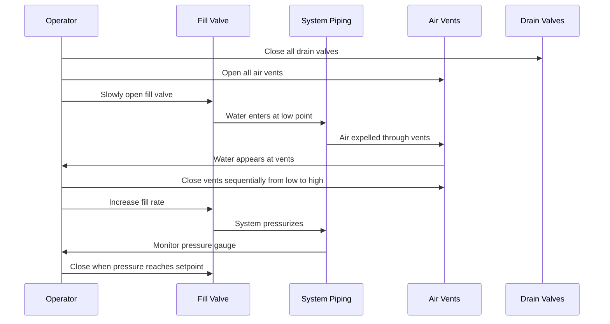

Drain-down systems provide freeze protection through complete gravity drainage of piping during cold weather, eliminating water content that could freeze and burst pipes. This passive approach requires zero operating energy but demands precise installation geometry, reliable automatic valves, and proper air admission to function consistently.

## Physics of Gravity Drainage

Successful drain-down relies on gravitational potential energy overcoming fluid friction and surface tension forces. The drainage velocity in a sloped pipe follows from energy balance:

$$V = \sqrt{\frac{2 g h}{1 + f \frac{L}{D}}}$$

Where:
- $V$ = drainage velocity (ft/s)
- $g$ = gravitational acceleration (32.2 ft/s²)
- $h$ = vertical elevation drop (ft)
- $f$ = Darcy friction factor (0.015-0.025 for smooth pipes)
- $L$ = pipe length (ft)
- $D$ = pipe diameter (ft)

For complete drainage, fluid velocity must exceed the capillary retention threshold, which varies with pipe diameter and material surface energy. Minimum slope requirements ensure this condition:

**Minimum slope = 1/4 inch per foot (2.1% grade, 1.2° angle)**

This standard originates from empirical testing showing complete water evacuation from Schedule 40 steel and copper pipes under typical installation conditions. Increasing slope to 1/2 inch per foot reduces drainage time by 40-60% and provides margin against minor installation deviations.

## Automatic Drain Valve Operation

Automatic drain valves (ADVs) open when system pressure drops below a calibrated threshold, allowing air admission and drainage. Three mechanisms dominate commercial applications:

### Spring-Loaded Diaphragm Valves

Operating principle: System pressure compresses a calibrated spring, holding a diaphragm against the drain port. When pressure drops below spring force, the diaphragm unseats, opening drainage.

Opening pressure range: 1-5 psi typical
Response time: 2-5 seconds
Orifice sizes: 1/8" to 1/2"
Applications: Residential and light commercial systems

**Pressure-flow relationship:**

$$Q = C_d A \sqrt{\frac{2 \Delta P}{\rho}}$$

Where:
- $Q$ = volumetric flow rate (ft³/s)
- $C_d$ = discharge coefficient (0.60-0.75 for ADVs)
- $A$ = orifice area (ft²)
- $\Delta P$ = pressure differential across valve (lbf/ft²)
- $\rho$ = fluid density (62.4 lbm/ft³ for water)

### Float-Operated Valves

Float mechanism rises with water presence, closing the drain port. As water drains, the float descends, maintaining the open position until refill.

Advantages:
- Positive shutoff independent of system pressure
- Visible drain status through transparent float chamber
- Self-cleaning action prevents sediment blockage

Disadvantages:
- Larger physical size (3-6 inch height requirement)
- Freeze risk if drainage incomplete
- Higher cost than spring-loaded designs

### Solenoid-Actuated Drain Valves

Electrically controlled valves open on power loss (fail-safe design) or temperature sensor signal. Combine with freeze protection controllers for automated seasonal operation.

**Sizing criteria:**

| Pipe Size | Minimum Drain Orifice | Drainage Time (10 ft rise) |
|-----------|----------------------|---------------------------|
| 1/2" - 3/4" | 1/8" | 45-60 seconds |
| 1" - 1-1/4" | 3/16" | 60-90 seconds |
| 1-1/2" - 2" | 1/4" | 90-120 seconds |
| 2-1/2" - 4" | 3/8" | 120-180 seconds |

Undersized drain valves create excessive drainage time, increasing freeze risk during rapid temperature drops. Design for complete system drainage within 3-5 minutes maximum.

## Air Vent Placement and Sizing

Air admission prevents vacuum formation that halts drainage through negative pressure buildup. As water evacuates, air must replace the vacated volume:

$$V_{air} = V_{water} + V_{expansion}$$

Air vents (vacuum breakers) must locate at:

1. **System high points:** Every elevation peak in the piping network
2. **Fixture branches:** Terminal points on dead-end runs
3. **Horizontal run endpoints:** Far end of long horizontal sections before slope reverses

### Vacuum Breaker Types

**Manual Air Vents:**
- Simple threaded ports with caps
- Operator opens during drain-down cycle
- Lowest cost but requires manual intervention
- Risk of forgetting to close before refill

**Automatic Vacuum Breakers:**
- Spring-loaded atmospheric valves (similar construction to ADVs)
- Open automatically when internal pressure drops below atmospheric
- Close when positive pressure restored during refill
- Required for unattended automatic systems

**Float-Type Air Vents:**
- Float seals vent when water present
- Automatic air release during drainage
- Prevents water spray during normal operation
- Higher cost but optimal for heated space installations

### Vent Sizing

Minimum vent orifice diameter follows from required air admission rate:

$$d_{vent} = \sqrt{\frac{4 Q_{drain}}{\pi V_{air} C_d}}$$

For practical application:

| System Pipe Size | Minimum Vent Size | Air Flow Capacity |
|-----------------|------------------|------------------|
| 1/2" - 1" | 1/8" | 0.5 SCFM |
| 1-1/4" - 2" | 1/4" | 2.0 SCFM |
| 2-1/2" - 4" | 3/8" | 4.5 SCFM |
| 6" - 8" | 1/2" | 8.0 SCFM |

## Piping Slope Requirements

Continuous unidirectional slope from air vents to drain valves is mandatory. Multiple drain points reduce slope length, minimizing elevation change requirements.

### Slope Calculation Methodology

For a piping system with length $L$ and minimum slope $S$:

$$h_{drop} = L \times S$$

Example: 50 ft horizontal pipe run at 1/4" per foot:

$$h_{drop} = 50 \text{ ft} \times \frac{1}{4 \times 12} = 1.04 \text{ ft} = 12.5 \text{ inches}$$

This vertical drop must be achievable within the building geometry. If insufficient, intermediate drain points are required.

### Multi-Drain System Layout

```mermaid
graph LR
    A[Air Vent<br/>High Point] -->|1/4" per ft slope| B[Intermediate<br/>Drain Valve]
    B -->|1/4" per ft slope| C[Main Drain<br/>Valve]
    D[Air Vent<br/>Branch High Point] -->|1/4" per ft slope| B

    style A fill:#e1f5ff
    style D fill:#e1f5ff
    style B fill:#ffe1e1
    style C fill:#ffe1e1
```

Each drain valve services a specific drainage zone. Valves isolate if one section requires maintenance while others remain operational.

## Refill Procedures

System refilling after drainage requires controlled water reintroduction to prevent air lock, water hammer, and incomplete filling.

### Standard Refill Sequence



### Critical Refill Parameters

**Fill rate:** 2-5 GPM for residential systems, 10-20 GPM for commercial installations. Excessive fill velocity creates turbulent air entrapment and incomplete venting.

Maximum recommended fill velocity:

$$V_{fill} = 1.0 \text{ ft/s}$$

This corresponds to:

| Pipe Diameter | Maximum Fill Rate |
|--------------|------------------|
| 1/2" | 1.5 GPM |
| 3/4" | 3.4 GPM |
| 1" | 6.0 GPM |
| 1-1/4" | 9.4 GPM |
| 1-1/2" | 13.5 GPM |
| 2" | 24.0 GPM |

**Pressurization time:** Allow 15-30 minutes for complete air dissolution after final venting. Rushing to full pressure traps micro-bubbles that reduce system efficiency and cause flow noise.

## System Drainage Verification

After installation and annually before winter, perform drainage verification testing:

1. **Close fill/supply valves** to isolate system
2. **Open all drain valves** manually or trigger automatic operation
3. **Open all air vents** to admit replacement air
4. **Measure drainage time** from start to final drip cessation
5. **Inspect drain valve discharge** for complete water evacuation
6. **Check low points** with inspection ports for residual water

Any water retention indicates insufficient slope, blocked drains, or air lock. IPC Section 305.6.1 requires complete drainage capability for freeze protection compliance.

### Drainage Performance Criteria

| System Type | Maximum Drainage Time | Residual Water Volume |
|------------|---------------------|---------------------|
| Residential (< 100 ft) | 3 minutes | < 1 cup |
| Light Commercial (100-500 ft) | 5 minutes | < 1 quart |
| Commercial (> 500 ft) | 10 minutes | < 1 gallon |

## Design Limitations

Drain-down systems impose constraints on piping layout:

**Cannot accommodate:**
- Horizontal piping sections without slope
- Piping below drain valve elevation
- Trap configurations that retain water
- Long vertical drops without intermediate air vents
- Fixtures requiring constant water availability

**Appropriate applications:**
- Seasonal systems (snow melting, irrigation)
- Vacation properties with extended unoccupied periods
- Outdoor shower facilities (pools, beaches)
- Exposed piping in unheated spaces
- Emergency freeze protection backup

## Comparative Analysis: Manual vs. Automatic Operation

| Feature | Manual Drain-Down | Automatic Drain-Down |
|---------|------------------|---------------------|
| Initial Cost | $50-200 | $300-800 |
| Operating Cost | $0 | $0 |
| Reliability | Depends on operator diligence | 95-98% with proper maintenance |
| Response Time | Hours to days | Minutes |
| Occupied Building Suitability | Poor | Good |
| Maintenance Frequency | Seasonal inspection | Annual valve testing |
| Freeze Risk | Moderate (human error) | Low |

Automatic systems justify their higher initial cost in unattended buildings, rapid-freeze climates, and applications where operator training/presence cannot be assured.

## Code Requirements

**IPC Section 305.6.1:** Piping in areas subject to freezing shall be protected by heating, insulation, both heating and insulation, or drain-down capability.

**IPC Section 305.6.2:** Drain-down systems shall provide complete drainage with minimum 1/4 inch per foot slope, drain valves at all low points, and air inlets at all high points.

**UPC Section 314.1:** Similar requirements with additional mandate for accessible drain valve locations and clear labeling of drain/vent components.

## Installation Best Practices

- **Use drain valve unions** for easy removal and cleaning
- **Install strainers upstream** of automatic valves to prevent debris blockage
- **Provide drain valve extensions** to terminate in accessible locations (not buried in walls)
- **Label all drain and vent points** with permanent weatherproof tags
- **Route drain discharge** to visible locations for operational verification
- **Install pressure gauges** at system high points to verify complete drainage (zero pressure)
- **Pitch horizontal pipe runs** in single direction without reversals or sags
- **Support piping** to maintain slope under full and empty conditions (account for thermal movement)

Drain-down systems offer the most energy-efficient freeze protection when design conditions permit their installation constraints. Proper valve selection, rigorous slope enforcement, and adequate air venting ensure reliable automatic operation throughout seasonal freeze-thaw cycles.
