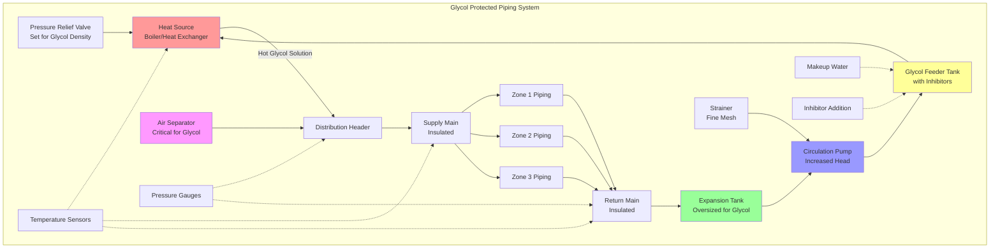

## Physical Principles of Glycol Freeze Protection

Glycol solutions prevent freezing through colligative property modification. When glycol molecules dissolve in water, they disrupt the formation of ice crystals by interfering with hydrogen bonding between water molecules. This molecular interference lowers the freezing point below 0°C (32°F), with the magnitude of depression proportional to glycol concentration.

The freezing point depression follows a non-linear relationship. At low concentrations (10-30% by weight), the freezing point decreases rapidly. Beyond 50% concentration, the rate of depression diminishes, and pure glycol (100%) actually freezes at a higher temperature than optimal mixtures. The eutectic point—the lowest achievable freezing point—occurs at approximately 60% ethylene glycol (-48°C or -55°F) and 55% propylene glycol (-51°C or -60°F).

## Glycol Concentration Calculations

The required glycol concentration depends on the minimum expected ambient temperature with appropriate safety margins. The freeze point of glycol solutions is calculated using empirical correlations:

For ethylene glycol solutions, the freezing point relationship:

$$T_f = -0.00175C^2 - 0.545C$$

For propylene glycol solutions:

$$T_f = -0.00195C^2 - 0.512C$$

where $T_f$ is the freezing point in °C and $C$ is the glycol concentration by weight (%).

The required concentration for a given design temperature includes a safety factor:

$$C_{req} = f(T_{design} - T_{safety})$$

where $T_{safety}$ typically equals 5-10°C (9-18°F) below the minimum expected temperature.

The burst protection concentration, which prevents pipe rupture even if solution becomes slushy, is lower:

$$C_{burst} \approx 0.65 \times C_{freeze}$$

## Heat Transfer and Hydraulic Impacts

Glycol solutions significantly alter heat transfer and pumping characteristics compared to pure water. The specific heat capacity decreases with increasing glycol concentration:

$$c_p = c_{p,water}(1 - 0.0045C)$$

Thermal conductivity similarly decreases:

$$k = k_{water}(1 - 0.0052C)$$

These reductions necessitate increased flow rates to maintain equivalent heat transfer capacity:

$$\dot{Q} = \dot{m} c_p \Delta T$$

For a 30% propylene glycol solution at 10°C, specific heat drops to approximately 3.93 kJ/(kg·K) compared to water's 4.19 kJ/(kg·K), requiring roughly 7% higher flow rate for equivalent heat transfer.

Viscosity increases substantially with glycol concentration and decreases with temperature. For propylene glycol at 0°C and 30% concentration, dynamic viscosity reaches approximately 4.5 mPa·s versus water's 1.8 mPa·s at the same temperature. This viscosity increase directly impacts pumping power:

$$\Delta P \propto \mu$$

Pump head requirements increase by 20-50% for typical glycol concentrations compared to water systems.

## System Design Considerations

### Expansion Tank Sizing

Glycol solutions have higher thermal expansion coefficients than water. The expansion tank must accommodate increased volumetric change:

$$V_{tank} = V_{system} \times \beta \times \Delta T \times SF$$

where $\beta$ is the volumetric expansion coefficient (approximately 0.00075/°C for 30% propylene glycol versus 0.00021/°C for water), and $SF$ is a safety factor of 1.25-1.5.

### Material Compatibility

Ethylene glycol and propylene glycol differ in corrosion characteristics. Uninhibited glycols oxidize to form acidic compounds (glycolic acid, formic acid) that attack ferrous metals and copper alloys. Corrosion inhibitor packages are mandatory, typically containing:

- Sodium nitrite or sodium benzoate (ferrous metal protection)
- Sodium molybdate (copper alloy protection)
- pH buffers (maintaining pH 8.5-10.5)
- Surfactants (preventing foam)

Inhibitor depletion requires annual testing and replenishment. ASTM D1384 and D4340 specify corrosion testing protocols for glycol solutions.

### Environmental and Safety Factors

Propylene glycol is non-toxic and preferred for applications with potential human contact, food processing facilities, or environmental sensitivity. Ethylene glycol provides superior heat transfer characteristics but presents toxicity hazards requiring careful handling and spill containment. Local codes may mandate propylene glycol in specific applications.

## Comparison of Freeze Protection Methods

| Protection Method | Capital Cost | Operating Cost | Reliability | Temperature Range | Maintenance |
|-------------------|--------------|----------------|-------------|-------------------|-------------|
| Propylene Glycol | Medium | Low | High | -51°C to 120°C | Annual testing |
| Ethylene Glycol | Low | Low | High | -48°C to 120°C | Annual testing |
| Heat Trace Electric | High | High | Medium | Unlimited | Sensor calibration |
| Heat Trace Steam | High | Very High | Medium | Unlimited | Trap maintenance |
| Circulation with Heat | Medium | Medium | High | Design-limited | Pump service |
| Drain-Down Systems | Low | Low | Low | N/A | Valve operation |

## Glycol Distribution System Architecture

## Standards and Code Requirements

ASHRAE Standard 15 addresses glycol solutions in mechanical refrigeration systems. ASTM D1177 specifies ethylene glycol-based engine coolants (applicable to closed-loop HVAC). ASTM D6210 covers propylene glycol-based heat transfer fluids. International Mechanical Code (IMC) Section 1404 requires backflow prevention for glycol systems connected to potable water.

The glycol concentration must be verified at commissioning and annually thereafter using refractometry or hydrometry. Documentation must include concentration percentage, inhibitor levels, pH, and freeze point verification. Glycol solutions require replacement when inhibitor depletion, contamination, or thermal degradation occurs, typically every 3-5 years in closed-loop systems with proper maintenance.

## Operational Monitoring

Critical monitoring parameters include:

**Temperature differential**: Excessive ΔT indicates inadequate flow from increased viscosity or pump degradation

**Pressure drop**: Increasing pressure drop suggests glycol degradation products forming sludge or scale

**pH level**: Drift below 8.0 indicates inhibitor depletion and onset of corrosion

**Reserve alkalinity**: Measures remaining neutralization capacity against acidic oxidation products

**Freeze point verification**: Direct measurement confirms concentration adequacy for protection

Automated systems should alarm on temperature excursions, pressure deviations, and pump failure to prevent freeze damage during unattended operation.
