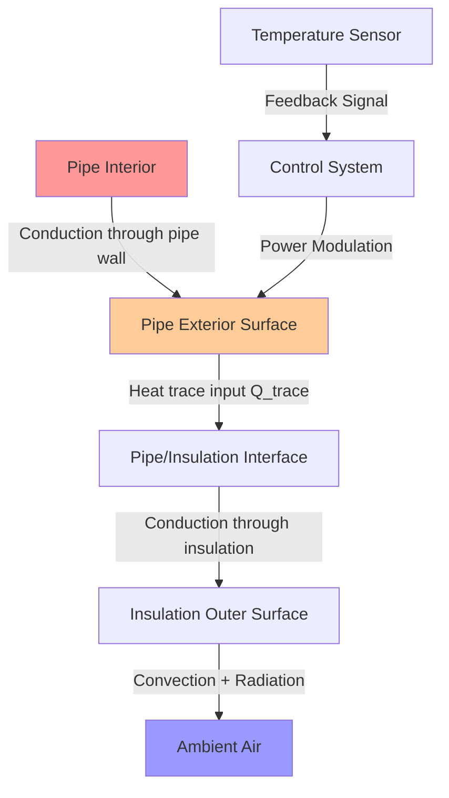
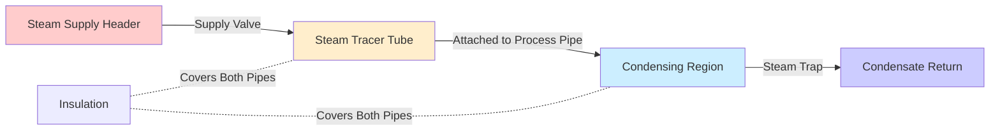
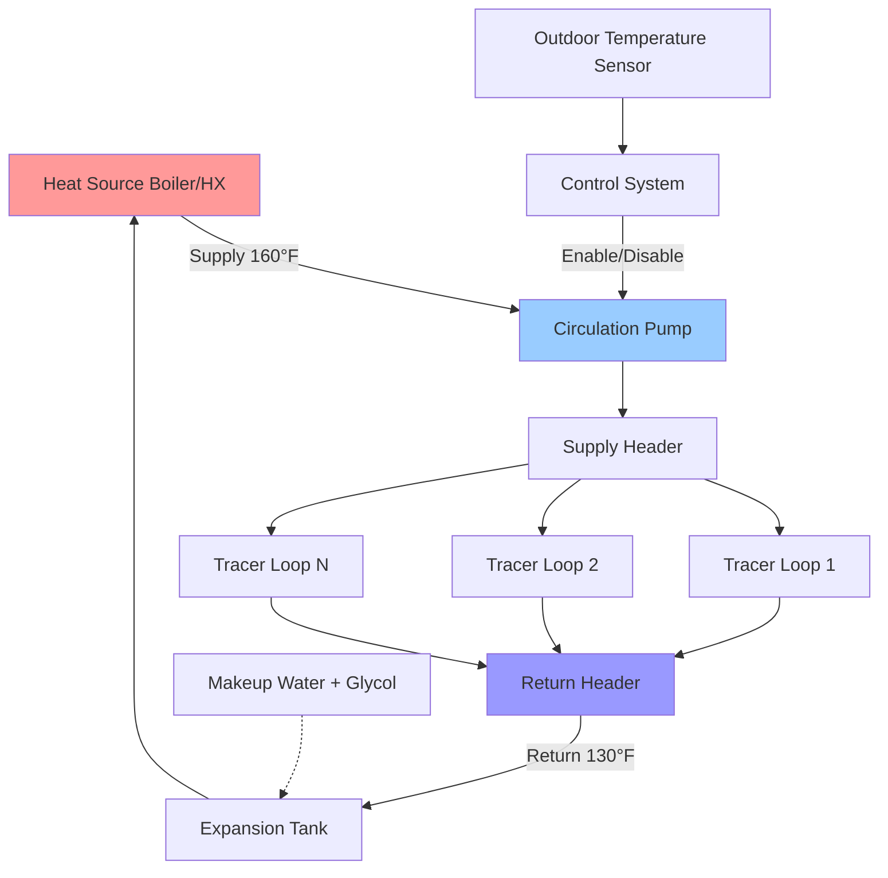

Heat trace systems maintain pipe temperatures above freezing through continuous or controlled thermal energy input. Three fundamental methods dominate industrial and commercial applications: electric resistance heating, steam tracing, and hot water circulation. Selection depends on available utilities, temperature requirements, hazardous area classifications, and lifecycle cost analysis.

## Physical Principles of Heat Tracing

Heat tracing compensates for thermal energy loss through pipe walls and insulation to the surrounding environment. The steady-state heat balance equation governs all heat trace design:

$$Q_{trace} \geq Q_{loss} = \frac{2\pi k L (T_{pipe} - T_{ambient})}{\ln(r_{outer}/r_{inner})} + Q_{convection} + Q_{radiation}$$

Where:
- $Q_{trace}$ = heat trace power input (W)
- $Q_{loss}$ = total heat loss (W)
- $k$ = thermal conductivity of insulation (W/m·K)
- $L$ = pipe length (m)
- $T_{pipe}$ = maintained pipe temperature (K)
- $T_{ambient}$ = minimum ambient temperature (K)
- $r_{outer}$, $r_{inner}$ = outer and inner insulation radii (m)

For practical calculations with insulated pipes, the simplified form proves adequate:

$$Q_{loss} = \frac{\Delta T \times L}{R_{total}}$$

Where $R_{total}$ represents the combined thermal resistance of insulation, pipe wall, internal fluid film, and external convective boundary layer.

## Electric Heat Trace Systems

Electric heat trace converts electrical energy to thermal energy through resistive heating. NEC Article 427 and IEEE Standard 515 establish requirements for design, installation, and maintenance.

### Self-Regulating Heat Trace Cable

Self-regulating cables contain a conductive polymer core between two parallel bus wires. The polymer exhibits positive temperature coefficient (PTC) behavior—electrical resistance increases exponentially with temperature according to:

$$R(T) = R_0 \times e^{\beta(T - T_0)}$$

Where:
- $R(T)$ = resistance at temperature $T$ (Ω/ft)
- $R_0$ = reference resistance (Ω/ft)
- $\beta$ = temperature coefficient (typically 0.03-0.08 K⁻¹)
- $T_0$ = reference temperature (K)

This physical mechanism provides inherent temperature limiting—as pipe temperature increases, local resistance increases, current decreases, and power output drops. The cable automatically adjusts power output along its length based on local temperature conditions.

**Performance characteristics:**
- Power output: 3-50 W/ft at 40°F depending on cable rating
- Output decreases 50-70% from 40°F to 150°F
- Cannot overheat when overlapped or bunched
- Maximum exposure temperature: 185-215°F (product dependent)
- Circuit length: 100-300 ft at 120V, 200-600 ft at 240V
- Inrush current: 2-3× steady-state during cold startup

### Constant Wattage Heat Trace Cable

Constant wattage cables maintain fixed power output independent of temperature. Two configurations exist:

**Series Resistance Cable:**
- Single continuous heating element
- Fixed total wattage for entire circuit
- Cannot be cut to length in field
- If sectioned, entire circuit fails
- Used for precise temperature control applications

**Parallel Resistance Cable:**
- Heating elements connected in parallel between bus wires
- Can be field-cut to required length
- Failure of one element does not affect others
- Power output: 3-25 W/ft constant
- Requires thermostat control to prevent overheating

Power output relationship:

$$P = \frac{V^2}{R} = I^2 R$$

Where $V$ = supply voltage, $R$ = cable resistance, $I$ = current. Since resistance remains constant, power output does not vary with ambient or pipe temperature—external control proves mandatory.

### Heat Trace Cable Selection Table

| Application | Pipe Temp | Cable Type | Power Density | Control Method | NEC Class |
|-------------|-----------|------------|---------------|----------------|-----------|
| Freeze protection | 40-50°F | Self-reg | 5-15 W/ft | Ambient sensor | Class 1 |
| Process maintenance | 50-150°F | Self-reg or constant | 10-30 W/ft | Pipe sensor + stat | Class 2 |
| High temperature | 150-300°F | Mineral insulated | 20-60 W/ft | RTD + controller | Class 3 |
| Steam condensate | 200-400°F | MI cable | 30-80 W/ft | Temperature controller | Class 4 |
| Hazardous areas | Varies | Explosion-proof | Product specific | Intrinsically safe | Division 1/2 |

### Heat Loss Calculation Methodology

Calculate heat trace requirements using the following procedure:

**Step 1: Determine design temperatures**
- Minimum ambient temperature (99.6% design day from ASHRAE)
- Maintenance temperature (typically 40-50°F for freeze protection)
- Maximum exposure temperature (summer conditions)

**Step 2: Calculate bare pipe heat loss**

$$Q_{bare} = \frac{\pi D L (T_{pipe} - T_{ambient})}{R_{convection} + R_{radiation}}$$

For horizontal pipes in still air at typical conditions:

$$Q_{bare} \approx 1.2 \times D \times L \times \Delta T \text{ (W, for D in inches, L in feet, ΔT in °F)}$$

**Step 3: Apply insulation effect**

$$Q_{insulated} = \frac{Q_{bare}}{1 + \frac{k_{pipe} t_{ins}}{k_{ins} r_{pipe}}}$$

Where:
- $t_{ins}$ = insulation thickness
- $k_{ins}$ = insulation thermal conductivity (0.25-0.35 BTU·in/hr·ft²·°F for fiberglass)
- $k_{pipe}$ = pipe thermal conductivity

**Step 4: Add heat sink losses**

Valves, flanges, and supports act as thermal bridges conducting heat from the pipe:

$$Q_{fittings} = N_{valves} \times 10W + N_{flanges} \times 8W + N_{supports} \times 5W$$

**Step 5: Apply safety factors**

- Wind exposure (outdoor): multiply by 1.3-1.5
- Startup heating: multiply by 1.5-2.0
- Pipe material factor: 1.15 for copper, 1.0 for steel
- Total design heat trace power: $Q_{total} = Q_{insulated} \times$ (safety factors)

### Example Calculation

**Given:**
- 2" steel pipe, 100 ft length
- 1.5" fiberglass insulation
- Maintain 50°F, design ambient -10°F
- Outdoor exposure with wind
- 3 gate valves, 4 flanged joints

**Solution:**

Base heat loss with insulation:
$$Q_{base} = \frac{60°F \times 100ft}{R_{value}} = \frac{6000}{4.5} = 1333 \text{ W} = 13.3 \text{ W/ft}$$

Heat sinks:
$$Q_{fittings} = 3(10W) + 4(8W) = 62 \text{ W} = 0.62 \text{ W/ft averaged}$$

Wind factor: $1.4$
Steel factor: $1.0$

$$Q_{design} = (13.3 + 0.62) \times 1.4 = 19.5 \text{ W/ft}$$

**Select:** 20 W/ft self-regulating cable with 240V supply

## Steam Tracing Systems

Steam tracing uses condensing steam in a small-diameter tracer tube attached to the process pipe. Latent heat of vaporization provides high heat transfer rates with minimal temperature differential.

### Steam Tracing Design Principles

Heat transfer from steam tracer occurs through three mechanisms:

1. **Condensation inside tracer tube:**
$$h_{condensation} = 0.725 \left[\frac{g \rho_L (\rho_L - \rho_V) k_L^3 h_{fg}}{\mu_L D_{tracer} \Delta T}\right]^{0.25}$$

2. **Conduction through tracer wall and contact resistance**

3. **Conduction through process pipe wall to fluid**

Typical steam tracer performance:

| Steam Pressure | Saturation Temp | Heat Output per Tracer | Tracer Tube Size | Condensate Rate |
|----------------|-----------------|----------------------|------------------|-----------------|
| 15 psig | 250°F | 40-60 BTU/hr·ft | 1/4" - 3/8" | 4-6 lb/hr per 100ft |
| 30 psig | 274°F | 50-75 BTU/hr·ft | 3/8" - 1/2" | 5-8 lb/hr per 100ft |
| 50 psig | 298°F | 65-95 BTU/hr·ft | 1/2" - 3/4" | 7-10 lb/hr per 100ft |
| 100 psig | 338°F | 90-130 BTU/hr·ft | 3/4" - 1" | 10-14 lb/hr per 100ft |

### Steam Tracer Configuration

**Installation requirements:**

- Tracer tube continuously welded or banded to process pipe bottom for gravity drainage
- Slope tracer 1/2" per 10 ft toward condensate collection point
- Install steam trap at end of each tracer run (not at intermediate points)
- Trap sizing: 2-3× calculated condensate load
- Supply steam through top connection, remove condensate from bottom
- Insulation covers both process pipe and tracer as single assembly
- Maximum tracer length: 300-500 ft depending on pipe size and heat loss

### Steam Trap Selection for Tracers

Proper trap operation ensures continuous condensate removal without steam loss:

**Thermostatic traps:** Open on temperature drop, suitable for modulating loads
**Float and thermostatic traps:** Handle varying condensate loads, preferred for long tracers
**Inverted bucket traps:** Reliable but discharge intermittently, causing temperature cycling
**Thermodynamic traps:** Simple and compact, acceptable for small tracers

Trap capacity must exceed peak condensate rate under coldest conditions by 2-3× to accommodate startup surges.

## Hot Water Heat Trace Systems

Hot water circulation through jacketed pipe or parallel tubing provides uniform heating without the high temperatures and pressure concerns of steam. Common in freeze protection applications where precise temperature control and low maintenance prove essential.

### Hot Water Tracer Design

Heat output from circulating hot water tracer:

$$Q = \dot{m} c_p (T_{in} - T_{out}) = UA \Delta T_{lm}$$

Where:
- $\dot{m}$ = water flow rate (lb/hr)
- $c_p$ = specific heat of water (1.0 BTU/lb·°F)
- $UA$ = overall heat transfer coefficient × area
- $\Delta T_{lm}$ = log mean temperature difference

Log mean temperature difference accounts for temperature drop along tracer length:

$$\Delta T_{lm} = \frac{(T_{in} - T_{ambient}) - (T_{out} - T_{ambient})}{\ln\left(\frac{T_{in} - T_{ambient}}{T_{out} - T_{ambient}}\right)}$$

**Typical hot water tracer parameters:**

- Supply temperature: 140-180°F
- Return temperature: 120-140°F
- Flow velocity: 2-4 ft/s minimum to prevent settling
- Tubing size: 1/2" to 1" copper or CPVC
- Heat output: 15-40 BTU/hr·ft depending on ΔT
- Pump head: 10-30 ft per 100 ft of tracer
- Glycol addition: 30-40% by volume for freeze protection of tracer itself

### Hot Water System Components

**Design considerations:**

- Size heat source for simultaneous operation of all tracers at design ambient
- Provide dedicated circulation pump with backup
- Install strainer upstream of pump to prevent debris accumulation
- Use propylene glycol (30-40%) to protect tracer tubes from freezing
- Enable circulation at 38-40°F outdoor temperature
- Monitor return temperature—excessive drop indicates inadequate flow
- Annual glycol testing and pH monitoring required

## NEC and IEEE 515 Compliance Requirements

### NEC Article 427: Fixed Electric Heating Equipment for Pipelines and Vessels

**427.10 - General:** Heat trace systems must be identified as suitable for the specific application, including chemical exposure, moisture, and temperature.

**427.13 - Identification:** Each factory-assembled heating cable must have permanent identification every 3 feet showing manufacturer, catalog number, and ratings.

**427.18 - Power Supply:** Branch circuits must be rated at minimum 125% of total connected heat trace load for continuous duty.

**427.19 - Disconnecting Means:** Each heat trace circuit requires accessible disconnect within sight of controller or lockable in open position.

**427.22 - Equipment Protection:**
- Ground fault protection Class A (5 mA) required for general applications
- Equipment protection GFPE (30 mA) required for large systems
- Overcurrent protection coordinated with cable cold inrush current (2-3× rated)

**427.23 - Metal Covering:** Metallic cable braids and sheaths must be grounded per Article 250.

**427.28 - Thermal Protection:** Constant wattage cables require thermostat or temperature-limiting device to prevent overheating.

### IEEE Standard 515: Standard for the Testing, Design, Installation and Maintenance of Electrical Resistance Trace Heating for Industrial Applications

**Design requirements:**
- Heat loss calculations with minimum 10% safety margin
- Startup heating calculations for frozen pipe recovery (optional but recommended)
- Circuit length calculations based on voltage drop and cable specifications
- Power density limitations based on pipe temperature classification

**Installation requirements:**
- Cable secured every 12-16 inches with pressure-sensitive adhesive or glass tape
- Minimum bend radius: 6× cable thickness for self-reg, 10× for MI cable
- Avoid cable damage during insulation installation
- Weatherproof terminations and splice kits listed for application
- Installation inspection before insulation applied

**Testing requirements:**
- Pre-energization insulation resistance test: minimum 20 MΩ at 500V DC
- Continuity test to verify circuit integrity
- Ground fault circuit interrupter operational test
- Infrared thermography survey 30 days after commissioning

**Maintenance requirements:**
- Annual infrared survey to identify hot spots and failures
- Ground fault device testing quarterly
- Insulation resistance testing every 3 years
- Document all repairs and modifications

## Control Strategies for Heat Trace Systems

Effective control balances freeze protection reliability with energy efficiency.

### Ambient Temperature Control

Simplest control method—energizes heat trace when outdoor temperature falls below setpoint (typically 38-40°F):

**Advantages:**
- Low cost and simple installation
- Suitable for self-regulating cable
- Anticipates freezing conditions before pipe temperature drops

**Disadvantages:**
- Does not respond to localized cold spots or wind effects
- May overcycle during temperature swings near setpoint
- Cannot detect heat trace failures

### Pipe Temperature Control

Thermostat sensor attached directly to pipe surface cycles heat trace to maintain setpoint:

**Advantages:**
- Directly measures parameter of concern (pipe temperature)
- Energy efficient—operates only when needed
- Can use lower cost constant wattage cable with stat control

**Disadvantages:**
- Sensor location critical—may miss cold spots
- Requires low-voltage control wiring to each zone
- Stat calibration affects accuracy

### Proportional Control

Electronic controller modulates heat trace power based on outdoor temperature:

$$P_{output} = P_{max} \times \frac{T_{setpoint} - T_{outdoor}}{T_{setpoint} - T_{design}}$$

Provides variable heat output proportional to heating demand, optimizing energy use for self-regulating cables that naturally modulate with pipe temperature.

### System Monitoring and Alarms

Advanced systems provide:
- Current monitoring to detect cable failures (open circuit or ground fault)
- Ground fault indication with individual circuit identification
- Pipe temperature monitoring at critical locations
- Outdoor temperature trending
- Energy consumption tracking
- Remote alarm notification

## Comparison of Heat Tracing Methods

| Parameter | Electric Self-Reg | Electric Constant | Steam Tracing | Hot Water |
|-----------|------------------|-------------------|---------------|-----------|
| Initial cost | Medium | Low | High | Medium-High |
| Operating cost | Low-Medium | Medium-High | Medium | Low-Medium |
| Temperature range | 40-300°F | 40-500°F | 200-400°F | 40-200°F |
| Response time | Fast (5-15 min) | Fast (5-15 min) | Medium (15-30 min) | Slow (30-60 min) |
| Maintenance | Low | Medium | High | Medium |
| Hazardous area | Suitable with approval | Suitable with approval | Preferred | Suitable |
| Turndown | Excellent (automatic) | Poor (requires control) | Good | Good |
| Uniformity | Excellent | Excellent | Fair | Good |
| Freeze-up recovery | Fast | Fast | Very fast | Slow |

## Installation Best Practices

**Cable routing:**
- Install on bottom of horizontal pipe for gravity drainage condensate protection
- Spiral wrap at 6-12 inch pitch on vertical risers over 20 feet
- Increase cable spacing to 4 inches near high-heat equipment
- Cross expansion loops at right angles, provide service loop
- Label all circuits at 50-foot intervals with circuit number

**Power connections:**
- Use factory-fabricated connection and splice kits exclusively
- Follow manufacturer torque specifications for terminal screws
- Apply heat-shrink tubing and self-fusing tape per installation instructions
- Install junction boxes rated NEMA 4X minimum for wet locations
- Verify polarity for cables requiring specific phase connection

**Insulation application:**
- Apply insulation directly over installed and tested heat trace
- Seal all joints with vapor-tight mastic rated for operating temperature
- Install with vapor barrier facing outward
- Support insulation on hangers to prevent compression
- Use aluminum or PVC jacketing outdoors for weather protection
- Mark "Electric heat trace—do not remove insulation" every 10 feet

**Quality verification:**
- Measure and record insulation resistance before energization (>20 MΩ typical)
- Photograph installation before insulation for as-built records
- Perform infrared survey 24-72 hours after initial energization
- Document all circuit breaker and GFCI locations
- Provide operation and maintenance manual to facility

Heat trace systems offer reliable freeze protection when properly designed, installed, and maintained. Selection requires thorough engineering analysis of thermal requirements, available utilities, operational constraints, and lifecycle costs. Electric self-regulating cable provides optimal performance for most commercial freeze protection applications, while steam and hot water tracing remain preferred for high-temperature process maintenance and facilities with existing steam infrastructure.
