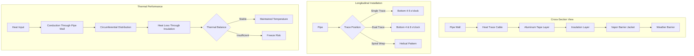

## Physical Principles of Heat Trace Insulation

Insulation in heat trace applications serves a dual purpose: reducing heat loss from the pipe and protecting the heat trace cable from mechanical damage and environmental exposure. Unlike standard process insulation, heat trace insulation must balance thermal resistance with the heat input capacity of the electric heating cable.

The fundamental challenge is maintaining pipe temperature above freezing while minimizing electrical energy consumption. This requires accurate quantification of heat losses through the insulation and selection of materials that provide adequate thermal resistance without exceeding heat trace cable power density limits.

## Heat Loss and Insulation Thickness Calculation

The steady-state heat loss from an insulated pipe follows the radial heat transfer equation:

$$Q = \frac{2\pi L(T_p - T_a)}{\frac{\ln(r_2/r_1)}{k_{ins}} + \frac{1}{r_2 h_o}}$$

Where:
- $Q$ = heat loss rate (W)
- $L$ = pipe length (m)
- $T_p$ = maintained pipe temperature (°C)
- $T_a$ = ambient temperature (°C)
- $r_1$ = pipe outer radius (m)
- $r_2$ = insulation outer radius (m)
- $k_{ins}$ = thermal conductivity of insulation (W/m·K)
- $h_o$ = outer surface heat transfer coefficient (W/m²·K)

The heat trace cable must supply sufficient power to overcome this heat loss plus a safety factor. For freeze protection, the maintained temperature typically ranges from 4°C to 10°C.

## Required Heat Trace Power Density

The linear power density required from the heat trace cable is:

$$q_{trace} = \frac{Q}{L} \cdot SF$$

Where $SF$ is a safety factor (typically 1.3-1.5) accounting for:
- Voltage variations
- Cable aging effects
- Intermittent flow conditions
- Startup transients

The selected heat trace cable must have adequate watt density at the design maintenance temperature. Self-regulating cables reduce output as pipe temperature increases, providing inherent overtemperature protection.

## Critical Radius Concept

For small diameter pipes, adding insulation can paradoxically increase heat loss if the insulation thickness is below the critical radius:

$$r_{crit} = \frac{k_{ins}}{h_o}$$

This occurs because the increased surface area for convection outweighs the added thermal resistance. For typical insulation materials ($k_{ins}$ = 0.035-0.045 W/m·K) and outdoor conditions ($h_o$ = 15-25 W/m²·K), the critical radius ranges from 1.4 to 3.0 mm—well below practical insulation thicknesses.

## Insulation Material Selection for Heat Trace

Material selection depends on temperature rating, moisture resistance, compressive strength, and compatibility with the heat trace cable maximum exposure temperature.

| Insulation Type | Thermal Conductivity (W/m·K) | Max Temp (°C) | Moisture Resistance | Compressive Strength | Cost Factor |
|----------------|------------------------------|---------------|---------------------|---------------------|-------------|
| Mineral Wool (Pipe Section) | 0.038-0.042 | 650 | Poor (requires jacket) | Medium | 1.0 |
| Polyisocyanurate (PIR) | 0.023-0.026 | 150 | Good | High | 1.4 |
| Cellular Glass | 0.038-0.045 | 430 | Excellent | Very High | 2.1 |
| Elastomeric Foam | 0.036-0.040 | 105 | Excellent | Low | 1.2 |
| Phenolic Foam | 0.018-0.021 | 120 | Good | Medium | 1.6 |
| Aerogel Blanket | 0.012-0.015 | 200 | Good | Low | 4.5 |

For freeze protection applications with self-regulating heat trace (typical exposure temperatures 65-85°C), mineral wool, elastomeric foam, and PIR are most common. Cellular glass excels in harsh outdoor environments due to superior moisture and vermin resistance.

## Heat Trace and Insulation Installation Configuration

## Installation Best Practices

**Cable Positioning**: Place heat trace on the bottom quadrant of horizontal pipes (4-5 o'clock position when facing downstream) to ensure direct contact with condensate or stagnant fluid. On vertical pipes, spiral wrapping improves temperature uniformity but increases cable length and cost.

**Securing**: Use aluminum tape or glass fiber tape to secure the cable continuously along the pipe surface. This ensures intimate thermal contact and prevents cable movement during insulation installation. Never use plastic tape that may melt under operating conditions.

**Insulation Continuity**: Eliminate thermal bridges at supports, flanges, and valves. Use pre-molded insulation fittings or carefully fabricated sections to maintain continuous thermal resistance. Each thermal bridge can increase local heat loss by 50-200%.

**Vapor Barrier Integrity**: Seal all longitudinal and circumferential joints in the vapor barrier jacket using mastic or specialized tapes. Moisture infiltration degrades insulation thermal performance and can cause corrosion under insulation (CUI).

## Design Standards and Code Requirements

**IEEE 515**: IEEE Standard for the Testing, Design, Installation, and Maintenance of Electrical Resistance Trace Heating for Industrial Applications provides comprehensive guidance on heat trace system design including insulation specifications.

**ASTM C534**: Standard Specification for Preformed Flexible Elastomeric Cellular Thermal Insulation establishes material properties and testing methods for elastomeric insulation commonly used in freeze protection.

**ASTM C547**: Standard Specification for Mineral Fiber Pipe Insulation defines requirements for mineral wool products including temperature ratings and thermal conductivity.

Local mechanical codes may specify minimum insulation thickness for exterior piping based on climate zone and application. The International Energy Conservation Code (IECC) mandates insulation for certain piping systems but does not specifically address heat trace applications.

## Sizing Example

For a 2-inch (60.3 mm OD) steel pipe with heat trace maintaining 7°C in -20°C ambient conditions:

Assume 25 mm mineral wool insulation ($k$ = 0.040 W/m·K) and outdoor surface coefficient $h_o$ = 20 W/m²·K.

Calculate:
- $r_1$ = 0.0302 m
- $r_2$ = 0.0552 m
- Temperature difference = 27 K

Heat loss per meter:

$$q = \frac{2\pi \cdot 27}{\frac{\ln(0.0552/0.0302)}{0.040} + \frac{1}{0.0552 \cdot 20}} = \frac{169.6}{14.44 + 0.906} = 11.0 \text{ W/m}$$

Required trace power with SF = 1.4:

$$q_{trace} = 11.0 \times 1.4 = 15.4 \text{ W/m}$$

Select a self-regulating heat trace cable rated for at least 15.4 W/m at 7°C maintenance temperature. Verify that insulation temperature rating exceeds the cable's maximum exposure temperature (typically 85°C for standard self-regulating types).

This engineering approach ensures reliable freeze protection while optimizing energy consumption and system lifecycle costs.