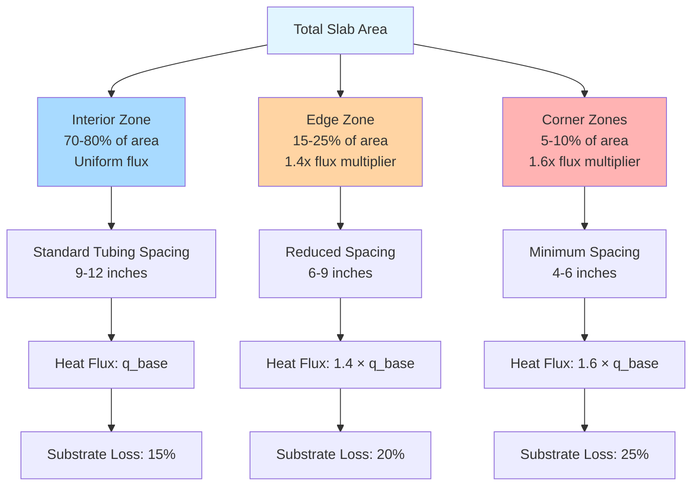

## Physical Principles of Area-Based Heat Loss

Snow melting system performance depends critically on the geometric relationship between heated area and thermal boundary conditions. Heat transfer occurs through three distinct mechanisms: conductive losses to the substrate and ground, convective losses to ambient air at exposed surfaces, and radiative exchange with the sky. The total thermal load scales proportionally with surface area, but edge effects introduce non-uniformities that require specific design accommodation.

The fundamental heat balance for a snow melting slab:

$$Q_{total} = Q_{snow} + Q_{conv} + Q_{rad} + Q_{edge} + Q_{ground}$$

Where edge losses represent 15-40% of total thermal demand depending on slab geometry and insulation configuration.

## Total Slab Area Calculation

The gross heated area defines the primary thermal load and tubing/cable length requirements. For rectangular slabs:

$$A_{slab} = L \times W$$

For irregular geometries, decompose into regular sections:

$$A_{total} = \sum_{i=1}^{n} A_i$$

Where $A_i$ represents each polygonal section. Use CAD measurement tools or coordinate geometry for complex shapes:

$$A_{polygon} = \frac{1}{2} \left| \sum_{i=0}^{n-1} (x_i y_{i+1} - x_{i+1} y_i) \right|$$

**Critical consideration:** Total area directly determines:
- Required heating capacity (BTU/hr)
- Tubing/cable length (linear feet)
- Circulator sizing (GPM flow rate)
- Electrical service capacity (kW)

## Free Area vs. Total Area Ratio

The free area ratio (FAR) accounts for obstacles, drains, and unheated zones within the slab perimeter:

$$FAR = \frac{A_{free}}{A_{total}} = \frac{A_{total} - A_{obstructions}}{A_{total}}$$

Typical FAR values by application:

| Application Type | Free Area Ratio | Design Impact |
|-----------------|----------------|---------------|
| Open driveways | 0.92 - 0.98 | Minimal deductions |
| Loading docks | 0.85 - 0.92 | Door wells, drains |
| Walkways with trees | 0.75 - 0.85 | Tree wells, planters |
| Complex plazas | 0.65 - 0.80 | Multiple obstacles |

Heat flux calculations use free area for capacity determination:

$$q_{design} = \frac{Q_{total}}{A_{free}}$$

This approach prevents under-heating due to obstructions that reduce effective heated surface.

## Edge Perimeter Length and Thermal Impact

Edge zones experience elevated heat losses due to three-dimensional heat flow paths and reduced insulation effectiveness. The perimeter-to-area ratio governs edge effect magnitude:

$$R_{PA} = \frac{P}{A_{slab}}$$

Higher ratios indicate greater relative edge losses. For rectangular slabs:

$$P = 2(L + W)$$

$$R_{PA} = \frac{2(L + W)}{L \times W}$$

**Edge zone characteristics:**

- Width: typically 12-24 inches from exposed edge
- Heat flux multiplier: 1.3-1.6× interior zones
- Insulation requirement: R-10 to R-20 vertical edge insulation

The edge heat loss coefficient increases inversely with slab size. Small slabs ($A < 200$ ft²) exhibit edge-dominated thermal behavior, while large slabs ($A > 1000$ ft²) approach interior-dominated performance.

## Area Classification by ASHRAE Standards

ASHRAE categorizes snow melting areas based on operational priority and design criteria:

| Classification | Description | Area Ratio | Design Heat Flux |
|---------------|-------------|-----------|------------------|
| Class I - Critical | Hospitals, fire stations | 1.0 (full coverage) | 200-250 BTU/hr·ft² |
| Class II - Commercial | Retail, offices | 0.8-1.0 | 150-200 BTU/hr·ft² |
| Class III - Residential | Driveways, walks | 0.5-0.8 | 100-150 BTU/hr·ft² |

Area ratio represents the fraction of available space requiring active heating. Class I systems heat 100% of critical surfaces, while Class III may employ selective heating of traffic lanes only.

## Heat Flux Distribution Patterns

Heat delivery varies spatially across the slab due to tubing spacing, edge effects, and thermal diffusion through concrete:

## Effective Heated Area Calculation

The thermally effective area accounts for heat spreading through concrete thermal conductivity. For embedded tubing systems:

$$A_{eff} = n \times L_{tube} \times W_{eff}$$

Where:
- $n$ = number of tubing circuits
- $L_{tube}$ = circuit length (ft)
- $W_{eff}$ = effective heating width per tube

Effective width depends on tubing depth and spacing:

$$W_{eff} = S \times \eta_{spread}$$

Where $S$ is tubing on-center spacing and $\eta_{spread}$ is the thermal spreading efficiency (0.85-0.95 for properly designed systems).

For $S = 12$ inches and $\eta_{spread} = 0.90$:

$$W_{eff} = 12 \times 0.90 = 10.8 \text{ inches}$$

## Design Methodology for Area Determination

**Step 1:** Measure gross slab dimensions
- Use as-built drawings or field measurements
- Include all heated surfaces

**Step 2:** Identify and quantify obstructions
- Calculate obstruction areas
- Determine free area ratio

**Step 3:** Calculate perimeter length
- Include all exposed edges
- Exclude edges against heated structures

**Step 4:** Classify edge zones
- Mark 12-24 inch edge bands
- Calculate edge area percentage

**Step 5:** Apply ASHRAE classification
- Determine operational requirements
- Select appropriate area ratio

**Step 6:** Calculate effective heated area
- Apply free area ratio
- Account for thermal spreading

The resulting effective area drives all downstream calculations including heat flux requirements, tubing layout, and system capacity sizing.

## Practical Area Considerations

**Thermal bridges:** Structural penetrations, embedded metals, and construction joints create localized high-loss areas requiring additional heating capacity. Add 5-10% to calculated area for thermal bridge compensation.

**Drainage slopes:** Slabs with significant slope (>2%) exhibit asymmetric snow accumulation patterns. Orient tubing perpendicular to slope direction for uniform melting performance.

**Adjacent structures:** Unheated walls and structures within 3 feet of the slab edge increase convective losses by 20-30%. Extend heated area or increase edge zone flux accordingly.

**Future expansion:** Design tubing manifolds and heat sources for 20-30% future area expansion to accommodate site development without complete system replacement.

Accurate area determination forms the foundation of reliable snow melting system design. Edge effects, obstructions, and thermal spreading must all factor into effective area calculations to ensure adequate heating capacity across all slab zones.
