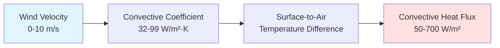
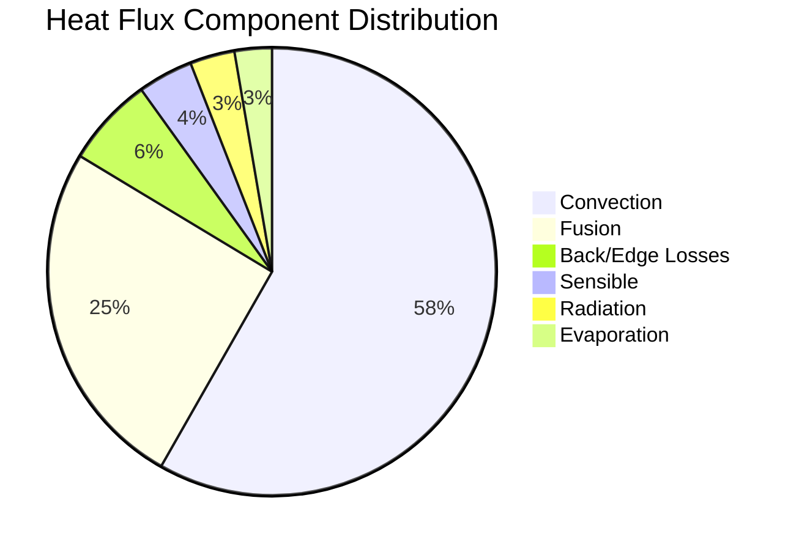

The ASHRAE load calculation methodology for snow melting systems quantifies the total heat flux required to melt snow at a specified rate while overcoming all simultaneous heat losses. This physics-based approach accounts for multiple energy transfer mechanisms and provides the foundation for accurate system sizing across all climate zones.

## Fundamental Heat Transfer Components

The total required heat flux represents the summation of six distinct thermal loads, each governed by specific physical principles:

$$q_{total} = q_{sensible} + q_{fusion} + q_{evap} + q_{conv} + q_{rad} + q_{back}$$

Where all terms are expressed in W/m² (or Btu/hr·ft² in IP units). Each component addresses a specific energy transfer mechanism essential to maintaining a snow-free surface.

## Sensible Heat for Snow Temperature Rise

Snow arrives at the pavement surface at ambient air temperature, which ranges from -20°C to 0°C (-4°F to 32°F) during precipitation events. Sensible heat raises the snow temperature from ambient to 0°C (32°F), the melting point.

The sensible heat requirement follows the fundamental relationship:

$$q_{sensible} = \dot{m}_{snow} \cdot c_{p,snow} \cdot \Delta T$$

For practical snow melting calculations:

$$q_{sensible} = s \cdot \rho_{snow} \cdot c_{p,snow} \cdot (0 - T_{air})$$

Where:
- $s$ = snowfall rate (m/hr or in/hr)
- $\rho_{snow}$ = snow density (50-150 kg/m³ or 3-9 lb/ft³)
- $c_{p,snow}$ = specific heat of snow (2.09 kJ/kg·K or 0.5 Btu/lb·°F)
- $T_{air}$ = ambient air temperature (°C or °F)

**Example Calculation:**

For design conditions: $s$ = 25 mm/hr (1 in/hr), $\rho_{snow}$ = 100 kg/m³, $T_{air}$ = -10°C (14°F)

$$q_{sensible} = 0.025 \text{ m/hr} \times 100 \text{ kg/m}^3 \times 2.09 \text{ kJ/kg·K} \times 10 \text{ K}$$
$$q_{sensible} = 52.25 \text{ kJ/hr·m}^2 = 14.5 \text{ W/m}^2 \text{ (4.6 Btu/hr·ft}^2\text{)}$$

The sensible heat component typically represents 5-10% of total heat flux requirements under moderate conditions but increases significantly during extreme cold events.

## Latent Heat of Fusion for Phase Change

The latent heat of fusion constitutes the dominant thermal load, representing the energy required to convert ice at 0°C to liquid water at 0°C without temperature change. This phase transition requires 334 kJ/kg (144 Btu/lb), substantially more energy than the sensible heating component.

The fusion heat requirement scales linearly with snowfall rate:

$$q_{fusion} = s \cdot \rho_{snow} \cdot h_{fg}$$

Where:
- $h_{fg}$ = latent heat of fusion = 334 kJ/kg (144 Btu/lb)

**Standard Design Values:**

| Snowfall Rate | Snow Density | Mass Flux | Fusion Heat Flux |
|---------------|--------------|-----------|------------------|
| 0.5 in/hr (12.7 mm/hr) | 100 kg/m³ | 1.27 kg/hr·m² | 118 W/m² (37 Btu/hr·ft²) |
| 1.0 in/hr (25.4 mm/hr) | 100 kg/m³ | 2.54 kg/hr·m² | 236 W/m² (75 Btu/hr·ft²) |
| 1.5 in/hr (38.1 mm/hr) | 100 kg/m³ | 3.81 kg/hr·m² | 354 W/m² (112 Btu/hr·ft²) |
| 2.0 in/hr (50.8 mm/hr) | 100 kg/m³ | 5.08 kg/hr·m² | 471 W/m² (150 Btu/hr·ft²) |

ASHRAE recommends 1.0 in/hr as the standard design snowfall rate for moderate climates, 1.5 in/hr for heavy snowfall regions, and 2.0 in/hr for extreme conditions. This component alone accounts for 40-60% of total system capacity.

## Evaporation Heat Loss

After snow melts, liquid water on the pavement surface evaporates into the air stream, consuming significant latent heat. The evaporation rate depends on surface temperature, air temperature, relative humidity, and wind velocity.

ASHRAE provides an empirical correlation for evaporation heat flux:

$$q_{evap} = h_{fg,water} \cdot \dot{m}_{evap}$$

The mass evaporation rate follows:

$$\dot{m}_{evap} = h_{m} \cdot A \cdot (P_{sat,surface} - P_{vapor,air})$$

Where:
- $h_{m}$ = mass transfer coefficient (function of wind speed)
- $P_{sat,surface}$ = saturation vapor pressure at surface temperature
- $P_{vapor,air}$ = partial pressure of water vapor in ambient air

For practical design, ASHRAE recommends a simplified approach:

$$q_{evap} = 0.0013 \cdot V_{wind} \cdot (P_{sat} - P_{air})$$

Where $V_{wind}$ is in mph and pressures in inches Hg, yielding $q_{evap}$ in Btu/hr·ft².

**Typical Design Values:**

At surface temperature 2°C (35°F), air temperature 0°C (32°F), 80% RH, and 15 mph wind:
- $P_{sat}$ = 0.225 in Hg
- $P_{air}$ = 0.80 × 0.181 = 0.145 in Hg
- $q_{evap}$ = 0.0013 × 15 × (0.225 - 0.145) = 0.0016 Btu/hr·ft² per mph·in Hg
- Total evaporation flux: 20-40 W/m² (6-13 Btu/hr·ft²)

This component represents 8-15% of total heat flux and increases dramatically with wind velocity and low humidity conditions.

## Convective Heat Loss

Forced convection from wind flow across the pavement surface transfers heat from the warm surface to cold ambient air. This represents the largest continuous heat loss during system operation.

The convective heat transfer rate follows Newton's law of cooling:

$$q_{conv} = h_{conv} \cdot (T_{surface} - T_{air})$$

The convective heat transfer coefficient depends strongly on wind velocity:

$$h_{conv} = 5.7 + 3.8 \cdot V_{wind}$$

In SI units (W/m²·K with $V_{wind}$ in m/s):

$$h_{conv} = 32.4 + 6.7 \cdot V_{wind}$$

**Example Calculation:**

For $T_{surface}$ = 2°C (35°F), $T_{air}$ = -5°C (23°F), $V_{wind}$ = 6.7 m/s (15 mph):

$$h_{conv} = 32.4 + 6.7 \times 6.7 = 77.3 \text{ W/m}^2\text{·K}$$
$$q_{conv} = 77.3 \times (2 - (-5)) = 541 \text{ W/m}^2 \text{ (172 Btu/hr·ft}^2\text{)}$$

Wind velocity exhibits the strongest influence on total heat flux requirements. Each 1 m/s (2.2 mph) increase in wind speed raises heat flux by approximately 45-50 W/m² (14-16 Btu/hr·ft²).

## Radiative Heat Loss

Thermal radiation from the pavement surface to the sky constitutes a secondary but significant heat loss mechanism, particularly during clear nights when the effective sky temperature drops well below air temperature.

The radiative heat transfer follows the Stefan-Boltzmann law:

$$q_{rad} = \epsilon \cdot \sigma \cdot F_{view} \cdot (T_{surface}^4 - T_{sky}^4)$$

Where:
- $\epsilon$ = surface emissivity (0.85-0.95 for concrete/asphalt)
- $\sigma$ = Stefan-Boltzmann constant (5.67 × 10⁻⁸ W/m²·K⁴)
- $F_{view}$ = view factor to sky (0.5-1.0 depending on surroundings)
- Temperatures in absolute units (K or R)

For small temperature differences, this linearizes to:

$$q_{rad} = h_{rad} \cdot (T_{surface} - T_{sky})$$

Where $h_{rad}$ = 4·$\epsilon$·$\sigma$·$T_{mean}^3$ ≈ 5-7 W/m²·K for typical conditions.

**Design Approach:**

ASHRAE recommends using an effective sky temperature:

$$T_{sky} = T_{air} - \Delta T_{sky}$$

Where $\Delta T_{sky}$ = 6-11°C (10-20°F) for clear sky, 0-3°C (0-5°F) for overcast conditions.

Under typical design conditions (clear sky, overcast during snowfall):
$$q_{rad} = 20-40 \text{ W/m}^2 \text{ (6-13 Btu/hr·ft}^2\text{)}$$

This represents 5-10% of total heat flux under standard design conditions.

## Design Snowfall Rate Selection

The design snowfall rate determines the capacity of the melting system and directly impacts both capital cost and operational performance. ASHRAE provides climate-specific guidance based on meteorological data analysis.

**ASHRAE Design Criteria:**

| Climate Classification | 99% Snowfall Rate | 95% Snowfall Rate | Recommended Design |
|------------------------|-------------------|-------------------|-------------------|
| Light snow regions | 0.3 in/hr | 0.5 in/hr | 0.5 in/hr |
| Moderate snow regions | 0.7 in/hr | 1.0 in/hr | 1.0 in/hr |
| Heavy snow regions | 1.2 in/hr | 1.5 in/hr | 1.5 in/hr |
| Extreme snow regions | 1.5 in/hr | 2.0 in/hr | 2.0 in/hr |

The 99% snowfall rate indicates that only 1% of recorded snowfall events exceed this intensity. Systems designed to this criterion maintain snow-free performance during 99% of events but may exhibit temporary accumulation during the most severe 1% of storms.

## Comprehensive Load Calculation Example

**Design Conditions:**
- Location: Chicago, IL (moderate snow region)
- Snowfall rate: 1.0 in/hr (25.4 mm/hr)
- Snow density: 100 kg/m³
- Air temperature: -5°C (23°F)
- Wind velocity: 6.7 m/s (15 mph)
- Relative humidity: 80%
- Surface temperature: 2°C (35°F)
- Sky conditions: Overcast

**Component Calculations:**

1. Sensible heat:
   - $q_{sensible}$ = 0.0254 × 100 × 2.09 × 7 = 37.1 W/m² (11.8 Btu/hr·ft²)

2. Latent heat of fusion:
   - $q_{fusion}$ = 0.0254 × 100 × 334 = 236 W/m² (74.8 Btu/hr·ft²)

3. Evaporation:
   - $q_{evap}$ = 25 W/m² (7.9 Btu/hr·ft²) from empirical correlation

4. Convection:
   - $h_{conv}$ = 32.4 + 6.7 × 6.7 = 77.3 W/m²·K
   - $q_{conv}$ = 77.3 × 7 = 541 W/m² (171.5 Btu/hr·ft²)

5. Radiation:
   - $T_{sky}$ = -5 - 2 = -7°C (overcast, small correction)
   - $q_{rad}$ = 30 W/m² (9.5 Btu/hr·ft²)

6. Back/edge losses (10% of surface losses):
   - $q_{back}$ = 60 W/m² (19.0 Btu/hr·ft²)

**Total Required Heat Flux:**
$$q_{total} = 37 + 236 + 25 + 541 + 30 + 60 = 929 \text{ W/m}^2 \text{ (294 Btu/hr·ft}^2\text{)}$$

This falls within the ASHRAE Class III (heavy duty) range, appropriate for critical access areas in this climate.

## Back and Edge Heat Losses

Beyond surface losses, snow melting slabs experience downward conduction through the pavement structure and lateral conduction to unheated perimeter zones.

**Downward Losses:**

$$q_{back} = \frac{T_{surface} - T_{ground}}{R_{total}}$$

Where $R_{total}$ includes pavement and soil thermal resistances. Insulation below the slab (R-10 minimum, R-15 preferred) reduces this loss from 80-100 W/m² to 20-30 W/m² (25-32 to 6-10 Btu/hr·ft²).

**Edge Losses:**

Perimeter zones lose heat laterally to adjacent unheated surfaces. ASHRAE recommends increasing edge zone heat flux by 25-50% over interior zones, accomplished through:
- Reduced tube/cable spacing (67-75% of interior spacing)
- Increased fluid temperature (+5-10°C)
- Vertical edge insulation extending 0.6 m (24 in) below grade

## Reference Standards

Complete design procedures and climate-specific data appear in:
- **ASHRAE Handbook—HVAC Applications, Chapter 51: Snow Melting and Freeze Protection**
- **ASHRAE Snow Melting Design Guide** (provides worked examples and load calculation worksheets)

These references include detailed psychrometric relationships, wind speed correlations, and regional snowfall intensity data essential for accurate system sizing across all North American climate zones.
