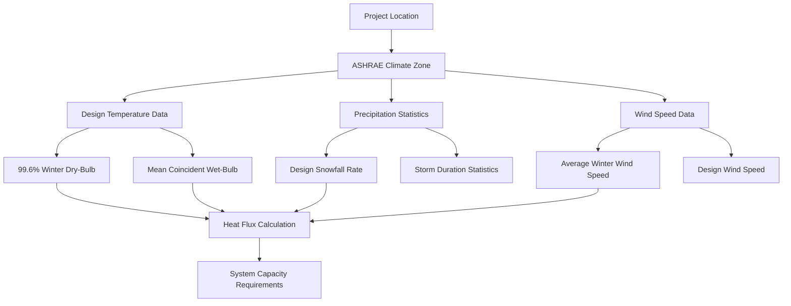

Climate conditions govern the thermal performance requirements of snow melting systems through direct influence on heat transfer mechanisms. The fundamental energy balance at the pavement surface depends on air temperature, wind velocity, precipitation characteristics, and atmospheric moisture content. ASHRAE provides comprehensive geographic climate data to establish design parameters for reliable system sizing.

## Fundamental Climate Parameters

Snow melting system design requires quantification of five primary meteorological variables that control surface heat transfer rates.

**Design Ambient Temperature**
The design air temperature establishes the baseline for sensible heat loss calculations. Lower temperatures increase the thermal gradient between the heated pavement surface (typically maintained at 33-40°F during operation) and surrounding air, directly increasing convective and radiative losses.

ASHRAE recommends using the 99.6% winter design dry-bulb temperature for the project location, representing conditions exceeded only 0.4% of winter hours. This conservative approach ensures adequate capacity during severe weather events when system operation is most critical.

**Design Wind Speed**
Wind velocity determines the convective heat transfer coefficient at the pavement surface. Higher wind speeds increase boundary layer turbulence, enhancing heat removal and proportionally increasing the required system capacity.

Standard design wind speeds range from 10-15 mph for most locations, though exposed sites such as rooftops, parking structures, or coastal areas may require consideration of 20-25 mph sustained winds. Wind speed effects dominate the overall heat flux requirement in many climates.

**Design Snowfall Rate**
The precipitation intensity directly determines the latent heat of fusion component. Snow accumulation rate is measured in inches per hour of water equivalent, which accounts for snow density variations.

Geographic locations exhibit characteristic storm patterns with typical maximum intensities ranging from 0.5 to 2.0 inches per hour for design purposes.

**Relative Humidity**
Atmospheric moisture content influences evaporative heat loss from the wetted pavement surface. Higher humidity reduces the vapor pressure gradient between the liquid film and ambient air, decreasing evaporation rates and correspondingly reducing the evaporative component of total heat flux.

**Solar Radiation**
Incident solar energy provides a beneficial heat gain that partially offsets system requirements during daylight hours. However, conservative design practice typically neglects solar contribution due to its intermittent and unpredictable nature during winter storm conditions.

## Heat Transfer Mechanisms

Climate parameters influence three distinct heat transfer modes at the pavement surface.

**Convective Heat Loss**
Forced convection driven by wind removes sensible heat from the pavement. The convective heat flux follows:

$q_{conv} = h_c \cdot (T_s - T_a)$

Where:
- $q_{conv}$ = Convective heat flux (Btu/hr·ft²)
- $h_c$ = Convective heat transfer coefficient (Btu/hr·ft²·°F)
- $T_s$ = Surface temperature (°F)
- $T_a$ = Ambient air temperature (°F)

The convective coefficient increases with wind speed according to empirical correlations. For pavement surfaces exposed to wind:

$h_c = 0.7 + 0.78 \cdot V$

Where $V$ = wind velocity (mph). At 15 mph wind speed, the convective coefficient reaches approximately 12.4 Btu/hr·ft²·°F.

**Radiative Heat Loss**
Long-wave thermal radiation between the pavement surface and the sky dome removes additional sensible heat. The radiative component follows the Stefan-Boltzmann relationship, linearized for typical temperature ranges:

$q_{rad} = h_r \cdot (T_s - T_{sky})$

Where:
- $q_{rad}$ = Radiative heat flux (Btu/hr·ft²)
- $h_r$ = Radiative heat transfer coefficient, typically 0.8-1.2 Btu/hr·ft²·°F
- $T_{sky}$ = Effective sky temperature (°F)

Cloud cover during snowfall reduces the sky temperature depression, slightly decreasing radiative losses compared to clear-sky conditions.

**Evaporative Heat Loss**
Conversion of melted snow to water vapor removes latent heat of vaporization. The evaporative flux depends on the vapor pressure difference:

$q_{evap} = h_m \cdot (P_{sat} - P_{amb}) \cdot h_{fg}$

Where:
- $q_{evap}$ = Evaporative heat flux (Btu/hr·ft²)
- $h_m$ = Mass transfer coefficient (function of wind speed)
- $P_{sat}$ = Saturation vapor pressure at surface temperature
- $P_{amb}$ = Ambient vapor pressure (function of relative humidity)
- $h_{fg}$ = Latent heat of vaporization, 1,060 Btu/lb

High wind speeds increase the mass transfer coefficient, while high relative humidity decreases the vapor pressure driving force. These effects partially offset each other under typical storm conditions.

## Geographic Climate Data

ASHRAE provides comprehensive design climate data organized by location, enabling site-specific system sizing.

**Climate Zone Classification**
ASHRAE divides North America into climate zones based on heating degree days and precipitation patterns. Snow melting system requirements vary significantly across zones:

| Climate Zone | Representative City | 99.6% Design Temp | Design Snowfall | Design Wind Speed |
|--------------|-------------------|-------------------|-----------------|-------------------|
| 6A - Cold Humid | Minneapolis, MN | -16°F | 1.5 in/hr | 12 mph |
| 5A - Cool Humid | Chicago, IL | -7°F | 1.0 in/hr | 11 mph |
| 5B - Cool Dry | Denver, CO | -2°F | 1.2 in/hr | 9 mph |
| 4A - Mixed Humid | New York, NY | 15°F | 0.8 in/hr | 15 mph |
| 7 - Very Cold | Duluth, MN | -20°F | 1.8 in/hr | 13 mph |

**Design Snowfall Rate Selection**
The design precipitation intensity represents the maximum sustained rate during significant storm events. ASHRAE recommendations base this parameter on local climatological data:

- **Light snow regions** (0.5 in/hr): Intermountain areas, southern snow belt
- **Moderate snow regions** (1.0 in/hr): Northern tier states, mountain foothills
- **Heavy snow regions** (1.5 in/hr): Great Lakes snow belt, Rockies
- **Extreme snow regions** (2.0 in/hr): Sierra Nevada, Cascade Range

Each 0.5 in/hr increment in design snowfall rate increases the heat of fusion component by 72 Btu/hr·ft², directly scaling system capacity requirements.

**Wind Speed Considerations**
Local topography, building orientation, and site exposure significantly affect wind speed at the pavement surface. Adjustment factors account for these variations:

- **Sheltered locations**: 0.5-0.7 × airport wind data
- **Typical urban sites**: 0.7-0.9 × airport wind data
- **Open/exposed sites**: 1.0-1.2 × airport wind data
- **Elevated/rooftop**: 1.2-1.5 × airport wind data

The wind speed component dominates total heat flux in many climates. Proper site assessment prevents undersizing in exposed locations or over-design in sheltered areas.

## Integrated Climate Effects

The total heat flux requirement combines all climate-driven components:

$q_s = q_m + q_{conv} + q_{rad} + q_{evap}$

Where:
- $q_s$ = Total system heat flux (Btu/hr·ft²)
- $q_m$ = Heat of fusion for snow melting (144 Btu/hr·ft² per in/hr)
- $q_{conv}$ = Convective heat loss
- $q_{rad}$ = Radiative heat loss
- $q_{evap}$ = Evaporative heat loss

Substituting the detailed expressions yields the complete ASHRAE design equation:

$q_s = 144 \cdot s + h_c \cdot (T_s - T_a) + h_r \cdot (T_s - T_{sky}) + h_m \cdot (P_{sat} - P_{amb}) \cdot h_{fg}$

Where $s$ = snowfall rate (in/hr).

**Example Calculation: Chicago, IL**
Design conditions:
- Air temperature: 10°F
- Surface temperature: 35°F
- Snowfall rate: 1.0 in/hr
- Wind speed: 12 mph
- Relative humidity: 80%

Heat flux components:
- Heat of fusion: $q_m = 144 \times 1.0 = 144$ Btu/hr·ft²
- Convective loss: $q_{conv} = (0.7 + 0.78 \times 12) \times (35 - 10) = 257$ Btu/hr·ft²
- Radiative loss: $q_{rad} = 1.0 \times (35 - 5) = 30$ Btu/hr·ft²
- Evaporative loss: $q_{evap} \approx 25$ Btu/hr·ft² (reduced by high RH)

Total required heat flux: $q_s = 144 + 257 + 30 + 25 = 456$ Btu/hr·ft²

This calculation demonstrates that convective losses exceed the melting component under high wind conditions, emphasizing the importance of accurate wind speed assessment.

## Seasonal Climate Variation

While design calculations use peak conditions, actual operational requirements vary throughout the winter season based on real-time weather.

**Early/Late Season**
Milder temperatures (25-32°F) and lower snowfall rates (0.3-0.6 in/hr) reduce heat flux requirements by 40-60% compared to design conditions. Systems operate efficiently at reduced capacity during these periods.

**Mid-Winter Peak**
Design conditions occur during the coldest months with maximum snowfall intensity. Systems must deliver full rated capacity to maintain performance specifications.

**Storm Duration Effects**
Extended precipitation events (6+ hours) allow slab thermal equilibrium, while brief snow squalls may clear before the slab fully warms. Control strategies should account for storm duration forecasts to optimize energy consumption.

## Climate Change Considerations

Long-term climate trends may affect snow melting system design assumptions over typical 25-30 year equipment lifespans.

**Temperature Trends**
Rising winter temperatures reduce heating degree days and sensible heat losses but do not eliminate the need for snow melting systems in traditional snow belt regions. Design should still accommodate historical extreme events.

**Precipitation Pattern Changes**
Some regions experience fewer but more intense snow events, potentially increasing peak instantaneous loads while reducing seasonal operating hours. Design snowfall rates may require upward adjustment in affected areas.

**Geographic Range Shifts**
Marginal snow regions may experience reduced snow frequency, potentially affecting the economic justification for permanent installed systems versus alternative approaches like heated mats or chemical treatment.

## Reference Standards

Climate design data for snow melting systems follows ASHRAE Handbook—Fundamentals, Chapter 14: Climatic Design Information, providing station-specific temperature, wind, and precipitation data. Heat flux calculation procedures reference ASHRAE Handbook—HVAC Applications, Chapter 51: Snow Melting and Freeze Protection.
