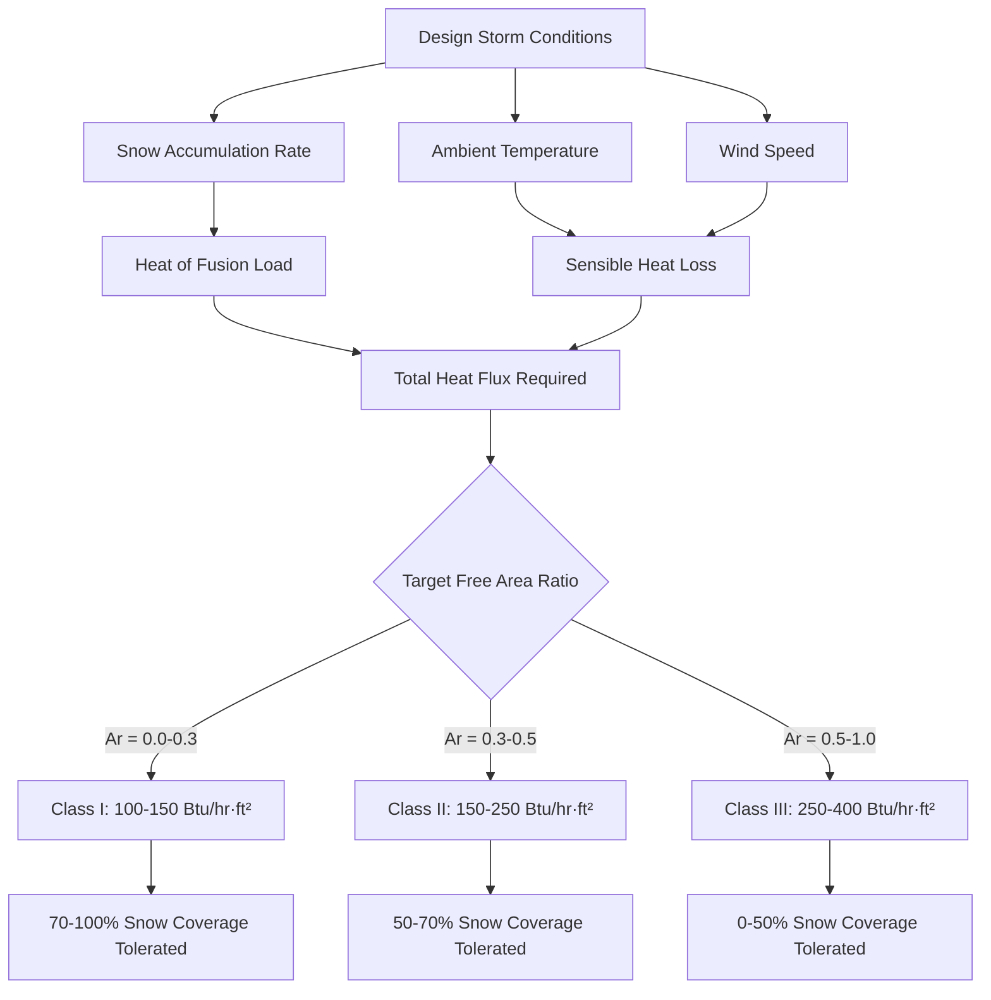

The free area ratio ($A_r$) represents the time-averaged fraction of pavement surface that remains snow-free during a design storm event. This dimensionless parameter serves as the fundamental performance metric for classifying snow melting system capability and directly determines required heat flux capacity.

## Physical Definition of Free Area Ratio

The free area ratio quantifies temporal snow-free performance rather than instantaneous spatial coverage:

$$A_r = \frac{t_{clear}}{t_{total}} = \frac{\text{Duration of clear pavement}}{\text{Total storm duration}}$$

This temporal definition accounts for the dynamic nature of snow accumulation and melting. A system with $A_r = 0.7$ maintains clear pavement 70% of the time during a storm, allowing temporary snow accumulation for 30% of the event duration.

**Relationship to Spatial Coverage:**

While $A_r$ defines temporal performance, the snow-free surface area at any instant follows:

$$A_{clear}(t) = A_r \cdot A_{total} \cdot \eta(t)$$

Where:
- $A_{clear}(t)$ = Instantaneous clear surface area (ft²)
- $A_{total}$ = Total heated pavement area (ft²)
- $\eta(t)$ = Instantaneous efficiency factor (0.85-1.0)

The efficiency factor accounts for non-uniform melting patterns, edge effects, and thermal gradients across the slab surface.

## ASHRAE Classification by Free Area Ratio

ASHRAE Handbook—HVAC Applications establishes three system classes based on free area ratio and corresponding heat flux requirements:

| System Class | Free Area Ratio ($A_r$) | Heat Flux Range | Snow Coverage | Response Time |
|--------------|-------------------------|-----------------|---------------|---------------|
| Class I | 0.0 - 0.3 | 100-150 Btu/hr·ft² | 70-100% visible | > 2 hours |
| Class II | 0.3 - 0.5 | 150-250 Btu/hr·ft² | 50-70% visible | 1-2 hours |
| Class III | 0.5 - 1.0 | 250-400 Btu/hr·ft² | 0-50% visible | < 1 hour |

**Class I Systems** tolerate significant snow accumulation, relying on periodic melting cycles rather than continuous clearing. These systems prioritize capital cost minimization over performance, accepting reduced accessibility during peak snowfall rates.

**Class II Systems** maintain predominantly clear surfaces with intermittent snow patches during heavy precipitation. This intermediate classification balances performance and cost for commercial applications where brief accessibility interruptions are acceptable.

**Class III Systems** deliver continuous snow-free performance throughout design storm conditions. These critical-access systems maintain completely bare, dry pavement by providing heat flux exceeding the maximum rate of snow accumulation and thermal loss.

## Heat Flux Scaling with Free Area Ratio

Required system heat flux scales approximately linearly with target free area ratio:

$$q_s = q_{base} \cdot \left(\frac{A_r - A_{r,min}}{1 - A_{r,min}}\right) + q_{idle}$$

Where:
- $q_s$ = Required system heat flux (Btu/hr·ft²)
- $q_{base}$ = Base heat flux for complete clearing (300-350 Btu/hr·ft²)
- $A_{r,min}$ = Minimum achievable ratio without active heating (≈0.05)
- $q_{idle}$ = Idling mode heat flux (20-50 Btu/hr·ft²)

This relationship demonstrates that achieving $A_r = 1.0$ (100% snow-free) requires approximately 3-4 times the heat flux of $A_r = 0.3$ (30% snow-free), directly impacting equipment sizing and energy consumption.

## Snow Accumulation Tolerance Analysis

Snow accumulation tolerance inversely correlates with free area ratio, defining the maximum allowable snow depth before system performance degrades:

$$d_{max} = \frac{(q_s - q_{loss}) \cdot t_{response}}{144 \cdot \rho_{snow} \cdot (H_f + c_p \cdot \Delta T)}$$

Where:
- $d_{max}$ = Maximum tolerable snow depth (inches)
- $q_s$ = Installed heat flux capacity (Btu/hr·ft²)
- $q_{loss}$ = Heat loss to ambient (Btu/hr·ft²)
- $t_{response}$ = System warm-up time (hours)
- $\rho_{snow}$ = Snow density (typically 6-8 lb/ft³ for fresh snow)
- $H_f$ = Heat of fusion for ice (144 Btu/lb)
- $c_p$ = Specific heat of snow (0.5 Btu/lb·°F)
- $\Delta T$ = Temperature rise required (°F)

**Practical Accumulation Limits:**

| Free Area Ratio | Typical Max Depth | Recovery Time | Operational Mode |
|-----------------|-------------------|---------------|------------------|
| $A_r$ = 0.1 | 3-4 inches | 4-6 hours | Periodic activation |
| $A_r$ = 0.4 | 1-2 inches | 2-3 hours | Intermittent operation |
| $A_r$ = 0.8 | 0.25-0.5 inches | 30-60 minutes | Continuous operation |
| $A_r$ = 1.0 | 0 inches | < 15 minutes | Pre-storm activation |

Class I systems with low free area ratios tolerate substantial accumulation but require extended recovery periods. Class III systems prevent accumulation entirely through anticipatory control and continuous high heat flux delivery.

## Design Criteria Selection Process

Selecting appropriate free area ratio involves balancing performance requirements against capital and operating costs:

**Step 1: Application Priority Assessment**

Determine consequence of temporary snow cover:
- **Critical Access**: Hospital emergency entrances, fire station aprons → $A_r$ ≥ 0.8
- **High Traffic**: Commercial building entrances, retail walkways → $A_r$ = 0.4-0.6
- **Standard Access**: Residential driveways, secondary walkways → $A_r$ = 0.1-0.3
- **Supplemental**: Overflow parking, storage areas → $A_r$ < 0.2

**Step 2: Climate Severity Analysis**

Evaluate design storm characteristics:
- Snowfall rate exceeding 1.5 in/hr requires $A_r$ ≥ 0.5 for reasonable performance
- Wind speeds above 15 mph increase required heat flux by 30-40% for given $A_r$
- Ambient temperatures below 10°F necessitate Class II minimum ($A_r$ ≥ 0.3)

**Step 3: Economic Analysis**

Calculate life-cycle cost including capital, energy, and maintenance:

$$LCC = C_{install} + \sum_{y=1}^{L} \frac{C_{energy,y} + C_{maint,y}}{(1+r)^y}$$

Where:
- $LCC$ = Life-cycle cost ($)
- $C_{install}$ = Initial installation cost (scales with $A_r^{1.2}$)
- $C_{energy,y}$ = Annual energy cost (scales with $A_r^{1.5}$)
- $C_{maint,y}$ = Annual maintenance cost
- $r$ = Discount rate
- $L$ = System lifetime (20-30 years)

Higher free area ratios yield diminishing returns beyond $A_r$ = 0.6-0.7 for most applications. The exponential increase in installed capacity and energy consumption rarely justifies marginal performance gains unless application criticality demands absolute snow-free assurance.

## Partial Coverage System Design

Many applications employ partial coverage strategies where only critical paths receive active heating:

**Approach Ratio:**

$$R_{approach} = \frac{A_{heated}}{A_{total}} = \frac{\text{Heated pavement area}}{\text{Total pavement area}}$$

Combined with free area ratio:

$$A_{r,effective} = A_r \cdot R_{approach}$$

For example, heating only a 4-foot-wide walkway centerline through an 8-foot-wide path creates $R_{approach}$ = 0.5. Achieving $A_{r,effective}$ = 0.4 (40% total path snow-free) requires $A_r$ = 0.8 for the heated portion alone.

**Strategic Partial Coverage:**

- **Center Strip Heating**: Heats 40-60% of width, allows snow to melt laterally
- **Wheel Track Heating**: Targets vehicle tire paths for driveways (30-40% coverage)
- **Edge Heating**: Prevents ice dam formation at drainage points (20-30% coverage)

Partial coverage reduces capital and operating costs by 40-70% while maintaining functional accessibility through strategically cleared paths.

## Active Melting Mode Requirements

Achieving target free area ratio during active snowfall requires maintaining surface temperature above the melting point plus accounting for evaporation:

$$T_{surface} = T_{melt} + \Delta T_{margin} = 32°F + (3-5°F)$$

The margin above freezing prevents refreezing and accelerates runoff. Required heat flux to maintain this surface temperature:

$$q_s = \frac{s \cdot H_f}{A_r} + h_c \cdot (T_{surface} - T_{air}) + h_{evap} + q_{down}$$

Where:
- $s$ = Design snowfall rate (in/hr)
- $H_f$ = Heat of fusion constant (144 Btu/hr·ft² per in/hr)
- $h_c$ = Convective heat transfer coefficient (3-5 Btu/hr·ft²·°F per mph wind)
- $h_{evap}$ = Evaporative heat loss (40-80 Btu/hr·ft²)
- $q_{down}$ = Downward conduction loss (10-30 Btu/hr·ft²)

The denominator $A_r$ indicates that lower free area ratios permit reduced heat flux because temporary snow cover acts as insulation, reducing convective and radiative losses during accumulation periods.

## Wind Effects on Coverage Percentage

Wind velocity substantially impacts achievable free area ratio for given heat flux:

$$A_{r,wind} = A_{r,calm} \cdot \exp\left(-\frac{v_{wind} - v_{ref}}{v_{scale}}\right)$$

Where:
- $A_{r,wind}$ = Free area ratio with wind
- $A_{r,calm}$ = Free area ratio in calm conditions
- $v_{wind}$ = Actual wind speed (mph)
- $v_{ref}$ = Reference wind speed (typically 5 mph)
- $v_{scale}$ = Wind scaling factor (15-20 mph)

**Wind Impact Example:**

A Class II system designed for $A_r$ = 0.5 at 10 mph wind experiences degradation to $A_r$ = 0.3 when wind increases to 20 mph, effectively reducing performance to Class I levels. Compensation requires increasing heat flux by approximately 50-80 Btu/hr·ft² or accepting reduced snow-free coverage.

## System Response Time Considerations

Free area ratio depends not only on steady-state heat flux but also on system response time from idle to full output:

$$A_r = 1 - \frac{t_{response} \cdot s}{d_{threshold}} \quad \text{(for rapid-onset storms)}$$

Where:
- $t_{response}$ = Time to reach full melting capacity (minutes)
- $s$ = Snowfall rate (in/hr)
- $d_{threshold}$ = Accumulation depth triggering visible coverage (typically 0.25-0.5 inches)

**Response Time by System Type:**

| System Type | Response Time | Impact on $A_r$ | Mitigation Strategy |
|-------------|---------------|-----------------|---------------------|
| Electric cable | 5-15 minutes | Minimal (ΔAr ≈ 0.02) | None required |
| Hydronic (idling) | 20-40 minutes | Moderate (ΔAr ≈ 0.1-0.15) | Maintain slab at 35-40°F |
| Hydronic (cold start) | 60-120 minutes | Severe (ΔAr ≈ 0.3-0.4) | Weather prediction activation |

Hydronic systems achieve specified free area ratio only when maintained in idling mode. Cold-start activation results in 30-40% reduction in effective $A_r$ during the warm-up period.

## Reference Standards

Design methodology follows ASHRAE Handbook—HVAC Applications, Chapter 51: Snow Melting and Freeze Protection. Free area ratio selection criteria align with ASHRAE performance classification for snow melting system design loads and operational strategies.
