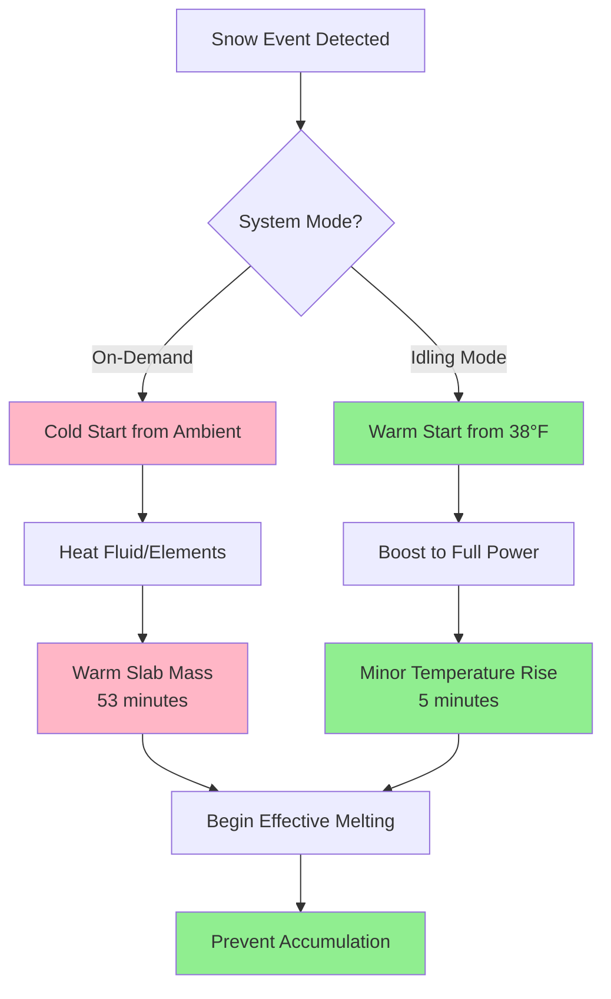
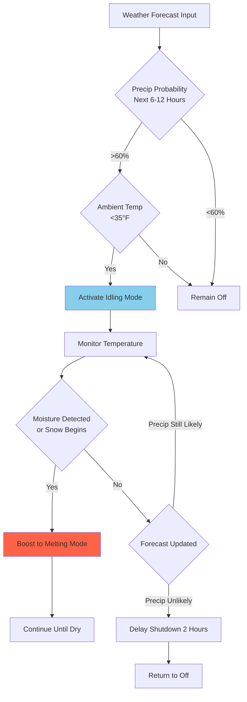
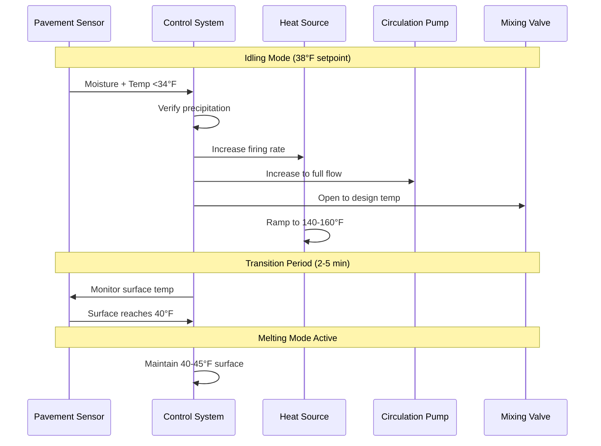

Idling mode represents a reduced-power operational state where snow melting systems maintain slab temperatures above freezing to enable rapid response when precipitation begins. This strategy trades continuous low-level energy consumption for substantially improved system performance and reduced lag time between weather event onset and effective snow clearing.

## Fundamental Principles of Idling Operation

Idling mode maintains the pavement slab at a temperature slightly above the freezing point of water, typically 35-40°F (2-4°C). This pre-conditioning serves two critical functions: preventing ice bond formation between falling snow and the pavement surface, and reducing the thermal inertia that must be overcome when transitioning to full melting mode.

The physics governing idling operation centers on maintaining a positive temperature gradient from the slab surface to the ambient environment while minimizing heat flux requirements. The steady-state heat balance for idling mode is:

$$q_{idle} = h_c(T_s - T_a) + h_r(T_s - T_{sky}) + q_{ground}$$

Where:
- $q_{idle}$ = idling heat flux (Btu/hr·ft²)
- $h_c$ = convective heat transfer coefficient (Btu/hr·ft²·°F)
- $T_s$ = slab surface temperature (°F)
- $T_a$ = ambient air temperature (°F)
- $h_r$ = radiative heat transfer coefficient (Btu/hr·ft²·°F)
- $T_{sky}$ = effective sky temperature (°F)
- $q_{ground}$ = downward conduction loss (Btu/hr·ft²)

For typical winter conditions with wind speeds of 10-15 mph, the combined convective and radiative heat transfer coefficient approximates 5-8 Btu/hr·ft²·°F, yielding idling heat flux requirements of 20-50 Btu/hr·ft² depending on ambient temperature.

## Idling Heat Flux Requirements

Idling heat flux varies with climate conditions and desired standby temperature. The relationship follows a simplified form:

$$q_{idle} = U_{eff}(T_{idle} - T_{design})$$

Where:
- $U_{eff}$ = effective heat loss coefficient (Btu/hr·ft²·°F)
- $T_{idle}$ = target idling temperature (typically 38°F)
- $T_{design}$ = design ambient temperature (°F)

For practical design purposes, idling heat flux requirements by climate zone are:

| Climate Zone | Design Temp (°F) | Idling Flux (Btu/hr·ft²) | % of Full Load |
|--------------|------------------|-------------------------|----------------|
| Mild (25-32°F) | 28 | 20-30 | 20-25% |
| Moderate (15-25°F) | 20 | 30-40 | 25-30% |
| Cold (0-15°F) | 10 | 40-50 | 30-35% |
| Extreme (<0°F) | -5 | 50-60 | 35-40% |

The percentage of full-load capacity required for idling increases in colder climates because the temperature differential between the idling setpoint and ambient conditions grows larger. However, absolute idling flux remains relatively modest compared to melting mode requirements of 150-400 Btu/hr·ft².

## Response Time Benefits

The primary advantage of idling mode is the dramatic reduction in system response time when snow begins falling. Response time comprises two components: the thermal lag in heating the embedded fluid or electric elements, and the thermal mass effect of raising the slab temperature from ambient to effective melting conditions.

**Temperature Rise Time Calculation**

For hydronic systems, the time required to transition from idling to full melting mode is:

$$t_{response} = \frac{m_{slab}c_{concrete}(T_{melt} - T_{idle})}{q_{available} \cdot A}$$

Where:
- $t_{response}$ = time to reach melting mode (hours)
- $m_{slab}$ = slab mass per unit area (lb/ft²)
- $c_{concrete}$ = specific heat of concrete (0.22 Btu/lb·°F)
- $T_{melt}$ = target melting temperature (typically 40-45°F)
- $T_{idle}$ = initial idling temperature (38°F)
- $q_{available}$ = available heating capacity (Btu/hr·ft²)
- $A$ = slab area (ft²)

For a 4-inch concrete slab (50 lb/ft² mass):

**Without Idling (Starting from 20°F):**
$$t_{response} = \frac{50 \times 0.22 \times (40-20)}{250} = 0.88 \text{ hours (53 minutes)}$$

**With Idling (Starting from 38°F):**
$$t_{response} = \frac{50 \times 0.22 \times (40-38)}{250} = 0.09 \text{ hours (5 minutes)}$$

This calculation demonstrates that idling reduces response time by approximately 90%, enabling the system to prevent snow accumulation rather than attempting to melt already-deposited snow.

## Energy Consumption Analysis

Idling mode energy consumption depends on three factors: idling heat flux, operational duration, and frequency of melting events. A comprehensive energy analysis must account for both idling periods and the reduced energy required during the transition to melting mode due to pre-conditioning.

**Seasonal Energy Comparison**

Total seasonal energy consumption comprises idling energy plus melting energy:

$$E_{total} = q_{idle} \cdot A \cdot t_{idle} + q_{melt} \cdot A \cdot t_{melt}$$

Where:
- $E_{total}$ = total seasonal energy (Btu)
- $t_{idle}$ = cumulative idling hours (hours)
- $t_{melt}$ = cumulative melting hours (hours)

For a moderate climate zone (Minneapolis, MN):
- Potential idling hours per season: 2,200 hours (November-March)
- Actual melting hours per season: 150 hours
- Average idling flux: 35 Btu/hr·ft²
- Average melting flux: 225 Btu/hr·ft²

**Idling Strategy Energy:**
$$E_{idle} = 35 \times 2200 = 77,000 \text{ Btu/ft²}$$
$$E_{melt} = 225 \times 150 = 33,750 \text{ Btu/ft²}$$
$$E_{total} = 110,750 \text{ Btu/ft²}$$

**On-Demand Strategy Energy:**
Extended warmup requires higher energy and longer melting periods:
$$E_{melt} = 225 \times 185 = 41,625 \text{ Btu/ft²}$$

The on-demand approach saves approximately 77,000 Btu/ft² in idling energy but incurs an additional 7,875 Btu/ft² in extended melting time and less effective snow control, resulting in net savings of 69,125 Btu/ft² but substantially compromised performance.

**Economic Consideration**

For a 1,000 ft² system operating on natural gas at $1.00/therm (100,000 Btu) with 85% boiler efficiency:

- **Idling cost:** $\frac{77,000 \times 1000}{100,000 \times 0.85} = \$906$ per season
- **Performance benefit:** Prevention of accumulation, liability reduction, reduced manual snow removal

The economic decision depends on the value placed on immediate snow clearing versus energy cost. Class III systems (hospitals, fire stations, critical access) universally employ idling mode. Class II systems use selective idling based on weather forecasts. Class I systems typically operate on-demand only.

## Control Strategies for Idling Mode

Effective idling mode control requires weather-predictive algorithms and temperature-based activation to minimize unnecessary operation while ensuring availability when needed.

### Weather-Predictive Idling

Advanced control systems activate idling mode based on meteorological forecasts indicating precipitation probability within a defined time horizon:

**Forecast-Based Activation Logic:**

This strategy reduces unnecessary idling hours by 30-50% compared to temperature-only activation while maintaining rapid-response capability.

### Slab Temperature Maintenance

Precise temperature control during idling prevents both excessive energy consumption and inadequate pre-conditioning. Proportional-integral (PI) control maintains stable slab temperature:

$$\dot{Q}(t) = K_p(T_{setpoint} - T_{slab}) + K_i \int_0^t (T_{setpoint} - T_{slab}) \, d\tau$$

Where:
- $\dot{Q}(t)$ = heating output (Btu/hr)
- $K_p$ = proportional gain
- $K_i$ = integral gain
- $T_{setpoint}$ = idling temperature target (38°F)
- $T_{slab}$ = measured slab temperature (°F)

Typical PI tuning parameters for snow melting:
- $K_p$ = 50-100 Btu/hr per °F deviation
- $K_i$ = 10-25 Btu/hr per °F·hour

Properly tuned PI control maintains slab temperature within ±1°F of setpoint, preventing temperature oscillations that waste energy through repeated heating and cooling cycles.

### Zone-Based Selective Idling

Large installations benefit from zone-based idling that prioritizes critical access areas while deferring less essential zones to on-demand operation:

| Priority Zone | Description | Idling Strategy | Response Target |
|---------------|-------------|-----------------|-----------------|
| Zone 1 | Critical access (emergency entry) | Continuous idling | <5 minutes |
| Zone 2 | High-traffic (main entrance) | Forecast-based idling | <15 minutes |
| Zone 3 | Moderate-traffic (secondary paths) | On-demand | <45 minutes |
| Zone 4 | Low-priority (remote areas) | Manual activation | Variable |

This tiered approach reduces total idling energy by 40-60% while maintaining rapid response where most critical. The control system activates zones sequentially based on priority when forecast conditions warrant.

## Thermal Mass Effects and Slab Design

Concrete thermal mass significantly influences idling mode energy requirements and response characteristics. Thicker slabs store more thermal energy but require greater heat input to maintain temperature.

**Thermal Mass Calculation**

The volumetric thermal mass per unit area:

$$M_{thermal} = \rho_{concrete} \cdot t_{slab} \cdot c_{concrete}$$

Where:
- $\rho_{concrete}$ = concrete density (145 lb/ft³)
- $t_{slab}$ = slab thickness (ft)
- $c_{concrete}$ = specific heat (0.22 Btu/lb·°F)

| Slab Thickness | Thermal Mass (Btu/ft²·°F) | Idling Stability | Response Time |
|----------------|---------------------------|------------------|---------------|
| 3 inches | 8.0 | Lower (±2°F variation) | Fast (3-4 min) |
| 4 inches | 10.6 | Moderate (±1.5°F) | Moderate (5-6 min) |
| 5 inches | 13.3 | Good (±1°F) | Moderate (7-8 min) |
| 6 inches | 15.9 | Excellent (±0.5°F) | Slower (10-12 min) |

Optimal slab thickness for idling applications balances thermal stability with response time. The 4-5 inch range provides adequate thermal buffering without excessive thermal inertia. Thicker slabs (6+ inches) are appropriate for Class III installations where stability outweighs response speed.

**Insulation Below Slab**

Subslab insulation dramatically reduces idling energy consumption by minimizing downward heat loss. The reduction in idling flux with insulation:

$$q_{idle,insulated} = q_{idle,uninsulated} - \frac{T_{idle} - T_{ground}}{R_{insulation}}$$

For 2-inch rigid XPS insulation (R-10) with ground temperature of 40°F:

$$\Delta q = \frac{38-40}{10} = -0.2 \text{ Btu/hr·ft²}$$

However, the primary benefit occurs during melting mode. During idling, ground temperature often approaches slab temperature, minimizing the benefit. The economic justification for insulation derives primarily from melting mode energy savings of 15-25%.

## Transition from Idling to Melting Mode

The control sequence for transitioning between operational modes must execute smoothly to prevent temperature overshoot, equipment cycling, or delayed response.

**Standard Transition Sequence:**

**Boost Heat Calculation**

The additional heat required to rapidly transition from idling to melting mode:

$$Q_{boost} = m_{slab} \cdot c_{concrete} \cdot (T_{melt} - T_{idle}) + q_{melt} \cdot A \cdot t_{transition}$$

This represents the sum of sensible heat to raise slab temperature plus the heat required to maintain surface conditions during the transition period. For a 1,000 ft² system with 4-inch slab:

$$Q_{boost} = (50 \times 1000) \times 0.22 \times (40-38) + 225 \times 1000 \times 0.08 = 40,000 \text{ Btu}$$

Heat source equipment must provide rated capacity plus this boost requirement to achieve design response time. For hydronic systems, boiler capacity should be:

$$Q_{boiler} \geq q_{melt} \cdot A + \frac{Q_{boost}}{t_{response,target}}$$

Where $t_{response,target}$ is the desired transition time (typically 5-10 minutes = 0.08-0.17 hours).

## Performance Optimization Strategies

Several design and operational strategies optimize idling mode performance while controlling energy consumption.

**Variable Idling Temperature**

Rather than maintaining constant idling temperature, advanced systems modulate setpoint based on forecast probability and time-to-event:

$$T_{idle,variable} = T_{ambient} + \Delta T_{buffer}$$

Where $\Delta T_{buffer}$ increases from 2°F (minimal idling) to 10°F (full pre-conditioning) as snow probability and proximity increase. This reduces average idling energy by 20-30% while maintaining response capability when needed.

**Fluid Temperature Reset**

Hydronic systems employ outdoor air reset during idling to minimize distribution losses:

$$T_{fluid,idle} = T_{slab,target} + \Delta T_{required}$$

Where $\Delta T_{required}$ is the minimum temperature differential needed to deliver idling heat flux, typically 10-20°F. Lower fluid temperatures reduce piping heat loss by 30-50% during extended idling periods.

**Occupancy-Based Activation**

For commercial installations with predictable traffic patterns, occupancy schedules override weather-based idling to ensure cleared surfaces during business hours:

- Night setback: Minimal idling (33°F) or off during 10 PM - 5 AM
- Pre-occupancy warmup: Full idling activation 2 hours before opening
- Business hours: Forecast-based idling with priority override
- Post-occupancy: Continued operation 1 hour after closing, then weather-based only

This approach reduces total idling hours by 15-25% for typical commercial schedules while ensuring cleared access during operational periods.

## Application Recommendations by System Class

Idling strategy selection depends fundamentally on system classification and operational priorities:

**Class I Systems (Residential)**
- Recommendation: On-demand operation only
- Rationale: Energy cost outweighs convenience benefit
- Exception: Elderly or mobility-impaired occupants may justify forecast-based idling

**Class II Systems (Commercial)**
- Recommendation: Forecast-based selective idling
- Rationale: Balance energy cost with liability and operational needs
- Strategy: Activate idling 3-6 hours before predicted precipitation

**Class III Systems (Critical Access)**
- Recommendation: Continuous or minimally-modulated idling
- Rationale: Operational availability requirements supersede energy considerations
- Strategy: Maintain 36-40°F slab temperature throughout winter season

## ASHRAE Design Guidance

ASHRAE Handbook—HVAC Applications Chapter 51 provides limited specific guidance on idling mode, focusing instead on full-load melting requirements. However, the fundamental heat transfer principles and control recommendations apply directly to idling operation.

Key ASHRAE principles relevant to idling:
- Surface temperature must remain above dew point to prevent frost formation
- Control systems should prevent short-cycling (minimum 15-minute run cycles)
- Temperature sensors require calibration accuracy of ±2°F for effective idling control
- Anticipatory control improves performance compared to reactive-only operation

The heat flux equations provided in ASHRAE Chapter 51 can be directly applied to idling mode by substituting reduced temperature differentials and accounting for the absence of melting load components.

## Conclusion

Idling mode operation represents a design choice that trades continuous low-level energy consumption for substantially improved system response time and snow control effectiveness. The decision to implement idling depends on system classification, climate severity, energy costs, and the value placed on immediate snow clearing versus operating economy.

Properly designed and controlled idling systems reduce response time by 85-95% compared to on-demand operation, enabling prevention of snow accumulation rather than reactive melting. The energy penalty of 70,000-90,000 Btu/ft² per season must be weighed against improved safety, reduced liability exposure, and elimination of manual snow clearing during the critical first phase of weather events.

Advanced control strategies including weather-predictive activation, variable idling temperature, and zone-based prioritization can reduce idling energy consumption by 30-60% while maintaining the core benefit of rapid response capability.
