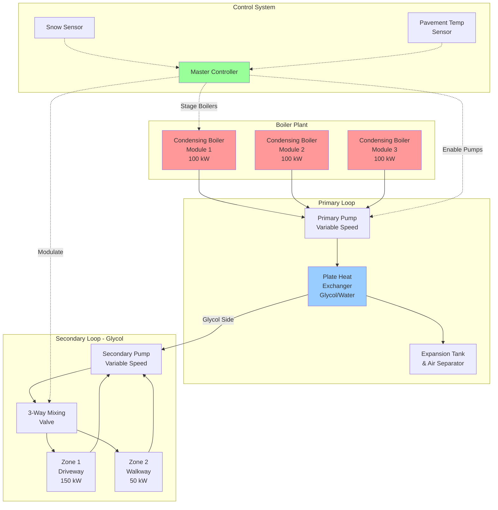

Boilers serve as the primary heat source in most hydronic snow melting systems, converting fuel energy into thermal energy that circulates through embedded piping networks. The selection and sizing of boiler equipment directly impacts system performance, operating cost, and reliability during critical snow events.

## Fundamental Heat Transfer Principles

Snow melting represents a dynamic heat transfer problem involving three simultaneous modes:

**Conduction** through the slab delivers heat from embedded tubing to the surface. The rate follows Fourier's law, where thermal conductivity of concrete (1.4-1.7 W/m·K) and depth of tube burial establish the temperature gradient required.

**Convection** from the surface transfers heat to ambient air and falling snow. The convective heat transfer coefficient varies with wind speed, typically ranging from 15-50 W/m²·K for outdoor conditions. Wind amplifies heat loss significantly.

**Evaporation** of melted snow and standing water consumes substantial energy. The latent heat of vaporization (2257 kJ/kg at 0°C) means evaporative losses often exceed sensible heating requirements during active melting.

**Radiation** exchanges occur between the pavement surface and sky, ground, and surrounding structures. Net radiation can be negative (heat loss) under clear skies or positive under cloud cover.

## Boiler Capacity Sizing

The required boiler capacity for snow melting applications exceeds standard space heating loads by a factor of 5-10. Accurate sizing requires detailed load calculations per ASHRAE standards.

### Heat Flux Requirement

The fundamental equation for required surface heat flux:

$$q_s = q_o + A_R \cdot q_m$$

Where:
- $q_s$ = total surface heat flux requirement (W/m²)
- $q_o$ = heat flux for maintaining bare pavement (idling mode)
- $A_R$ = area ratio (snow-free fraction, typically 1.0 for full melting)
- $q_m$ = additional heat flux for active snow melting

### ASHRAE Snow Melting Load Calculation

The complete heat balance equation accounts for all transfer modes:

$$q_{total} = q_{sensible} + q_{latent} + q_{radiation} + q_{back}$$

**Sensible heat** for snow melting:

$$q_{sensible} = s \cdot c_p \cdot (T_f - T_a)$$

Where:
- $s$ = snowfall rate (kg/m²·h)
- $c_p$ = specific heat of snow/ice (2.1 kJ/kg·K)
- $T_f$ = film temperature at surface (typically 0-2°C)
- $T_a$ = ambient air temperature (°C)

**Latent heat** for melting and evaporation:

$$q_{latent} = s \cdot (h_{fusion} + h_{evap})$$

Where:
- $h_{fusion}$ = heat of fusion (334 kJ/kg)
- $h_{evap}$ = heat of vaporization (2257 kJ/kg)

**Convective heat loss** to air:

$$q_{conv} = h_c \cdot (T_s - T_a)$$

Where:
- $h_c$ = convective heat transfer coefficient (function of wind speed)

**Back losses** through slab:

$$q_{back} = U \cdot (T_f - T_g)$$

Where:
- $U$ = overall heat transfer coefficient through insulation
- $T_g$ = ground temperature below slab

### Total Boiler Output Requirement

$$Q_{boiler} = \frac{A \cdot q_{total}}{\eta_{sys}}$$

Where:
- $A$ = snow melting area (m²)
- $\eta_{sys}$ = overall system efficiency (0.85-0.95)

**Example calculation:** For a 500 m² driveway in climate with 25 mm/h design snowfall rate:

- Design heat flux: 400 W/m² (typical for moderate climates)
- Total thermal load: 500 m² × 400 W/m² = 200 kW
- Required boiler capacity (85% system efficiency): 200 kW / 0.85 = 235 kW (803,000 BTU/h)

## Boiler Types for Snow Melting

| Boiler Type | Thermal Efficiency | Turndown Ratio | Glycol Compatibility | Capital Cost | Best Application |
|-------------|-------------------|----------------|---------------------|--------------|------------------|
| Condensing Gas | 95-98% | 10:1 to 20:1 | Excellent | High | New installations, low return temps |
| Non-Condensing Gas | 80-85% | 4:1 to 5:1 | Good | Medium | Retrofit, higher return temps |
| Oil-Fired | 82-87% | 3:1 to 4:1 | Good | Medium | Areas without gas service |
| Electric Resistance | 99%+ | Infinite | Excellent | Low | Small areas, remote locations |
| Modular Condensing | 95-98% | 20:1+ (staged) | Excellent | High | Large areas, variable loads |

## Dedicated vs. Shared Boiler Plant

**Dedicated snow melt boilers** operate independently from building heating systems. This configuration provides several advantages:

- Independent temperature control (snow melt requires 40-60°C supply vs. 70-85°C for space heating)
- Simplified glycol protection (building systems typically use water)
- Eliminates cross-contamination concerns
- Allows for optimal boiler selection for intermittent, high-load duty cycle

**Shared boiler plants** serve both snow melting and building heating loads through proper hydraulic separation:

- Lower capital cost (single boiler plant)
- Better equipment utilization during shoulder seasons
- Requires heat exchanger to separate glycol and water circuits
- Needs sophisticated controls to prioritize conflicting demands
- May require oversized boiler to handle combined peak loads

## System Configuration

## Modulating Burner Control

Modern condensing boilers employ modulating burners that adjust firing rate to match instantaneous load. This capability proves essential for snow melting applications where load varies dramatically:

**Cold start phase** requires maximum output to warm the slab mass. Thermal inertia of concrete slabs (volumetric heat capacity ≈ 2.4 MJ/m³·K) means significant energy storage.

**Active melting phase** maintains steady output to balance heat losses and melt incoming snow at design rate.

**Idling phase** provides minimal heat input to prevent surface refreezing between snow events. Typical idling loads run 15-25% of peak design.

Turndown ratio defines the range between minimum and maximum firing rates. A 10:1 turndown ratio allows a 300 kW boiler to modulate down to 30 kW, improving efficiency during partial load conditions.

## Condensing Boiler Advantages

Condensing boilers extract latent heat from flue gases by cooling exhaust below the water vapor dew point (≈54°C for natural gas). This process recovers approximately 10% additional energy compared to non-condensing designs.

For snow melting applications, condensing operation occurs reliably because return water temperatures remain low (35-45°C) throughout most of the operating cycle. The supply temperature rarely exceeds 60°C, ensuring continuous condensing mode.

**Efficiency gains** translate to 15-20% reduction in fuel consumption over conventional boilers. For a system with 2000 hours annual runtime and 150 kW average load, this represents 45,000-60,000 kWh saved per season.

## Glycol Compatibility Considerations

All snow melting boilers must accommodate glycol-water mixtures for freeze protection. Key design considerations:

**Heat exchanger materials** must resist glycol corrosion. Stainless steel, copper-nickel alloys, and properly treated carbon steel prove acceptable. Manufacturer approval for glycol service is mandatory.

**Derating factors** account for reduced heat transfer. Propylene glycol at 30% concentration reduces heat transfer coefficient by approximately 15% and requires 15-20% higher flow rates to achieve equivalent heat delivery.

**Temperature limits** restrict glycol solutions. Maximum operating temperature should not exceed 120°C to prevent thermal degradation. Most snow melting systems operate well below this threshold.

**pH monitoring** prevents corrosion. Glycol solutions require inhibitor packages and periodic testing to maintain pH between 8.5-10.5.

## Peak Load and Redundancy

Snow melting systems operate under binary conditions: full load during events or no load between events. This duty cycle differs fundamentally from modulating space heating loads.

**Redundancy considerations** recognize that system failure during snow events creates safety hazards. Options include:

- Modular boiler arrays where loss of one unit reduces capacity but maintains partial operation
- Backup boiler sized for 50-75% of load to maintain critical pathways
- Connection provisions for temporary rental boilers
- Dual fuel capability (gas primary, oil backup)

**Load diversity** rarely applies in snow melting. Unlike building systems where simultaneous peak loads prove unlikely, all snow melting zones activate simultaneously during storm events. Design calculations must assume 100% coincident operation.

## Boiler Efficiency Optimization

Maximizing seasonal efficiency requires attention to both steady-state combustion efficiency and cycling losses:

**Outdoor reset control** adjusts supply temperature based on ambient conditions. During mild weather or light snowfall, reduced supply temperature improves condensing efficiency while maintaining adequate melting performance.

**Post-purge minimization** reduces standby losses. Traditional boilers purge combustion chambers after shutdown, exhausting heated air. Modern controls optimize purge cycles to minimum code requirements.

**System pressure** impacts boiler efficiency through pump power consumption. Properly sized piping, low-pressure-drop heat exchangers, and variable speed pumping minimize parasitic losses.

**Thermal mass management** exploits slab heat storage. During off-peak utility rate periods, the system can charge thermal mass at reduced cost, then coast through peak rate hours while maintaining surface temperature.

## Design Standards and Code Compliance

Snow melting boiler installations must comply with:

- **ASHRAE Handbook - HVAC Applications**, Chapter 51: Snow Melting and Freeze Protection
- **ASME CSD-1**: Controls and Safety Devices for Automatically Fired Boilers
- **NFPA 54**: National Fuel Gas Code (for gas-fired equipment)
- **NFPA 31**: Installation of Oil-Burning Equipment
- **Local mechanical codes** governing boiler rooms, venting, and combustion air

Proper application of these standards ensures safe, efficient, reliable snow melting system operation throughout the service life.
