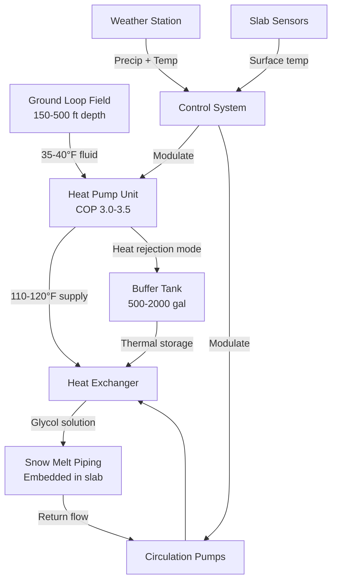

Geothermal systems extract thermal energy from the earth to provide heating for snow melting applications. Unlike conventional heat sources that burn fuel or convert electricity directly to heat, ground source heat pumps (GSHPs) transfer heat from the subsurface, achieving coefficients of performance (COP) between 3.0 and 4.5. This fundamental thermodynamic advantage makes geothermal systems highly efficient for snow melting despite significant capital costs.

## Physical Principles of Ground Heat Exchange

The earth maintains relatively constant temperatures below the frost line, typically 45-55°F at depths of 10-20 feet depending on geographic location. This stable thermal reservoir enables consistent heat extraction throughout winter. Heat transfer from ground to fluid occurs through three mechanisms:

**Conduction** dominates in the immediate vicinity of the heat exchanger pipe. Thermal conductivity of surrounding soil or rock (typically 1.0-2.5 BTU/hr·ft·°F) determines the rate of heat flow according to Fourier's law:

$$q = -k A \frac{dT}{dx}$$

where $q$ is heat transfer rate, $k$ is thermal conductivity, $A$ is surface area, and $\frac{dT}{dx}$ is the temperature gradient.

**Thermal diffusivity** governs how quickly the ground temperature profile responds to heat extraction. Defined as:

$$\alpha = \frac{k}{\rho c_p}$$

where $\rho$ is density and $c_p$ is specific heat capacity. High diffusivity materials (rock, saturated soil) recover faster between heating cycles.

**Groundwater movement** provides convective heat transfer in saturated formations, significantly enhancing heat exchange capacity and allowing smaller ground loop fields.

## Ground Source Heat Pump Sizing

GSHP capacity must satisfy both the instantaneous snow melting load and account for ground temperature depression over the heating season. The required heat pump heating capacity is:

$$Q_{hp} = \frac{Q_{sm}}{1 - \frac{1}{COP}}$$

where $Q_{sm}$ is the design snow melting load (BTU/hr) and $COP$ is the coefficient of performance at design conditions. For snow melting with design loads of 150-200 BTU/hr·ft², entering water temperatures of 35-40°F, typical COPs range from 3.0-3.5.

The ground loop must extract heat at the rate:

$$Q_{ground} = Q_{sm} - \frac{Q_{sm}}{COP} = Q_{sm}\left(1 - \frac{1}{COP}\right)$$

For a COP of 3.5, the ground must supply 71% of the delivered heating capacity, with electrical input providing the remaining 29%.

## Ground Loop Configuration Options

**Vertical Borehole Systems** penetrate 150-500 feet depth with high-density polyethylene U-tubes grouted in 4-6 inch diameter holes. Heat extraction rates depend on geology:

| Ground Formation | Extraction Rate | Thermal Conductivity |
|------------------|----------------|---------------------|
| Dry sand/gravel | 20-30 BTU/hr·ft | 1.0-1.5 BTU/hr·ft·°F |
| Saturated sand/gravel | 35-50 BTU/hr·ft | 1.5-2.0 BTU/hr·ft·°F |
| Solid rock (granite) | 50-70 BTU/hr·ft | 2.0-2.5 BTU/hr·ft·°F |
| Saturated clay | 25-40 BTU/hr·ft | 1.2-1.8 BTU/hr·ft·°F |

Required bore length is:

$$L_{total} = \frac{Q_{ground}}{q_{extract}}$$

where $q_{extract}$ is the extraction rate per unit length. A 500,000 BTU/hr snow melting load with COP = 3.5 requires:

$$L_{total} = \frac{355,000}{45} = 7,889 \text{ ft of bore length}$$

This translates to approximately 26 boreholes at 300 feet depth, requiring adequate site area and spacing (15-20 feet minimum) to prevent thermal interference.

**Horizontal Ground Loops** install in trenches 6-10 feet deep below the frost line. Heat transfer area requirements are substantially larger due to shallower depth and greater seasonal temperature variation. Typical extraction rates of 10-15 BTU/hr·ft² of ground area make horizontal systems impractical for most snow melting applications unless significant land area is available.

**Standing Column Wells** circulate water directly through bedrock formations in open or screened boreholes. These systems achieve 150-250 BTU/hr·ft extraction rates in favorable geology with sufficient groundwater flow, dramatically reducing required bore length. Water quality and regulatory permitting are critical considerations.

## System Integration and Controls

The heat exchanger isolates the closed ground loop (water or water-glycol) from the snow melting distribution system (typically 25-30% propylene glycol). This prevents ground loop contamination and allows independent pressure management.

Buffer tanks (500-2,000 gallons) provide thermal mass that reduces heat pump cycling and allows the system to respond to rapid load changes without short-cycling compressors. Tank capacity should store 15-30 minutes of design load:

$$V_{tank} = \frac{Q_{sm} \times t}{500 \times \Delta T}$$

where $V_{tank}$ is in gallons, $t$ is storage time in hours, and $\Delta T$ is the usable temperature difference (typically 10-15°F).

## Performance Comparison: Geothermal vs Conventional

| Parameter | Geothermal GSHP | Gas Boiler | Electric Resistance |
|-----------|----------------|------------|-------------------|
| Efficiency (COP) | 3.0-4.5 | 0.85-0.95 | 1.0 |
| Operating cost (relative) | 1.0× | 1.8-2.5× | 3.5-4.5× |
| Capital cost (relative) | 2.5-3.5× | 1.0× | 0.8-1.0× |
| Maintenance frequency | Low | Moderate | Very low |
| Lifespan (ground loop) | 50+ years | 20-25 years | 25-30 years |
| Carbon footprint | Very low | Moderate | High (grid-dependent) |
| Space requirements | High (bore field) | Low | Low |

## Design Standards and Best Practices

ASHRAE Standard 90.1 requires snow melting systems to include automatic controls that detect precipitation and pavement temperature, preventing unnecessary operation. For geothermal systems, this control strategy is particularly important because the limited thermal capacity of the ground loop can be depleted by continuous operation.

IGSHPA (International Ground Source Heat Pump Association) design guidelines specify:

- Minimum 15-foot spacing between vertical boreholes for residential applications
- 20-foot spacing for commercial snow melting with extended operating hours
- Maximum 50°F temperature depression in ground loops under continuous operation
- Thermal conductivity testing of ground formations for systems exceeding 50 tons capacity

Loop fluid velocity should maintain turbulent flow (Reynolds number > 4,000) to maximize heat transfer and prevent stratification:

$$Re = \frac{\rho v D}{\mu}$$

where $v$ is fluid velocity, $D$ is pipe diameter, and $\mu$ is dynamic viscosity. For 1-inch HDPE pipe with 30% glycol at 40°F, minimum velocity is approximately 2 ft/s.

## Economic Considerations

Geothermal snow melting systems require 2.5-3.5 times the capital investment of conventional boiler systems but offer operating cost savings of 40-60%. Simple payback periods typically range from 10-18 years depending on local utility rates and snow removal frequency. However, when integrated with building heating and cooling loads, shared ground loop infrastructure can reduce incremental costs by 50-70%, improving economics substantially.

The thermal stability of ground loops and minimal maintenance requirements result in lifecycle costs that favor geothermal systems for applications with 20+ year planning horizons, particularly institutional and commercial properties committed to sustainability goals.
