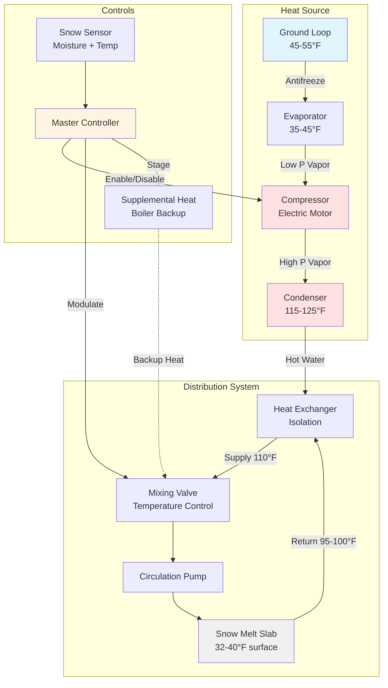

Heat pumps transfer thermal energy from lower-temperature sources to higher-temperature sinks using mechanical work input. While theoretically attractive for snow melting applications due to potential COP values exceeding unity, practical limitations emerge from the thermodynamic constraints imposed by low outdoor temperatures coinciding with snow events.

## Thermodynamic Fundamentals

Heat pump performance fundamentally depends on the temperature differential between source and sink. The Carnot COP establishes the theoretical maximum efficiency:

$$\text{COP}_{\text{Carnot}} = \frac{T_{\text{cond}}}{T_{\text{cond}} - T_{\text{evap}}}$$

Where temperatures are absolute (Rankine or Kelvin). Real heat pumps achieve 40-60% of Carnot efficiency due to irreversibilities including:

- Compressor inefficiency and friction losses
- Pressure drops through heat exchangers
- Non-ideal refrigerant behavior
- Heat transfer limitations requiring temperature differences

For snow melting requiring 110°F supply water (570°R) from a 32°F ambient source (492°R), Carnot COP equals 7.3. Real-world systems achieve COP of 2.0-2.5 under these conditions, representing 27-34% of theoretical maximum.

## Coefficient of Performance in Snow Melt Applications

The instantaneous COP for snow melting heat pumps follows:

$$\text{COP} = \frac{Q_{\text{delivered}}}{W_{\text{compressor}} + W_{\text{pumps}} + W_{\text{controls}}}$$

Where:
- $Q_{\text{delivered}}$ = heating capacity delivered to snow melting loop (Btu/h)
- $W_{\text{compressor}}$ = compressor electrical input (Btu/h)
- $W_{\text{pumps}}$ = circulation pump work (Btu/h)
- $W_{\text{controls}}$ = auxiliary equipment power (Btu/h)

For air-source heat pumps, empirical COP degradation with outdoor temperature follows approximately:

$$\text{COP}(T_{\text{OD}}) = \text{COP}_{47} \times \left(0.6 + 0.017 \times T_{\text{OD}}\right)$$

Where $T_{\text{OD}}$ is outdoor dry-bulb temperature (°F) and $\text{COP}_{47}$ is rated COP at 47°F outdoor temperature.

## Air-Source Heat Pumps

Air-source heat pumps extract thermal energy from outdoor air using refrigerant evaporator coils. Performance deteriorates severely during snow events when heat is most needed.

**Capacity and Efficiency Degradation:**

At 32°F outdoor temperature, ASHPs experience:
- Heating capacity reduced to 60-70% of rated capacity at 47°F
- COP decreased from 3.2-3.8 to 2.0-2.5
- Frost accumulation on outdoor coils requiring defrost cycles
- Supply water temperature limitation to 110-120°F maximum

**Defrost Cycle Impact:**

When outdoor coil temperature falls below 32°F and relative humidity exceeds 70%, frost forms on heat exchanger surfaces. Defrost cycles reverse refrigerant flow every 30-90 minutes, interrupting heat delivery for 5-15 minutes. During defrost:

$$Q_{\text{defrost}} = m_{\text{coil}} \times (h_{\text{ice}} + c_{\text{p,ice}} \times \Delta T)$$

This energy comes from the building load or supplemental resistance heat, effectively reducing system COP by 15-25% during snow events.

**Critical Limitations:**

1. **Low outdoor temperature operation:** Below 25°F, most ASHPs require supplemental electric resistance heat, eliminating efficiency advantages
2. **Reduced capacity at design conditions:** When snow melting load peaks, ASHP capacity reaches minimum
3. **Supply water temperature constraints:** Low condensing temperatures limit available heat flux density
4. **Reliability concerns:** Ice buildup, compressor stress, and control complexity increase failure risk

ASHPs are generally unsuitable for snow melting primary heat source in climates requiring active snow management systems. They may serve as supplemental heat in mild climates (ASHRAE climate zones 3-4) with infrequent snow events.

## Ground-Source Heat Pumps

Ground-source (geothermal) heat pumps extract thermal energy from the earth, leveraging stable subsurface temperatures of 45-55°F year-round below 15-20 feet depth.

**Performance Characteristics:**

GSHPs maintain consistent performance independent of outdoor air temperature:
- COP range: 3.0-4.5 throughout heating season
- Heating capacity remains constant regardless of snow event
- No defrost cycles eliminate performance interruptions
- Higher supply water temperatures (120-130°F) achievable
- 20-30 year equipment life exceeds ASHP 12-15 year expectancy

**Ground Loop Heat Transfer:**

Vertical closed-loop systems extract heat through U-tube piping in boreholes. Heat transfer rate per unit length:

$$q_{\text{ground}} = \frac{2\pi k_{\text{soil}} (T_{\text{ground}} - T_{\text{fluid}})}{\ln(r_{\text{b}}/r_{\text{pipe}}) + R_{\text{pipe}} + R_{\text{grout}}}$$

Where:
- $k_{\text{soil}}$ = thermal conductivity (Btu/h·ft·°F), typically 1.2-2.5
- $T_{\text{ground}}$ = undisturbed ground temperature (°F)
- $T_{\text{fluid}}$ = circulating fluid temperature (°F)
- $r_{\text{b}}$ = borehole radius (ft)
- $r_{\text{pipe}}$ = pipe outer radius (ft)
- $R_{\text{pipe}}$, $R_{\text{grout}}$ = thermal resistances

**Sizing Requirements:**

Ground loop sizing must prevent progressive ground temperature depression over multiple heating seasons. For snow melting applications, extraction rates of 150-200 feet of vertical bore per ton (12,000 Btu/h) are typical—substantially more conservative than the 100-150 feet/ton used for building heating alone.

Total bore depth:

$$L_{\text{total}} = \frac{Q_{\text{peak}} \times (R_{\text{eff}} + R_{\text{borehole}})}{T_{\text{ground}} - T_{\text{EWT,min}}}$$

Where:
- $L_{\text{total}}$ = total bore length required (ft)
- $Q_{\text{peak}}$ = peak heat extraction rate (Btu/h)
- $R_{\text{eff}}$ = effective ground thermal resistance (h·ft·°F/Btu)
- $R_{\text{borehole}}$ = borehole thermal resistance (h·ft·°F/Btu)
- $T_{\text{EWT,min}}$ = minimum entering water temperature (°F)

**Economic Considerations:**

GSHP installed costs range from $2,500-4,000 per ton including ground loop installation—2.5-4 times higher than conventional boilers. Economic viability depends on:

1. **Utilization factor:** Annual operating hours determine simple payback period
2. **Electricity vs. fuel cost ratio:** COP advantage multiplied by rate differential
3. **System life:** 25+ year ground loop amortizes high initial investment
4. **Maintenance costs:** Lower than combustion equipment (no burner, flue, or combustion air system)

For snow melting systems operating 300-800 hours annually in northern climates, simple payback typically ranges from 12-20 years depending on electricity and natural gas rates.

## System Configuration

The heat exchanger isolates the refrigerant condensing loop from the snow melting distribution system, preventing glycol contamination of the refrigerant circuit and allowing independent pressure control.

## Comparison: Air-Source vs Ground-Source Heat Pumps

| Parameter | Air-Source Heat Pump | Ground-Source Heat Pump |
|-----------|---------------------|------------------------|
| **Heating COP at 32°F** | 2.0-2.5 | 3.5-4.5 |
| **Heating COP at 17°F** | 1.5-2.0 (with defrost) | 3.5-4.5 (stable) |
| **Capacity at 17°F** | 55-65% of rated | 100% of rated |
| **Supply water temp** | 110-115°F max | 120-130°F |
| **Defrost cycles** | Required every 30-90 min | None |
| **Installed cost ($/ton)** | $1,200-1,800 | $2,500-4,000 |
| **Operating cost factor** | 1.0× (baseline) | 0.6-0.7× |
| **Equipment life** | 12-15 years | 20-25 years (25+ for loop) |
| **Maintenance intensity** | High (outdoor coil, defrost) | Low (indoor equipment only) |
| **Supplemental heat** | Required < 25°F | Optional backup only |
| **Performance degradation** | Severe during snow events | Minimal seasonal variation |
| **Suitable climates** | Zones 3-4 only | All climates |
| **Typical application** | Mild-climate supplement | Primary heat source |

## Design Considerations for Heat Pump Snow Melting Systems

**Capacity Sizing:**

Heat pump capacity must satisfy peak load at minimum expected outdoor temperature without supplemental heat (GSHP) or with defined supplemental heat contribution (ASHP). Size using:

$$Q_{\text{HP}} = \frac{A \times q_{\text{design}} + Q_{\text{piping loss}}}{\text{COP}_{\text{design}}} \times 1.15$$

The 1.15 factor accounts for compressor capacity degradation and control system inefficiencies.

**Buffer Tank Integration:**

A buffer tank between heat pump and snow melting loop provides:
- Thermal mass preventing short-cycling
- Hydraulic separation for independent flow rates
- Temperature stratification improving efficiency
- Capacity to handle transient load spikes

Minimum buffer volume:

$$V_{\text{buffer}} = \frac{Q_{\text{HP}} \times t_{\text{min cycle}}}{500 \times \Delta T_{\text{tank}}}$$

Where $t_{\text{min cycle}}$ is 10 minutes minimum and $\Delta T_{\text{tank}}$ is 10-15°F.

**Supplemental Heat Staging:**

For hybrid systems with backup boilers, stage heat sources by operating cost:

1. **Stage 1:** GSHP operates to maximum capacity
2. **Stage 2:** Supplemental boiler engages when outdoor temperature falls below setpoint or heat pump cannot maintain supply temperature
3. **Emergency:** Boiler provides full capacity if heat pump fails

Controls interlock heat sources preventing simultaneous operation unless both are required for peak load.

**Snow Detection and Idling:**

Two operational modes optimize energy consumption:

**Idling Mode:**
- Maintains slab temperature at 35-38°F
- Reduces response time from 60-90 minutes to 15-30 minutes
- Heat pump operates intermittently at low load
- Recommended for high-priority applications

**On-Demand Mode:**
- Slab cools to ambient temperature between events
- Full heat pump capacity applied when snow detected
- Lower energy consumption but slower response
- Acceptable for non-critical applications

## Standards and Design References

ASHRAE Handbook—HVAC Applications, Chapter 52 establishes heat flux requirements ranging from 150-250 Btu/h·ft² depending on snow intensity, wind speed, and ambient temperature. Heat pump sizing must account for COP variation at these design conditions.

For ground-source systems, IGSHPA (International Ground Source Heat Pump Association) guidelines specify ground loop design methodology including thermal conductivity testing, antifreeze concentration, and minimum loop separation distances.

ARI Standard 330 defines heat pump performance testing and rating conditions. Equipment selected for snow melting must demonstrate capacity and efficiency at lower water temperatures (40-45°F evaporator, 110-120°F condenser) than standard heating applications.

## Practical Application Limits

Heat pumps remain viable for snow melting under specific conditions:

**Ground-Source Heat Pumps Appropriate When:**
- Electricity cost < 2.5× natural gas cost ($/MMBtu equivalent basis)
- System utilization exceeds 400 hours annually
- Ground conditions favorable (adequate thermal conductivity, soil moisture)
- Environmental considerations favor electric systems
- Long-term ownership justifies capital investment

**Air-Source Heat Pumps Appropriate When:**
- Climate zone 3-4 with infrequent snow events (< 10 events/year)
- Supplemental electric resistance heat acceptable
- Initial cost constraints prohibit GSHP or boilers
- System used primarily for cooling with secondary snow melt function

**Both Technologies Inappropriate When:**
- Extremely low ambient temperatures (< 0°F design conditions)
- High snow intensity requiring heat flux > 200 Btu/h·ft²
- Rapid response time critical (< 30 minutes to clear surface)
- Electricity rates exceed economic threshold for given COP

For most commercial and institutional snow melting installations in northern climates (ASHRAE zones 5-7), conventional gas-fired boilers remain the most cost-effective and reliable primary heat source, with ground-source heat pumps reserved for applications prioritizing operating cost reduction over initial investment.
