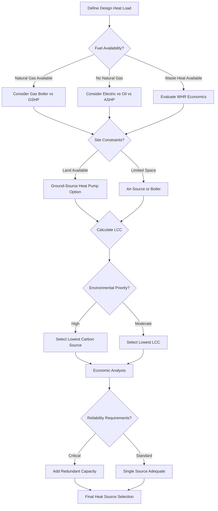

## Heat Source Selection Methodology

Heat source selection for snow melting systems requires rigorous analysis of thermodynamic efficiency, economic viability, fuel availability, and operational reliability. The selection process balances initial capital investment against long-term operational costs while ensuring adequate thermal capacity during design storm conditions.

## Fundamental Heat Transfer Requirements

Snow melting systems must deliver sufficient thermal energy to satisfy three simultaneous heat transfer mechanisms:

1. **Sensible heat flux** to raise snow temperature from ambient to 0°C
2. **Latent heat of fusion** to convert solid ice to liquid water (334 kJ/kg)
3. **Convective and radiative losses** to the environment

The total heat flux required is:

$$q_{total} = q_{sensible} + q_{latent} + q_{conv} + q_{rad}$$

Where sensible heat flux for melting snow is:

$$q_{sensible} = \dot{m}_{snow} \cdot c_p \cdot (T_{melt} - T_{air})$$

And latent heat requirement:

$$q_{latent} = \dot{m}_{snow} \cdot h_{fg}$$

For typical design conditions (1 inch/hour snowfall rate, 0°F ambient), the required heat flux ranges from 150-250 BTU/hr·ft² (473-788 W/m²). Heat source selection must provide this capacity with adequate safety margin.

## Heat Source Comparison Matrix

| Heat Source | Thermal Efficiency | Capital Cost ($/kW) | Operating Cost ($/MMBTU) | Turndown Ratio | Response Time | Lifespan (years) |
|-------------|-------------------|---------------------|--------------------------|----------------|---------------|------------------|
| Natural Gas Boiler | 82-98% | $80-150 | $8-12 | 5:1 to 10:1 | 5-15 min | 15-25 |
| Electric Boiler | 99% | $40-80 | $25-35 | 10:1 | 2-5 min | 20-30 |
| Air-Source Heat Pump | COP 1.5-3.0 | $200-400 | $12-18 | 3:1 | 10-20 min | 15-20 |
| Ground-Source Heat Pump | COP 3.0-4.5 | $400-800 | $8-15 | 4:1 | 10-20 min | 20-30 |
| Oil Boiler | 80-88% | $90-180 | $15-22 | 4:1 | 8-20 min | 15-20 |
| Waste Heat Recovery | 60-90% | $150-500 | $0-5 | 2:1 | Variable | 15-25 |
| Solar Thermal | 40-70% | $300-600 | $0 | N/A | Hours | 15-25 |

## Economic Analysis Framework

The lifecycle cost of a heat source combines capital expenditure with present value of operational costs over the system lifespan:

$$LCC = C_{capital} + \sum_{i=1}^{n} \frac{C_{operating,i}}{(1+r)^i}$$

Where:
- $LCC$ = Lifecycle cost ($)
- $C_{capital}$ = Initial capital cost including installation ($)
- $C_{operating,i}$ = Annual operating cost in year $i$ ($/yr)
- $r$ = Discount rate (decimal)
- $n$ = Analysis period (years)

Annual operating cost incorporates fuel consumption and efficiency:

$$C_{operating} = \frac{Q_{annual}}{\eta_{source}} \cdot C_{fuel}$$

Where:
- $Q_{annual}$ = Annual thermal energy requirement (MMBTU/yr)
- $\eta_{source}$ = Source efficiency (decimal)
- $C_{fuel}$ = Unit fuel cost ($/MMBTU)

For heat pumps, efficiency is expressed as COP (Coefficient of Performance):

$$C_{operating,HP} = \frac{Q_{annual}}{COP \cdot 3.412} \cdot C_{electric}$$

The factor 3.412 converts BTU/Wh to establish equivalent electrical energy consumption.

## Heat Source Selection Criteria

## Comparative Economic Example

Consider a 10,000 ft² snow melting system requiring 2.0 MMBTU/hr peak capacity with 500 MMBTU/yr annual consumption:

**Natural Gas Boiler:**
- Capital: $25,000
- Operating: 500 MMBTU ÷ 0.90 efficiency × $10/MMBTU = $5,556/yr
- 20-year LCC at 4% discount: $25,000 + $75,566 = $100,566

**Ground-Source Heat Pump:**
- Capital: $85,000
- Operating: 500 MMBTU ÷ (3.5 × 3.412) × $0.12/kWh = $5,009/yr
- 20-year LCC at 4% discount: $85,000 + $68,090 = $153,090

**Electric Resistance Boiler:**
- Capital: $15,000
- Operating: 500 MMBTU ÷ (1.0 × 3.412) × $0.12/kWh = $17,532/yr
- 20-year LCC at 4% discount: $15,000 + $238,460 = $253,460

This analysis demonstrates that despite higher capital cost, natural gas boilers typically offer lowest lifecycle cost in regions with gas infrastructure, while electric resistance carries prohibitive operating costs despite low initial investment.

## Critical Selection Factors

**Thermal Capacity Margin**

Heat sources must provide 115-125% of calculated design load to account for:
- Distribution system heat losses (10-15%)
- Degraded performance at extreme outdoor conditions
- Future expansion requirements

**Modulation and Turndown**

Snow melting operates intermittently. Heat sources with high turndown ratios (10:1) maintain efficiency during partial load conditions, which represent 70-80% of operating hours.

**Response Time**

Rapid storm onset requires heat sources capable of reaching full output within 15-30 minutes. Electric and gas-fired equipment respond faster than heat pumps cycling from standby.

**Fuel Supply Reliability**

Critical applications (hospital emergency access, fire station aprons) require either dual-fuel capability or on-site fuel storage to ensure operation during utility disruptions.

## Environmental Considerations

Carbon intensity varies significantly across heat sources:

- **Natural Gas:** 117 lb CO₂/MMBTU
- **Electric (grid average):** 150-200 lb CO₂/MMBTU equivalent
- **Heat Pump (electric):** 40-70 lb CO₂/MMBTU equivalent
- **Oil:** 161 lb CO₂/MMBTU
- **Waste Heat:** 0-20 lb CO₂/MMBTU

Regions with renewable-heavy electrical grids (hydro, wind, solar) favor heat pump solutions from both cost and carbon perspectives.

## Hybrid System Strategies

Optimal economics often result from hybrid configurations:

1. **Base load heat pump + peak boiler:** Minimizes operating cost while ensuring capacity
2. **Solar thermal + auxiliary boiler:** Reduces annual fuel consumption by 30-50%
3. **Waste heat + standby electric:** Leverages free energy with guaranteed backup

Hybrid systems require sophisticated controls to optimize source staging based on real-time efficiency and fuel costs.

## Conclusion

Heat source selection for snow melting systems demands comprehensive analysis integrating thermodynamic principles, economic modeling, and operational requirements. Natural gas boilers provide proven reliability and favorable economics in most applications, while heat pumps offer superior efficiency in mild climates or renewable-powered regions. Critical installations benefit from redundant or dual-fuel configurations that guarantee thermal availability regardless of external conditions.
