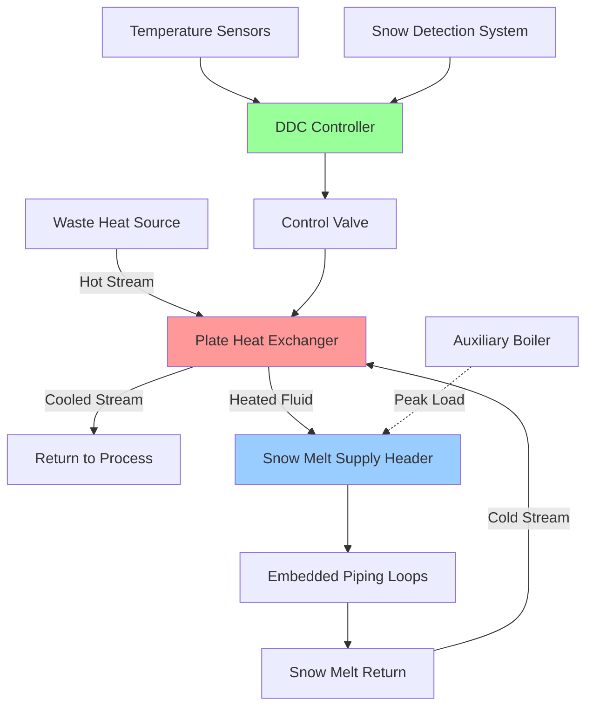

## Fundamentals of Waste Heat Recovery for Snow Melting

Waste heat recovery for snow melting represents an optimal application of low-grade thermal energy that would otherwise be rejected to the atmosphere. The intermittent nature of snow melting loads aligns well with continuous industrial heat rejection, creating an economically viable use for thermal energy streams typically ranging from 40°C to 95°C.

The fundamental principle involves capturing sensible or latent heat from process streams and transferring it to a snow melting fluid loop through heat exchangers. The thermodynamic efficiency depends on temperature differential maintenance, heat exchanger effectiveness, and system hydraulic design.

## Waste Heat Source Categories

### Industrial Process Heat Rejection

Manufacturing facilities, power generation plants, and chemical processing operations continuously reject heat through cooling water systems, condenser circuits, and exhaust streams. The key design parameter is the consistency of heat availability relative to snow melting demand.

**Available thermal power from a process stream:**

$$Q_{available} = \dot{m} \cdot c_p \cdot (T_{in} - T_{out})$$

Where:
- $Q_{available}$ = available thermal power (W)
- $\dot{m}$ = mass flow rate of waste heat stream (kg/s)
- $c_p$ = specific heat capacity (J/kg·K)
- $T_{in}$ = inlet temperature of waste heat stream (K)
- $T_{out}$ = minimum allowable outlet temperature (K)

### Data Center Thermal Rejection

Data centers provide an exceptional waste heat source due to year-round operation and predictable heat output. Server cooling systems typically reject heat at 30°C to 45°C through CRAC (Computer Room Air Conditioning) units or direct liquid cooling loops.

For a data center with IT load $P_{IT}$ and power usage effectiveness (PUE), the total heat rejection:

$$Q_{rejection} = P_{IT} \cdot PUE$$

The fraction recoverable for snow melting depends on heat exchanger design and temperature lift requirements for the snow melt system.

### Combined Heat and Power (CHP) Systems

CHP installations reject substantial heat through engine jacket cooling, exhaust heat recovery, and generator cooling. These sources operate continuously, providing base load thermal energy for snow melting with peak supplementation from auxiliary boilers.

Engine jacket cooling typically provides 85°C to 95°C water, ideal for direct snow melt system integration with minimal temperature degradation.

## Heat Exchanger Design Considerations

The effectiveness of waste heat recovery depends critically on heat exchanger selection and sizing. For snow melting applications, plate heat exchangers dominate due to compact footprint and high effectiveness.

**Heat exchanger effectiveness:**

$$\varepsilon = \frac{Q_{actual}}{Q_{max}} = \frac{C_{min}(T_{h,in} - T_{h,out})}{C_{min}(T_{h,in} - T_{c,in})}$$

Where:
- $\varepsilon$ = heat exchanger effectiveness (dimensionless)
- $C_{min}$ = minimum heat capacity rate between hot and cold streams (W/K)
- $T_{h,in}$, $T_{h,out}$ = hot stream inlet and outlet temperatures (K)
- $T_{c,in}$ = cold stream inlet temperature (K)

Target effectiveness for snow melt heat recovery systems: 0.70 to 0.85.

**Required heat exchanger area using NTU method:**

$$NTU = \frac{UA}{C_{min}}$$

$$\varepsilon = \frac{1 - e^{-NTU(1-C_r)}}{1 - C_r \cdot e^{-NTU(1-C_r)}}$$

Where $C_r = C_{min}/C_{max}$ is the heat capacity ratio.

## Waste Heat Source Comparison

| Source Type | Temperature Range | Availability | Heat Exchanger Type | Integration Complexity |
|-------------|-------------------|--------------|---------------------|------------------------|
| Data Center CRAC | 30°C - 45°C | Continuous | Plate HX | Low |
| CHP Jacket Water | 85°C - 95°C | Continuous | Plate HX | Medium |
| Industrial Cooling Water | 40°C - 70°C | Continuous | Shell & Tube / Plate | Medium |
| Refrigeration Condenser | 35°C - 50°C | Continuous | Brazed Plate HX | Low |
| Boiler Economizer | 90°C - 150°C | Seasonal | Shell & Tube | High |
| Process Condensate | 60°C - 100°C | Variable | Plate HX | Medium |

## System Integration Architecture

## Economic Feasibility Assessment

The economic viability of waste heat recovery for snow melting depends on:

1. **Avoided energy cost**: The value of fuel or electricity offset by waste heat utilization
2. **Capital cost differential**: Incremental cost of heat exchanger and piping versus standalone boiler
3. **Operational hours**: Annual snow melting demand hours
4. **Heat source proximity**: Piping run distance affects both capital and pumping costs

**Simple payback calculation:**

$$PB = \frac{C_{capital,incremental}}{E_{annual} \cdot c_{energy}}$$

Where:
- $PB$ = simple payback period (years)
- $C_{capital,incremental}$ = additional capital cost for waste heat recovery ($)
- $E_{annual}$ = annual energy recovered (kWh/year)
- $c_{energy}$ = energy cost ($/kWh)

Typical payback periods: 2 to 6 years, depending on waste heat source temperature and proximity.

## Design Standards and Guidelines

- **ASHRAE Handbook - HVAC Applications**: Chapter on snow melting and freeze protection systems includes waste heat recovery considerations
- **IDSA Design Standards**: Specify minimum approach temperatures and heat exchanger sizing criteria
- **ASME Section VIII**: Pressure vessel code for heat exchangers in high-temperature applications
- **AHRI Standard 400**: Liquid-to-liquid heat exchangers performance rating

## Control Strategy Optimization

Waste heat recovery systems require sophisticated controls to manage variable waste heat availability against intermittent snow melt demand:

1. **Priority sequencing**: Waste heat as primary source, auxiliary boiler as secondary
2. **Temperature reset**: Modulate snow melt supply temperature based on precipitation intensity
3. **Heat storage**: Thermal storage tanks buffer mismatch between waste heat availability and snow melt demand
4. **Bypass control**: Prevent overcooling of waste heat source below process requirements

The control logic must maintain minimum waste stream return temperature to prevent process disruption while maximizing thermal energy recovery.

## Thermal Storage Integration

When waste heat availability exceeds instantaneous snow melt demand, thermal storage extends system utility:

**Required storage volume for time-shifted operation:**

$$V_{storage} = \frac{Q_{excess} \cdot t_{storage}}{\rho \cdot c_p \cdot \Delta T}$$

Where:
- $V_{storage}$ = storage tank volume (m³)
- $Q_{excess}$ = excess waste heat power (W)
- $t_{storage}$ = storage duration (s)
- $\rho$ = fluid density (kg/m³)
- $\Delta T$ = allowable temperature swing in storage (K)

Stratified storage tanks with 15°C to 25°C temperature differential provide optimal performance for snow melt applications.

---

**Engineering Takeaway**: Waste heat recovery for snow melting transforms an operational expense (heat rejection) into an asset (free thermal energy), with payback periods that justify implementation in most industrial, institutional, and commercial applications with suitable waste heat sources within 100 meters of snow melt zones.
