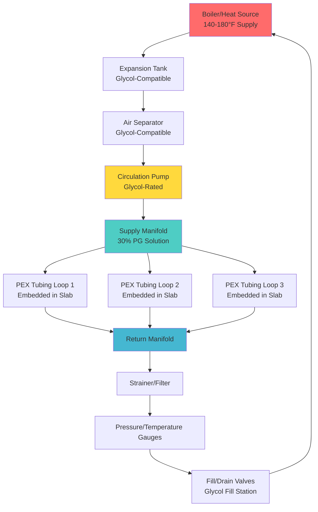

## Physical Principles of Antifreeze Solutions

Antifreeze solutions prevent freezing in hydronic snow melting systems by disrupting ice crystal formation at the molecular level. When glycol molecules dissolve in water, they interfere with the hydrogen bonding network required for ice crystallization, lowering the freezing point through colligative property depression. The freezing point depression is proportional to the molar concentration of glycol, not its mass fraction, which explains the non-linear relationship between concentration and freeze protection.

The addition of glycol fundamentally alters the thermophysical properties of the heat transfer fluid. Specific heat capacity decreases because glycol molecules have lower heat capacity than water molecules. Thermal conductivity drops due to weaker intermolecular forces in glycol compared to water's hydrogen bonding network. Viscosity increases dramatically because larger glycol molecules create greater internal friction during flow.

## Glycol Type Comparison

Two glycol types dominate hydronic snow melting applications, each with distinct characteristics:

| Property | Propylene Glycol | Ethylene Glycol |
|----------|------------------|-----------------|
| Toxicity | Food-grade, non-toxic | Toxic, requires containment |
| Freeze Point (50% by weight) | -29°F (-34°C) | -34°F (-37°C) |
| Specific Heat at 50% | 0.90 Btu/lb·°F | 0.88 Btu/lb·°F |
| Viscosity at 50%, 20°F | 28 cP | 19 cP |
| Thermal Conductivity at 50% | 0.23 Btu/h·ft·°F | 0.25 Btu/h·ft·°F |
| Cost Relative | 1.0x | 0.7x |
| Corrosion Protection | Requires inhibitors | Requires inhibitors |
| Typical Lifespan | 3-5 years | 3-5 years |

Propylene glycol is the standard choice for snow melting systems due to its non-toxic nature, which eliminates environmental concerns if leaks occur near potable water sources or landscaping. Ethylene glycol offers slightly better freeze protection and lower viscosity but requires strict containment protocols.

## Freeze Point Protection and Concentration Selection

The relationship between glycol concentration and freeze point follows ASHRAE data correlations. For propylene glycol by weight percent:

$$T_{freeze} = -0.634C - 0.0272C^2 + 0.000383C^3$$

where $T_{freeze}$ is the freezing point in °F and $C$ is the concentration in weight percent.

For outdoor snow melting systems, design freeze point should extend 10-15°F below the expected minimum ambient temperature to account for:
- System shutdown scenarios with residual fluid in exposed piping
- Wind chill effects on surface-mounted components
- Glycol degradation over time reducing freeze protection

Typical concentrations range from 25% to 35% by weight for most climates. A 30% propylene glycol solution provides freeze protection to approximately -8°F (-22°C), suitable for climates with design winter temperatures above 5°F (-15°C). Concentrations above 50% offer diminishing freeze protection returns while dramatically increasing viscosity penalties.

## Heat Transfer Performance Penalties

Glycol addition reduces heat transfer effectiveness through three mechanisms: reduced specific heat, decreased thermal conductivity, and increased viscosity affecting convective coefficients.

The effective heat capacity correction factor for sensible heat transfer:

$$\dot{Q}_{glycol} = \dot{m} \cdot c_{p,glycol} \cdot \Delta T = \dot{Q}_{water} \cdot \frac{c_{p,glycol}}{c_{p,water}}$$

For 30% propylene glycol:

$$\frac{c_{p,glycol}}{c_{p,water}} = \frac{0.95}{1.0} = 0.95$$

The convective heat transfer penalty from viscosity effects follows the Dittus-Boelter correlation relationship:

$$\frac{h_{glycol}}{h_{water}} \approx \left(\frac{\mu_{water}}{\mu_{glycol}}\right)^{0.2} \cdot \left(\frac{k_{glycol}}{k_{water}}\right)^{0.6}$$

At 30% propylene glycol and 40°F:

$$\frac{h_{glycol}}{h_{water}} \approx (0.58)^{0.2} \cdot (0.85)^{0.6} = 0.89$$

The combined effect requires approximately 15-20% higher flow rates to maintain equivalent heat delivery compared to water systems.

## Viscosity Effects on Pumping

Viscosity increases exponentially with glycol concentration and decreases with temperature. The dynamic viscosity for propylene glycol solutions:

$$\mu = \mu_{water} \cdot e^{A + B/T}$$

where coefficients $A$ and $B$ depend on concentration and $T$ is absolute temperature.

At 30% propylene glycol concentration, viscosity at 20°F is approximately 7 times that of water at the same temperature. This dramatically impacts pumping requirements:

$$\Delta P_{glycol} = \Delta P_{water} \cdot \frac{\mu_{glycol}}{\mu_{water}}$$

Pump head requirements increase proportionally, and pump curves shift significantly. System designers must select pumps based on glycol properties at minimum operating temperature, not water properties. Oversizing circulation pumps by 20-30% accounts for glycol viscosity penalties while maintaining design flow rates.

## Corrosion Protection Requirements

Glycol solutions become acidic when oxidized, requiring corrosion inhibitor packages to protect ferrous and non-ferrous metals. ASHRAE Standard 188 addresses water quality for glycol systems.

Inhibitors must protect against:
- General corrosion of ferrous components (pumps, valves, manifolds)
- Galvanic corrosion at dissimilar metal joints
- Pitting corrosion in copper tubing
- Stress corrosion cracking

Annual fluid testing monitors:
- pH level (target 8.5-10.5)
- Reserve alkalinity (minimum 5-10 ml 0.1N HCl/10ml sample)
- Freeze point via refractometer
- Inhibitor concentration via titration

Replace glycol solutions when pH drops below 7.0, reserve alkalinity depletes, or freeze point degrades beyond design requirements.

## System Filling and Maintenance

Proper glycol charging prevents air entrainment and ensures accurate concentration. Fill systems using pressurized glycol mixing stations that pre-blend to target concentration. Filling through the lowest system point while venting at high points removes trapped air that reduces heat transfer effectiveness.

Monitor glycol condition annually. Degraded glycol exhibits dark coloration, decreased pH, and elevated freeze point. Flush and refill systems every 3-5 years or when testing indicates inhibitor depletion. Never mix propylene and ethylene glycol types, as inhibitor packages are incompatible.

---

**ASHRAE References:**
- ASHRAE Handbook—HVAC Systems and Equipment, Chapter 13: Hydronic Heating and Cooling
- ASHRAE Handbook—Fundamentals, Chapter 31: Physical Properties of Secondary Coolants
