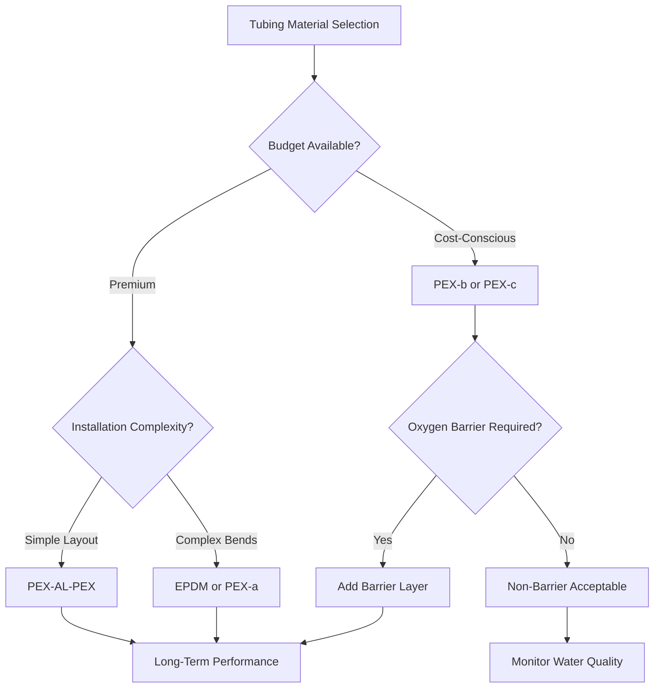
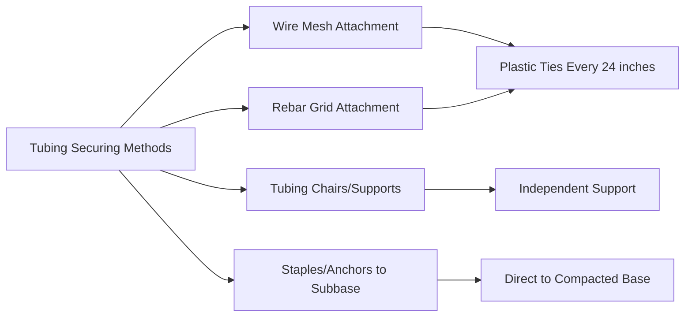
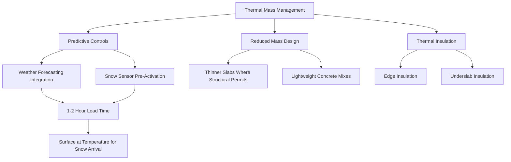

Embedded tubing systems form the heat transfer network for hydronic snow melting applications. The tubing material, installation configuration, and interaction with the thermal mass of the pavement structure determine system performance, response time, and long-term reliability. Proper material selection and installation technique directly affect heat delivery efficiency and service life.

## Tubing Material Comparison

Two primary tubing materials dominate hydronic snow melting installations: cross-linked polyethylene (PEX) and ethylene propylene diene monomer (EPDM) synthetic rubber. Each material exhibits distinct physical properties affecting performance, installation procedures, and cost.

### Cross-Linked Polyethylene (PEX)

PEX tubing undergoes a molecular bonding process that creates three-dimensional polymer chains, providing superior mechanical strength and thermal stability compared to standard polyethylene. This cross-linking prevents the material from melting under normal operating conditions and provides excellent resistance to freeze-thaw cycling.

**Physical properties:**
- **Thermal conductivity:** $k = 0.23$ BTU/hr·ft·°F
- **Maximum operating temperature:** 200°F (93°C) continuous
- **Minimum bend radius:** 6-8 times nominal diameter
- **Coefficient of thermal expansion:** $\alpha = 1.1 \times 10^{-4}$ per °F
- **Oxygen permeability:** 0.05-0.10 g/m·day (non-barrier) to <0.001 g/m·day (oxygen barrier)

The coefficient of thermal expansion determines dimensional changes during thermal cycling. For a 300-foot circuit experiencing a 50°F temperature increase, calculate expansion:

$$\Delta L = L_0 \cdot \alpha \cdot \Delta T = 300 \text{ ft} \times 1.1 \times 10^{-4} \text{ per °F} \times 50\text{°F} = 1.65 \text{ inches}$$

This expansion occurs within the concrete matrix and requires proper installation techniques to prevent stress concentration.

**PEX tubing types:**

| Type | Structure | Oxygen Barrier | Applications |
|------|-----------|----------------|--------------|
| PEX-a | Peroxide cross-linked | Optional layer | Most flexible, easiest installation |
| PEX-b | Silane cross-linked | Optional layer | Economical, moderate flexibility |
| PEX-c | Electron beam cross-linked | Optional layer | Least flexible, lowest cost |
| PEX-AL-PEX | Aluminum layer core | Integral aluminum | Best oxygen protection, maintains shape |

### EPDM Synthetic Rubber Tubing

EPDM tubing consists of a synthetic rubber compound with excellent chemical resistance and flexibility. The material demonstrates superior resistance to ozone, UV radiation, and temperature extremes compared to PEX.

**Physical properties:**
- **Thermal conductivity:** $k = 0.17$ BTU/hr·ft·°F
- **Maximum operating temperature:** 250°F (121°C) continuous
- **Minimum bend radius:** 3-4 times nominal diameter
- **Coefficient of thermal expansion:** $\alpha = 1.0 \times 10^{-4}$ per °F
- **Oxygen permeability:** Inherently low, <0.005 g/m·day

EPDM's lower thermal conductivity slightly reduces heat transfer effectiveness compared to PEX, but the difference remains negligible in embedded applications where concrete thermal resistance dominates overall heat transfer.

### Material Selection Criteria

**Selection factors:**

1. **Oxygen permeation control:** Systems containing ferrous components require oxygen barrier tubing to prevent corrosion
2. **Installation complexity:** Tighter bends and obstacles favor EPDM or PEX-a
3. **Operating temperature:** Standard snow melting rarely exceeds 140°F supply temperature
4. **Freeze-thaw resistance:** Both materials tolerate expansion from ice formation
5. **Chemical compatibility:** Verify compatibility with specific antifreeze formulations
6. **Cost considerations:** PEX-b and PEX-c offer lowest material cost

## Oxygen Barrier Requirements

Oxygen diffusion into hydronic systems accelerates corrosion of steel boilers, heat exchangers, and circulator components. The rate of oxygen ingress follows Fick's law of diffusion:

$$J = -D \cdot \frac{dC}{dx}$$

Where:
- $J$ = diffusion flux (mass per area per time)
- $D$ = diffusion coefficient (material-dependent)
- $\frac{dC}{dx}$ = concentration gradient across tubing wall

Non-barrier PEX allows approximately 0.10 g oxygen per meter of tubing per day at typical operating conditions. For a 3,000-foot installation:

$$Q_{O_2} = 0.10 \text{ g/m·day} \times \frac{3000 \text{ ft}}{3.28 \text{ ft/m}} = 91.5 \text{ g/day}$$

This oxygen ingress rapidly depletes corrosion inhibitors and attacks ferrous components. Oxygen barrier tubing reduces diffusion by 95-99%, extending system life from years to decades.

**Barrier methods:**
- **EVOH (ethylene vinyl alcohol) layer:** Extruded onto PEX as thin barrier film
- **Aluminum layer:** PEX-AL-PEX uses 0.004-0.008 inch aluminum core
- **Inherent material barrier:** EPDM naturally exhibits low oxygen permeability

## Concrete Slab Installation Methods

Tubing installation within concrete slabs requires attention to placement depth, securing methods, and protection during concrete placement. The installation configuration affects both heat transfer efficiency and tubing longevity.

### Installation Depth Optimization

Heat transfer from embedded tubing to the surface involves conduction through concrete. The governing equation for steady-state heat flux:

$$q = \frac{k_c}{\delta} \cdot (T_t - T_s)$$

Where:
- $q$ = heat flux to surface (BTU/hr·ft²)
- $k_c$ = concrete thermal conductivity ≈ 1.0 BTU/hr·ft·°F
- $\delta$ = depth from tubing centerline to surface (ft)
- $T_t$ = tubing surface temperature (°F)
- $T_s$ = slab surface temperature (°F)

For a 4-inch concrete slab with tubing at mid-depth (2 inches below surface):

$$q = \frac{1.0 \text{ BTU/hr·ft·°F}}{2/12 \text{ ft}} \cdot (T_t - T_s) = 6.0 \cdot (T_t - T_s)$$

Positioning tubing closer to the surface increases heat flux for a given temperature difference but reduces protection from surface loads and thermal cycling damage.

**Depth recommendations:**

| Slab Thickness | Tubing Depth | Reasoning |
|----------------|--------------|-----------|
| 3 inches | 1.5 inches | Minimum practical depth |
| 4 inches | 2.0 inches | Standard residential installation |
| 5 inches | 2.5 inches | Commercial light-duty |
| 6 inches | 2.5-3.0 inches | Commercial heavy-duty |
| 8+ inches | 3.0-4.0 inches | Industrial, use thermal modeling |

Positioning tubing at exactly mid-depth optimizes the balance between surface heat delivery and protection from mechanical damage. Thicker slabs benefit from placement slightly above mid-depth (upper third) to reduce thermal resistance to the surface.

### Securing Methods

**Wire mesh installation:**
1. Place welded wire mesh (WWF) on chairs at specified height
2. Secure tubing to mesh using plastic cable ties at 18-24 inch intervals
3. Avoid metal fasteners that create thermal bridges and potential leak points
4. Maintain 3 inches minimum clearance from slab edges

**Rebar grid installation:**
1. Install rebar grid per structural requirements
2. Attach tubing using plastic-coated wire or zip ties
3. Position tubing to avoid interference with rebar intersections
4. Coordinate tubing layout with structural reinforcement placement

**Advantages of chair/support method:**
- Independent of structural reinforcement
- Precise depth control
- Reduces concrete displacement during placement
- Suitable for large-area installations

### Protection During Concrete Placement

Tubing damage during concrete pour accounts for significant installation failures. Implement protection protocols:

**Pre-pour pressure testing:**
1. Pressure test all circuits to 100 psi
2. Maintain pressure during concrete placement
3. Monitor pressure gauges continuously for sudden drops indicating damage
4. Document pressure before, during, and after pour

**Pour procedures:**
1. Direct concrete flow to avoid direct impact on tubing
2. Use low-slump concrete (3-4 inch slump) to reduce segregation
3. Avoid mechanical vibrators directly contacting tubing
4. Distribute concrete evenly to prevent tubing displacement
5. Maintain minimum 1.5 inch concrete cover above tubing

**Post-pour verification:**
1. Maintain test pressure for 24 hours after finishing
2. Perform flow testing before system startup
3. Document final pressure and flow measurements
4. Cure concrete per ACI recommendations (minimum 7 days moist cure)

## Thermal Mass Effects and System Response

The thermal mass of concrete slabs significantly affects snow melting system response time and energy consumption. Concrete's thermal properties create both advantages and limitations compared to low-mass systems.

### Thermal Mass Calculation

Concrete thermal mass determines energy required to bring the system to operating temperature:

$$Q_{mass} = m \cdot c_p \cdot \Delta T$$

Where:
- $Q_{mass}$ = energy to heat concrete mass (BTU)
- $m$ = concrete mass (lb)
- $c_p$ = specific heat of concrete ≈ 0.20 BTU/lb·°F
- $\Delta T$ = temperature rise (°F)

For a 1,000 ft² slab, 4 inches thick, heated from 32°F to 40°F:

$$m = 1000 \text{ ft}^2 \times \frac{4}{12} \text{ ft} \times 150 \text{ lb/ft}^3 = 50{,}000 \text{ lb}$$

$$Q_{mass} = 50{,}000 \text{ lb} \times 0.20 \text{ BTU/lb·°F} \times 8\text{°F} = 80{,}000 \text{ BTU}$$

This represents the energy absorbed by concrete before significant surface heating occurs. At 100,000 BTU/hr heat input, the warm-up requires nearly one hour before effective snow melting begins.

### Response Time Analysis

Transient heat transfer in concrete slabs follows the diffusion equation:

$$\frac{\partial T}{\partial t} = \alpha \cdot \nabla^2 T$$

Where $\alpha$ is thermal diffusivity:

$$\alpha = \frac{k}{\rho \cdot c_p} = \frac{1.0 \text{ BTU/hr·ft·°F}}{150 \text{ lb/ft}^3 \times 0.20 \text{ BTU/lb·°F}} = 0.033 \text{ ft}^2\text{/hr}$$

The characteristic time for heat to propagate a distance $\delta$:

$$t_{response} \approx \frac{\delta^2}{\alpha}$$

For tubing 2 inches below surface:

$$t_{response} \approx \frac{(2/12 \text{ ft})^2}{0.033 \text{ ft}^2\text{/hr}} = 0.84 \text{ hours} \approx 50 \text{ minutes}$$

This theoretical minimum demonstrates why high thermal mass systems require predictive controls that activate before snow events rather than reactive operation.

### Thermal Mass Management Strategies

**Advantages of high thermal mass:**
- Thermal storage capacity allows intermittent heat source operation
- Temperature stability reduces cycling frequency
- Residual heat continues melting after heat input stops
- Reduced surface temperature fluctuations

**Disadvantages of high thermal mass:**
- Extended warm-up period (1-3 hours typical)
- Higher energy consumption during startup
- Requires predictive control strategies
- Increased operating cost for intermittent snow events

**Edge and underslab insulation effects:**

Installing rigid insulation at slab perimeter and beneath the slab reduces downward and edge heat losses, directing more energy to the surface. For a 4-inch slab with 2-inch extruded polystyrene (R-10) underslab insulation:

**Heat loss reduction:** 30-50% compared to uninsulated installation
**Improved response time:** 15-25% faster surface heating
**Energy savings:** 20-40% over heating season

Calculate the thermal resistance network:

$$R_{total} = R_{insulation} + R_{concrete} + R_{surface}$$

$$R_{total} = 10 + \frac{0.333 \text{ ft}}{1.0 \text{ BTU/hr·ft·°F}} + 0.68 = 11.0 \text{ hr·ft}^2\text{·°F/BTU}$$

The insulation dominates the thermal resistance, forcing heat flow upward toward the surface rather than into the ground.

## Installation Specifications

**Tubing circuit design parameters:**

| Parameter | Specification | Notes |
|-----------|--------------|-------|
| Maximum circuit length | 300 ft (1/2 in), 400 ft (3/4 in) | Limits pressure drop <15 psi |
| Tube spacing | 6-12 inches on center | Per ASHRAE heat flux requirements |
| Minimum bend radius | 6× diameter (PEX), 3× diameter (EPDM) | Prevents kinking |
| Expansion loops | Not required | Concrete restrains tubing |
| Pressure test | 100 psi for 24 hours | Before and during concrete pour |
| Maximum fluid velocity | 4 ft/sec | Limits erosion and noise |

**Concrete specifications:**
- **Minimum compressive strength:** 3,000 psi at 28 days
- **Maximum aggregate size:** 3/4 inch
- **Air entrainment:** 5-8% for freeze-thaw resistance
- **Slump:** 3-5 inches for proper consolidation
- **Water-cement ratio:** <0.50 for durability

**Quality control procedures:**
1. Verify tubing depth before concrete placement using measuring devices
2. Photograph tubing layout with dimensional references
3. Document circuit lengths and flow rates
4. Record pressure test results at multiple stages
5. Conduct infrared thermography after commissioning to verify uniform heat distribution

## Design Reference Standards

Snow melting system design and installation follows established engineering standards:

- **ASHRAE Handbook—HVAC Applications, Chapter 51:** Comprehensive snow melting design methodology including heat flux calculations, tubing layouts, and thermal analysis procedures
- **ASTM F876/F877:** Standard specifications for cross-linked polyethylene (PEX) tubing and fittings
- **ASTM D4976:** Standard specification for polyethylene plastics molding and extrusion materials
- **ACI 332:** Guide to residential concrete for snow melting applications
- **PPI TR-4:** Technical report on PEX tubing for hydronic heating applications

Adherence to these standards ensures proper material selection, installation quality, and long-term system performance in snow melting applications.

---

**File:** /Users/evgenygantman/Documents/github/gantmane/hvac/content/specialty-applications-testing/specialty-hvac-applications/snow-melting-freeze-protection-systems/hydronic-snow-melting/embedded-tubing-systems/_index.md

**Key Technical Points:**
- PEX tubing exhibits thermal conductivity k = 0.23 BTU/hr·ft·°F with coefficient of thermal expansion α = 1.1×10⁻⁴ per °F
- EPDM demonstrates superior flexibility (3-4× diameter bend radius vs 6-8× for PEX) and inherent oxygen barrier properties
- Optimal tubing depth places centerline at slab mid-depth; for 4-inch slab, position 2 inches below surface
- Concrete thermal mass requires approximately 80,000 BTU to raise 1,000 ft² × 4-inch slab by 8°F
- System response time approximately 50 minutes for heat to propagate from 2-inch depth to surface (thermal diffusivity α = 0.033 ft²/hr)
- Oxygen barrier tubing reduces oxygen ingress by 95-99%, critical for systems with ferrous components
- Underslab insulation (R-10) reduces heat loss 30-50% and improves response time 15-25%
