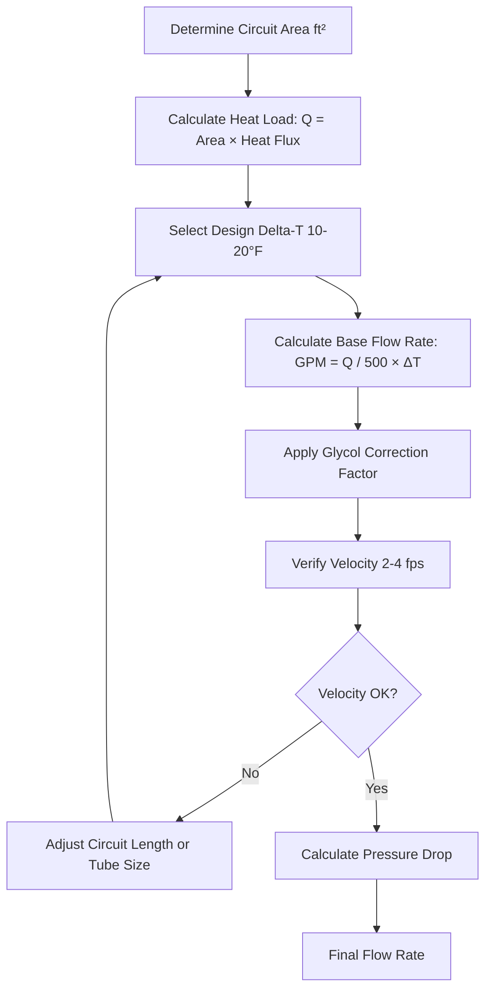
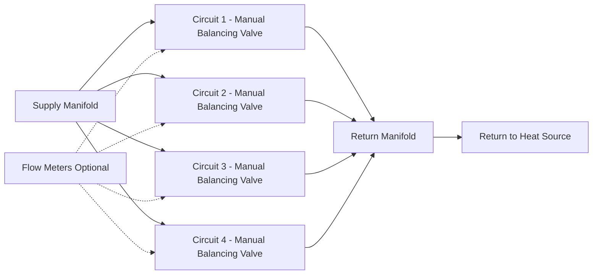

Flow rate determination constitutes a critical design parameter for hydronic snow melting systems, directly affecting heat transfer effectiveness, pumping energy consumption, and system reliability. Proper flow rate calculations must account for heat flux requirements, fluid properties, circuit geometry, and hydraulic constraints to achieve uniform surface temperatures while minimizing operating costs.

## Fundamental Flow Rate Equation

Flow rate derives from the first law of thermodynamics applied to the heat transfer fluid circulating through embedded tubing. The energy balance equation relates volumetric flow rate to heat output and temperature change:

$$\dot{Q} = \dot{m} \cdot c_p \cdot \Delta T = \rho \cdot \dot{V} \cdot c_p \cdot \Delta T$$

Where:
- $\dot{Q}$ = heat transfer rate (BTU/hr)
- $\dot{m}$ = mass flow rate (lb/hr)
- $c_p$ = specific heat capacity (BTU/lb·°F)
- $\Delta T$ = temperature difference supply to return (°F)
- $\rho$ = fluid density (lb/ft³)
- $\dot{V}$ = volumetric flow rate (ft³/hr)

Converting to practical HVAC units with water properties ($\rho \cdot c_p \approx 500$ BTU/ft³·°F):

$$\text{GPM} = \frac{\dot{Q}}{500 \cdot \Delta T}$$

This simplified form applies to pure water. Glycol solutions require correction factors based on concentration and temperature.

## Delta-T Selection

Temperature drop through each circuit affects flow rate requirements, pump sizing, and surface temperature uniformity. Delta-T selection involves balancing competing objectives:

### Design Delta-T Range

**Low delta-T (10-15°F):**
- Provides superior surface temperature uniformity
- Reduces temperature variation between circuit inlet and outlet
- Requires higher flow rates and increased pump power
- Minimizes thermal stress on pavement
- Preferred for critical applications (hospital entries, bridge decks)

**Medium delta-T (15-20°F):**
- Standard design range for most applications
- Balances performance and energy consumption
- Acceptable temperature uniformity for commercial installations
- Reduces pump size compared to low delta-T designs

**High delta-T (20-30°F):**
- Minimizes flow rate and pump energy
- Increases surface temperature variation
- May create visible striping or cold spots
- Risk of inadequate heat transfer at circuit ends
- Generally avoided except for budget-constrained projects

### Temperature Uniformity Analysis

Surface temperature variation along a circuit results from progressive fluid cooling. For a serpentine tubing layout with constant heat extraction:

$$T_{\text{fluid}}(x) = T_{\text{supply}} - \frac{\dot{q} \cdot A(x)}{\dot{m} \cdot c_p}$$

Where $A(x)$ represents the surface area served from inlet to position $x$. This linear temperature decay causes corresponding surface temperature gradients. Limiting delta-T to 15-20°F typically maintains surface temperature variation within 5-10°F, acceptable for most applications.

## Flow Rate Per Circuit Calculation

Calculate flow rate for each tubing circuit based on served area, design heat flux, and selected delta-T:

### Calculation Procedure

### Example Calculation

**Given:**
- Circuit area: 400 ft²
- Design heat flux: 200 BTU/hr·ft²
- Delta-T: 15°F
- Fluid: 30% propylene glycol

**Solution:**

Total heat load:
$$\dot{Q} = 400 \text{ ft}^2 \times 200 \text{ BTU/hr·ft}^2 = 80{,}000 \text{ BTU/hr}$$

Base flow rate (water):
$$\text{GPM}_{\text{water}} = \frac{80{,}000}{500 \times 15} = 10.67 \text{ GPM}$$

Glycol correction factor (30% propylene glycol at 110°F ≈ 1.08):
$$\text{GPM}_{\text{glycol}} = 10.67 \times 1.08 = 11.52 \text{ GPM}$$

## Reynolds Number and Flow Regime

Flow regime significantly impacts heat transfer effectiveness. Turbulent flow provides superior convective heat transfer compared to laminar flow through enhanced mixing and boundary layer disruption.

### Reynolds Number Definition

$$\text{Re} = \frac{\rho \cdot v \cdot D}{\mu} = \frac{v \cdot D}{\nu}$$

Where:
- $\rho$ = fluid density (lb/ft³)
- $v$ = flow velocity (ft/s)
- $D$ = tubing inside diameter (ft)
- $\mu$ = dynamic viscosity (lb/ft·s)
- $\nu$ = kinematic viscosity (ft²/s)

### Flow Regime Criteria

| Reynolds Number | Flow Regime | Heat Transfer | Design Guidance |
|-----------------|-------------|---------------|-----------------|
| Re < 2,300 | Laminar | Poor, avoid | Increase flow rate or reduce tubing size |
| 2,300 < Re < 4,000 | Transitional | Unstable | Design margin, not recommended |
| Re > 4,000 | Turbulent | Excellent | Target design range |
| Re > 10,000 | Fully turbulent | Optimal | Preferred for critical applications |

### Velocity Requirements

Maintain fluid velocity between 2-4 fps in embedded tubing to ensure turbulent flow:

$$v = \frac{Q}{A} = \frac{0.408 \cdot \text{GPM}}{D_{\text{in}}^2}$$

Where $D_{\text{in}}$ is the inside diameter in inches.

**Velocity limits by tubing size:**

| Tubing Size | Inside Diameter | Flow Rate for 2 fps | Flow Rate for 4 fps |
|-------------|-----------------|---------------------|---------------------|
| 1/2 inch | 0.475 inch | 0.9 GPM | 1.8 GPM |
| 5/8 inch | 0.574 inch | 1.3 GPM | 2.6 GPM |
| 3/4 inch | 0.671 inch | 1.8 GPM | 3.6 GPM |
| 1 inch | 0.864 inch | 3.0 GPM | 6.0 GPM |

### Glycol Effects on Reynolds Number

Propylene glycol increases fluid viscosity, reducing Reynolds number for a given velocity. At 40% glycol concentration and 100°F, viscosity increases by approximately 2.5× compared to water, requiring higher velocities to maintain turbulent flow.

Account for reduced Reynolds number by:
1. Increasing design velocity to 3-5 fps for glycol systems
2. Selecting larger tubing diameters to reduce pressure drop
3. Limiting circuit lengths to maintain acceptable pressure drop
4. Verifying turbulent flow at minimum operating temperature (highest viscosity condition)

## Circuit Balancing Methodology

Multiple parallel circuits require balancing to ensure equal flow distribution and uniform heat output across the snow melting area.

### Balancing Approaches

**Manual balancing valves:**
- Install on return side of each circuit
- Adjust to equalize flow based on design calculations
- Measure pressure drop across each circuit during commissioning
- Calculate flow rate from pressure drop and circuit characteristics

**Manifolds with integrated flow meters:**
- Direct flow rate indication for each circuit
- Simplifies balancing procedure
- Allows continuous monitoring and adjustment
- Higher initial cost, superior long-term performance

### Balancing Calculation

For equal length circuits with identical tubing size and spacing, flow distributes proportionally to pressure drop:

$$\frac{\text{GPM}_1}{\text{GPM}_2} = \sqrt{\frac{\Delta P_1}{\Delta P_2}}$$

Adjust balancing valves to create additional pressure drop in circuits with naturally lower resistance, equalizing total pressure drop across all circuits.

## Pressure Drop Calculations

Total pressure drop determines pump head requirement and affects system efficiency. Pressure drop occurs in embedded tubing circuits, manifolds, heat exchangers, and interconnecting piping.

### Tubing Circuit Pressure Drop

Darcy-Weisbach equation for friction loss in circular pipes:

$$\Delta P = f \cdot \frac{L}{D} \cdot \frac{\rho \cdot v^2}{2}$$

Where:
- $f$ = Darcy friction factor (dimensionless)
- $L$ = circuit length (ft)
- $D$ = inside diameter (ft)
- $\rho$ = fluid density (lb/ft³)
- $v$ = flow velocity (ft/s)

For turbulent flow, friction factor depends on Reynolds number and relative roughness. PEX tubing exhibits smooth pipe behavior, allowing use of the Blasius correlation for turbulent flow:

$$f = \frac{0.316}{\text{Re}^{0.25}} \quad \text{for } 3{,}000 < \text{Re} < 100{,}000$$

### Practical Pressure Drop Estimation

For preliminary sizing, use simplified pressure drop per 100 feet:

| Tubing Size | Flow Rate | Pressure Drop (ft water/100 ft) |
|-------------|-----------|----------------------------------|
| 1/2 inch | 1 GPM | 3.5 |
| 1/2 inch | 2 GPM | 12.0 |
| 5/8 inch | 2 GPM | 5.0 |
| 5/8 inch | 3 GPM | 10.5 |
| 3/4 inch | 3 GPM | 4.5 |
| 3/4 inch | 4 GPM | 7.5 |
| 1 inch | 5 GPM | 4.0 |
| 1 inch | 6 GPM | 5.5 |

These values apply to water at 110°F. Multiply by 1.3-1.8 for glycol solutions depending on concentration.

### Total System Pressure Drop

Sum pressure drops from all components in the longest hydraulic path:

$$\Delta P_{\text{total}} = \Delta P_{\text{circuit}} + \Delta P_{\text{manifold}} + \Delta P_{\text{HX}} + \Delta P_{\text{piping}} + \Delta P_{\text{fittings}}$$

## Pump Head Requirements

Select circulator pumps to overcome total system pressure drop while delivering design flow rate. Express pump head in feet of water column equivalent.

### Pump Sizing Procedure

1. **Calculate design flow rate** for entire system (sum of all circuits)
2. **Determine critical circuit** (longest path, highest pressure drop)
3. **Calculate total pressure drop** including all components
4. **Add safety factor** (15-25%) to account for aging, fouling, and calculation uncertainties
5. **Select pump** with capacity at intersection of design flow and head on pump curve

### Pump Head Equation

$$H_{\text{pump}} = \frac{\Delta P_{\text{total}}}{\rho \cdot g} \times 1.2$$

Where the 1.2 factor provides 20% safety margin.

### Variable Speed Pumps

Variable speed circulators offer significant advantages:
- Reduce energy consumption during partial load operation
- Maintain constant differential pressure across manifolds
- Automatically compensate for system resistance changes
- Allow lower initial pump head selection with ability to increase if needed

Design variable speed systems for 75% of maximum calculated flow rate, allowing pump speed to modulate based on actual demand.

## Design Recommendations

**Flow rate design:**
- Target 2.5-3.5 fps velocity in embedded tubing
- Limit delta-T to 15-20°F for commercial applications
- Verify turbulent flow (Re > 4,000) at minimum operating temperature
- Calculate glycol correction factors at design operating conditions

**Circuit design:**
- Maximum circuit length 300-400 feet for 1/2-inch tubing
- Equalize circuit lengths within 10% for simplified balancing
- Install balancing valves on all circuits
- Provide pressure/temperature test ports on manifolds

**Pump selection:**
- Size for 120% of calculated pressure drop
- Select pumps with flat efficiency curves across operating range
- Consider variable speed drives for systems >10 GPM
- Verify adequate NPSH (net positive suction head) at operating temperature

## ASHRAE Reference Standards

ASHRAE Handbook—HVAC Applications, Chapter 51 (Snow Melting and Freeze Protection) provides:
- Flow rate calculation methodology
- Glycol solution property data and correction factors
- Pressure drop tables for various tubing sizes and flow rates
- Pump selection criteria and efficiency recommendations

ASHRAE Handbook—Fundamentals, Chapter 3 (Fluid Flow) covers:
- Reynolds number calculations and flow regime determination
- Friction factor correlations for smooth and rough pipes
- Pressure drop equations for piping networks
- Pump affinity laws and system curve analysis

---

**File:** /Users/evgenygantman/Documents/github/gantmane/hvac/content/specialty-applications-testing/specialty-hvac-applications/snow-melting-freeze-protection-systems/hydronic-snow-melting/flow-rates/_index.md

**Key Engineering Points:**
- Flow rate equation: GPM = Q / (500 × ΔT) with glycol correction factors applied
- Design delta-T typically 15-20°F balancing uniformity and pump energy
- Maintain velocity 2-4 fps ensuring Reynolds number >4,000 for turbulent flow
- Circuit balancing via manual valves or manifolds with integrated flow meters
- Total pump head includes tubing circuits, manifolds, heat exchangers, and 20% safety factor
