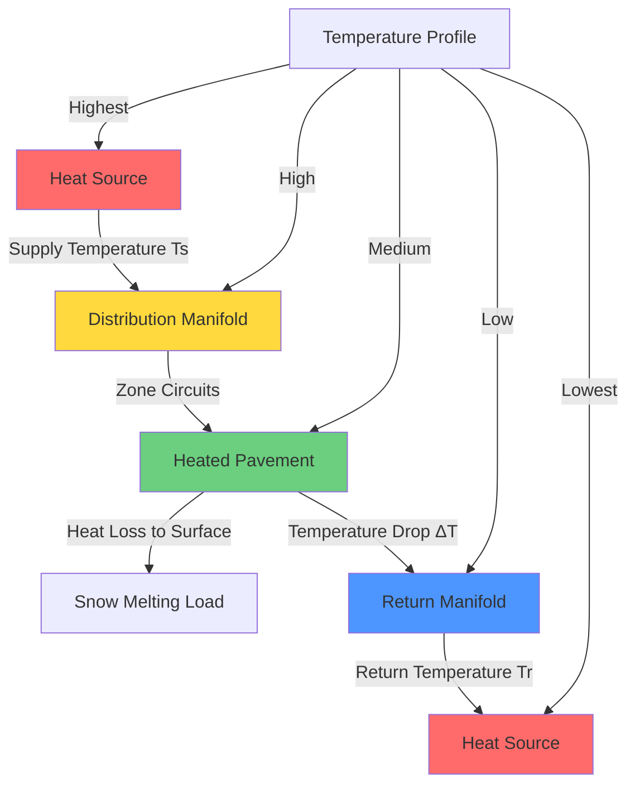

## Fundamentals of Fluid Temperature Design

Fluid temperature selection in hydronic snow melting systems directly governs heat transfer capacity, energy consumption, and system reliability. The temperature differential between supply and return fluid determines the heat delivery rate for a given flow rate, following fundamental heat transfer principles.

The heat transfer from fluid to pavement surface occurs through three sequential thermal resistances: convective transfer from fluid to tubing inner surface, conduction through tubing wall, and conduction through pavement to surface. Higher fluid temperatures increase the driving force for heat transfer across these resistances.

## Heat Transfer Calculations

The heat delivered by the hydronic fluid follows the sensible heat equation:

$$Q = \dot{m} c_p (T_s - T_r)$$

Where:
- $Q$ = heat transfer rate (Btu/hr or W)
- $\dot{m}$ = mass flow rate (lb/hr or kg/s)
- $c_p$ = specific heat capacity of fluid (Btu/lb-°F or J/kg-K)
- $T_s$ = supply fluid temperature (°F or °C)
- $T_r$ = return fluid temperature (°F or °C)

For volumetric flow rates, this becomes:

$$Q = \dot{V} \rho c_p \Delta T$$

Where $\dot{V}$ is volumetric flow rate and $\rho$ is fluid density. For water at standard conditions, this simplifies to:

$$Q \text{ (Btu/hr)} = 500 \times \text{GPM} \times \Delta T \text{ (°F)}$$

$$Q \text{ (kW)} = 4.187 \times \text{L/s} \times \Delta T \text{ (°C)}$$

The required supply temperature depends on design snow melting load, tube spacing, embedment depth, and pavement thermal conductivity:

$$T_s = T_{surf} + \frac{q_{sm}}{U_{eff}}$$

Where:
- $T_{surf}$ = pavement surface temperature during melting (typically 32-35°F)
- $q_{sm}$ = design snow melting heat flux (Btu/hr-ft² or W/m²)
- $U_{eff}$ = effective heat transfer coefficient from fluid to surface

## Temperature Profile Analysis

The fluid experiences maximum temperature at the heat source outlet and minimum temperature at the return manifold after traversing all circuit lengths. Temperature stratification within the pavement creates a temperature gradient from tube depth to surface.

## Supply and Return Temperature Criteria

Supply fluid temperature must satisfy two primary requirements:

1. **Heat flux delivery**: Sufficient temperature differential between fluid and pavement surface to deliver design snow melting load
2. **Freeze protection**: Temperature maintained above freezing throughout system, including longest circuits at design flow rates

ASHRAE recommends supply temperatures between 95-140°F (35-60°C) for most applications. Higher temperatures enable:

- Reduced tube spacing for given heat output
- Faster snow melting response
- Lower required flow rates
- Smaller tubing diameter

However, excessive temperatures create thermal stress in pavement, increase heat losses from distribution piping, and reduce heat source efficiency.

Return temperature design balances system efficiency against first cost:

- Larger $\Delta T$ (20-30°F): Reduced flow rate, smaller pipe sizing, lower pumping energy
- Smaller $\Delta T$ (10-15°F): More uniform surface temperature, reduced tube spacing variation

## Temperature Comparison by Heat Source

| Heat Source Type | Typical Supply Temp | Return Temp | Delta T | Fluid Type | Notes |
|-----------------|-------------------|-------------|---------|------------|-------|
| Gas boiler | 120-160°F (49-71°C) | 100-130°F | 20-30°F | Water or glycol | High temperature capability |
| Condensing boiler | 95-140°F (35-60°C) | 75-110°F | 20-30°F | Water or glycol | Optimized for low return temps |
| Heat pump | 95-120°F (35-49°C) | 80-105°F | 15-20°F | Water or glycol | Temperature limited by refrigerant |
| Solar thermal | 100-130°F (38-54°C) | 80-110°F | 20-30°F | Glycol required | Variable based on insolation |
| Geothermal | 90-110°F (32-43°C) | 70-90°F | 15-25°F | Water or glycol | Lower temperature differential |
| Electric boiler | 110-150°F (43-66°C) | 90-120°F | 20-30°F | Water or glycol | Precise temperature control |
| Waste heat recovery | 100-140°F (38-60°C) | 80-110°F | 20-30°F | Depends on source | Temperature varies with source |

## Glycol Solution Effects

Antifreeze glycol solutions alter fluid thermal properties:

**Propylene glycol at 30% concentration:**
- Specific heat: 15% lower than water
- Density: 3% higher than water
- Viscosity: 2-3 times water viscosity
- Freezing point: -10°F (-23°C)

These property changes require higher flow rates (approximately 15-20% increase) to deliver equivalent heat transfer. Pumping power increases significantly due to elevated viscosity, particularly at lower temperatures.

The modified heat transfer equation for glycol solutions:

$$Q = 500 \times \text{GPM} \times \Delta T \times \text{SG} \times \frac{c_{p,glycol}}{c_{p,water}}$$

Where SG is specific gravity of the glycol solution.

## Design Temperature Selection

Supply temperature selection process:

1. Calculate design snow melting heat flux from ASHRAE methodology
2. Determine required surface-to-ambient heat transfer rate
3. Establish tube spacing and embedment depth based on installation constraints
4. Calculate required average fluid temperature using thermal resistance network
5. Add safety factor (typically 10-15°F) for response time and load variation
6. Select supply temperature accounting for heat source limitations

Return temperature results from design flow rate and supply temperature, constrained by maximum allowable circuit pressure drop and minimum velocity for air purging (typically 2-3 ft/s).

Optimal design achieves balance between capital cost (affected by tube spacing, tubing diameter, and heat source sizing) and operating cost (influenced by supply temperature, pumping power, and heat source efficiency).

## Operational Considerations

Fluid temperature control strategies include:

- **Constant supply temperature**: Simplest control, varies flow rate based on demand
- **Outdoor reset**: Reduces supply temperature during milder conditions for efficiency
- **Modulating control**: Adjusts both temperature and flow based on snow detection and pavement sensors

Lower return temperatures improve condensing boiler efficiency by enabling flue gas condensation, recovering latent heat. Target return temperatures below 130°F (54°C) maximize condensing operation.

Mixing valves prevent excessively high supply temperatures during startup or light load conditions, protecting pavement from thermal shock and reducing surface evaporation losses.
