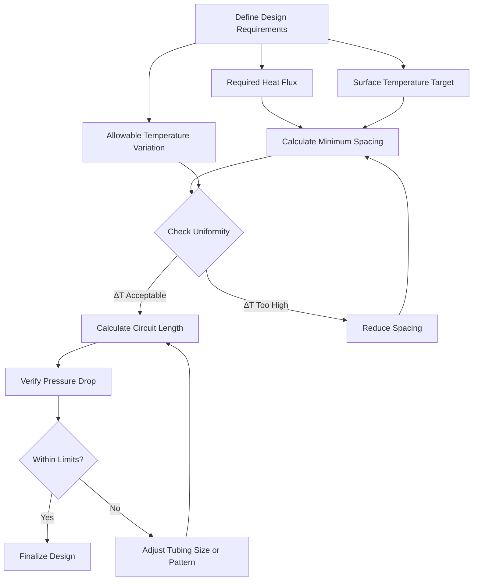
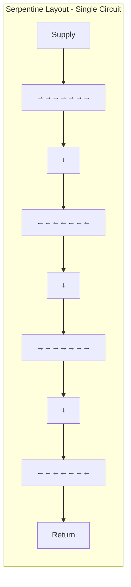
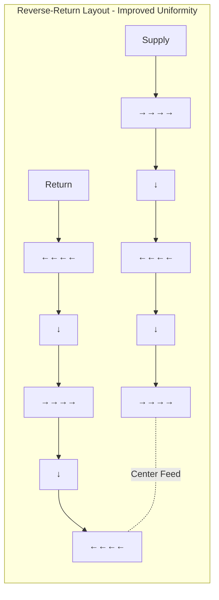

Tube spacing represents the fundamental design parameter determining hydronic snow melting system performance. The spacing between adjacent tubing runs controls surface temperature distribution, total heat output capacity, installation cost, and temperature uniformity. Proper spacing design balances thermal performance requirements against economic constraints while ensuring complete snow and ice melting across the entire surface.

## Heat Transfer Fundamentals

Heat flows from embedded tubing through the pavement structure to the surface via conduction. The temperature distribution within the slab depends on tubing spacing, slab thermal conductivity, tube depth, and fluid temperature. The surface exhibits maximum temperature directly above each tube and minimum temperature at the midpoint between adjacent tubes.

### Temperature Profile Physics

For a horizontal plane containing multiple heat sources (tubes), the temperature field can be approximated using superposition of individual tube effects. At any point on the surface, the temperature results from contributions of all nearby tubes, with closer tubes contributing proportionally more heat.

The steady-state temperature difference between the surface point directly above a tube ($T_{max}$) and the midpoint between tubes ($T_{min}$) depends on spacing:

$$\Delta T_{surface} = T_{max} - T_{min} = \frac{q \cdot s}{2k_{eff}} \cdot f(d, s)$$

Where:
- $\Delta T_{surface}$ = surface temperature variation (°F)
- $q$ = heat flux per unit area (BTU/hr·ft²)
- $s$ = tube spacing (ft)
- $k_{eff}$ = effective thermal conductivity of pavement (BTU/hr·ft·°F)
- $f(d, s)$ = geometric function accounting for tube depth $d$ and spacing $s$

This relationship shows surface temperature variation increases linearly with spacing and decreases with higher thermal conductivity. Concrete's superior thermal conductivity (8-12 BTU/hr·ft·°F) compared to asphalt (4-6 BTU/hr·ft·°F) allows wider tube spacing for equivalent temperature uniformity.

## Spacing-to-Heat Output Relationship

Heat output per unit area increases inversely with tube spacing for a given fluid temperature and slab configuration. Doubling tube spacing reduces heat flux by approximately 50%, though the relationship becomes nonlinear as spacing approaches very wide or very narrow limits.

### Heat Flux Calculation

The average heat flux delivered to the surface depends on the temperature difference between fluid and surface, thermal resistance of the pavement above tubes, and tube spacing:

$$q = \frac{T_f - T_s}{R_{total}} = \frac{T_f - T_s}{\frac{s \cdot d}{k_{slab}} + R_{tube} + R_{interface}}$$

Where:
- $T_f$ = average fluid temperature (°F)
- $T_s$ = required surface temperature (°F)
- $R_{total}$ = total thermal resistance (hr·ft²·°F/BTU)
- $d$ = tube burial depth from surface (ft)
- $k_{slab}$ = slab thermal conductivity (BTU/hr·ft·°F)
- $R_{tube}$ = tube wall thermal resistance (typically negligible for thin-wall PEX)
- $R_{interface}$ = concrete-to-tube contact resistance

For well-installed systems in concrete, interface resistance remains minimal when tubing contacts concrete uniformly. The dominant resistance term becomes the conduction path through concrete from tube to surface.

### Typical Spacing and Heat Flux Values

| Tube Spacing (in) | Heat Flux Capacity (BTU/hr·ft²) | Application Type | Surface Temp Variation (°F) |
|-------------------|----------------------------------|------------------|----------------------------|
| 4 | 300-400 | Bridge decks, extreme climates | 3-5 |
| 6 | 200-300 | High-priority areas, ramps | 5-8 |
| 9 | 150-200 | Standard commercial, driveways | 8-12 |
| 12 | 100-150 | Residential walkways, mild climate | 12-18 |
| 15 | 75-125 | Low snow load areas, backup systems | 18-25 |

Values assume 4-inch concrete slab, 2-inch tube depth, 120°F average fluid temperature, and 32°F surface temperature requirement.

## Slab Depth Effects on Spacing

Slab thickness and tube burial depth significantly affect required tube spacing and achievable heat flux. Deeper tube placement increases thermal resistance between fluid and surface, requiring closer spacing or higher fluid temperature to maintain equivalent output.

### Optimal Tube Depth

Position tubing at 40-50% of total slab depth measured from the finished surface. This location balances surface heat delivery against mechanical protection during construction and service. For standard residential applications:

- **4-inch slab:** 1.5 to 2 inches from surface
- **6-inch slab:** 2.5 to 3 inches from surface
- **8-inch slab:** 3 to 4 inches from surface

Shallower placement improves thermal response and reduces required fluid temperature but increases construction damage risk. Deeper placement provides better protection but necessitates higher temperatures or closer spacing.

### Depth-Spacing Interaction

The relationship between tube depth and required spacing for constant heat flux follows:

$$\frac{s_2}{s_1} = \sqrt{\frac{d_1}{d_2}}$$

For a given heat output target, doubling tube depth requires spacing reduction by factor of $\sqrt{2}$ ≈ 1.41, or approximately 30% tighter spacing. Conversely, tubes installed at half the depth allow 41% wider spacing.

## Temperature Uniformity Requirements

Surface temperature variation between tubes creates visual patterns during melting—snow melts first above tubes, creating stripes. Acceptable variation depends on application criticality and aesthetic concerns.

### Uniformity Criteria

ASHRAE recommends limiting surface temperature variation to maintain consistent melting performance:

- **Critical applications (hospital entries, emergency access):** ≤ 5°F variation
- **Commercial applications (sidewalks, retail entries):** ≤ 10°F variation
- **Residential applications (driveways, walkways):** ≤ 15°F variation

Achieving tighter uniformity requires closer spacing, higher slab thermal conductivity, or shallower tube placement. Economic analysis typically justifies 8-12°F variation for most commercial installations.

### Uniformity Calculation Method

Estimate surface temperature variation using the dimensionless spacing ratio:

$$\Psi = \frac{s}{d}$$

Where $\Psi$ represents the spacing-to-depth ratio. Lower ratios produce more uniform temperatures:

- $\Psi < 4$: Excellent uniformity (< 5°F variation)
- $\Psi = 4-6$: Good uniformity (5-10°F variation)
- $\Psi = 6-8$: Acceptable uniformity (10-15°F variation)
- $\Psi > 8$: Poor uniformity (> 15°F variation)

For 9-inch spacing and 2-inch depth: $\Psi = 9/2 = 4.5$, predicting 5-10°F variation.

## Spacing Design Procedure

### Step-by-Step Design Process

**Step 1: Determine Required Heat Flux**

Calculate design heat flux from ASHRAE Chapter 51 procedures based on:
- Local snowfall intensity and frequency
- Acceptable snow accumulation
- Wind speed and air temperature
- System responsiveness requirements

Typical design values: 150-250 BTU/hr·ft² for most applications.

**Step 2: Establish Fluid Temperature**

Select supply fluid temperature based on heat source and efficiency targets:
- Low temperature systems: 90-110°F (heat pumps, condensing boilers)
- Standard systems: 110-130°F (conventional boilers)
- High output systems: 130-150°F (heavy snow, rapid response)

**Step 3: Calculate Initial Spacing**

Use simplified spacing equation for preliminary estimate:

$$s = \frac{k_{eff}(T_f - T_s)}{q \cdot d} \cdot 12 \text{ (inches)}$$

Apply effectiveness factor (typically 0.7-0.9) to account for non-ideal heat transfer, fluid temperature drop along circuits, and edge losses.

**Step 4: Verify Temperature Uniformity**

Calculate spacing-to-depth ratio and estimate surface temperature variation. If variation exceeds requirements, reduce spacing proportionally.

**Step 5: Optimize for Edge Zones**

Reduce spacing by 25-50% within 2-3 feet of slab edges and perimeter areas where heat losses increase due to exposed edge conditions. Typical edge zone spacing: 6 inches when field spacing is 9 inches.

## Tubing Layout Patterns

Physical tubing arrangement affects overall system performance, particularly thermal uniformity and hydraulic characteristics.

### Serpentine Pattern

Simple serpentine creates temperature gradient across the slab as fluid cools from supply to return. The supply side operates warmer than return side, creating uneven melting performance.

### Reverse-Return Serpentine Pattern

Center-feed reverse-return pattern provides superior uniformity by equalizing average fluid temperature across the entire surface. Supply and return sides interleave, averaging out temperature differences.

## Practical Installation Considerations

**Tubing Attachment:** Secure tubing every 24-36 inches using plastic zip ties to prevent floating during concrete placement. Avoid metal fasteners that create thermal bridges and potential corrosion sites.

**Pressure Testing:** Test circuits at 100 psi minimum before concrete pour and maintain pressure during placement to immediately detect any damage from foot traffic or concrete equipment.

**Construction Sequencing:** Install tubing after vapor barrier and insulation (if used) but before concrete placement. Coordinate with concrete contractor to minimize tube damage risk.

**Expansion Joints:** Route tubing through isolation joints using flexible pipe sleeves to accommodate slab movement without tube damage. Never rigidly penetrate expansion joints.

## Economic Optimization

Total installed cost increases with closer spacing due to:
- Higher tubing material costs (more linear feet per square foot)
- Increased labor for installation
- Larger manifolds and distribution equipment
- Higher pump energy from increased pressure drop

Balance performance benefits against cost increases. For most commercial applications, 9-inch spacing provides optimal cost-effectiveness. Residential projects often use 12-inch spacing to reduce installation costs, accepting slightly reduced performance.

Perform life-cycle cost analysis including installation costs, operating energy, and maintenance when selecting spacing for critical applications. Closer spacing increases first cost but may reduce operating costs through lower required fluid temperatures.

## Design References

ASHRAE Handbook—HVAC Applications, Chapter 51 (Snow Melting and Freeze Protection) provides comprehensive calculation procedures, including:

- Detailed heat flux calculation methodology
- Tubing spacing charts for various slab configurations
- Fluid temperature and flow rate determination
- Edge zone design considerations
- Control strategy recommendations

For precise designs, use ASHRAE calculation procedures or specialized snow melting design software that accounts for all system variables and local climate conditions.

---

**File:** /Users/evgenygantman/Documents/github/gantmane/hvac/content/specialty-applications-testing/specialty-hvac-applications/snow-melting-freeze-protection-systems/hydronic-snow-melting/tube-spacing/_index.md

**Key Technical Points:**
- Surface temperature variation increases linearly with tube spacing and inversely with slab thermal conductivity
- Heat flux capacity decreases proportionally with wider spacing; doubling spacing reduces output by ~50%
- Optimal tube depth is 40-50% of slab thickness measured from surface (typically 2 inches for 4-inch slab)
- Spacing-to-depth ratio (Ψ) below 6 provides acceptable temperature uniformity for most applications
- Edge zones require 25-50% closer spacing than field areas to compensate for increased heat losses
- Reverse-return serpentine patterns provide superior temperature uniformity compared to simple serpentine
- Standard spacing ranges: 6 inches (high output), 9 inches (commercial), 12 inches (residential)
