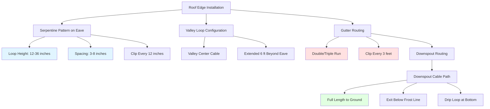

## Physical Principles of Cable Installation

Effective roof and gutter heating cable installation depends on strategic heat placement to counteract three heat transfer mechanisms: conduction through roofing materials, convection from air movement, and radiation to the cold sky. Cable layout must address thermal bridging at roof edges where heat loss concentrates, creating ice dam formation zones.

The installation strategy targets critical heat loss areas: roof eaves where warm attic air rises and melts snow that refreezes at the cold overhang, valleys where concentrated water flow occurs, and gutters where standing water freezes due to insufficient drainage velocity.

## Cable Spacing Calculations

### Roof Edge Serpentine Pattern

Cable spacing on roof surfaces follows heat diffusion principles. The effective heating width per cable pass depends on roof material thermal conductivity and ambient conditions.

**Required cable length for serpentine pattern:**

$$L_{serpentine} = \frac{W_{roof} \cdot D_{loop}}{S_{spacing}} + 2 \cdot H_{vertical}$$

Where:
- $L_{serpentine}$ = total cable length (ft)
- $W_{roof}$ = roof edge width (ft)
- $D_{loop}$ = depth of serpentine loops into roof (ft), typically 12-36 inches
- $S_{spacing}$ = horizontal spacing between cable passes (in), typically 3-8 inches
- $H_{vertical}$ = vertical drop to gutter plus routing (ft)

**Heat output per unit area:**

$$q'' = \frac{P_{cable} \cdot L_{effective}}{A_{coverage}}$$

Where:
- $q''$ = heat flux (W/ft²)
- $P_{cable}$ = cable power density (W/ft)
- $L_{effective}$ = effective heating cable length in zone (ft)
- $A_{coverage}$ = area requiring protection (ft²)

Target heat flux ranges from 40-80 W/ft² depending on climate zone and roof exposure.

### Gutter Cable Density

Gutters require concentrated heat to maintain liquid flow. Cable density accounts for the gutter's thermal mass and heat loss to ambient air.

**Gutter cable requirement:**

$$N_{cables} = \frac{Q_{required}}{P_{cable}}$$

$$Q_{required} = \dot{m}_{melt} \cdot (L_f + c_p \cdot \Delta T) \cdot SF$$

Where:
- $N_{cables}$ = number of cable runs in gutter
- $Q_{required}$ = heat requirement (W/ft)
- $\dot{m}_{melt}$ = melt rate (lb/hr-ft), typically 2-5 lb/hr-ft
- $L_f$ = latent heat of fusion, 144 BTU/lb (334 J/g)
- $c_p$ = specific heat of water, 1 BTU/(lb·°F)
- $\Delta T$ = temperature rise needed (°F)
- $SF$ = safety factor, 1.5-2.0

Standard practice places 1-3 cable runs in gutters depending on width and exposure.

## Installation Patterns

## Installation Method Comparison

| Method | Application | Cable Spacing | Heat Density | Installation Time | Cost Factor |
|--------|-------------|---------------|--------------|-------------------|-------------|
| **Serpentine Roof Edge** | Ice dam prevention at eaves | 3-8 inches | 50-80 W/ft² | 2-3 hr/100 ft | 1.0x |
| **Gutter Single Run** | Light freeze protection | N/A (1 cable) | 30-50 W/ft | 1 hr/50 ft | 0.6x |
| **Gutter Double/Triple Run** | Heavy snow/ice conditions | Parallel runs | 60-120 W/ft | 1.5 hr/50 ft | 1.2x |
| **Valley Extended Loop** | Concentrated flow areas | 6-12 inches | 80-120 W/ft² | 3-4 hr/100 ft | 1.4x |
| **Full Downspout** | Prevent blockage | Inside downspout | 15-25 W/ft | 0.5 hr/ea | 0.4x |
| **Drip Edge Only** | Minimal protection | 12 inches | 25-40 W/ft² | 1 hr/100 ft | 0.5x |

## Attachment Methods and Hardware

### Cable Clips for Roof Surfaces

**Shingle Applications:**
- Use metal or plastic clips designed for shingle penetration
- Install clips every 12-18 inches along cable run
- Position clips to penetrate through shingle tab into roof deck
- Seal penetrations with roofing cement or manufacturer-supplied sealant
- Clips must withstand 20 lb pull force minimum

**Metal Roof Applications:**
- Magnetic clips for standing seam roofs (no penetration)
- Self-tapping screw clips for corrugated metal
- Clip spacing: 12 inches on vertical surfaces, 18 inches on horizontal
- Use stainless steel or coated hardware to prevent galvanic corrosion

### Gutter Attachment

**Clip Types:**
- Gutter edge clips that hook over gutter lip
- Through-bottom clips with rubber gaskets (sealed penetration)
- Spacing: every 3 feet minimum, every 2 feet for heavy cable

**Thermal Expansion Consideration:**
The cable experiences thermal cycling from -40°F to 150°F (operating). Use flexible attachment points or provide slack every 50 feet to accommodate expansion:

$$\Delta L = \alpha \cdot L_0 \cdot \Delta T$$

Where:
- $\Delta L$ = expansion (in)
- $\alpha$ = thermal expansion coefficient, typically 6-8 × 10⁻⁵ in/(in·°F) for cable
- $L_0$ = original length (ft)
- $\Delta T$ = temperature swing (°F)

## Downspout Cable Routing

Cable must traverse the full downspout length to prevent ice plug formation. Ice blockage at any point creates backup and overflow.

**Installation Protocol:**
1. Route cable inside downspout full length
2. Secure at top with clip or cable tie
3. Add slack loop (6-12 inches) every 10 feet
4. Exit downspout below frost line or at splash block
5. Create drip loop at exit to prevent water tracking back along cable

**Power requirement for downspout:**

$$P_{downspout} = L_{downspout} \cdot P_{cable} + P_{exit}$$

Where $P_{exit}$ accounts for 3-5 feet of exposed cable at ground level.

## Roof Penetration and Sealing Standards

All cable entry points through roof surfaces create potential leak paths. Proper sealing follows roofing industry standards (NRCA guidelines):

**Sealing Materials:**
- Silicone or polyurethane roofing sealant (UV-stable)
- Self-adhesive rubber boot for cable entry (rated for exterior use)
- Metal flashing at major penetrations

**Application:**
1. Create smooth transition from roof surface to cable
2. Apply sealant in 1/4-inch bead around penetration
3. Install rubber boot over cable, press into sealant
4. Apply second sealant bead over boot edge
5. Inspect annually for degradation

## Electrical Connection Zone

Cable termination must occur in weatherproof junction box rated NEMA 3R minimum. The cold tail (non-heating lead section) extends from the heated cable to the power connection point.

**Cold tail routing:**
- Protect cold tail in conduit if exposed
- Route to avoid foot traffic and mechanical damage
- Clearly label "Roof Heating - Do Not Remove"
- Connect through GFCI protection (required by NEC)

## Installation Quality Factors

**Cable Damage Prevention:**
- Avoid sharp bends (minimum bend radius: 1-2 inches depending on cable type)
- Do not stretch cable during installation
- Protect from sharp edges with edge protectors
- Test continuity before and after installation

**System Effectiveness:**
Installation quality directly affects heat transfer efficiency. Poor clip spacing creates cable sag, reducing contact with roof surface and decreasing conductive heat transfer by 30-50%. Excessive spacing between serpentine loops leaves cold zones where ice still forms.

The thermal contact resistance between cable and roof surface is:

$$R_{contact} = \frac{1}{h_{contact} \cdot A_{contact}}$$

Good installation (cable pressed firmly to surface) achieves $h_{contact}$ = 5-10 BTU/(hr·ft²·°F). Poor installation (air gaps) reduces this to 1-2 BTU/(hr·ft²·°F), requiring significantly higher cable temperatures and energy consumption.

## Maintenance Access

Design installations for long-term serviceability. Cable life expectancy ranges from 10-20 years depending on cable quality and installation conditions. Provide:
- Access to junction boxes without roof ladder requirement
- Labeled circuit identification at breaker panel
- Installation diagram showing cable routing (photograph before covering)
- Clear marking of cable locations to prevent accidental damage during roof work
