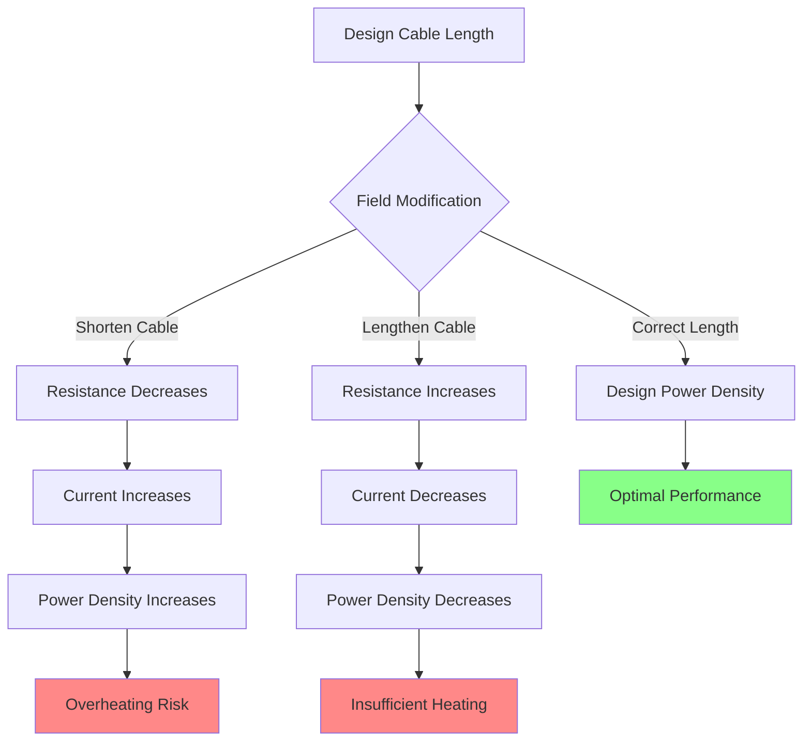

## Operating Principle

Constant wattage heating cables maintain fixed power output per unit length regardless of ambient temperature or surface conditions. This consistent performance derives from a series resistance heating element design where electrical resistance remains constant across the operating temperature range, producing predictable heat generation governed by Joule heating:

$$Q = I^2 R = \frac{V^2}{R}$$

where $Q$ represents heat generation (watts), $I$ is current (amperes), $R$ is resistance (ohms), and $V$ is applied voltage (volts).

Unlike self-regulating cables that modulate power output based on temperature-dependent polymer resistance, constant wattage designs deliver identical heat flux whether exposed to -40°F arctic conditions or 50°F moderate weather. This temperature-independent operation provides reliable performance in extreme cold where self-regulating cables experience reduced effectiveness.

## Series Resistance Construction

Constant wattage cables utilize continuous resistance wire elements configured in specific patterns to achieve target power density:

**Parallel resistance configuration.** Two bus wires run the full cable length with resistance heating wire woven between them in continuous parallel circuits. Each small section creates an independent heating zone powered by the main bus conductors. Total power output equals the sum of all parallel resistance segments.

**Series resistance configuration.** A single continuous heating element extends the full cable length between power connection and termination end. The total cable resistance determines current flow for a given applied voltage, establishing fixed power output. Any modification to cable length changes total resistance and alters power delivery across the entire circuit.

**Mineral insulated (MI) cable.** Heating conductor(s) suspended in compacted magnesium oxide powder insulation within a seamless metal sheath. This construction tolerates sustained exposure temperatures to 450°F and provides superior moisture resistance, extending service life beyond 25 years in harsh environments.

### Power Density Relationship

For series resistance designs, power per unit length relates directly to total cable length and applied voltage:

$$P_{total} = \frac{V^2}{R_{total}} \quad \text{and} \quad R_{total} = r \times L$$

where $P_{total}$ is total cable power (watts), $R_{total}$ is total cable resistance (ohms), $r$ is resistance per unit length (ohms/ft), and $L$ is total cable length (feet).

Power density (watts per foot) becomes:

$$P_{density} = \frac{P_{total}}{L} = \frac{V^2}{r \times L^2}$$

This inverse square relationship with length creates the fundamental cut-to-length limitation: shortening a series resistance cable reduces total resistance, increases current flow, and raises power density beyond design limits. Conversely, extending cable length reduces power density below effective heating thresholds.

## Cut-to-Length Limitations

Series resistance constant wattage cables require precise length specification during manufacturing. Field modifications compromise performance and safety:

**Shortening consequences.** Reducing cable length from design specification decreases total resistance, increasing current draw and power density. A 10% length reduction increases power density by approximately 23% through the combined effect of reduced resistance and shorter heat distribution length:

$$\frac{P_{density,short}}{P_{density,design}} = \left(\frac{L_{design}}{L_{short}}\right)^2$$

This elevated power density causes localized overheating, accelerates insulation degradation, and may exceed NEC temperature rise limits for contact with building materials.

**Lengthening consequences.** Extending cable length increases total resistance and reduces power density. A 10% length increase decreases power density by approximately 17%, potentially creating cold spots where heat output proves insufficient for ice prevention.

**Installation planning.** Measure roof edge, gutter, and downspout dimensions accurately before cable procurement. Order cables in precise lengths matching installation requirements plus 5% allowance for routing variations and connection details. Series resistance cables do not accommodate field length adjustment.

## Standard Power Ratings

Constant wattage cables are available in fixed power densities matched to specific applications:

| Power Density | Typical Application | Circuit Length Limit | Current Draw (120V) |
|---------------|---------------------|----------------------|---------------------|
| 5 W/ft | Light gutter heating, mild climates | 200 ft max | 8.3 A per 100 ft |
| 8 W/ft | Standard gutter/downspout heating | 150 ft max | 10 A per 100 ft |
| 10 W/ft | Roof edge serpentine patterns | 120 ft max | 12.5 A per 100 ft |
| 12 W/ft | Heavy-duty applications, metal gutters | 100 ft max | 15 A per 100 ft |
| 15 W/ft | Commercial applications, severe exposure | 80 ft max | 18.75 A per 100 ft |

Circuit length limits reflect NEC voltage drop requirements (maximum 3% for branch circuits) and practical circuit breaker sizing. Higher power densities enable shorter circuit runs before reaching ampacity limits.

## Voltage Options and Selection

Constant wattage cables are manufactured for specific operating voltages. Applying incorrect voltage produces power output deviating from design specifications according to:

$$P_{actual} = P_{rated} \times \left(\frac{V_{actual}}{V_{rated}}\right)^2$$

A 240V cable energized at 208V delivers only 75% of rated power output. Conversely, applying 277V to a 240V cable produces 33% excess power, causing rapid insulation failure.

**Voltage selection criteria:**

- **120V systems:** Residential applications, shorter circuit runs (<100 ft), readily available GFCI protection
- **208V systems:** Commercial buildings with three-phase service, longer circuits, reduced current draw
- **240V systems:** Residential split-phase service, optimized for longer circuit runs, lower current requirements
- **277V systems:** Commercial applications with 480V three-phase service, maximum circuit length capability

Higher operating voltages reduce current draw for equivalent power output, enabling longer circuit runs before reaching conductor ampacity limits or experiencing excessive voltage drop.

## Installation Requirements per NEC Article 426

NEC Article 426 governs installation of fixed outdoor electric deicing and snow-melting equipment, establishing specific requirements for roof and gutter heating cables:

**426.10 General.** Heating equipment must be identified as suitable for outdoor installation and ice prevention applications. Cables must carry appropriate UL listing for deicing applications.

**426.20 Thermal Protection.** Constant wattage cables require external thermal protection (thermostats or temperature limiters) to prevent overheating when covered by insulating snow or debris. Self-limiting through temperature-dependent resistance does not occur in constant wattage designs.

**426.28 Ground Fault Protection.** All circuits require ground fault circuit interrupter protection for personnel safety. GFCI protection must function at outdoor temperatures, requiring special cold-weather rated devices for reliable operation.

**426.50 Conductor Ampacity.** Supply conductors must be sized for 125% of continuous heating load. For a 100-foot cable at 10 W/ft (1000W total), 120V circuit draws 8.33A, requiring supply conductors rated for minimum 10.4A continuous.

**426.52 Overcurrent Protection.** Branch circuit overcurrent devices must be sized for 125% of continuous load. The same 1000W load requires minimum 10.4A overcurrent protection, typically served by a 15A circuit breaker with adequate margin.

## Control Integration

Constant wattage cables deliver full rated power whenever energized, making control strategy critical for energy efficiency and operational cost management:

### Ambient Temperature Control

Single-stage thermostats activate heating when outdoor temperature falls below setpoint (typically 38-42°F). This simple approach provides automatic operation but may energize systems during periods without precipitation, wasting energy during dry cold conditions.

Response characteristics follow simple on/off logic:

$$\text{Heater state} = \begin{cases}
\text{ON} & T_{ambient} < T_{setpoint} \\
\text{OFF} & T_{ambient} \geq T_{setpoint} + \Delta T_{differential}
\end{cases}$$

where $\Delta T_{differential}$ represents the control differential (typically 2-4°F) preventing rapid cycling.

### Moisture and Temperature Control

Combined moisture sensors and temperature measurement activate heating only when ice formation conditions exist (temperature below 40°F AND moisture present). This advanced control reduces energy consumption by 45-60% compared to temperature-only control while maintaining effective ice prevention.

The logic combines both inputs:

$$\text{Heater state} = (T_{ambient} < T_{setpoint}) \land (\text{Moisture detected})$$

Moisture detection methods include precipitation sensors, ice detection sensors, or sophisticated systems measuring water presence on heated surfaces.

### Temperature Limiting

All constant wattage installations require high-temperature limit protection independent of primary control. Limit switches mounted at cable surface prevent overheating if snow accumulation insulates cables, trapping generated heat and raising surface temperatures above safe limits.

Typical limit settings:

- Polymer insulated cables: 160-180°F
- Mineral insulated cables: 250-300°F
- Contact with combustible materials: 90°F maximum per NEC 426.20(B)

## Performance Comparison: Constant vs Self-Regulating

| Characteristic | Constant Wattage | Self-Regulating |
|----------------|------------------|-----------------|
| Power output | Fixed at all temperatures | Variable with temperature |
| Extreme cold performance | Maintains full output to -60°F | Output decreases below -20°F |
| Energy efficiency | Requires active control for efficiency | Automatic power reduction in mild weather |
| Overlap capability | Prohibited without thermostat | Safe due to automatic power reduction |
| Service life | 20-25 years (MI cable), 15-20 years (polymer) | 10-15 years before degradation |
| Initial cost | Lower | Higher (30-50% premium) |
| Operating cost | Higher without optimization | Lower through automatic modulation |
| Field cutting | Prohibited for series resistance | Permitted at any point |
| Installation complexity | Requires precise length planning | Flexible field adaptation |

## Application Guidelines

**Optimal constant wattage applications:**

- Extreme cold climates where ambient temperatures regularly fall below -20°F
- Critical drainage systems requiring guaranteed heat output regardless of conditions
- Long service life installations where 20+ year performance justifies higher operating costs
- Applications requiring precise, predictable heat flux for thermal modeling
- Retrofits where existing control infrastructure supports efficient operation

**Applications favoring self-regulating cables:**

- Moderate climates with temperatures typically above -10°F
- Energy-conscious installations prioritizing operating cost over initial investment
- Complex roof geometries requiring field-adaptable cable routing
- Installations without sophisticated control systems

## Circuit Design Example

Design a constant wattage system for residential gutter heating:

**Requirements:**
- Gutter length: 80 feet
- Downspout length: 20 feet
- Climate: Cold with temperatures to -20°F
- Available service: 120V, 20A circuit

**Cable selection:**
- Gutter: 8 W/ft constant wattage
- Downspout: 10 W/ft constant wattage

**Load calculation:**

$$P_{gutter} = 80 \text{ ft} \times 8 \text{ W/ft} = 640 \text{ W}$$

$$P_{downspout} = 20 \text{ ft} \times 10 \text{ W/ft} = 200 \text{ W}$$

$$P_{total} = 640 + 200 = 840 \text{ W}$$

**Current draw:**

$$I = \frac{P_{total}}{V} = \frac{840 \text{ W}}{120 \text{ V}} = 7.0 \text{ A}$$

**Required circuit breaker (125% continuous load):**

$$I_{breaker} = 7.0 \text{ A} \times 1.25 = 8.75 \text{ A} \rightarrow 15 \text{ A breaker}$$

This design provides adequate margin on the 20A circuit (35% utilization) while meeting NEC continuous load requirements. The 15A breaker protects both cables while allowing normal operation.

**Control recommendation:** Ambient sensor with 40°F activation setpoint provides simple automatic operation. Adding moisture sensing reduces energy consumption approximately 50% at operating cost of $85/winter (840W × $0.12/kWh × 850 hours) without moisture control, reducing to $42/winter with moisture sensing.

## Maintenance and Troubleshooting

Annual inspection before winter season should verify:

1. Cable physical condition—no cuts, abrasions, or damage to jacket
2. End seal integrity—watertight terminations at all cable ends
3. Clip attachment security—all mounting clips firmly attached
4. Electrical continuity—resistance measurement matching manufacturer specifications
5. Ground fault protection—GFCI test button function verification
6. Control calibration—thermostat setpoint accuracy within ±3°F

Common failure modes include moisture intrusion at damaged jacket locations, end seal deterioration allowing water penetration to conductor cores, and cold lead splice failures from thermal cycling stress. Most failures manifest as ground faults detected by GFCI protection before creating hazardous conditions.

Expected service life for properly installed constant wattage cables ranges from 15-20 years for polymer-insulated designs to 25+ years for mineral-insulated constructions in non-corrosive environments.
