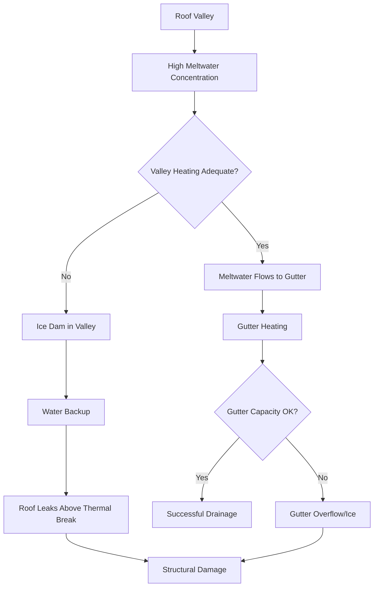

Ice dams form when heat escaping through the roof melts snow on upper surfaces, creating meltwater that refreezes at the cold eave overhang. This creates a barrier that traps subsequent meltwater, leading to roof leaks, gutter damage, and structural ice loads. Prevention requires strategic heat application to maintain drainage pathways.

## Ice Dam Formation Physics

The temperature gradient across a roof surface drives ice dam formation through three distinct thermal zones:

**Upper Roof Zone**: Interior heat loss warms the roof deck above 32°F (0°C), melting accumulated snow. The heat flux through the roof assembly is:

$$q'' = \frac{T_{interior} - T_{roof}}{R_{total}} = \frac{\Delta T}{R_{insulation} + R_{deck} + R_{shingles}}$$

where $q''$ is heat flux (Btu/hr·ft² or W/m²) and $R_{total}$ represents the combined thermal resistance of the roof assembly.

**Eave Zone**: The eave overhang, lacking interior heat, remains at ambient temperature. When meltwater from the upper zone reaches this cold surface, it refreezes, creating the ice dam.

**Valley Zone**: Roof valleys concentrate meltwater flow, creating localized high-volume freezing conditions that rapidly build ice accumulations.

The critical transition occurs at the thermal break between heated and unheated roof sections. The refreezing rate at the eave depends on:

$$\dot{m}_{ice} = \frac{q''_{melt} \cdot A_{upper}}{h_{fg}} \cdot \eta_{freeze}$$

where $\dot{m}_{ice}$ is ice formation rate (lb/hr), $q''_{melt}$ is snowmelt rate, $A_{upper}$ is the heated roof area, $h_{fg}$ is latent heat of fusion (144 Btu/lb), and $\eta_{freeze}$ is the fraction of meltwater that refreezes.

## Heat Cable Placement Strategy

Effective ice dam prevention requires heat application at critical zones where refreezing occurs and where meltwater accumulates.

### Eave Edge Protection

The primary defense is continuous heating along the eave edge, extending from the roof edge into the gutter and down the downspout. The standard configuration places heat cable:

- **First 3 feet** (0.9 m) from roof edge minimum for standard climates
- **First 6 feet** (1.8 m) for severe climates or low-slope roofs
- **Loop pattern** with 12-18 inch (30-45 cm) spacing perpendicular to eave

The heated width must extend beyond the exterior wall plane to ensure all areas lacking interior heat receive external heating. For walls with R-30 insulation and interior temperature of 68°F (20°C), the heat penetration distance is approximately:

$$x_{penetration} = \sqrt{\frac{k \cdot R_{wall} \cdot \Delta T}{q''_{surface}}}$$

Typical penetration is 24-36 inches (60-90 cm) for residential construction.

### Valley Heating Requirements

Roof valleys concentrate meltwater from adjacent roof planes, creating flow rates up to 5-10 times higher than flat surfaces. Valley heating must handle:

$$Q_{valley} = q''_{melt} \cdot A_{tributary} \cdot \cos(\theta)$$

where $A_{tributary}$ is the total roof area draining to the valley and $\theta$ is the roof slope angle.

Valley cable placement follows the valley centerline from ridge to eave, with supplemental cables placed 12-18 inches (30-45 cm) on each side for valleys serving large roof areas (>500 ft² per side).

### Gutter and Downspout Heating

Gutters and downspouts require continuous heating to maintain drainage capacity. The heat cable arrangement:

| Component | Cable Configuration | Typical Wattage |
|-----------|---------------------|-----------------|
| Gutter trough | Single cable, bottom center | 8-12 W/ft |
| Gutter trough (wide) | Two cables, both lower corners | 16-24 W/ft |
| Downspout | Single cable, full height | 8-12 W/ft |
| Downspout (large) | Two cables, opposite sides | 16-24 W/ft |
| Valley entry | Cable loop at gutter entry point | 20-30 W/ft |

The gutter cable extends through the downspout to a point below the frost line or onto a heated surface (minimum 12 inches beyond last potential freezing location).

## Heat Loss Compensation

The heating system must compensate for multiple simultaneous heat losses while maintaining drainage pathways.

### Conduction to Roof Surface

Heat conducted from the cable into the cold roof substrate:

$$q_{cond} = \frac{k_{eff} \cdot A_{contact}}{L} \cdot (T_{cable} - T_{roof})$$

For self-regulating heating cables at 40°F (4°C) roof temperature, conduction losses range from 8-12 W/ft depending on cable contact area and roof material thermal conductivity.

### Convection to Ambient Air

Wind-driven convective cooling from exposed surfaces:

$$q_{conv} = h_{conv} \cdot A_{surface} \cdot (T_{surface} - T_{ambient})$$

where $h_{conv}$ ranges from 5-25 Btu/hr·ft²·°F (28-142 W/m²·K) depending on wind speed. At 15 mph wind and 20°F (-7°C) ambient temperature, convective losses reach 15-20 W/ft of exposed cable.

### Meltwater Heating

Sensible and latent heat required to melt snow and raise meltwater temperature:

$$q_{melt} = \dot{m}_{water} \cdot [h_{fg} + c_p \cdot (T_{drain} - T_{initial})]$$

For snow at 28°F (-2°C) melted to 40°F (4°C) drainage water:

$$q_{melt} = \dot{m}_{water} \cdot [144 + 1.0 \cdot (40-32)] = \dot{m}_{water} \cdot 152 \text{ Btu/lb}$$

## System Sizing Methodology

Proper system sizing balances adequate heating capacity against energy consumption and installation cost.

### Design Parameters

| Parameter | Typical Value | Severe Climate |
|-----------|---------------|----------------|
| Eave heating width | 3 ft (0.9 m) | 6 ft (1.8 m) |
| Cable spacing | 12-18 in | 8-12 in |
| Linear power density | 8-12 W/ft | 12-18 W/ft |
| Total power per roof area | 15-25 W/ft² | 30-45 W/ft² |
| Valley power multiplier | 1.5-2.0× | 2.0-2.5× |
| Design ambient temp | 10-20°F | 0-10°F |

### Power Requirement Calculation

Total system power is the sum of all heated zones:

$$P_{total} = (L_{eave} \cdot p_{eave}) + (L_{valley} \cdot p_{valley} \cdot m) + (L_{gutter} \cdot p_{gutter}) + (L_{downspout} \cdot p_{downspout})$$

where:
- $L$ = linear length of each component (ft)
- $p$ = power density (W/ft)
- $m$ = multiplier for high-flow zones

**Example Calculation**: 50 ft eave, 30 ft valley, 50 ft gutter, 25 ft downspout, moderate climate:

$$P_{total} = (50 \cdot 10) + (30 \cdot 10 \cdot 1.5) + (50 \cdot 10) + (25 \cdot 10)$$
$$P_{total} = 500 + 450 + 500 + 250 = 1,700 \text{ W} = 1.7 \text{ kW}$$

### Installation Considerations

Heat cable attachment method affects thermal transfer efficiency and longevity:

- **Shingle clip attachment**: Spring clips secure cable to shingle tabs without roof penetration. Provides good thermal contact and allows thermal expansion.
- **Adhesive attachment**: High-temperature silicone or butyl adhesive bonds cable to roof surface. Best thermal contact but less flexibility.
- **Gutter clip attachment**: Specialized clips secure cable in gutter trough while maintaining proper position.

Cable routing follows the principle of maintaining continuous heating along all potential freezing pathways. No gaps exceeding 6 inches should exist in critical zones (eave edge, valley entry points).

## Control Strategies

Efficient operation requires automatic control based on conditions conducive to ice dam formation.

### Sensor-Based Control

**Temperature-moisture sensors** activate heating when:
- Ambient temperature < 38°F (3°C) AND
- Precipitation detected OR
- Snow present on roof

This prevents unnecessary operation during cold dry periods while ensuring protection during snowmelt conditions.

**Thermal modeling controllers** predict ice dam conditions based on:
- Roof temperature
- Ambient temperature
- Interior temperature (heat loss proxy)
- Precipitation intensity

### Manual Override

Systems include manual override capability for unusual conditions or pre-storm preparation. Manual activation 2-4 hours before anticipated freezing precipitation improves effectiveness by preventing initial ice formation.

## Performance Validation

System effectiveness is verified through:

1. **Thermal imaging** during operation confirms continuous heated pathways
2. **Drainage observation** during snowmelt confirms water flows freely to ground
3. **Ice formation monitoring** confirms no dam formation at design conditions
4. **Power consumption tracking** validates sizing calculations and identifies system degradation

Properly designed and installed systems prevent ice dam formation at ambient temperatures down to the design threshold (typically 0-20°F depending on climate zone) with snowpack depths up to 12-24 inches.

## References

- ASHRAE Handbook - HVAC Applications, Chapter 51: Snow Melting and Freeze Protection
- IEEE 515: Standard for the Testing, Design, Installation, and Maintenance of Electrical Resistance Trace Heating for Commercial Applications
- NFPA 70 (NEC): Article 426 - Fixed Outdoor Electric Deicing and Snow-Melting Equipment
- Institute for Building Technology and Safety (IBTS): Guidelines for Heat Cable Installation
- Cold Regions Research and Engineering Laboratory: Ice Dam Formation and Prevention Technical Reports
