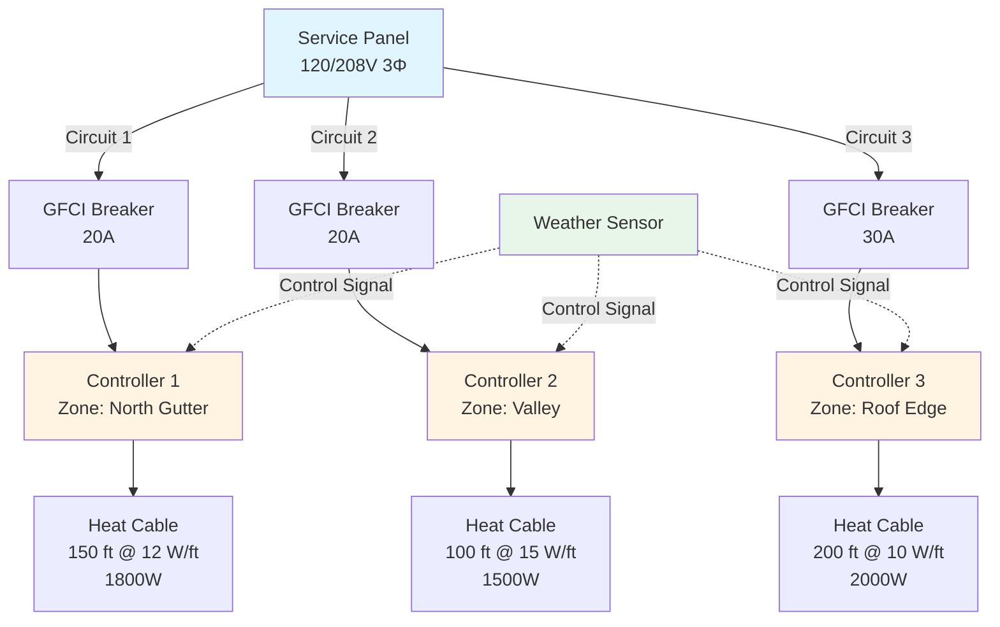

Proper electrical design ensures reliable operation of roof and gutter heating systems under extreme winter conditions. Power requirements derive from fundamental heat transfer principles, accounting for heat loss mechanisms and operational parameters specific to exposed roof environments.

## Heat Transfer Fundamentals

The required heating power density must overcome three primary heat loss mechanisms:

**Conductive losses** through roof substrate and mounting surfaces dissipate heat into the building envelope. For roof edge applications, conduction typically represents 15-25% of total heat loss.

**Convective losses** to ambient air increase dramatically with wind speed. Wind-driven convection dominates in exposed roof locations, accounting for 50-70% of total heating load at typical winter wind speeds of 10-20 mph.

**Evaporative losses** during active snow melting consume significant energy through phase change. The latent heat of fusion for ice (334 kJ/kg) establishes a theoretical minimum energy requirement independent of ambient temperature.

## Power Density Calculations

The required linear heating power density depends on gutter geometry, exposure conditions, and operational strategy:

$$q_L = \frac{Q_{total}}{L} = q_{conv} + q_{cond} + q_{melt}$$

where:
- $q_L$ = linear power density (W/m)
- $Q_{total}$ = total heating requirement (W)
- $L$ = heated length (m)

**Convective heat loss** follows Newton's law of cooling:

$$q_{conv} = h \cdot P \cdot (T_s - T_a)$$

where:
- $h$ = convective heat transfer coefficient (W/m²·K)
- $P$ = exposed perimeter (m)
- $T_s$ = surface temperature (°C)
- $T_a$ = ambient air temperature (°C)

For forced convection in wind:

$$h = 5.7 + 3.8V$$

where $V$ = wind velocity (m/s)

**Melting capacity** determines the snow processing rate:

$$q_{melt} = \dot{m} \cdot (L_f + c_p \Delta T)$$

where:
- $\dot{m}$ = snow melting rate (kg/s·m)
- $L_f$ = latent heat of fusion = 334 kJ/kg
- $c_p$ = specific heat of water = 4.18 kJ/kg·K
- $\Delta T$ = temperature rise from 0°C to drain

## Standard Power Densities by Application

| Application | Power Density | Design Temperature | Wind Exposure |
|-------------|---------------|-------------------|---------------|
| Roof edge/eave | 30-50 W/ft | -10°C to -20°C | High |
| Valley heating | 40-60 W/ft | -10°C to -20°C | Medium |
| Gutter heating | 8-15 W/ft | -5°C to -15°C | Medium |
| Downspout heating | 10-20 W/ft | -5°C to -15°C | Low |
| Drip edge | 20-35 W/ft | -10°C to -20°C | High |
| Metal roof panels | 15-25 W/ft² | -5°C to -15°C | High |

## Circuit Design and Electrical Parameters

**Ampacity calculation** for heat trace circuits:

$$I = \frac{P_{total}}{V \cdot \sqrt{3} \cdot PF}$$

for three-phase systems, or:

$$I = \frac{P_{total}}{V \cdot PF}$$

for single-phase systems, where:
- $I$ = circuit current (A)
- $P_{total}$ = total connected load (W)
- $V$ = supply voltage (V)
- $PF$ = power factor (typically 0.95-1.0 for resistive heating)

**Voltage drop limitations** prevent performance degradation:

$$V_{drop} = \frac{2 \cdot I \cdot L \cdot R}{1000}$$

where:
- $L$ = one-way circuit length (ft)
- $R$ = conductor resistance (Ω/1000 ft)

Maximum allowable voltage drop: 3% for branch circuits, 5% total from service entrance to load.

## Power Distribution Architecture

## Transformer Sizing

Transformers must accommodate total connected load plus safety factor:

$$S_{transformer} = \frac{P_{total}}{PF \cdot DF} \cdot SF$$

where:
- $S_{transformer}$ = transformer capacity (kVA)
- $DF$ = demand factor (0.7-1.0 depending on control strategy)
- $SF$ = safety factor (1.25 minimum per NEC)

For a typical residential installation with 500 ft of heat cable at 12 W/ft:
- Connected load = 6000 W
- With DF = 0.85, PF = 1.0, SF = 1.25
- Required transformer = 8.8 kVA (select 10 kVA standard size)

## Practical Design Considerations

**Circuit breaker sizing** must account for continuous duty rating. Per NEC Article 426, snow melting and de-icing equipment operates continuously under worst-case conditions:

$$I_{breaker} \geq 1.25 \cdot I_{load}$$

**Ground fault protection** is mandatory for all roof and gutter heating circuits per NEC 426.28. Use Class A GFCI (4-6 mA trip) for personnel protection.

**Conductor sizing** follows NEC Table 310.16 with temperature and conduit fill derating. For outdoor roof applications exposed to sunlight, apply 0.71 derating factor for conductors rated 75°C in ambient temperatures up to 40°C.

**Power monitoring** enables performance verification and energy management. Typical residential roof heating systems consume 3-8 kWh per operating hour, with seasonal energy use ranging from 500-2000 kWh depending on climate zone and control strategy.

Proper electrical design balances adequate heating capacity against installation cost and operational efficiency. Conservative power density selection ensures system reliability during design weather conditions while advanced controls minimize unnecessary energy consumption during marginal weather.
