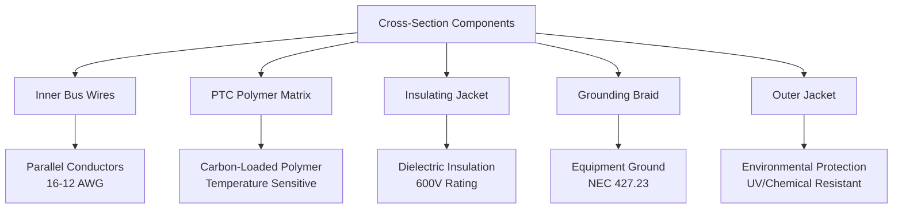
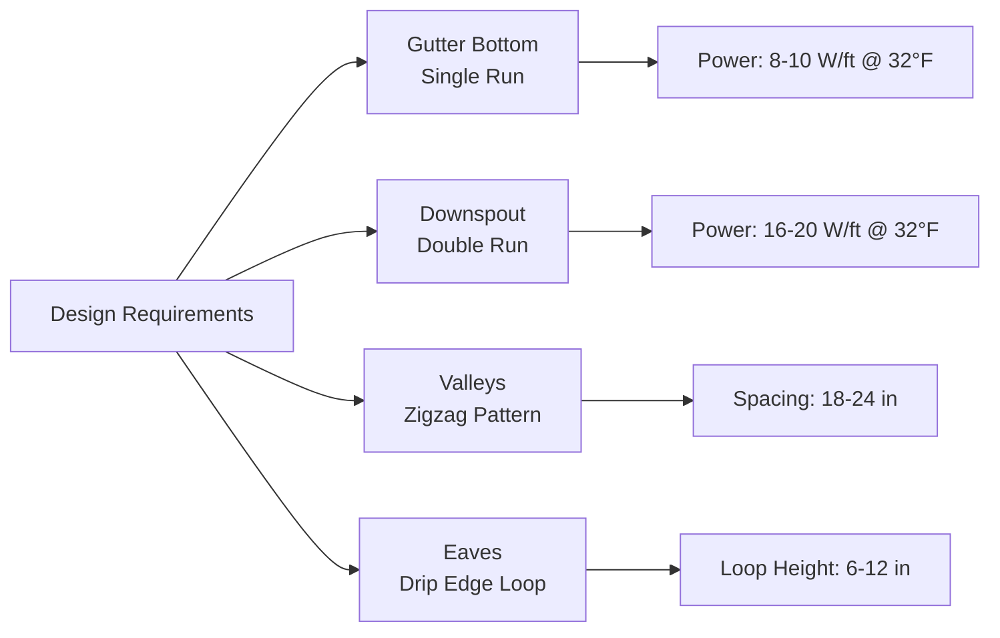

## Physical Operating Principle

Self-regulating heating cables utilize **positive temperature coefficient (PTC)** polymer technology to automatically adjust power output in response to local temperature conditions. The heating element consists of two parallel bus wires embedded in a semiconducting polymer matrix that exhibits temperature-dependent electrical resistance.

### PTC Polymer Behavior

The fundamental physics governing self-regulating operation:

**Resistance-Temperature Relationship:**

$$R(T) = R_0 e^{\beta(T - T_0)}$$

Where:
- $R(T)$ = resistance at temperature $T$ (Ω/ft)
- $R_0$ = reference resistance at $T_0$ (Ω/ft)
- $\beta$ = positive temperature coefficient (K⁻¹)
- $T$ = polymer temperature (K)
- $T_0$ = reference temperature (K)

**Power Output Response:**

$$P(T) = \frac{V^2}{R(T)} = \frac{V^2}{R_0 e^{\beta(T - T_0)}}$$

As polymer temperature increases, resistance increases exponentially, causing power output to decrease. This creates automatic thermal regulation at each point along the cable length.

## Construction and Materials

### Core Components

1. **Parallel Bus Wires**: Tinned copper conductors (typically 16-12 AWG)
2. **Conductive Polymer Matrix**: Carbon-loaded polymer with PTC characteristics
3. **Insulating Jacket**: Modified polyolefin or fluoropolymer
4. **Grounding Braid**: Tinned copper over-braid for equipment grounding
5. **Outer Jacket**: UV-resistant, chemical-resistant thermoplastic

## Power Output Characteristics

### Temperature-Dependent Performance

Self-regulating cables exhibit non-linear power output:

| Temperature (°F) | Power Output (W/ft) | Relative Output |
|------------------|---------------------|-----------------|
| -40°F | 12-15 | 100% |
| 0°F | 10-13 | 85% |
| 32°F | 8-10 | 70% |
| 50°F | 5-7 | 50% |
| 70°F | 2-4 | 25% |

**Thermal Equilibrium Condition:**

$$P_{out}(T) = Q_{loss}(T)$$

Where:
- $P_{out}(T)$ = cable power output at temperature $T$ (W/ft)
- $Q_{loss}(T)$ = heat loss from pipe/surface (W/ft)

The cable automatically stabilizes at the temperature where heat generation equals heat loss.

## Automatic Power Adjustment Mechanism

### Microscopic Thermal Response

The PTC polymer contains crystalline regions within an amorphous matrix. Temperature changes affect molecular structure:

**Below Threshold Temperature:**
- Crystalline regions compressed
- Carbon particles in close proximity
- Low electrical resistance
- High current flow
- Maximum power output

**Above Threshold Temperature:**
- Polymer expansion separates carbon particles
- Increased resistance between conduction paths
- Reduced current flow
- Decreased power output

**Current Density Relationship:**

$$J = \sigma(T) \cdot E$$

Where:
- $J$ = current density (A/m²)
- $\sigma(T)$ = temperature-dependent conductivity (S/m)
- $E$ = electric field strength (V/m)

The conductivity $\sigma(T)$ decreases exponentially with temperature, implementing automatic regulation.

## Energy Efficiency Benefits

### Comparative Energy Consumption

Self-regulating cables deliver substantial energy savings compared to constant-wattage systems:

**Annual Energy Calculation:**

$$E_{annual} = \int_0^{8760} P(T_{amb}(t)) \, dt$$

For typical northern climate installations:

| System Type | Average Power (W/ft) | Annual Energy (kWh/ft) | Relative Consumption |
|-------------|----------------------|------------------------|----------------------|
| Self-Regulating | 4.5 | 39.4 | 100% (baseline) |
| Constant Wattage (10 W/ft) | 10.0 | 87.6 | 222% |
| Constant Wattage (8 W/ft) | 8.0 | 70.1 | 178% |

**Energy Savings Fraction:**

$$\eta_{savings} = 1 - \frac{E_{self-reg}}{E_{constant}} = 1 - \frac{39.4}{87.6} = 0.55$$

Typical energy savings: **45-60% compared to constant-wattage systems** operating continuously.

### Overlapping Capability

Self-regulating cables can overlap without overheating due to automatic power reduction:

**Overlapped Section Power:**

When two cable sections overlap, local temperature increases, causing both cables to reduce output. The system reaches equilibrium where:

$$P_{total} < 2 \times P_{single}$$

This prevents thermal runaway and allows flexible installation without damage risk.

## Applications and Design Guidelines

### Roof and Gutter Installation

**Gutter and Downspout Coverage:**

### Power Density Selection

**Design Heat Output:**

$$q_{design} = \frac{k \cdot A}{L} \cdot \Delta T + q_{radiation} + q_{convection}$$

For metal gutters (aluminum, k = 205 W/m·K):
- Standard conditions: 8-10 W/ft
- Heavy ice/snow areas: 12-15 W/ft
- High-exposure locations: 15-20 W/ft

### Circuit Length Limitations

**Voltage Drop Constraint:**

$$L_{max} = \frac{V_{drop-max}}{I \cdot R_{cable}}$$

Maximum circuit lengths (120V, single-phase):

| Cable Power Rating | Bus Wire Size | Max Length | Voltage Drop |
|-------------------|---------------|------------|--------------|
| 5 W/ft @ 50°F | 16 AWG | 250 ft | 3% |
| 8 W/ft @ 32°F | 14 AWG | 200 ft | 3% |
| 12 W/ft @ 0°F | 12 AWG | 150 ft | 3% |
| 15 W/ft @ -20°F | 12 AWG | 120 ft | 3% |

## NEC Code Compliance

### Installation Requirements

**NEC Article 427 - Fixed Electric Heating Equipment for Pipelines and Vessels:**

- **427.10**: General provisions for electric heat tracing
- **427.23**: Equipment grounding required for all metallic components
- **427.28**: GFCI protection required for 120V circuits in wet locations
- **427.22**: Power supply disconnecting means within sight or lockable

**Branch Circuit Protection:**

$$I_{breaker} = 1.25 \times I_{startup}$$

Startup current typically 1.5-2.0 times steady-state current due to cold polymer resistance.

### Grounding and Bonding

All self-regulating cable systems require:
- Continuous equipment grounding conductor
- Grounding braid connected at both ends
- Ground-fault protection (GFCI) for 120V systems
- Metal raceways bonded per NEC 250.96

## Installation Best Practices

### Field Termination

Self-regulating cables can be cut to exact length on-site:

1. **End Seal Kit**: Waterproof termination of unused cable end
2. **Power Connection Kit**: Bus wire connection to branch circuit
3. **Splice Kit**: Field joining of cable sections
4. **Tee Kit**: Branch connections for complex layouts

**Minimum Bend Radius:**

$$r_{min} = 6 \times d_{cable}$$

Typical minimum bend radius: 0.5-1.0 inches depending on cable diameter.

### Temperature Monitoring

Installation of thermostats and sensors:
- **Ambient/Moisture Sensor**: Activates system when conditions require
- **GFCI Protection**: Required for personnel safety
- **Ground-Fault Monitoring**: Continuous system integrity verification

## Comparison: Self-Regulating vs. Constant-Wattage

| Parameter | Self-Regulating | Constant-Wattage |
|-----------|-----------------|------------------|
| Power Adjustment | Automatic by PTC polymer | Fixed output |
| Overlapping | Safe, auto-reduces | Overheating risk |
| Energy Efficiency | High (adjusts to conditions) | Lower (continuous output) |
| Installation Flexibility | Cut-to-length on-site | Factory lengths |
| Maximum Temperature | Self-limiting (185-215°F) | Requires thermostat |
| Initial Cost | Higher | Lower |
| Operating Cost | Lower | Higher |
| Lifespan | 15-25 years | 10-20 years |
| Startup Current | High (cold polymer) | Moderate |

## Maintenance and Troubleshooting

### Performance Verification

**Resistance Testing:**

Measure cable resistance at known temperature:

$$R_{expected} = \frac{V^2}{P_{rated} \times L}$$

Compare measured resistance to manufacturer specifications accounting for temperature.

### Common Issues

- **High resistance**: Polymer degradation or moisture ingress
- **Low resistance**: Insulation failure or short circuit
- **No continuity**: Bus wire damage or open circuit
- **Erratic operation**: Poor termination or connection

Regular inspection intervals: Annual before heating season.

## Conclusion

Self-regulating heating cables provide energy-efficient, automatic freeze protection through PTC polymer technology. The fundamental physics of temperature-dependent resistance enables each cable segment to independently adjust power output, delivering maximum efficiency and installation flexibility. Proper design following NEC requirements and manufacturer guidelines ensures reliable, long-term performance in roof and gutter heating applications.
