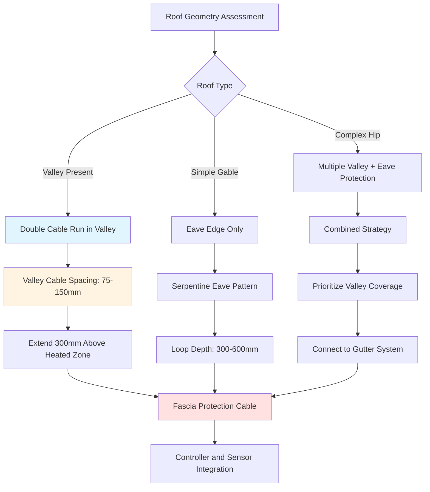

## Physical Mechanisms of Ice Dam Formation

Ice dams form at roof valleys and eaves through a thermodynamic process driven by differential heating. Heat loss through the roof deck melts snow at the upper roof surface, creating meltwater that flows downward. When this water reaches the cold eave overhang or valley where no interior heat is present, it refreezes, forming an ice barrier that traps subsequent meltwater behind it.

The critical temperature gradient occurs at the transition from heated to unheated roof sections. Valleys concentrate meltwater flow from adjacent roof planes, creating localized high-flow conditions that accelerate ice accumulation. Eave overhangs extend beyond the heated building envelope, providing the cold surface necessary for refreezing.

## Heat Transfer Requirements for Ice Prevention

The thermal power required to prevent ice formation must exceed the heat removal rate from meltwater cooling and refreezing. The energy balance includes sensible cooling of meltwater from its arrival temperature to 0°C and latent heat removal during phase change.

### Meltwater Heat Load Calculation

For a given meltwater flow rate $\dot{m}$ arriving at temperature $T_m$, the heat removal rate during cooling and freezing is:

$$Q_{total} = \dot{m} \left[ c_p (T_m - 0) + L_f \right]$$

where:
- $\dot{m}$ = meltwater mass flow rate (kg/s)
- $c_p$ = specific heat of water = 4,186 J/(kg·K)
- $T_m$ = meltwater arrival temperature (°C)
- $L_f$ = latent heat of fusion = 334,000 J/kg

To prevent ice formation, the applied heat flux must satisfy:

$$q_{applied} \geq \frac{Q_{total}}{A_{heated}} + q_{ambient}$$

where $A_{heated}$ is the heated surface area and $q_{ambient}$ represents ambient heat losses to cold air and radiation.

### Design Heat Flux for Valleys and Eaves

For standard residential applications in moderate climates, the recommended heat flux is:

$$q_{design} = 200 \text{ to } 350 \text{ W/m}^2$$

This corresponds to cable spacing and power density selection. Higher values apply to steep valleys with large drainage areas or locations with severe winter conditions.

## Valley Protection Strategies

Valleys require enhanced heating due to concentrated snow accumulation and meltwater convergence from multiple roof planes. The drainage area contributing to valley flow is:

$$A_{drainage} = L_{valley} \cdot (W_1 + W_2)$$

where $L_{valley}$ is valley length and $W_1$, $W_2$ are the horizontal widths of adjacent roof planes draining into the valley.

### Double Cable Run Configuration

Valley protection typically employs parallel cable runs spaced 75-150 mm apart, creating a heated channel along the valley center. This configuration provides:

1. **Redundancy** - If one cable fails, partial protection continues
2. **Enhanced heat flux** - Combined output exceeds single-cable installations
3. **Wider melt path** - Accommodates higher flow volumes

The total valley heat output becomes:

$$P_{valley} = 2 \cdot p_{linear} \cdot L_{valley}$$

where $p_{linear}$ is the cable power per unit length (W/m).

## Eave Protection Principles

Eave overhangs require heating to prevent meltwater refreezing at the drip edge. The critical zone extends from the exterior wall plane to the fascia, typically 0.6-1.2 m depending on overhang depth.

### Cable Placement at Eaves

Effective eave protection uses a serpentine cable pattern with loops extending up the roof slope and back to the drip edge. The loop depth $d_{loop}$ should satisfy:

$$d_{loop} \geq 0.3 \text{ m inside heated envelope}$$

This ensures melted snow and ice can flow completely off the roof without refreezing.

### Drip Edge and Fascia Heating

The fascia board requires protection from ice accumulation that can cause structural damage and create falling ice hazards. A dedicated cable run along the drip edge provides:

- Continuous heat at the roof-to-gutter transition
- Prevention of icicle formation
- Structural protection for fascia and soffit

## Cable Placement Strategies by Roof Geometry

## Protection Strategy Comparison by Roof Type

| Roof Configuration | Valley Protection | Eave Protection | Cable Density | Heat Flux (W/m²) | Priority Zones |
|-------------------|-------------------|-----------------|---------------|------------------|----------------|
| **Simple Gable** | Not required | Serpentine loops | 30-50 W/m | 200-250 | Drip edge, overhang |
| **Hip Roof** | Single run valleys | Full perimeter | 40-60 W/m | 250-300 | Valley junctions, eaves |
| **Complex Multi-Valley** | Double run valleys | Enhanced eave | 50-80 W/m | 300-350 | All valleys, critical drainage |
| **Low-Slope (<3:12)** | Triple run valleys | Extended loops | 60-90 W/m | 350-400 | Entire lower section |
| **Metal Roof** | Clipped cable system | Seam-mounted | 40-70 W/m | 250-350 | Valleys, panel seams |
| **Tile/Slate** | Under-tile channels | Discrete mounting | 50-80 W/m | 300-400 | Valley liners, edge details |

## Design Standards and Installation Codes

Valley and eave protection systems must comply with:

- **IEEE 515.1** - Standard for the Testing, Design, Installation, and Maintenance of Electrical Resistance Trace Heating for Commercial Applications
- **NFPA 70 (NEC)** - Article 426: Fixed Outdoor Electric Deicing and Snow-Melting Equipment
- **ASHRAE Handbook - HVAC Applications** - Chapter on snow melting and freeze protection
- **Local building codes** - Specific requirements for roof penetrations and electrical installations

Key code requirements include:

1. **GFCI protection** for all roof heating circuits
2. **Listed components** - UL or ETL certified cables and controllers
3. **Proper circuit sizing** - Ampacity calculations per NEC Article 426
4. **Bonding and grounding** - Metal roofing components and cable shields

## Valley and Eave Integration

Maximum effectiveness occurs when valley and eave systems connect seamlessly. Meltwater from heated valleys must flow through heated eaves to gutters without refreezing. The continuous heated path requires:

$$L_{total} = L_{valley} + L_{eave} + L_{gutter}$$

where each segment maintains adequate heat flux for the expected flow rate.

### Loop-to-Valley Transitions

At valley terminations, eave loops should connect directly to valley cables, eliminating cold spots. The transition zone receives enhanced heating through cable overlap:

$$P_{transition} = P_{valley} + P_{eave}$$

This overlap zone extends 150-300 mm to accommodate thermal bridging through the roof structure.

## Sensor Placement for Valley and Eave Systems

Automatic control systems require sensors positioned to detect both snow accumulation and melt conditions:

- **Valley sensors** - Moisture/temperature sensors at mid-valley points
- **Eave sensors** - Drip edge or fascia-mounted sensors
- **Ambient sensors** - Air temperature and precipitation detection

Control logic activates heating when:
1. Ambient temperature < 4°C
2. Moisture present at sensor locations
3. Snow accumulation detected (optional snow depth sensor)

## Performance Verification

System effectiveness is verified through:

- **Thermal imaging** during operation showing continuous heat coverage
- **Visual inspection** confirming no ice formation during melt cycles
- **Amperage testing** verifying design power delivery
- **Controller logging** documenting activation patterns and runtime

Properly designed valley and eave protection maintains ice-free conditions at critical roof areas, preventing structural damage and safety hazards from ice dams and falling ice.
