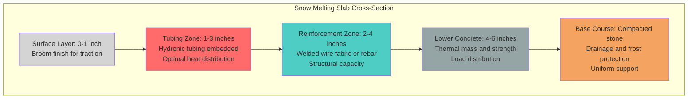

## Structural and Thermal Requirements

Concrete thickness in snow melting systems serves dual functions that must be simultaneously satisfied. The slab must provide adequate structural capacity to resist imposed loads while maintaining sufficient thermal mass for efficient heat storage and distribution. These requirements interact through the placement depth of heating elements, which affects both structural integrity and thermal performance.

### Minimum Thickness Standards

The minimum slab thickness depends on application type and load conditions:

| Application Type | Minimum Thickness | Governing Factor | Design Load |
|-----------------|-------------------|------------------|-------------|
| Residential Driveways | 4 inches (100 mm) | Thermal mass | 50 psf live load |
| Residential Walkways | 4 inches (100 mm) | Thermal uniformity | 40 psf live load |
| Commercial Parking | 6 inches (150 mm) | Wheel loads | 250 psf live load |
| Loading Docks | 8 inches (200 mm) | Point loads | 400 psf live load |
| Industrial Yards | 10 inches (250 mm) | Heavy equipment | 600+ psf live load |
| Aircraft Aprons | 12-18 inches (300-450 mm) | Aircraft loads | Per FAA standards |

### Structural Design Calculations

Slab thickness for structural capacity follows beam theory adapted for two-way concrete slabs on grade. The required thickness relates to bending moment capacity:

$$
t = \sqrt{\frac{6M}{f_c' \cdot b}}
$$

Where:
- $t$ = slab thickness (inches)
- $M$ = maximum bending moment (lb-ft/ft)
- $f_c'$ = concrete compressive strength (psi)
- $b$ = unit width, typically 12 inches

The bending moment for uniformly distributed loads on slabs is:

$$
M = \frac{w \cdot L^2}{8}
$$

Where:
- $w$ = applied load (psf)
- $L$ = effective span between support points (feet)

For concentrated loads, the Westergaard equation determines corner and edge stresses that govern thickness:

$$
\sigma = \frac{3P}{t^2} \left(1 - \left(\frac{a\sqrt{2}}{l}\right)^{0.6}\right)
$$

Where:
- $\sigma$ = flexural stress (psi)
- $P$ = concentrated load (lbs)
- $a$ = radius of loaded area (inches)
- $l$ = radius of relative stiffness (inches)

### Thermal Mass Considerations

Concrete thermal mass buffers temperature fluctuations and enables efficient system cycling. The heat capacity per unit area increases linearly with thickness:

$$
C_A = \rho \cdot c_p \cdot t
$$

Where:
- $C_A$ = heat capacity per unit area (Btu/ft²·°F)
- $\rho$ = concrete density (145 lb/ft³ typical)
- $c_p$ = specific heat (0.22 Btu/lb·°F for concrete)
- $t$ = thickness (feet)

For a 6-inch slab:
$$
C_A = 145 \times 0.22 \times 0.5 = 15.95 \text{ Btu/ft²·°F}
$$

This thermal mass allows the slab to store approximately 16 Btu per square foot for each degree of temperature rise, providing thermal inertia that reduces cycling frequency and peak heating demands.

### Tubing Placement Depth Requirements

Heating tubing must be positioned to balance structural requirements and heat transfer efficiency. The tubing centerline depth affects both:

**Structural Integrity:** Tubing placed within the tension zone (lower half of slab under positive moment) must not compromise reinforcement placement or concrete cover requirements. ACI 318 requires minimum 3/4-inch cover for concrete exposed to weather.

**Thermal Performance:** Excessive tubing depth increases thermal lag and reduces surface temperature response. The one-dimensional heat conduction time constant:

$$
\tau = \frac{z^2}{\alpha}
$$

Where:
- $\tau$ = thermal time constant (hours)
- $z$ = depth from surface to tubing centerline (feet)
- $\alpha$ = thermal diffusivity (0.033 ft²/hr for concrete)

For tubing at 2-inch depth (0.167 ft):
$$
\tau = \frac{(0.167)^2}{0.033} = 0.85 \text{ hours}
$$

This indicates approximately 51 minutes for surface temperature to reach 63% of its steady-state value after system startup.

### Slab Cross-Section Configuration

### Thickness Optimization Strategy

Select slab thickness using this hierarchy:

1. **Calculate structural requirement** based on anticipated loads using beam theory or finite element analysis for complex geometries
2. **Verify thermal mass adequacy** ensuring minimum 4-inch thickness for residential, 6-inch for commercial applications
3. **Confirm tubing placement depth** allows proper concrete cover (minimum 2 inches above tubing, 2 inches below)
4. **Check reinforcement accommodation** ensuring adequate space for steel placement per structural drawings
5. **Consider constructability** with standard forming depths and concrete placement logistics

### Special Considerations for Increased Thickness

Slabs exceeding 8 inches require additional analysis:

**Thermal Stratification:** Thick slabs may develop temperature gradients that reduce effective thermal mass. Multiple tubing layers at different depths may be warranted.

**Hydration Heat:** Large concrete pours generate significant heat during curing, potentially affecting tubing integrity. Pressure testing before and after concrete placement is essential.

**Shrinkage Control:** Thicker slabs experience greater differential shrinkage between top and bottom surfaces. Control joints must be spaced appropriately, typically at 15-20 times the slab thickness.

### Reference Standards

Design of heated concrete slabs must comply with:
- **ACI 318:** Building Code Requirements for Structural Concrete
- **ACI 332:** Residential Code Requirements for Structural Concrete
- **ASHRAE Handbook - HVAC Applications:** Chapter 51, Snow Melting and Freeze Protection
- **PCA:** Thickness Design for Concrete Highway and Street Pavements
- **CRSI:** Manual of Standard Practice for reinforcement detailing

Proper thickness selection ensures the heated slab performs reliably under both structural loads and thermal cycling throughout its design service life. Coordination between structural and mechanical engineers during design prevents conflicts between load-bearing requirements and heating system optimization.
