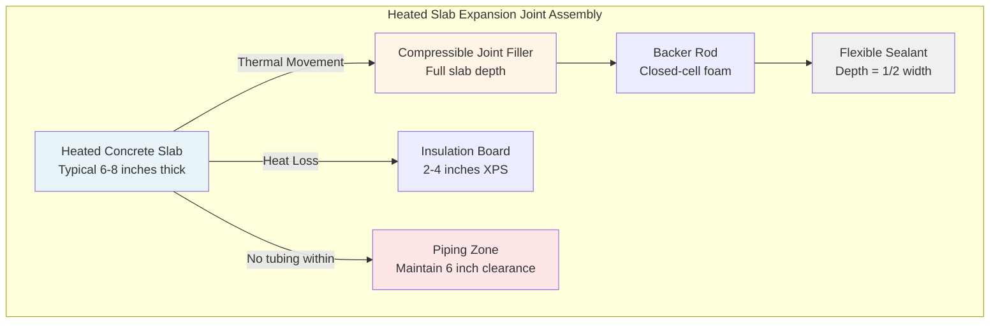

## Physical Basis of Thermal Expansion in Heated Slabs

Concrete undergoes dimensional changes when subjected to temperature variations. In snow melting systems, slabs experience temperature differentials ranging from -20°F to 70°F above ambient during operation. This temperature swing creates substantial expansion forces that require proper accommodation through expansion joints.

The fundamental relationship governing thermal expansion is:

$$\Delta L = \alpha \cdot L_0 \cdot \Delta T$$

Where:
- $\Delta L$ = change in length (in)
- $\alpha$ = coefficient of thermal expansion (in/in/°F)
- $L_0$ = original length (ft)
- $\Delta T$ = temperature change (°F)

For standard concrete, $\alpha \approx 5.5 \times 10^{-6}$ in/in/°F. A 100-ft slab experiencing a 60°F temperature rise will expand:

$$\Delta L = 5.5 \times 10^{-6} \times 100 \times 12 \times 60 = 0.396 \text{ in}$$

This nearly 0.4-inch movement must be accommodated to prevent cracking, spalling, and structural damage.

## Types of Expansion Joints for Heated Slabs

Heated concrete applications require joints capable of repeated thermal cycling while maintaining structural integrity and preventing water infiltration.

| Joint Type | Movement Capacity | Temperature Range | Typical Application | Durability |
|------------|------------------|-------------------|---------------------|------------|
| Compression Seal | ±25% joint width | -40°F to 180°F | Perimeter isolation | Excellent |
| Poured Sealant | ±12.5% joint width | -20°F to 160°F | Interior control joints | Good |
| Preformed Foam | Up to 50% compression | -30°F to 140°F | Isolation joints | Fair |
| Metal Bellows | ±2 inches | -50°F to 200°F | Heavy-duty applications | Excellent |
| Sliding Plate | Unlimited in plane | -40°F to 200°F | Large thermal movement | Excellent |

### Compression Seal Systems

Compression seal joints use preformed elastomeric gaskets compressed between concrete faces. The seal maintains continuous contact throughout the expansion-contraction cycle. Design requires:

$$W_{joint} = \frac{\Delta L_{max}}{0.25}$$

Where $W_{joint}$ is the minimum joint width and $\Delta L_{max}$ is the maximum anticipated movement. For 0.4-inch movement, the minimum joint width is 1.6 inches.

### Poured Sealant Joints

Two-part polyurethane or polysulfide sealants bond to concrete faces and stretch during expansion. The shape factor governs performance:

$$SF = \frac{W}{D}$$

Where $W$ is joint width and $D$ is sealant depth. Optimal shape factors range from 1:1 to 2:1 for heated applications.

## Joint Spacing Requirements

Maximum joint spacing depends on allowable tensile stress in concrete and the restraint conditions. The basic relationship:

$$L_{max} = \sqrt{\frac{2 \cdot f_t \cdot h}{\alpha \cdot E \cdot \Delta T \cdot \mu}}$$

Where:
- $f_t$ = allowable tensile stress (psi)
- $h$ = slab thickness (in)
- $E$ = modulus of elasticity (psi)
- $\mu$ = coefficient of subgrade friction

For typical snow melting slabs (6-inch thickness, 50°F operating differential):
- Unreinforced concrete: 12-15 ft maximum spacing
- Reinforced concrete: 20-25 ft maximum spacing
- Post-tensioned slabs: 40-60 ft maximum spacing

## Expansion Joint Details

## Design Considerations for Heated Slabs

### Piping Clearance

Hydronic tubing must maintain minimum 6-inch clearance from expansion joints. Closer placement creates stress concentrations during joint movement, risking tube damage. Tubing runs perpendicular to joints whenever possible.

### Reinforcement Interruption

Reinforcing steel must be completely discontinued at expansion joints. Continuous reinforcement defeats joint function by creating restraint. Use smooth dowels for load transfer without restricting movement.

### Insulation Edge Detail

Vertical insulation along joint edges reduces heat loss and prevents frost penetration beneath the joint. Minimum 2-inch thickness of extruded polystyrene (XPS) extends to subgrade depth.

### Joint Activation Timing

Joints should be cut or formed within 12-24 hours of concrete placement to control cracking. For heated slabs, initial system operation should occur after 28-day cure to establish joint function before thermal cycling.

## Thermal Stress Analysis

Restrained thermal expansion generates stress according to:

$$\sigma = \alpha \cdot E \cdot \Delta T \cdot R$$

Where $R$ is the degree of restraint (0 to 1). For fully restrained concrete with $E = 3.6 \times 10^6$ psi and $\Delta T = 50°F$:

$$\sigma = 5.5 \times 10^{-6} \times 3.6 \times 10^6 \times 50 \times 1 = 990 \text{ psi}$$

This stress exceeds concrete tensile strength (400-600 psi), necessitating expansion joints to reduce restraint.

## Installation Sequence

1. **Subgrade preparation** - compact and level to prevent differential settlement
2. **Insulation placement** - continuous layer with staggered joints
3. **Joint former installation** - secure vertical elements before concrete placement
4. **Concrete placement** - avoid displacement of joint materials
5. **Joint cutting** (if sawcut method) - within 24 hours to depth of one-third slab thickness
6. **Curing period** - minimum 28 days before heating system operation
7. **Sealant installation** - after joint cleaning and priming, before system activation

## Field Performance Factors

Expansion joint performance in heated slabs depends on:

- **Temperature differential magnitude** - larger swings require wider joints
- **Slab dimensions** - longer runs accumulate more total expansion
- **Restraint conditions** - perimeter attachments increase stress
- **Cycling frequency** - repeated movement fatigues sealant materials
- **Environmental exposure** - freeze-thaw cycles and chemical deicers degrade joint materials

Proper expansion joint design, detailing, and installation ensures long-term performance of snow melting systems by accommodating thermal movement while maintaining structural integrity and weatherproofing.
