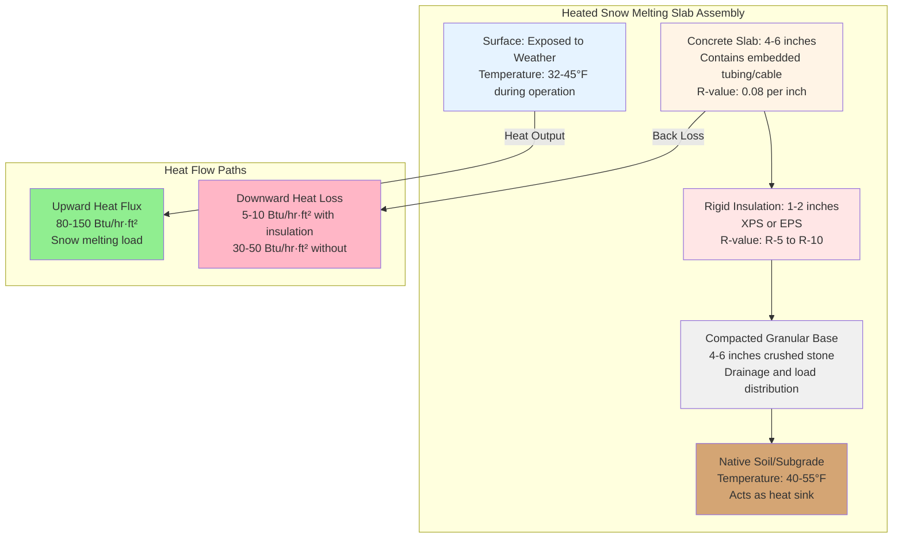

## Thermal Function of Sub-Slab Insulation

Sub-slab insulation serves one critical purpose in snow melting systems: redirect heat flux upward through the pavement surface rather than downward into the ground. Without insulation, the earth beneath acts as an infinite heat sink, consuming 30-50% of the system's thermal output with zero benefit to surface snow melting performance.

The physics governing this behavior follows Fourier's law of heat conduction. Heat flows from high to low temperature regions at a rate proportional to the thermal gradient and inversely proportional to thermal resistance. The ground temperature typically remains 40-55°F at depths below 6 feet, creating a substantial temperature difference when slab temperatures reach 35-45°F during operation. This temperature gradient drives continuous downward heat loss unless interrupted by thermal resistance.

## Back Loss Heat Transfer Analysis

The downward heat flux through uninsulated and insulated assemblies can be quantified through one-dimensional steady-state conduction analysis.

**Uninsulated Back Loss:**

$$q_{back,uninsulated} = \frac{T_{slab} - T_{ground}}{R_{concrete} + R_{soil}}$$

Where:
- $q_{back,uninsulated}$ = downward heat flux (Btu/hr·ft²)
- $T_{slab}$ = slab operating temperature (°F)
- $T_{ground}$ = deep ground temperature (°F)
- $R_{concrete}$ = thermal resistance of concrete (hr·ft²·°F/Btu)
- $R_{soil}$ = thermal resistance of soil layer (hr·ft²·°F/Btu)

**Insulated Back Loss:**

$$q_{back,insulated} = \frac{T_{slab} - T_{ground}}{R_{concrete} + R_{insulation} + R_{soil}}$$

The insulation effectiveness, expressed as heat loss reduction, is:

$$\eta_{insulation} = \frac{q_{back,uninsulated} - q_{back,insulated}}{q_{back,uninsulated}} \times 100\%$$

**Practical Example:**

For a slab operating at 40°F with ground temperature at 50°F, 6-inch concrete (R-0.6), and compacted soil (R-0.2 per foot):

Without insulation:
$$q_{back} = \frac{40 - 50}{0.6 + 1.0} = -6.25 \text{ Btu/hr·ft²}$$

With 2-inch XPS (R-10):
$$q_{back} = \frac{40 - 50}{0.6 + 10 + 1.0} = -0.86 \text{ Btu/hr·ft²}$$

This represents 86% reduction in back loss, directly improving system efficiency and reducing operating costs.

## Sub-Slab Insulation Assembly

## Rigid Insulation Material Selection

The sub-slab environment imposes specific requirements: compression resistance to support slab and traffic loads, moisture impermeability, and dimensional stability under wet conditions. Three rigid foam insulation types meet these criteria.

| Insulation Type | R-Value per Inch | Compressive Strength | Moisture Absorption | Cost Factor |
|----------------|------------------|---------------------|--------------------|--------------|
| Extruded Polystyrene (XPS) | 5.0 | 25-60 psi | 0.1% by volume | 1.5x |
| Expanded Polystyrene (EPS Type II) | 4.2 | 15-25 psi | 2-4% by volume | 1.0x |
| Polyisocyanurate (Polyiso) | 6.5 | 25-40 psi | 1-3% by volume | 1.8x |
| Cellular Glass | 2.9 | 100+ psi | 0% (impermeable) | 3.0x |

**Material Selection Criteria:**

1. **Extruded Polystyrene (XPS):** Industry standard for snow melting applications. Closed-cell structure provides excellent moisture resistance and maintains R-value in wet conditions. Compressive strength of 25 psi supports vehicle loads when properly distributed through concrete slab. Blue or pink color aids installation verification.

2. **Expanded Polystyrene (EPS Type II):** Lower cost alternative requiring attention to drainage. Type II grade (1.35 lb/ft³ density) provides adequate compressive strength. Must be protected from prolonged water exposure as moisture absorption degrades thermal performance by 15-30%.

3. **Polyisocyanurate:** Highest R-value per inch but temperature-dependent performance. R-value drops to approximately R-5.5 per inch at 40°F mean temperature. Foil facings provide vapor barrier but may complicate concrete adhesion.

4. **Cellular Glass:** Used in high-load applications (heavy truck traffic, aircraft loading). Zero moisture absorption and non-combustible properties justify higher cost in critical installations.

## Insulation Thickness and R-Value Requirements

ASHRAE guidelines for snow melting systems recommend minimum R-5 sub-slab insulation for economic operation, with R-10 preferred in cold climates where ground temperatures drop below 45°F seasonally.

**Economic Optimization:**

The optimal insulation thickness occurs when the incremental cost of additional insulation equals the present value of energy savings over the system lifetime. This calculation requires:

$$NPV = \sum_{n=1}^{L} \frac{q_{saved} \times A \times h \times c_{energy}}{(1 + i)^n} - C_{insulation}$$

Where:
- $NPV$ = net present value ($)
- $q_{saved}$ = heat loss reduction (Btu/hr·ft²)
- $A$ = slab area (ft²)
- $h$ = annual operating hours (hr/yr)
- $c_{energy}$ = energy cost ($/Btu)
- $i$ = discount rate (decimal)
- $n$ = year number
- $L$ = system lifetime (years)
- $C_{insulation}$ = installed insulation cost ($)

For typical installations with natural gas at $0.80/therm and 400 hours annual operation, 2-inch XPS (R-10) provides payback within 3-5 years compared to uninsulated construction.

## Edge Insulation Details

Perimeter heat loss through slab edges creates cold spots and uneven melting patterns. The edge condition presents lower thermal resistance due to shorter heat flow path to ambient air and exposure to wind convection.

**Edge Insulation Configuration:**

- **Vertical Dimension:** Extend insulation full slab depth plus 12-24 inches below slab bottom
- **Thermal Resistance:** R-10 minimum, R-15 preferred in climate zones 6-8
- **Material:** Same specification as sub-slab insulation for compatibility
- **Protection:** Cover exposed edges with metal flashing or protective coating

The heat flux through an uninsulated edge can be estimated:

$$q_{edge} = UA(T_{slab} - T_{ambient})$$

Where the edge UA-value typically ranges from 0.5-1.0 Btu/hr·ft·°F for uninsulated conditions, reduced to 0.05-0.1 Btu/hr·ft·°F with proper edge insulation.

## Installation Requirements

Proper installation ensures design thermal performance:

1. **Base Preparation:** Compact granular base to 95% modified Proctor density. Level to within 1/4 inch per 10 feet to prevent insulation board rocking and point loads.

2. **Board Layout:** Stagger joints in running bond pattern. Tape joints with manufacturer-approved adhesive tape to prevent concrete infiltration during pour.

3. **Drainage:** Install perimeter drainage to prevent water accumulation beneath insulation. Standing water creates thermal short-circuits and degrades EPS performance.

4. **Protection During Construction:** Cover insulation with polyethylene sheet or building paper before concrete placement. This prevents direct contact between wet concrete and insulation, which can dissolve foam surface.

5. **Edge Treatment:** Seal perimeter insulation to foundation walls or grade beams with compatible sealant to eliminate thermal bridging paths.

## Design Standards and References

Snow melting system insulation design follows these standards:

- **ASHRAE Handbook - HVAC Applications, Chapter 51:** Snow melting and freeze protection systems, thermal design methodology
- **ASTM C578:** Standard Specification for Rigid, Cellular Polystyrene Thermal Insulation
- **ASTM C1289:** Standard Specification for Faced Rigid Cellular Polyisocyanurate Thermal Insulation Board
- **ACI 332:** Residential Code Requirements for Structural Concrete and Commentary, foundation insulation placement

Proper sub-slab insulation transforms snow melting systems from marginally effective energy consumers into reliable, efficient installations that maintain clear surfaces throughout winter weather events. The thermal resistance provided by 1-2 inches of rigid insulation redirects 80-90% of downward heat loss to productive snow melting work, reducing operating costs and improving system responsiveness during storm events.
