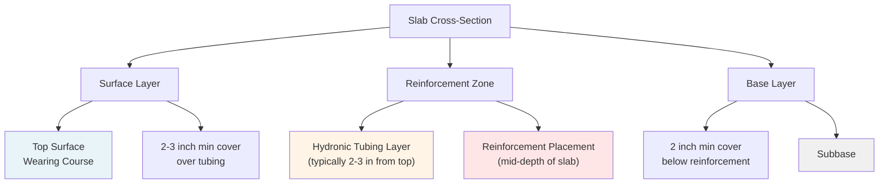
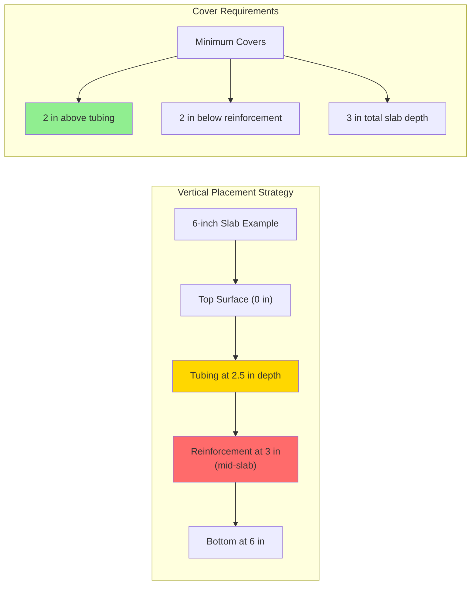

Concrete reinforcement in heated snow melting slabs serves dual functions: controlling thermal stress-induced cracking and managing structural loads. The cyclic heating creates temperature gradients that generate tensile stresses requiring careful reinforcement design beyond conventional slab specifications.

## Thermal Stress Mechanics in Heated Slabs

When a snow melting slab operates, temperature differences between the heated surface and the subgrade create internal stresses. The coefficient of thermal expansion for concrete typically ranges from 5.5 to 7.0 × 10⁻⁶ /°F (9.9 to 12.6 × 10⁻⁶ /°C).

### Thermal Stress Calculation

The thermal stress developed in a restrained concrete slab follows:

$$\sigma_{\text{thermal}} = \alpha \cdot E \cdot \Delta T \cdot R$$

Where:
- $\sigma_{\text{thermal}}$ = thermal stress (psi or MPa)
- $\alpha$ = coefficient of thermal expansion (1/°F or 1/°C)
- $E$ = modulus of elasticity of concrete (typically 3-5 × 10⁶ psi)
- $\Delta T$ = temperature difference through slab depth (°F or °C)
- $R$ = restraint factor (0 = free movement, 1 = full restraint)

For a typical snow melting slab with supply water at 110°F (43°C) and subgrade at 40°F (4°C), the temperature gradient generates significant tensile stress:

$$\sigma_{\text{thermal}} = 6.5 \times 10^{-6} \times 4 \times 10^6 \times 70 \times 0.6 = 1,092 \text{ psi}$$

This stress exceeds the tensile strength of concrete (typically 400-700 psi), necessitating reinforcement to control crack width and spacing.

### Temperature Gradient Through Slab

The temperature distribution through slab depth follows:

$$T(z) = T_{\text{bottom}} + (T_{\text{surface}} - T_{\text{bottom}}) \cdot \left(\frac{z}{h}\right)$$

Where $z$ is depth from bottom and $h$ is total slab thickness.

The maximum thermal gradient occurs during peak heating:

$$\frac{dT}{dz} = \frac{T_{\text{surface}} - T_{\text{bottom}}}{h}$$

For a 6-inch slab with 50°F differential: gradient = 50°F / 6 in = 8.3°F/inch.

## Reinforcement Types and Performance

| Reinforcement Type | Typical Specification | Tensile Strength | Thermal Performance | Cost Factor | Application |
|-------------------|----------------------|------------------|---------------------|-------------|-------------|
| Welded Wire Mesh (WWM) | 6×6 W2.9×W2.9 | 70,000 psi | Excellent distribution | 1.0× | Residential driveways |
| Welded Wire Mesh (WWM) | 6×6 W4×W4 | 70,000 psi | Superior control | 1.3× | Commercial parking |
| Rebar Grid | #4 @ 12" o.c. each way | 60,000 psi | Excellent | 1.5× | Heavy traffic areas |
| Rebar Grid | #5 @ 12" o.c. each way | 60,000 psi | Superior | 2.0× | Industrial applications |
| Fiber Reinforcement | 3-5 lb/yd³ synthetic | Varies | Good crack control | 0.8× | Supplemental only |
| Fiber Reinforcement | 30-50 lb/yd³ steel | Varies | Enhanced distribution | 1.2× | Combined with WWM |

### Welded Wire Mesh Reinforcement

Welded wire mesh provides distributed reinforcement ideal for controlling thermal cracking. The wire designation (W2.9 = 0.029 in² cross-sectional area per foot width) determines tensile capacity.

**Minimum reinforcement ratio for thermal control:**

$$\rho_{\text{min}} = \frac{0.0018 \cdot b \cdot h}{A_s} \leq 0.0020$$

For heated slabs, specify minimum 6×6 W2.9×W2.9 (0.029 in²/ft each direction). Heavy-duty applications require 6×6 W4×W4 (0.040 in²/ft).

### Rebar Grid Reinforcement

Deformed reinforcing bars provide higher tensile capacity for structural loads combined with thermal stress management. Standard configurations:

- **Residential:** #4 bars @ 18" o.c. each way
- **Commercial:** #4 bars @ 12" o.c. each way
- **Heavy-duty:** #5 bars @ 12" o.c. each way

The area of steel required balances thermal stress and structural load:

$$A_s = \frac{\sigma_{\text{thermal}} \cdot A_c}{f_y}$$

Where $f_y$ is yield strength of reinforcement (60,000 psi for Grade 60).

### Fiber Reinforcement

Synthetic or steel fibers supplement primary reinforcement but cannot replace it in heated slabs. Fibers control plastic shrinkage cracking and improve impact resistance. Typical dosage: 3-5 lb/yd³ for synthetic, 30-50 lb/yd³ for steel fibers.

## Reinforcement Placement Requirements

Proper vertical positioning within the slab cross-section is critical for thermal stress management and structural performance.

### Mid-Slab Placement Strategy

Position reinforcement at the neutral axis (mid-depth) to:

1. **Maximize moment resistance** for structural loads
2. **Distribute thermal stresses** equally between top and bottom
3. **Control crack width** through optimal stress transfer
4. **Ensure adequate cover** for corrosion protection

**Placement calculation for slab depth h:**

$$d_{\text{reinforcement}} = \frac{h}{2} \pm \frac{1}{4} \text{ inch tolerance}$$

For a 6-inch slab: place reinforcement at 3 inches from either surface.

### Cover Requirements Over Tubing

Maintain minimum 2-inch concrete cover above hydronic tubing to:

- Prevent surface cracking over tube paths
- Ensure adequate heat distribution to surface
- Provide structural integrity above tubing
- Protect tubing from impact damage

**Critical dimension check:**

$$d_{\text{cover}} = d_{\text{total}} - d_{\text{tubing}} - t_{\text{tubing}} \geq 2.0 \text{ inches}$$

### Minimum Cover Below Reinforcement

Provide minimum 2-inch cover below reinforcement for:

- Corrosion protection (especially with deicing salts)
- Concrete consolidation beneath steel
- Bond strength development
- Durability under freeze-thaw cycles

**For exterior slabs exposed to deicing chemicals:** increase bottom cover to 3 inches minimum.

## Reinforcement Placement Sequence

1. **Prepare subbase:** compact to 95% modified Proctor density
2. **Install vapor barrier:** 10-mil polyethylene with sealed joints
3. **Place insulation:** rigid XPS or EPS per thermal design
4. **Set tubing supports:** maintain designed spacing and elevation
5. **Install tubing:** secure to prevent flotation during concrete placement
6. **Position reinforcement:** use chairs to maintain mid-slab elevation
7. **Verify cover dimensions:** check tubing clearance and bottom cover
8. **Place concrete:** vibrate adequately without displacing reinforcement

## Design Considerations

**Restraint conditions significantly affect thermal stress magnitude:**

- Freshly placed slabs (R ≈ 0.2-0.3): minimal restraint, lower stress
- Aged slabs (R ≈ 0.5-0.7): increased restraint from subbase friction
- Edge conditions (R ≈ 0.8-1.0): high restraint near fixed boundaries

**Joint spacing must accommodate thermal expansion:**

$$L_{\text{max}} = \frac{\sigma_{\text{allow}}}{\alpha \cdot E \cdot \Delta T \cdot R}$$

Typical joint spacing: 15-20 feet for heated slabs (closer than unheated slabs).

**Reinforcement continuity through control joints:** terminate reinforcement at joints or provide dowels for load transfer while allowing thermal movement.

## Specification Checklist

- [ ] Reinforcement type selected based on load and thermal requirements
- [ ] Minimum steel ratio meets 0.0018 for thermal control
- [ ] Mid-slab placement verified (h/2 ± 0.25 inches)
- [ ] Minimum 2-inch cover over tubing confirmed
- [ ] Minimum 2-inch cover below reinforcement (3 inches for deicing exposure)
- [ ] Chairs or supports specified to maintain position during concrete placement
- [ ] Concrete mix design includes air entrainment (5-7%) for freeze-thaw durability
- [ ] Joint spacing accounts for thermal expansion (15-20 feet maximum)
- [ ] Edge restraint conditions evaluated for increased thermal stress

Proper reinforcement design and placement ensure heated slabs resist thermal stress cycles while maintaining structural integrity throughout decades of snow melting service.
