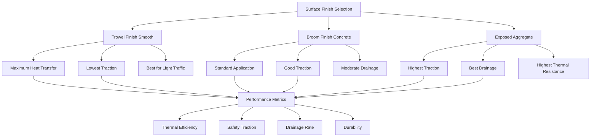

Surface finish selection directly affects snow melting system performance through its influence on thermal contact resistance, meltwater drainage efficiency, and freeze-thaw durability. The finish type determines surface roughness height, which impacts both heat transfer to the snow-slab interface and water film evacuation rates.

## Surface Texture Physics

Surface roughness creates a thermal contact resistance between the snow layer and heated concrete. This resistance adds to the overall thermal resistance path from heating element to snow surface.

The effective heat transfer coefficient at the textured interface is:

$$h_{eff} = \frac{1}{\frac{1}{h_{conv}} + \frac{R_a}{k_{concrete}}}$$

Where:
- $h_{conv}$ = convective heat transfer coefficient (W/m²·K)
- $R_a$ = average surface roughness height (m)
- $k_{concrete}$ = thermal conductivity of concrete (1.4-2.0 W/m·K)

For smooth trowel finishes, $R_a$ = 5-20 μm, while broom finishes produce $R_a$ = 50-150 μm. This difference creates a 3-8% variation in heat transfer efficiency during initial snow contact.

## Drainage Slope Requirements

Meltwater removal prevents refreezing and ice formation when the system cycles off. The minimum slope ensures gravitational drainage overcomes surface tension forces that would retain water films.

The critical drainage slope for complete water film evacuation is:

$$S_{min} = \frac{\tau_w}{\rho_w g h_f}$$

Where:
- $\tau_w$ = surface shear stress from water viscosity (0.001 Pa typical)
- $\rho_w$ = water density (1000 kg/m³)
- $g$ = gravitational acceleration (9.81 m/s²)
- $h_f$ = water film thickness (1-3 mm)

This yields a theoretical minimum slope of 0.3-0.5%. However, accounting for construction tolerances, surface irregularities, and accelerated drainage requirements, the practical minimum slope is:

$$S_{practical} = 1.0\% \text{ to } 2.0\%$$

Slopes below 1.0% result in ponding and extended melting cycles. Slopes above 4.0% may create pedestrian safety concerns on icy surfaces before full melting occurs.

## Finish Type Selection

## Surface Finish Comparison

| Finish Type | Surface Roughness Ra (μm) | Thermal Efficiency | Traction Rating | Drainage Rate | Freeze-Thaw Durability |
|-------------|---------------------------|-------------------|-----------------|---------------|------------------------|
| Trowel Smooth | 5-20 | Excellent (100% baseline) | Poor | Moderate | Good |
| Light Broom | 50-100 | Very Good (95-97%) | Good | Good | Very Good |
| Heavy Broom | 100-150 | Good (92-95%) | Very Good | Very Good | Excellent |
| Exposed Aggregate 6mm | 3000-4000 | Fair (85-90%) | Excellent | Excellent | Excellent |
| Exposed Aggregate 10mm | 5000-7000 | Fair (80-88%) | Excellent | Excellent | Excellent |

## Surface Preparation Standards

Proper surface finishing for heated slabs requires specific timing and techniques to prevent damage to embedded heating elements.

**Critical Installation Sequence:**
1. Place concrete and screed to final elevation + finishing allowance
2. Bull float when bleed water disappears (heating pipes protected)
3. Apply finish when concrete supports foot pressure with 6mm impression
4. Avoid excessive troweling over heating pipe locations
5. Cure immediately after finishing to prevent surface crazing

**Broom Finish Application:**
- Stroke perpendicular to drainage slope direction
- Maintain consistent pressure for uniform texture
- Broom depth: 1-2mm for light finish, 2-4mm for heavy finish
- Timing critical: too early causes tearing, too late prevents texturing

**Exposed Aggregate Process:**
- Apply surface retarder 1-2 hours after initial set
- Wash and brush when concrete resists 20mm penetration
- Target exposure depth: 1/4 to 1/3 of aggregate diameter
- Avoid over-washing near heating element locations

## Thermal Performance Impact

Surface finish affects the transient response time during snowfall onset. Smoother surfaces achieve faster initial melting, while textured surfaces require 15-30 minutes longer to establish complete melt patterns.

The time to achieve complete surface coverage melting is:

$$t_{melt} = \frac{\rho_s L_f h_s}{q_{surface}} \left(1 + \frac{R_a}{h_s}\right)$$

Where:
- $\rho_s$ = snow density (50-200 kg/m³)
- $L_f$ = latent heat of fusion (334 kJ/kg)
- $h_s$ = snow accumulation depth (m)
- $q_{surface}$ = surface heat flux (W/m²)

This equation demonstrates that roughness height becomes proportionally more significant as snow depth decreases, particularly affecting the final clearing phase.

## Drainage Design Integration

Surface slope must coordinate with slab edge details, drainage inlets, and perimeter transitions. Insufficient slope creates standing water zones that refreeze during system off-cycles, increasing energy consumption by 15-25%.

**Slope Configuration:**
- Minimum: 1.0% (1/8 inch per foot)
- Typical: 1.5% (3/16 inch per foot)
- Maximum: 2.5% (5/16 inch per foot)
- Drainage path length: maximum 7.5m to collection point

Create positive drainage to all edges. Avoid designing slope patterns that direct meltwater toward building entrances or create midfield low points.

## Finish Selection Criteria

Choose surface finish based on:

**Pedestrian Areas:** Light to medium broom finish (1.5-2mm texture depth) provides optimal balance of traction, thermal efficiency, and drainage.

**Vehicular Areas:** Heavy broom or light exposed aggregate delivers traction for starting and stopping while maintaining adequate thermal transfer.

**High-End Architectural:** Smooth trowel with integral color requires increased heat output (add 10-15% capacity) but delivers superior aesthetic appearance.

**Heavy Traffic Commercial:** Exposed aggregate 6-8mm provides maximum durability and longest service life under repeated freeze-thaw cycling and mechanical abrasion.

The surface finish represents the final interface where thermal energy transfers to melt snow. Proper selection and installation directly determine system effectiveness, energy efficiency, and long-term performance reliability.
