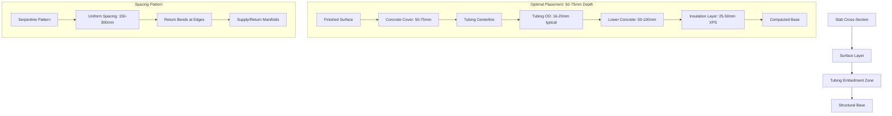

## Physical Principles of Tubing Placement

The placement of hydronic tubing within a concrete slab directly governs three critical performance parameters: heat transfer efficiency to the surface, thermal response time, and structural durability. The heat transfer from embedded tubing follows conduction through concrete, making depth the primary variable controlling surface heat flux.

### Heat Transfer from Embedded Tubing

Heat flow from tubing to the slab surface follows Fourier's law of conduction. For a tubing centerline at depth $d$ below the surface, the steady-state heat flux to the surface is:

$$q'' = \frac{k_c \cdot (T_{tube} - T_{surf})}{d \cdot R_{eff}}$$

where:
- $k_c$ = concrete thermal conductivity (1.4-1.7 W/m·K)
- $T_{tube}$ = tubing surface temperature (K)
- $T_{surf}$ = slab surface temperature (K)
- $d$ = tubing depth below surface (m)
- $R_{eff}$ = effective thermal resistance accounting for geometry

The effective thermal resistance includes both the concrete path and the cylindrical geometry around the tubing. This relationship demonstrates that shallow placement reduces thermal resistance, increasing heat flux to the surface for a given fluid temperature.

### Response Time Analysis

The transient response of the system depends on the thermal mass that must be heated before significant surface heat flux develops. The time constant for the system is:

$$\tau = \frac{\rho_c \cdot c_c \cdot d^2}{\alpha_c}$$

where:
- $\rho_c$ = concrete density (2300-2400 kg/m³)
- $c_c$ = concrete specific heat (880 J/kg·K)
- $\alpha_c$ = concrete thermal diffusivity ($k_c / \rho_c c_c$)
- $d$ = tubing depth (m)

This quadratic relationship with depth shows that response time increases rapidly as tubing is placed deeper. A tubing depth of 50 mm yields approximately one-quarter the response time of 100 mm depth.

## Standard Placement Depths

ASHRAE and industry standards establish tubing placement guidelines based on balancing response time, efficiency, and structural requirements.

| Tubing Depth Below Surface | Response Time | Heat Transfer Efficiency | Application | Structural Considerations |
|---------------------------|---------------|-------------------------|-------------|--------------------------|
| 25-38 mm (1-1.5 in) | Fastest (15-30 min) | Highest | Residential driveways, walkways | Risk of surface cracking, requires proper cover |
| 50-75 mm (2-3 in) | Moderate (30-60 min) | Good | Commercial parking, standard driveways | Optimal balance, most common |
| 75-100 mm (3-4 in) | Slow (60-120 min) | Reduced | Heavy traffic areas, high structural loads | Maximum structural protection |
| >100 mm (>4 in) | Very slow (>120 min) | Poor | Not recommended | Excessive thermal mass penalty |

### Recommended Placement: 50-75 mm

The optimal placement range for most applications is 50-75 mm (2-3 inches) below the finished surface. This depth provides:

- Adequate concrete cover to prevent freeze damage to tubing
- Response times under one hour for snow event initiation
- Acceptable heat transfer efficiency (75-85% compared to surface placement)
- Sufficient embedment to prevent thermal stress cracks
- Compatibility with standard reinforcement placement

## Tubing Spacing Calculations

Tubing spacing works in conjunction with depth to achieve uniform surface temperature. The spacing $s$ required for a given surface heat flux $q''_{req}$ is:

$$s = \frac{2 \cdot k_c \cdot (T_f - T_{surf})}{\pi \cdot q''_{req}} \cdot \ln\left(\frac{s}{\pi \cdot d}\right)$$

This transcendental equation requires iterative solution. For practical design, ASHRAE provides simplified relationships:

For tubing at 50-75 mm depth:
- 150-200 mm spacing: High output (400-600 W/m²)
- 225-300 mm spacing: Standard output (250-400 W/m²)
- 300-450 mm spacing: Low output (150-250 W/m²)

Closer spacing compensates for greater depth, maintaining surface temperature uniformity within ±2°C.

## Tubing Placement Configuration

### Installation Methodology

**Support Chair Requirements:**

Tubing must be secured at the design elevation using:
- Plastic or metal support chairs rated for concrete placement
- Chair height = slab thickness - tubing depth - (tubing OD/2)
- Chair spacing: 600-900 mm along tubing runs
- Additional support at bends and direction changes

**Securing Methods:**

1. Wire ties to reinforcing mesh (primary method)
2. Plastic clips attached to insulation board
3. Proprietary tubing rail systems for precise spacing
4. Avoid metal ties that create thermal bridges

**Critical Installation Points:**

- Maintain minimum 75 mm from slab edges to prevent freeze exposure
- Keep 150 mm minimum from expansion joints
- Position tubing below reinforcement when possible to prevent uplift
- Pressure test to 100 psi (690 kPa) before concrete placement
- Maintain pressure during pour to detect damage

## Depth Impact on Performance

The effect of placement depth on key performance metrics:

**Heat Transfer Efficiency (relative to 25 mm depth):**
$$\eta_d = \frac{25}{d} \cdot \left(1 + \frac{d-25}{100}\right)^{-0.5}$$

| Depth (mm) | Relative Efficiency | Required Fluid Temperature Increase |
|-----------|-------------------|-----------------------------------|
| 25 | 100% | Baseline |
| 50 | 88% | +3°C |
| 75 | 78% | +6°C |
| 100 | 70% | +9°C |

Deeper placement requires higher supply temperatures to achieve the same surface output, increasing operating costs and reducing boiler efficiency.

## Edge Zone Considerations

Slab edges experience 40-60% higher heat loss than interior areas. Tubing placement near edges requires:

- Reduced spacing (50-75% of interior spacing)
- Maximum practical depth to prevent freeze damage to tubing
- Minimum 75 mm cover from all edges
- Enhanced insulation at perimeter

The edge zone typically extends 600-900 mm from the slab perimeter. This region requires dedicated design attention to prevent persistent snow accumulation at walkway edges.

## Quality Verification

After installation and before concrete placement:

1. Verify tubing depth with measuring stick at multiple locations (±10 mm tolerance)
2. Confirm spacing with tape measure (±15 mm tolerance)
3. Inspect support chair integrity and tie security
4. Document any field modifications to design
5. Photograph tubing layout for as-built records

Proper tubing placement is permanent. Corrections after concrete placement are impossible, making installation verification critical to system performance.
